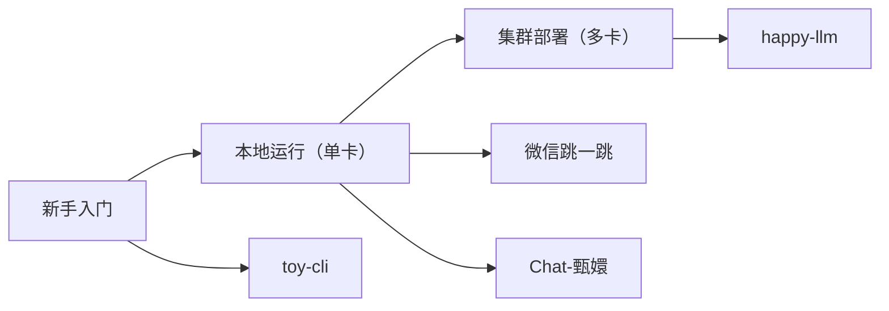

<div align="center">

# AMD-YES 🎮

**玩转 AMD GPU 的酷炫项目合集**

让AI更有趣，让创意更自由 ✨

</div>


<div align='center'>

[](https://rocm.docs.amd.com/)

</div>

<div align="center">

---

## 🚀 快速导航


| 本地运行（单卡） | 集群部署（多卡） |
|---------|---------|
| [🧸 toy-cli](./01-toy-cli/README.md) ✅️ | [🚀 happy-llm](./06-happy-llm/README.md) 🚧 |
| [🎮 微信跳一跳](./02-wechat-jump/README.md) ✅️| |
| [🎭 Chat-甄嬛](./03-huanhuan-chat/README.md) ✅️| |

</div>

> ✅ 支持 | 🚧 开发中 


## 📁 项目结构

```
03-AMD-YES/
├── README.md                    # 项目总览
├── 01-toy-cli/                  # LLM 轻量化终端助手
│   └── README.md
├── 02-wechat-jump/              # YOLOv10 微信跳一跳
│   └── README.md
├── 03-huanhuan-chat/            # Chat-甄嬛
│   └── README.md
└── 04-happy-llm/                # Happy-LLM 分布式训练
    └── README.md
```

---

## 💻 本地运行（单卡）

适合个人开发者快速体验，一块AMD显卡就能玩转！

### 🧸 toy-cli

[toy-cli](https://github.com/KMnO4-zx/toy-cli) - LLM 轻量化终端助手 | [📖 详细文档](./01-toy-cli/README.md)

- 简化的 Claude Code 风格的代码 Agent
- 极简命令行调用大模型
- 轻量级、易上手
- 学习API调用的最佳入门项目

**亮点：** 3分钟学会调用大模型，就是这么简单粗暴！

---

### 🎮 基于 YOLOv10 微信跳一跳

[YOLOv10 微信跳一跳](https://github.com/KMnO4-zx/wechat-jump) - AI玩跳一跳 | [📖 详细文档](./02-wechat-jump/README.md)

- 基于YOLOv10目标检测的自动化游戏AI
- 实时识别跳跃目标，精准计算距离
- 计算机视觉+游戏AI的趣味实战

**亮点：** 让AI替你刷分，告别手残党！🚀

---

### 🎭 Chat-甄嬛

[Chat-甄嬛](https://github.com/KMnO4-zx/huanhuan-chat) - 后宫语言模型 | [📖 详细文档](./03-huanhuan-chat/README.md)

- 基于《甄嬛传》台词训练的LoRA微调模型
- 完美模仿甄嬛的语气和说话风格
- 从数据准备到微调部署的全流程教程

**亮点：** 用AI重现甄嬛的优雅与智慧，古风对话体验拉满！

---

## 🔥 集群部署（多卡）

进阶玩法，分布式训练部署！

### 🚀 happy-llm

[Happy-LLM](https://github.com/datawhalechina/happy-llm) - 从零训练大模型 | [📖 详细文档](./06-happy-llm/README.md)

- 分布式多机多卡训练完整教程
- 大模型核心原理深度剖析
- 手把手复现完整训练流程

**进阶必备：** 想要玩转大模型集群训练？这个必须安排！💪


## 🎯 学习路线图



**推荐学习路径：**
1. 先玩 `toy-cli` 熟悉大模型调用
2. 然后选感兴趣的案例深入学习
3. 挑战 `happy-llm` 进阶分布式

---


## 🤝 参与贡献

有好想法？来提交你的AMD项目！

- 📝 补充教程文档
- 🐛 修复Bug
- 💡 分享你的项目
- 📦 丰富侧端案例

[贡献指南](../CONTRIBUTING.md)

---

## 📚 参考资源

- [self-llm 完整教程](https://github.com/datawhalechina/self-llm)
- [ROCm 官方文档](https://rocm.docs.amd.com/)
- [hello-rocm 主项目](../)

---

<div align="center">

**AMD YES! 让AI更有趣** 🚀

Made with ❤️ by the hello-rocm community

</div>