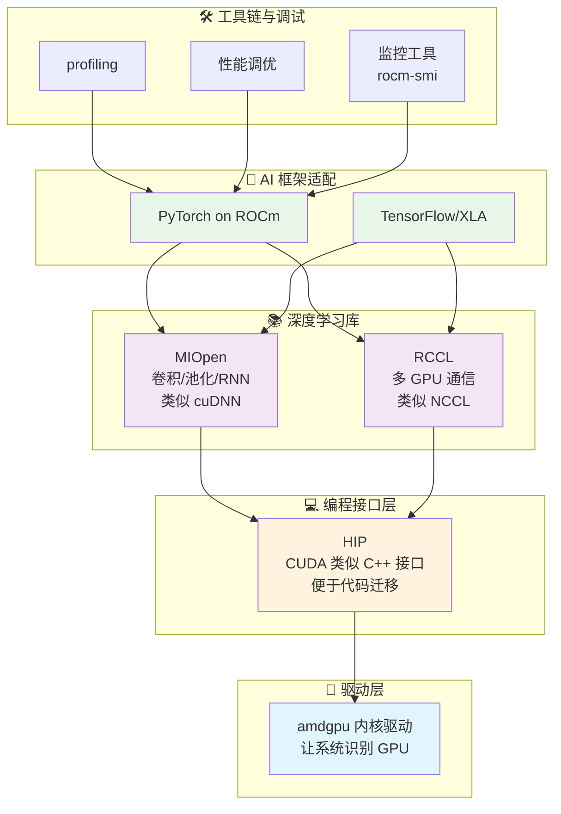
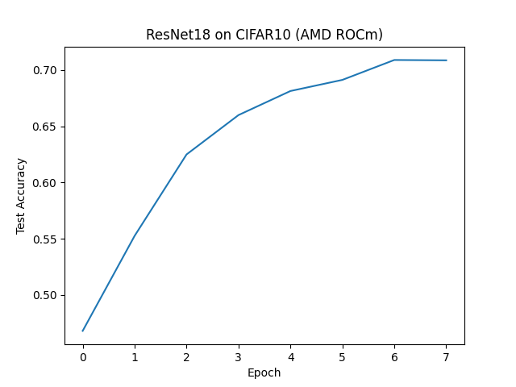
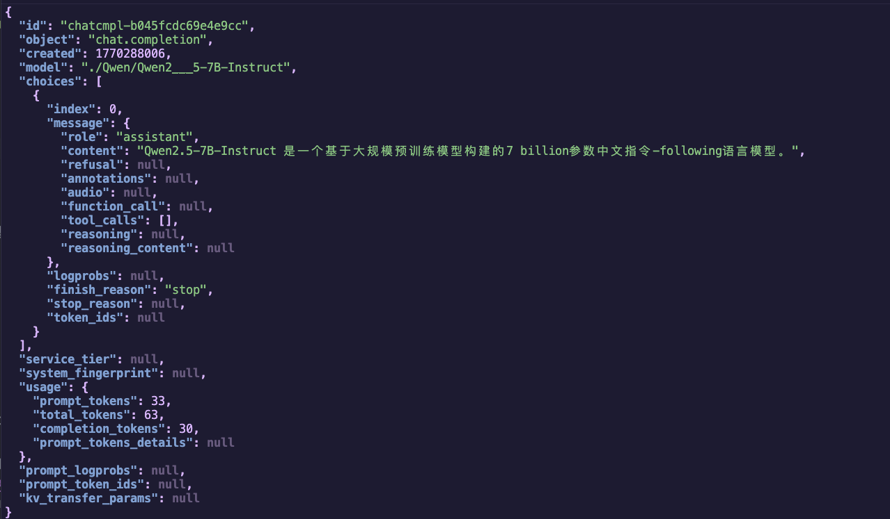

# 第 1 章：拥抱 AMD AI 算力新时代

<div align='center'>

[](https://rocm.docs.amd.com/)
[](https://pytorch.org/)

</div>

---

## 🎯 本章学习目标

本章的目标，是帮你搞清楚三件事：

1. ✅ **你的 AMD 设备能做什么**——从 Ryzen AI 本地 NPU，到 Radeon 独显、Instinct 加速卡的 AI 能力全景图
2. ✅ **ROCm 是什么**——为什么说它是 AI 的"基础设施"而不是单纯的"驱动"
3. ✅ **动手实战**——在 AMD 平台上用 PyTorch 跑通 ResNet 训练和 Qwen 3 大模型推理

***OK，那接下来我将会带领大家一步步探索 AMD AI 算力新时代，让我们一起来体验一下吧~***

---

## 1.1 你的 AMD 显卡能做什么？

> 💡 **小贴士**：过去我们谈 AI，几乎等于"英伟达 + CUDA"。现在这个格局已经被打破——AMD 从低功耗 AI PC，到桌面/工作站显卡，再到数据中心加速卡，形成了一条完整的 AI 产品线，并且统一在 ROCm 软件栈之下。

### 1.1.1 从 AI PC 到独立显卡的全景图

过去我们谈 AI，几乎等于“英伟达 + CUDA”。现在这个格局已经被打破：AMD 从低功耗 AI PC，到桌面/工作站显卡，再到数据中心加速卡，形成了一条完整的 AI 产品线，并且统一在 ROCm 软件栈之下。

可以把 AMD 的 AI 硬件大致分成三档来看：

### 🖥️ 1）AI PC：Ryzen AI（NPU + GPU）

以 2026 年的 **Ryzen AI 400 系列**为例，NPU 算力最高可达 **60 TOPS**，满足甚至超过微软 Copilot+ PC 的 40 TOPS 要求[1][2]。

一个典型的 Ryzen AI 400 芯片内部通常包含：

| 组件 | 功能 | 典型应用 |
| :--- | :--- | :--- |
| **Zen 5 CPU 核心** | 通用计算、数据预处理 | 数据预处理、逻辑控制 |
| **RDNA 3.5/4 集成 GPU** | 中等规模模型训练、小模型推理 | 7B 级别推理、LoRA 微调、图像/视频生成 |
| **XDNA 2 NPU** | 高效执行本地 AI 推理任务 | 语音识别、实时翻译、Copilot+ 功能 |


### 🎮 2）桌面/工作站：Radeon RX / Radeon Pro

对大部分开发者来说，入门友好的选择是 **Radeon RX 7000 / 9000 系列（RDNA 3 / RDNA 4）**：

| 类型 | 代表型号 | 特点 |
| :--- | :--- | :--- |
| **游戏卡** | Radeon RX 7700、RX 9070 等 | 性价比高，适合开发者和个人用户 |
| **专业卡** | Radeon AI PRO / Radeon Pro W 系列 | 显存更大、更稳定，适合专业工作 |

#### 🚀 RDNA 4 AI 加速亮点

RDNA 4 引入了更强的 AI 加速能力[3]：

- ✨ **每个 Compute Unit 内集成 2 个 AI 加速器**
- 📈 **AI 算力提升超过 4 倍**（相比上一代 RDNA 3）
- 💪 **千 TOPS 等级运算**（部分 9000 系列卡，搭配 16GB+ 显存）

#### 💼 桌面/工作站典型用法

- 🎨 本地 Stable Diffusion / ComfyUI 全流程
- 🤖 中等规模（7B–14B）LLM 推理与 LoRA 微调
- 🖼️ 图像分类、检测、分割等训练任务

### 🏢 3）数据中心：Instinct MI 系列

如果你在做大规模训练或部署 70B 甚至 400B 级别的模型，AMD 的 **Instinct MI300X / MI350X / MI355X** 系列是主力硬件[4][5]：

#### 💎 Instinct 系列核心优势

| 特性 | 说明 | 应用价值 |
| :--- | :--- | :--- |
| **超大显存** | 最高 **192GB HBM** 高带宽显存 | 支持超长上下文大模型（如 Qwen3-Coder-Next 80B） |
| **先进精度** | 支持 **FP8 精度、256k 上下文长度** | 满足最新代码模型和多模态模型需求[5] |
| **深度优化** | ROCm 7 在 Llama 3.x、GLM、DeepSeek 等模型上做了算子级优化 | 显著提升训练与推理吞吐[4] |

#### 🏭 使用场景

- 🔬 大模型训练（70B+）
- 🌐 多 GPU / 多节点推理集群
- 🏢 企业级 AI 服务平台

---

### 1.1.2 ROCm 生态现状：它不仅仅是"驱动"

> ⚠️ **重要认知**：很多人以为"装上 ROCm 就是装了驱动"，其实 ROCm 更像是一整套**开源 AI 计算平台**，类似"CUDA 生态"的 AMD 版本。

#### 🔧 ROCm 是什么？

ROCm（Radeon Open Compute）主要包含几层：



> 💡 **一句话总结**：**ROCm = AMD 版的 CUDA 生态 + 还更开放**

#### 🌟 ROCm 7.2 的几个关键点

根据 2026 年的官方信息和媒体报道[1][4][6]，ROCm 7.2 有几个对开发者很重要的变化：

| # | 特性 | 说明 |
| :--- | :--- | :--- |
| **1** | **🪟🐧 双平台正式支持** | Windows（Adrenalin 26.1.1）+ Linux（Ubuntu 等）一键安装 |
| **2** | **🎯 支持面扩展到消费级** | 不再局限数据中心，正式支持 Radeon RX 7000/9000 + Ryzen AI 300/400 |
| **3** | **⚡ 为 PyTorch 深度优化** | Llama、GLM、DeepSeek 等模型内核级优化，"装完就能用" |
| **4** | **🤝 与 Ubuntu 深度集成** | Ubuntu 26.04 LTS 起原生支持，长期稳定的 AI 环境[7] |

---

## 1.2 PyTorch on ROCm：无缝衔接

这一小节专注在三个核心问题：

| 问题 | 说明 |
| :--- | :--- |
| **📦 怎么装？** | pip install 背后的版本选择（稳定版 / Nightly / Windows） |
| **✅ 真的兼容吗？** | 为什么在 AMD 上 `torch.cuda.is_available()` 也是 True |
| **🚀 跑得动啥？** | 实战：ResNet 训练 Demo + Qwen 3 推理 Demo |

---

### 1.2.1 安装：pip install 里的玄机（官方 / nightly 如何选）

#### 📊 版本分层概览

PyTorch on ROCm 的包，通常可以分成三个层次：

#### 🔵 1. 稳定版（Stable）- AMD 官方推荐

> 💡 **重要说明**：AMD 推荐使用 **repo.radeon.com** 的 ROCm WHL 文件，而非 PyTorch.org 的版本（后者未经 AMD 充分测试）。

##### 📋 前置条件 [8]

- Python 3.12 环境
- Ubuntu 24.04 / 22.04

##### 安装步骤

**步骤 1：更新 pip**

```bash
# 安装 pip（如果尚未安装）
sudo apt install python3-pip -y

# 更新 pip 和 wheel
pip3 install --upgrade pip wheel
```

**步骤 2：下载并安装 PyTorch for ROCm**

Ubuntu 22.04 示例：

```bash
# 下载 WHL 文件
wget https://repo.radeon.com/rocm/manylinux/rocm-rel-7.2/torch-2.9.1%2Brocm7.2.0.lw.git7e1940d4-cp312-cp312-linux_x86_64.whl
wget https://repo.radeon.com/rocm/manylinux/rocm-rel-7.2/torchvision-0.24.0%2Brocm7.2.0.gitb919bd0c-cp312-cp312-linux_x86_64.whl
wget https://repo.radeon.com/rocm/manylinux/rocm-rel-7.2/triton-3.5.1%2Brocm7.2.0.gita272dfa8-cp312-cp312-linux_x86_64.whl
wget https://repo.radeon.com/rocm/manylinux/rocm-rel-7.2/torchaudio-2.9.0%2Brocm7.2.0.gite3c6ee2b-cp312-cp312-linux_x86_64.whl

# 卸载旧版本（如果存在）
pip3 uninstall torch torchvision triton torchaudio

# 安装新版本
pip3 install torch-2.9.1+rocm7.2.0.lw.git7e1940d4-cp312-cp312-linux_x86_64.whl \
  torchvision-0.24.0+rocm7.2.0.gitb919bd0c-cp312-cp312-linux_x86_64.whl \
  torchaudio-2.9.0+rocm7.2.0.gite3c6ee2b-cp312-cp312-linux_x86_64.whl \
  triton-3.5.1+rocm7.2.0.gita272dfa8-cp312-cp312-linux_x86_64.whl
```

> ⚠️ **注意**：在非虚拟环境的 Python 3.12 中安装时，必须添加 `--break-system-packages` 标志。

**步骤 3：验证安装**

```bash
# 验证 PyTorch 是否正确安装
python3 -c 'import torch' 2> /dev/null && echo 'Success' || echo 'Failure'

# 验证 GPU 是否可用
python3 -c 'import torch; print(torch.cuda.is_available())'

# 显示 GPU 设备名称
python3 -c "import torch; print(f'device name [0]:', torch.cuda.get_device_name(0))"

# 显示完整的 PyTorch 环境信息
python3 -m torch.utils.collect_env
```

**预期输出**：

```
Success
True
device name [0]: AMD Radeon 8060S  # 或其他支持的 AMD GPU
```

> ✅ **适用场景**：生产环境和日常训练（AMD 官方推荐）

#### 🟡 2. Docker 安装（可选）

使用 Docker 可以提供更好的可移植性和预构建的容器环境。

**安装 Docker**：

```bash
sudo apt install docker.io
```

**拉取并运行 PyTorch Docker 镜像**（Ubuntu 24.04）：

```bash
# 拉取镜像
sudo docker pull rocm/pytorch:rocm7.2_ubuntu24.04_py3.12_pytorch_release_2.9.1

# 启动容器
sudo docker run -it \
  --cap-add=SYS_PTRACE \
  --security-opt seccomp=unconfined \
  --device=/dev/kfd \
  --device=/dev/dri \
  --group-add video \
  --ipc=host \
  --shm-size 8G \
  rocm/pytorch:rocm7.2_ubuntu24.04_py3.12_pytorch_release_2.9.1
```

> 💡 **提示**：可以使用 `-v` 参数挂载主机的数据目录到容器中。

#### 🔴 3. Windows 专用 ROCm SDK 轮子

对于 PyTorch on Windows + ROCm 7.2，AMD 官方提供了完整 wheel 链接[9]：
     - 先安装 ROCm SDK 组件（Python 3.12 环境）；
     - 再安装带 `+rocmsdk20260116` 标记的 torch/torchvision/torchaudio 轮子。
   - 典型命令（CMD 示例）：
     ```bat
     pip install --no-cache-dir ^
       https://repo.radeon.com/rocm/windows/rocm-rel-7.2/torch-2.9.1%2Brocmsdk20260116-cp312-cp312-win_amd64.whl ^
       https://repo.radeon.com/rocm/windows/rocm-rel-7.2/torchaudio-2.9.1%2Brocmsdk20260116-cp312-cp312-win_amd64.whl ^
       https://repo.radeon.com/rocm/windows/rocm-rel-7.2/torchvision-0.24.1%2Brocmsdk20260116-cp312-cp312-win_amd64.whl
     ```

#### 🎯 如何选择安装方式？

| 你的需求 | 推荐方案 | 说明 |
| :--- | :--- | :--- |
| **🔒 追求稳定（Linux）** | **repo.radeon.com WHL 文件** | AMD 官方推荐，经过充分测试 |
| **🐳 快速部署** | **Docker 镜像** | 预构建环境，开箱即用，跨平台 |
| **🚀 新硬件尝鲜** | **Nightly ROCm 轮子** | 新硬件支持 + 新功能，能接受偶尔踩坑 |
| **🪟 Windows 用户** | **AMD 官方 ROCm SDK** | Windows + Radeon + Ryzen AI 环境 |

---

### 1.2.2 兼容性揭秘：`torch.cuda.is_available()` 在 AMD 上也是 True？

> 🔍 **现象揭秘**：很多人第一次在 AMD GPU 上装好 PyTorch 后，运行验证代码发现 `torch.cuda.is_available()` 返回的是 **True**。这不是 bug，而是 **兼容性设计**。

很多人第一次在 AMD GPU 上装好 PyTorch 后，跑：

```python
import torch
print(torch.cuda.is_available())
print(torch.cuda.get_device_name(0))
print(torch.version.hip)
```

**结果发现**：

- `torch.cuda.is_available()` 返回的居然是 **True**；
- `torch.cuda.get_device_name(0)` 显示的是 **Radeon RX 9070 XT**、**Radeon PRO W7900** 或 **Instinct MI300X** 等；
- `torch.version.hip` 显示类似 `7.2.26015-fc0010cf6a`。

这不是 bug，而是 **兼容性设计**：

<div style="background: #fff3cd; border: 1px solid #ffc107; border-radius: 8px; padding: 16px; margin: 16px 0;">
  <div style="display: flex; align-items: start;">
    <span style="font-size: 20px; margin-right: 10px;">⚡</span>
    <div>
      <strong style="color: #856404;">为什么 torch.cuda 在 AMD 上也是 True？</strong><br>
      <span style="color: #856404; line-height: 1.6;">
        • PyTorch 生态（huggingface 等）依赖 <code>torch.cuda.*</code> API 判断 GPU<br>
        • 为了兼容性，ROCm 后端沿用了 <code>cuda</code> 命名空间<br>
        • 底层实际运行的是 <strong>HIP/ROCm</strong>，无需修改任何代码 ✨
      </span>
    </div>
  </div>
</div>


> ✅ **结论**：在 AMD 平台上：
> - `torch.cuda.*` ≈ "有 GPU 加速，底层是 ROCm/HIP"
> - `torch.version.rocm` 才是你真正查看 ROCm 版本的地方

---

### 1.2.3 实战 1：ResNet 图像分类训练 Demo

> 🎯 **实战目标**：下面给出一个可以直接在 AMD GPU 上跑的 **ResNet18 + CIFAR10** 训练 Demo。代码逻辑参考了 AMD 官方的 ROCm 博客示例[10]，稍作精简和注释。

#### 📦 环境准备

确保你已经在当前 Python 环境中：

- ✅ 装好了支持 ROCm 的 PyTorch
- ✅ 安装了以下依赖：

```bash
pip install torchvision datasets matplotlib
```

#### 💻 完整训练脚本示例

```python
# file: resnet_cifar10_amd.py
import random
import datetime
import torch
import torchvision
from datasets import load_dataset
import matplotlib.pyplot as plt


def get_dataloaders(batch_size=256):
    dataset = load_dataset("cifar10")
    dataset.set_format("torch")

    train_loader = torch.utils.data.DataLoader(
        dataset["train"], shuffle=True, batch_size=batch_size
    )
    test_loader = torch.utils.data.DataLoader(
        dataset["test"], batch_size=batch_size
    )
    return train_loader, test_loader


def get_transform():
    mean = torch.tensor([0.4914, 0.4822, 0.4465]).view(1, 3, 1, 1)
    std = torch.tensor([0.2023, 0.1994, 0.2010]).view(1, 3, 1, 1)

    def transform(x):
        # x 可能是 (B, H, W, C) 或 (B, C, H, W)
        if x.ndim == 4 and x.shape[1] != 3:
            x = x.permute(0, 3, 1, 2)  # 仅在 BHWC 时转换
        x = x.float() / 255.0
        x = (x - mean.to(x.device)) / std.to(x.device)
        return x

    return transform


def build_model():
    model = torchvision.models.resnet18(num_classes=10)
    loss_fn = torch.nn.CrossEntropyLoss()
    optimizer = torch.optim.Adam(model.parameters(), lr=0.01, weight_decay=1e-4)
    return model, loss_fn, optimizer


def train_model(model, loss_fn, optimizer, train_loader, test_loader, transform, num_epochs):
    print(f"Number of GPUs: {torch.cuda.device_count()}")
    print([torch.cuda.get_device_name(i) for i in range(torch.cuda.device_count())])
    device = torch.device("cuda" if torch.cuda.is_available() else "cpu")

    model.to(device)
    accuracy = []
    t0 = datetime.datetime.now()

    for epoch in range(num_epochs):
        print(f"Epoch {epoch+1}/{num_epochs}")
        t0_epoch_train = datetime.datetime.now()

        model.train()
        train_losses, n_examples = [], 0
        for batch in train_loader:
            batch = {k: v.to(device) for k, v in batch.items()}

            optimizer.zero_grad()
            preds = model(transform(batch["img"]))
            loss = loss_fn(preds, batch["label"])
            loss.backward()
            optimizer.step()

            train_losses.append(loss.detach())
            n_examples += batch["label"].shape[0]

        train_loss = torch.stack(train_losses).mean().item()
        t_epoch_train = datetime.datetime.now() - t0_epoch_train

        model.eval()
        with torch.no_grad():
            t0_epoch_test = datetime.datetime.now()
            test_losses, n_test_examples, n_test_correct = [], 0, 0
            for batch in test_loader:
                batch = {k: v.to(device) for k, v in batch.items()}

                preds = model(transform(batch["img"]))
                loss = loss_fn(preds, batch["label"])

                test_losses.append(loss)
                n_test_examples += batch["img"].shape[0]
                n_test_correct += (batch["label"] == preds.argmax(dim=1)).sum()

            test_loss = torch.stack(test_losses).mean().item()
            test_accuracy = n_test_correct / n_test_examples
            t_epoch_test = datetime.datetime.now() - t0_epoch_test
            accuracy.append(test_accuracy.cpu())

        print(f"  Epoch time: {t_epoch_train+t_epoch_test}")
        print(f"  Examples/second (train): {n_examples/t_epoch_train.total_seconds():0.4g}")
        print(f"  Examples/second (test): {n_test_examples/t_epoch_test.total_seconds():0.4g}")
        print(f"  Train loss: {train_loss:0.4g}")
        print(f"  Test loss: {test_loss:0.4g}")
        print(f"  Test accuracy: {test_accuracy*100:0.4g}%")

    total_time = datetime.datetime.now() - t0
    print(f"Total training time: {total_time}")
    return accuracy


def main():
    torch.manual_seed(0)
    random.seed(0)

    model, loss, optimizer = build_model()
    train_loader, test_loader = get_dataloaders()
    transform = get_transform()

    test_accuracy = train_model(
        model, loss, optimizer, train_loader, test_loader, transform, num_epochs=8
    )

    plt.plot(test_accuracy)
    plt.xlabel("Epoch")
    plt.ylabel("Test Accuracy")
    plt.title("ResNet18 on CIFAR10 (AMD ROCm)")
    plt.savefig("resnet_cifar10_amd.png")
    print("训练完成，准确率曲线已保存为 resnet_cifar10_amd.png")


if __name__ == "__main__":
    main()

```

#### 🚀 运行方式

```bash
python resnet_cifar10_amd.py
```

#### ✅ 输出




---

### 1.2.4 实战 2：Qwen 2.5 模型推理 Demo（vLLM + ROCm）

> 🚀 **实战目标**：本节展示如何在 AMD GPU 上通过 **vLLM + ROCm 7** 运行阿里 Qwen2.5 系列大模型的推理。
>
> 💡 **适用提示**：本示例以 Qwen2.5-7B-Instruct 为例，适合桌面 Radeon 和数据中心 Instinct 系列 GPU。

#### 步骤 1：使用 Docker 启动 vLLM 环境

使用 Docker 可以快速获得一个预配置好的 vLLM + ROCm 环境：

```bash
docker run -it \
  --network=host \
  --device=/dev/kfd \
  --device=/dev/dri \
  --group-add=video \
  --ipc=host \
  --cap-add=SYS_PTRACE \
  --security-opt seccomp=unconfined \
  --shm-size 8G \
  -v $(pwd):/workspace \
  --name vllm \
  rocm/vllm-dev:rocm7.2_navi_ubuntu24.04_py3.12_pytorch_2.9_vllm_0.14.0rc0
```

**参数说明**：

| 参数 | 说明 |
| :--- | :--- |
| `--network=host` | 使用主机网络，便于访问服务 |
| `--device=/dev/kfd --device=/dev/dri` | 挂载 GPU 设备 |
| `--group-add=video` | 添加到 video 组以访问 GPU |
| `--ipc=host --shm-size 8G` | 共享内存配置，用于多进程通信 |
| `-v $(pwd):/workspace` | 挂载当前目录到容器的 /workspace |

#### 步骤 2：环境准备

进入容器后，安装基础库：

```bash
pip install transformers accelerate
```

#### 步骤 3：下载模型（使用 ModelScope）

安装 ModelScope：

```bash
pip install modelscope
```

在终端输入 `python` 进入交互模式：

```python
from modelscope import snapshot_download

# 下载到当前目录
model_dir = snapshot_download('Qwen/Qwen2.5-7B-Instruct', cache_dir='./')
print(f"模型已下载到: {model_dir}")
```
**输出示例：**
```
模型已下载到: ./Qwen/Qwen2___5-7B-Instructors
```

#### 步骤 4：启动 vLLM 推理服务

```bash
python -m vllm.entrypoints.openai.api_server \
  --model ./Qwen/Qwen2___5-7B-Instruct \
  --host 0.0.0.0 \
  --port 3000 \
  --dtype float16 \
  --gpu-memory-utilization 0.9 \
  --swap-space 16 \
  --disable-log-requests \
  --tensor-parallel-size 1 \
  --max-num-seqs 64 \
  --max-num-batched-tokens 32768 \
  --max-model-len 32768 \
  --distributed-executor-backend mp
```

**参数说明**：

| 参数 | 说明 |
| :--- | :--- |
| `--model` | 模型路径 |
| `--dtype float16` | 使用半精度浮点数 |
| `--gpu-memory-utilization 0.9` | GPU 显存利用率 |
| `--swap-space 16` | Swap 空间大小（GB） |
| `--max-model-len 32768` | 最大上下文长度 |

#### 步骤 5：测试推理服务

使用 curl 发送请求：

```bash
curl -s http://127.0.0.1:3000/v1/chat/completions \
  -H "Content-Type: application/json" \
  -d '{
    "model": "./Qwen/Qwen2___5-7B-Instruct",
    "messages": [
      {"role": "system", "content": "You are a helpful assistant."},
      {"role": "user", "content": "用一句话介绍一下 Qwen2.5-7B-Instruct。"}
    ],
    "temperature": 0.7,
    "max_tokens": 256
  }' | jq .
```

#### ✅ 预期结果

如果一切正常，你会收到类似以下的 JSON 响应，包含 Qwen2.5 模型生成的回答：


---

### 1.2.5 实战 3：Qwen 2.5 原生 PyTorch 推理

> 🎯 **实战目标**：本节展示如何不依赖 vLLM 等推理框架，直接使用 **PyTorch + Transformers** 在 AMD GPU 上运行 Qwen2.5 模型推理。
>
> 💡 **适用场景**：需要更灵活的控制、研究模型内部行为、或只需简单单卡推理的场景。

#### 步骤 1：环境准备

确保已安装必要的依赖：

```bash
pip install torch transformers accelerate
```

#### 步骤 2：创建推理脚本

创建文件 `qwen_pytorch_inference.py`：

```python
# file: qwen_pytorch_inference.py
import torch
import time
from transformers import AutoModelForCausalLM, AutoTokenizer

# ==========================================
# 核心配置区
# ==========================================

# 模型路径
MODEL_PATH = "./Qwen/Qwen2___5-7B-Instruct"

# 设备选择
DEVICE = "cuda:0"

# ==========================================

def run_inference():
    print(f"=== AMD ROCm PyTorch 推理测试 ===")

    # 打印设备信息
    if torch.cuda.is_available():
        props = torch.cuda.get_device_properties(0)
        print(f"使用设备: {torch.cuda.get_device_name(0)} ({props.total_memory / 1024**3:.1f} GB)")
    else:
        print("[警告] 未检测到 ROCm/CUDA 设备，将使用 CPU 运行（极慢）")

    # 加载 Tokenizer
    print("\n[1/3] 正在加载 Tokenizer...")
    try:
        tokenizer = AutoTokenizer.from_pretrained(MODEL_PATH, local_files_only=True,trust_remote_code=True)
    except Exception as e:
        print(f"[错误] Tokenizer 加载失败: {e}")
        return

    print("\n[2/3] 正在加载模型权重 (BFloat16)...")
    st = time.time()
    try:
        model = AutoModelForCausalLM.from_pretrained(
            MODEL_PATH,
            torch_dtype=torch.bfloat16,  # AMD MI系列/新卡推荐 BF16
            device_map=DEVICE,
            trust_remote_code=True,
        )
    except Exception as e:
        print(f"[致命错误] 模型加载失败: {e}")
        print("如果是显存不足，请尝试使用量化模型。")
        return

    print(f"模型加载耗时: {time.time() - st:.2f} 秒")

    # 构建对话
    prompt = "你好，请用这台高性能显卡为我写一首关于 AMD 显卡逆袭的七言绝句。"
    messages = [
        {"role": "system", "content": "你是一个才华横溢的诗人。"},
        {"role": "user", "content": prompt}
    ]

    print("\n[3/3] 开始推理...")

    # 应用聊天模板
    text = tokenizer.apply_chat_template(messages, tokenize=False, add_generation_prompt=True)

    # 编码输入
    model_inputs = tokenizer([text], return_tensors="pt").to(DEVICE)

    # 生成文本
    st = time.time()
    with torch.no_grad():
        generated_ids = model.generate(
            model_inputs.input_ids,
            max_new_tokens=512,
            temperature=0.7,
            top_p=0.9,
            pad_token_id=tokenizer.eos_token_id
        )
    et = time.time()

    # 解码输出
    input_len = model_inputs.input_ids.shape[1]
    output_ids = generated_ids[:, input_len:]

    response = tokenizer.batch_decode(output_ids, skip_special_tokens=True)[0]

    # 计算性能指标
    tokens_gen = output_ids.shape[1]
    speed = tokens_gen / (et - st)

    print("\n" + "="*20 + " 生成结果 " + "="*20)
    print(response)
    print("="*50)
    print(f"生成速度: {speed:.2f} tokens/s")
    print(f"显存占用: {torch.cuda.max_memory_allocated() / 1024**3:.2f} GB")

if __name__ == "__main__":
    # 启用实验性 ROCm 优化
    import os
    os.environ["TORCH_ROCM_AOTRITON_ENABLE_EXPERIMENTAL"] = "1"
    run_inference()
```

#### 步骤 3：运行推理

```bash
python qwen_pytorch_inference.py
```

#### ✅ 预期输出


## 📖 参考文献

| # | 描述 | 链接 |
| :--- | :--- | :--- |
| [1] | AMD ROCm 7.2 正式发布:支持多款新硬件,优化 Instinct AI 性能 | [链接](https://so.html5.qq.com/page/real/search_news?docid=70000021_7796976caaa35752) |
| [2] | AMD Expands AI Leadership Across Client, Graphics, and ... | [链接](https://www.amd.com/en/newsroom/press-releases/2026-1-5-amd-expands-ai-leadership-across-client-graphics-.html) |
| [3] | AI Acceleration with AMD Radeon™ Graphics Cards | [链接](https://www.amd.com/en/products/graphics/radeon-ai.html) |
| [4] | AMD ROCm 7.2 更新相关报道（IT之家等综合） | [链接](https://so.html5.qq.com/page/real/search_news?docid=70000021_9816977467427752) |
| [5] | Day 0 Support for Qwen3-Coder-Next on AMD Instinct GPUs | [链接](https://www.amd.com/en/developer/resources/technical-articles/2026/day-0-support-for-qwen3-coder-next-on-amd-instinct-gpus.html) |
| [6] | ROCm 7 软件 | [链接](https://www.amd.com/zh-cn/products/software/rocm/whats-new.html) |
| [7] | Ubuntu 将原生支持 AMD ROCm 软件 | [链接](https://so.html5.qq.com/page/real/search_news?docid=70000021_494693a705e92252) |
| [8] | Install PyTorch via PIP (Linux ROCm) | [链接](https://rocm.docs.amd.com/projects/radeon-ryzen/en/latest/docs/install/installrad/native_linux/install-pytorch.html) |
| [9] | Install PyTorch via PIP (Windows ROCm) | [链接](https://rocm.docs.amd.com/projects/radeon-ryzen/en/latest/docs/install/installrad/windows/install-pytorch.html) |
| [10] | ResNet for image classification using AMD GPUs | [链接](https://rocm.blogs.amd.com/artificial-intelligence/resnet/README.html) |
