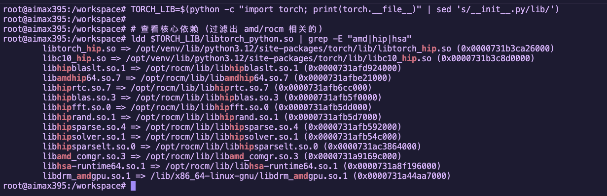
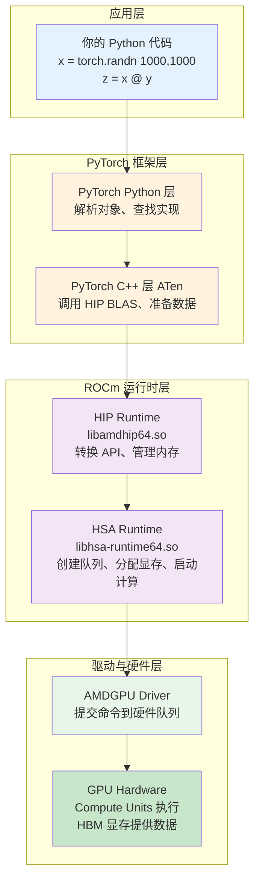
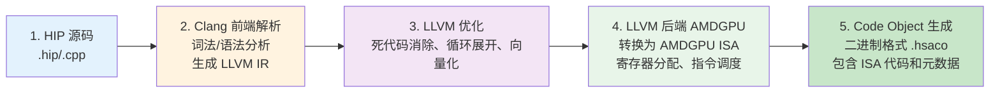
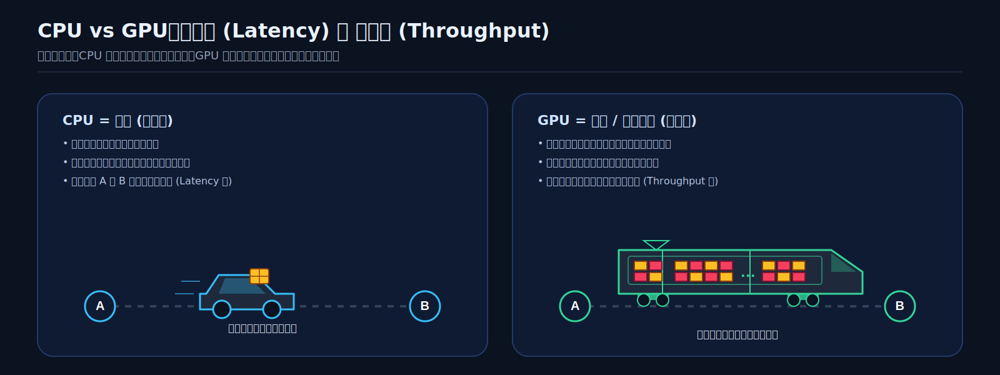
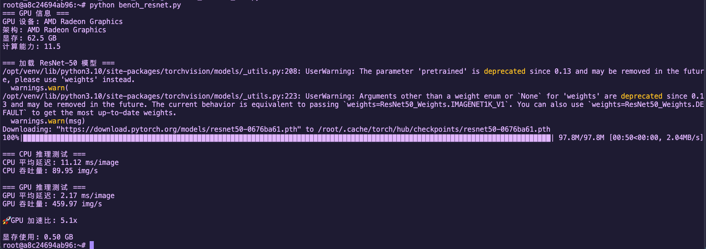
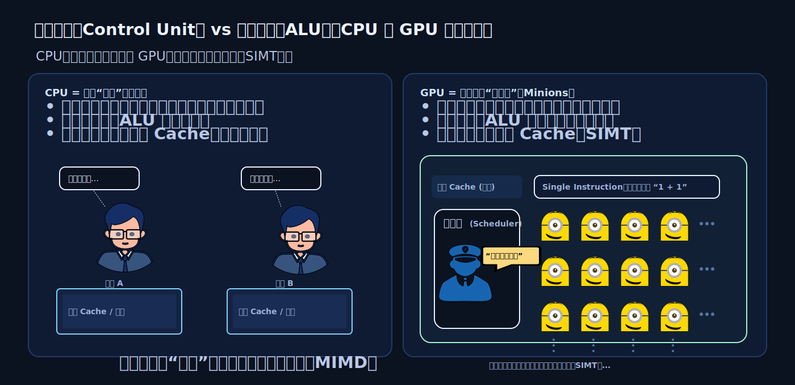
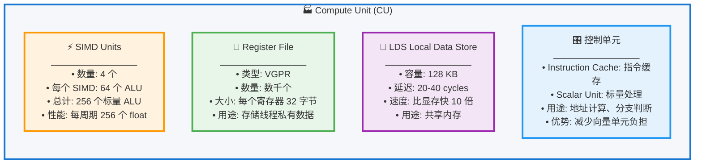

# 第 2 章：解密 AI 加速器——从软件栈到硬件架构

<div align='center'>

[](https://rocm.docs.amd.com/)
[](https://pytorch.org/)
[]()
[]()

</div>

> **🖥️ 实验环境**
> - **设备**: AMD AI+ MAX395
> - **GPU**: Radeon 8060S
> - **架构**: gfx1151 (RDNA 3)
> - **ROCm 版本**: 7.x
> - **系统**: Ubuntu 24.04 / 22.04

---

## 🎯 本章学习目标

通过本章，你将理解三件核心事情：

1. ✅ **软件调用链路**：PyTorch 代码如何经过 HIP → HSA → Driver → GPU 执行
2. ✅ **思维范式转变**：从 CPU 的"低延迟"到 GPU 的"高吞吐"，SIMT 模型的工作原理
3. ✅ **硬件架构原理**：AMD GPU 的 CU、LDS、HBM，以及内存带宽的重要性

***OK，让我们开始深入探索 AI 加速器的奥秘吧！***

---

## 2.1 从 Python 到 GPU：一次代码执行的完整旅程

当你写下 `x + y` 这样的 PyTorch 代码时，你知道这行代码经历了多少层"翻译"才最终在 GPU 上执行吗？这一节，我们用 Linux 的工具来追踪整个调用链路。

### 2.1.1 黑盒解密：用 `ldd` 追踪 PyTorch 的依赖链路

> 💡 **小贴士**：PyTorch 只是一个高层封装，真正在 GPU 上干活的是底层的 ROCm 软件栈。让我们用 `ldd` 工具（查看动态库依赖）来揭开这个黑盒。

#### 🔍 追踪命令

```bash
# 找到 torch 库的路径
TORCH_LIB=$(python -c "import torch; print(torch.__file__)" | sed 's/__init__.py/lib/')

# 查看核心依赖 (过滤出 amd/rocm 相关的)
ldd $TORCH_LIB/libtorch_python.so | grep -E "amd|hip|hsa"
```

#### 📊 输出示例



这些库构成了 **ROCm 软件栈的核心**，我们逐个拆解：

#### 🔧 四大核心组件

| 组件 | 库名 | 职责 | 对应关系 |
|:---|:---|:---|:---|
| **翻译官** | `libamdhip64.so` | 将 CUDA 风格的 API 调用转换为 AMD 的指令 | NVIDIA 的 `libcudart` |
| **工头** | `libhsa-runtime64.so` | 真正调度 GPU、管理内存、让显卡开始干活 | HSA 异构计算基础架构 |
| **技能包** | `hipblas`/`hipfft` 等 | 高性能数学库（矩阵乘法、FFT 等） | NVIDIA 的 cuBLAS/cuFFT |
| **编译器前端** | `libamd_comgr.so` | 动态编译 HIP 代码为二进制对象 | NVIDIA 的 NVRTC |

#### 📚 数学库详解

| 库名 | 作用 | 应用场景 |
|:---|:---|:---|
| `hipblas` | 矩阵运算（BLAS） | 线性层、矩阵乘法 |
| `hipfft` | 快速傅里叶变换 | 信号处理、某些注意力机制 |
| `hiprand` | 随机数生成 | Dropout、噪声注入 |
| `hipsparse` | 稀疏矩阵运算 | 稀疏注意力机制 |

<div style="background: #e3f2fd; border: 1px solid #2196f3; border-radius: 8px; padding: 16px; margin: 16px 0;">
  <div style="display: flex; align-items: start;">
    <span style="font-size: 20px; margin-right: 10px;">💡</span>
    <div>
      <strong style="color: #1565c0;">为什么需要这些数学库？</strong><br>
      <span style="color: #1565c0; line-height: 1.6;">
        这些库是 AMD 工程师用汇编语言手写优化的，性能比你自己写的 HIP 代码快 10-100 倍。当你跑 Qwen 模型时，大量的矩阵运算就是由 <code>hipblas</code> 完成的。
      </span>
    </div>
  </div>
</div>

---

### 2.1.2 全景图解：完整调用链路

现在我们把整个调用链路用 Mermaid 流程图画出来：



#### 🔄 关键数据流

| 阶段 | 位置 | 任务 |
|:---|:---|:---|
| **1. CPU 端** | 系统内存 | 准备数据、调用 API |
| **2. PCIe 总线** | 总线传输 | 数据从系统内存搬运到显存 |
| **3. GPU 端** | GPU 核心 | Compute Units 并行执行计算 |
| **4. 返回** | 总线传输 | 结果从显存搬回系统内存 |

---

### 2.1.3 编译器视角：ROCm 如何用 LLVM/Clang 把高层代码"降维"

> ⚠️ **重要认知**：你写的 Python/HIP 代码，GPU 是看不懂的。编译器需要做一系列转换才能让 GPU 执行。

#### 📋 编译流程



#### 🔬 示例：一个简单的 HIP 函数如何被编译
> 🎯 **实战演练**：让我们用实际的编译命令输出 LLVM IR 和 ISA！

创建文件 `simple_add.cpp`：

```cpp
// file: simple_add.cpp
#include <hip/hip_runtime.h>
#include <iostream>

__global__ void add(float* a, float* b, float* c, int n) {
    int i = blockIdx.x * blockDim.x + threadIdx.x;
    if (i < n) {
        c[i] = a[i] + b[i];
    }
}

int main() {
    int n = 1024;
    size_t bytes = n * sizeof(float);

    float *a, *b, *c;
    hipMalloc(&a, bytes);
    hipMalloc(&b, bytes);
    hipMalloc(&c, bytes);

    // 初始化数据
    float *h_a = new float[n];
    float *h_b = new float[n];
    for(int i = 0; i < n; i++) {
        h_a[i] = 1.0f;
        h_b[i] = 2.0f;
    }

    hipMemcpy(a, h_a, bytes, hipMemcpyHostToDevice);
    hipMemcpy(b, h_b, bytes, hipMemcpyHostToDevice);

    // 启动核函数
    hipLaunchKernelGGL(add, dim3(1), dim3(n), 0, 0, a, b, c, n);
    hipDeviceSynchronize();

    // 验证结果
    float *h_c = new float[n];
    hipMemcpy(h_c, c, bytes, hipMemcpyDeviceToHost);

    std::cout << "Result: " << h_c[0] << ", " << h_c[n-1] << std::endl;

    delete[] h_a;
    delete[] h_b;
    delete[] h_c;
    hipFree(a);
    hipFree(b);
    hipFree(c);

    return 0;
}
```

**方法 1：使用 hipcc 直接输出 LLVM IR**

```bash
# 输出未经优化的 LLVM IR
hipcc --offload-arch=gfx1151 \
      -emit-llvm \
      -S \
      -O0 \
      simple_add.cpp -o simple_add_O0.ll

# 输出优化后的 LLVM IR
hipcc --offload-arch=gfx1151 \
      -emit-llvm \
      -S \
      -O3 \
      simple_add.cpp -o simple_add_O3.ll

# 查看生成的 LLVM IR（只显示 GPU kernel 部分）
sed -n '/__CLANG_OFFLOAD_BUNDLE____START__ hip-amdgcn/,/__CLANG_OFFLOAD_BUNDLE____END__ hip-amdgcn/p' simple_add_O0.ll | grep -A 40 "define protected amdgpu_kernel"
sed -n '/__CLANG_OFFLOAD_BUNDLE____START__ hip-amdgcn/,/__CLANG_OFFLOAD_BUNDLE____END__ hip-amdgcn/p' simple_add_O3.ll | grep -A 40 "define protected amdgpu_kernel"
```

**实际输出示例**（未经优化的 LLVM IR -O0）：

```llvm
; 生成的文件: simple_add_O0.ll
define protected amdgpu_kernel void @_Z3addPfS_S_i(ptr addrspace(1) noundef %0, ptr addrspace(1) noundef %1, ptr addrspace(1) noundef %2, i32 noundef %3) #4 {
  %5 = alloca i32, align 4, addrspace(5)
  %6 = alloca i32, align 4, addrspace(5)
  %7 = alloca i32, align 4, addrspace(5)
  %8 = alloca i32, align 4, addrspace(5)
  %9 = alloca i32, align 4, addrspace(5)
  %10 = alloca i32, align 4, addrspace(5)
  %11 = alloca ptr, align 8, addrspace(5)
  %12 = alloca ptr, align 8, addrspace(5)
  %13 = alloca ptr, align 8, addrspace(5)
  %14 = alloca ptr, align 8, addrspace(5)
  %15 = alloca ptr, align 8, addrspace(5)
  %16 = alloca ptr, align 8, addrspace(5)
  %17 = alloca i32, align 4, addrspace(5)
  %18 = alloca i32, align 4, addrspace(5)
  %19 = addrspacecast ptr addrspace(5) %11 to ptr
  %20 = addrspacecast ptr addrspace(5) %12 to ptr
  %21 = addrspacecast ptr addrspace(5) %13 to ptr
  %22 = addrspacecast ptr addrspace(5) %14 to ptr
  %23 = addrspacecast ptr addrspace(5) %15 to ptr
  %24 = addrspacecast ptr addrspace(5) %16 to ptr
  %25 = addrspacecast ptr addrspace(5) %17 to ptr
  %26 = addrspacecast ptr addrspace(5) %18 to ptr
  store ptr addrspace(1) %0, ptr %19, align 8
  %27 = load ptr, ptr %19, align 8
  store ptr addrspace(1) %1, ptr %20, align 8
  %28 = load ptr, ptr %20, align 8
  store ptr addrspace(1) %2, ptr %21, align 8
  %29 = load ptr, ptr %21, align 8
  store ptr %27, ptr %22, align 8
  store ptr %28, ptr %23, align 8
  store ptr %29, ptr %24, align 8
  store i32 %3, ptr %25, align 4
  %30 = addrspacecast ptr addrspace(5) %10 to ptr
  %31 = addrspacecast ptr addrspace(5) %7 to ptr
  %32 = call i64 @__ockl_get_group_id(i32 noundef 0) #17
  %33 = trunc i64 %32 to i32
  %34 = addrspacecast ptr addrspace(5) %9 to ptr
  %35 = addrspacecast ptr addrspace(5) %6 to ptr
  %36 = call i64 @__ockl_get_local_size(i32 noundef 0) #17
  %37 = trunc i64 %36 to i32
  %38 = mul i32 %33, %37
  %39 = addrspacecast ptr addrspace(5) %8 to ptr
  %40 = addrspacecast ptr addrspace(5) %5 to ptr
  %41 = call i64 @__ockl_get_local_id(i32 noundef 0) #17
  %42 = trunc i64 %41 to i32
  %43 = add i32 %38, %42
  store i32 %43, ptr %26, align 4
  %44 = load i32, ptr %26, align 4
  %45 = load i32, ptr %25, align 4
  %46 = icmp slt i32 %44, %45
  br i1 %46, label %47, label %63

47:                                               ; preds = %4
  %48 = load ptr, ptr %22, align 8
  %49 = load i32, ptr %26, align 4
  %50 = sext i32 %49 to i64
  %51 = getelementptr inbounds float, ptr %48, i64 %50
  %52 = load float, ptr %51, align 4
  %53 = load ptr, ptr %23, align 8
  %54 = load i32, ptr %26, align 4
  %55 = sext i32 %54 to i64
  %56 = getelementptr inbounds float, ptr %53, i64 %55
  %57 = load float, ptr %56, align 4
  %58 = fadd contract float %52, %57
  %59 = load ptr, ptr %24, align 8
  %60 = load i32, ptr %26, align 4
  %61 = sext i32 %60 to i64
  %62 = getelementptr inbounds float, ptr %59, i64 %61
  store float %58, ptr %62, align 4
  br label %63

63:                                               ; preds = %47, %4
  ret void
}
; O0 版本只有约 75 行代码
```

**实际输出示例**（优化后的 LLVM IR -O3）：

```llvm
; 生成的文件: simple_add_O3.ll
define protected amdgpu_kernel void @_Z3addPfS_S_i(ptr addrspace(1) noundef readonly captures(none) %0, ...) local_unnamed_addr #0 {
  ; 无栈分配！所有变量都在寄存器中

  ; 直接调用 LLVM intrinsic（无中间层）
  %5 = tail call i32 @llvm.amdgcn.workgroup.id.x()
  %6 = tail call ptr addrspace(4) @llvm.amdgcn.implicitarg.ptr()
  %7 = getelementptr inbounds nuw i8, ptr addrspace(4) %6, i64 12
  %8 = load i16, ptr addrspace(4) %7, align 4, !tbaa !6
  %9 = zext i16 %8 to i32
  %10 = mul i32 %5, %9
  %11 = tail call noundef range(i32 0, 1024) i32 @llvm.amdgcn.workitem.id.x()
  %12 = add i32 %10, %11
  %13 = icmp slt i32 %12, %3
  br i1 %13, label %14, label %22

14:                                               ; preds = %4
  %15 = sext i32 %12 to i64
  %16 = getelementptr inbounds float, ptr addrspace(1) %2, i64 %15
  %17 = getelementptr inbounds float, ptr addrspace(1) %1, i64 %15
  %18 = getelementptr inbounds float, ptr addrspace(1) %0, i64 %15
  %19 = load float, ptr addrspace(1) %18, align 4, !tbaa !10
  %20 = load float, ptr addrspace(1) %17, align 4, !tbaa !10
  %21 = fadd contract float %19, %20
  store float %21, ptr addrspace(1) %16, align 4, !tbaa !10
  br label %22

22:                                               ; preds = %14, %4
  ret void
}
; O3 版本只有约 35 行代码
```

<div style="background: #e3f2fd; border: 1px solid #2196f3; border-radius: 8px; padding: 16px; margin: 16px 0;">
  <div style="display: flex; align-items: start;">
    <span style="font-size: 20px; margin-right: 10px;">🔍</span>
    <div>
      <strong style="color: #1565c0;">O0 vs O3 关键差异对比</strong><br>
      <span style="color: #1565c0; line-height: 1.6;">
        <strong>栈使用：</strong> O0 使用 18 个 alloca（addrspace(5) private memory），O3 完全无栈分配<br/>
        <strong>函数调用：</strong> O0 使用 <code>@__ockl_get_group_id</code> 等包装函数，O3 直接调用 <code>@llvm.amdgcn.workgroup.id.x()</code> intrinsic<br/>
        <strong>代码量：</strong> O0 约 75 行，O3 仅 35 行（优化掉 50%）<br/>
        <strong>内存访问：</strong> O0 多次冗余 load/store，O3 所有变量保持寄存器<br/>
        <strong>TBAA 注解：</strong> O3 添加 <code>!tbaa !6</code> 和 <code>!tbaa !10</code> 用于类型别名分析优化<br/>
        <strong>参数属性：</strong> O3 添加 <code>readonly</code>/<code>writeonly</code>/<code>captures(none)</code> 帮助编译器优化
      </span>
    </div>
  </div>
</div>


**（可选）输出 AMDGPU ISA 汇编代码**：

```bash
# 输出 ISA 汇编代码
hipcc --offload-arch=gfx1151 -S -O3 simple_add.cpp -o simple_add.s

# 查看生成的汇编（只显示 GPU kernel 部分）
sed -n '/__CLANG_OFFLOAD_BUNDLE____START__ hip-amdgcn/,/__CLANG_OFFLOAD_BUNDLE____END__ hip-amdgcn/p' simple_add.s | head -100
```

**实际输出示例**（AMDGPU ISA 汇编）：

```asm
# __CLANG_OFFLOAD_BUNDLE____START__ hip-amdgcn-amd-amdhsa--gfx1151
        .amdgcn_target "amdgcn-amd-amdhsa--gfx1151"
        .amdhsa_code_object_version 6
        .text
        .protected      _Z3addPfS_S_i           ; -- Begin function _Z3addPfS_S_i
        .globl  _Z3addPfS_S_i
        .p2align        8
        .type   _Z3addPfS_S_i,@function
_Z3addPfS_S_i:                          ; @_Z3addPfS_S_i
; %bb.0:
        s_clause 0x1
        s_load_b32 s3, s[0:1], 0x2c
        s_load_b32 s4, s[0:1], 0x18
        s_waitcnt lgkmcnt(0)
        s_and_b32 s3, s3, 0xffff
        s_delay_alu instid0(SALU_CYCLE_1)
        v_mad_u64_u32 v[0:1], null, s2, s3, v[0:1]
        s_mov_b32 s2, exec_lo
        v_cmpx_gt_i32_e64 s4, v0
        s_cbranch_execz .LBB0_2
; %bb.1:
        s_load_b128 s[4:7], s[0:1], 0x0
        v_ashrrev_i32_e32 v1, 31, v0
        s_load_b64 s[0:1], s[0:1], 0x10
        s_delay_alu instid0(VALU_DEP_1) | instskip(SKIP_1) | instid1(VALU_DEP_1)
        v_lshlrev_b64 v[0:1], 2, v[0:1]
        s_waitcnt lgkmcnt(0)
        v_add_co_u32 v2, vcc_lo, s4, v0
        s_delay_alu instid0(VALU_DEP_1) | instskip(SKIP_1) | instid1(VALU_DEP_1)
        v_add_co_ci_u32_e64 v3, null, s5, v1, vcc_lo
        v_add_co_u32 v4, vcc_lo, s6, v0
        v_add_co_ci_u32_e64 v5, null, s7, v1, vcc_lo
        global_load_b32 v2, v[2:3], off
        global_load_b32 v3, v[4:5], off
        v_add_co_u32 v0, vcc_lo, s0, v0
        s_delay_alu instid0(VALU_DEP_1)
        v_add_co_ci_u32_e64 v1, null, s1, v1, vcc_lo
        s_waitcnt vmcnt(0)
        v_add_f32_e32 v2, v2, v3
        global_store_b32 v[0:1], v2, off
.LBB0_2:
        s_endpgm
        .section        .rodata,"a",@progbits
        .p2align        6, 0x0
        .amdhsa_kernel _Z3addPfS_S_i
                .amdhsa_group_segment_fixed_size 0
                .amdhsa_private_segment_fixed_size 0
                .amdhsa_kernarg_size 288
                .amdhsa_user_sgpr_count 2
                .amdhsa_user_sgpr_dispatch_ptr 0
                .amdhsa_user_sgpr_queue_ptr 0
                .amdhsa_user_sgpr_kernarg_segment_ptr 1
                .amdhsa_user_sgpr_dispatch_id 0
                .amdhsa_user_sgpr_private_segment_size 0
                .amdhsa_wavefront_size32 1
                .amdhsa_uses_dynamic_stack 0
                .amdhsa_enable_private_segment 0
                .amdhsa_system_sgpr_workgroup_id_x 1
                .amdhsa_system_sgpr_workgroup_id_y 0
                .amdhsa_system_sgpr_workgroup_id_z 0
                .amdhsa_system_sgpr_workgroup_info 0
                .amdhsa_system_vgpr_workitem_id 0
                .amdhsa_next_free_vgpr 6
                .amdhsa_next_free_sgpr 8
                .amdhsa_reserve_vcc 1
                .amdhsa_float_round_mode_32 0
                .amdhsa_float_round_mode_16_64 0
                .amdhsa_float_denorm_mode_32 3
                .amdhsa_float_denorm_mode_16_64 3
                .amdhsa_dx10_clamp 1
                .amdhsa_ieee_mode 1
                .amdhsa_fp16_overflow 0
                .amdhsa_workgroup_processor_mode 1
                .amdhsa_memory_ordered 1
                .amdhsa_forward_progress 1
                .amdhsa_shared_vgpr_count 0
                .amdhsa_inst_pref_size 2
                .amdhsa_exception_fp_ieee_invalid_op 0
                .amdhsa_exception_fp_denorm_src 0
                .amdhsa_exception_fp_ieee_div_zero 0
                .amdhsa_exception_fp_ieee_overflow 0
                .amdhsa_exception_fp_ieee_underflow 0
                .amdhsa_exception_fp_ieee_inexact 0
                .amdhsa_exception_int_div_zero 0
        .end_amdhsa_kernel
        .text
.Lfunc_end0:
        .size   _Z3addPfS_S_i, .Lfunc_end0-_Z3addPfS_S_i
                                        ; -- End function
        .set _Z3addPfS_S_i.num_vgpr, 6
        .set _Z3addPfS_S_i.num_agpr, 0
        .set _Z3addPfS_S_i.numbered_sgpr, 8
        .set _Z3addPfS_S_i.num_named_barrier, 0
        .set _Z3addPfS_S_i.private_seg_size, 0
        .set _Z3addPfS_S_i.uses_vcc, 1
        .set _Z3addPfS_S_i.uses_flat_scratch, 0
        .set _Z3addPfS_S_i.has_dyn_sized_stack, 0
        .set _Z3addPfS_S_i.has_recursion, 0
        .set _Z3addPfS_S_i.has_indirect_call, 0
        .section        .AMDGPU.csdata,"",@progbits
```

**关键汇编指令解读**：

| 指令 | 说明 |
|:---|:---|
| `s_load_b32` | 标量加载：从常量内存加载到 SGPR |
| `v_mad_u64_u32` | 向量乘加：计算线程全局 ID |
| `v_cmpx_gt_i32` | 向量比较：边界检查，同时更新执行掩码 |
| `global_load_b32` | 全局内存加载：从显存读取数据 |
| `v_add_f32_e32` | 向量浮点加法：执行实际的加法运算 |
| `global_store_b32` | 全局内存存储：写回显存 |
| `s_endpgm` | 程序结束：终止 kernel 执行 |


#### 💡 为什么需要运行时编译（JIT）？

PyTorch 有一个强大的能力：**运行时编译**。当你写一个自定义算子时，PyTorch 会：

1. 在运行时调用 `hiprtc` (HIP Runtime Compilation)
2. 使用 `libamd_comgr` 编译你的 HIP 代码
3. 生成适配当前 GPU 架构的二进制
4. 加载到 GPU 执行

这就是为什么 PyTorch 能"动态编译" HIP 算子。

---

### 2.1.4 实战验证：手写第一个 HIP 程序

> 🎯 **实战目标**：现在我们跳过 Python，直接用 C++ 写一个 HIP 程序，验证整个调用链路。

#### 📝 创建文件 `hello_rocm.cpp`

```cpp
#include <hip/hip_runtime.h>
#include <iostream>
#include <cstdlib>

// 定义一个宏来检查 HIP API 的返回值
#define HIP_CHECK(call)                                                         \
    do {                                                                        \
        hipError_t err = call;                                                  \
        if (err != hipSuccess) {                                                \
            std::cerr << "HIP Error: " << hipGetErrorString(err)                \
                      << " at line " << __LINE__ << std::endl;                  \
            std::exit(EXIT_FAILURE);                                            \
        }                                                                       \
    } while (0)

// 这是一个"核函数"(Kernel)，它将在 AMD GPU 上运行
// __global__ 是告诉编译器：这个函数在 GPU 上跑，但由 CPU 调用
__global__ void vector_add(float *a, float *b, float *c, int n) {
    // 获取当前线程的 ID
    int i = blockDim.x * blockIdx.x + threadIdx.x;
    if (i < n) {
        c[i] = a[i] + b[i]; // 每个线程只算一个数的加法
    }
}

int main() {
    int n = 1024; // 向量长度
    size_t bytes = n * sizeof(float);

    // 1. 在 CPU (Host) 上分配内存
    float *h_a, *h_b, *h_c;
    h_a = (float*)malloc(bytes);
    h_b = (float*)malloc(bytes);
    h_c = (float*)malloc(bytes);

    // 初始化数据
    for(int i=0; i<n; i++) {
        h_a[i] = 1.0f;
        h_b[i] = 2.0f;
    }

    // 2. 在 GPU (Device) 上分配显存
    float *d_a, *d_b, *d_c;
    HIP_CHECK(hipMalloc(&d_a, bytes));
    HIP_CHECK(hipMalloc(&d_b, bytes));
    HIP_CHECK(hipMalloc(&d_c, bytes));

    // 3. 把数据从 CPU 搬运到 GPU (H2D)
    HIP_CHECK(hipMemcpy(d_a, h_a, bytes, hipMemcpyHostToDevice));
    HIP_CHECK(hipMemcpy(d_b, h_b, bytes, hipMemcpyHostToDevice));

    // 4. 启动核函数！让显卡干活
    // 语法: <<<GridDim, BlockDim>>>
    // 这里开启 1 个 Block，里面有 1024 个线程并行计算
    hipLaunchKernelGGL(vector_add, dim3(1), dim3(n), 0, 0, d_a, d_b, d_c, n);

    // 等待 GPU 干完活
    HIP_CHECK(hipDeviceSynchronize());

    // 5. 把结果搬回 CPU (D2H)
    HIP_CHECK(hipMemcpy(h_c, d_c, bytes, hipMemcpyDeviceToHost));

    // 验证结果
    std::cout << "Element [0]: " << h_a[0] << " + " << h_b[0] << " = " << h_c[0] << std::endl;
    std::cout << "Element [1023]: " << h_a[1023] << " + " << h_b[1023] << " = " << h_c[1023] << std::endl;
    std::cout << ">>> ROCm HIP Kernel executed successfully on AMD GPU!" << std::endl;

    // 清理内存
    HIP_CHECK(hipFree(d_a)); HIP_CHECK(hipFree(d_b)); HIP_CHECK(hipFree(d_c));
    free(h_a); free(h_b); free(h_c);

    return 0;
}
```

#### 🚀 编译并运行

```bash
# 确认 hipcc 编译器是否就绪
which hipcc

# 编译
hipcc hello_rocm.cpp -o hello_rocm

# 运行
./hello_rocm
```

**预期输出**：
```
Element [0]: 1 + 2 = 3
Element [1023]: 1 + 2 = 3
>>> ROCm HIP Kernel executed successfully on AMD GPU!
```

#### 📊 程序执行流程

| 步骤 | CPU 端 | GPU 端 |
|:---|:---|:---|
| **1. 分配内存** | `malloc` 分配系统内存 | `hipMalloc` 分配显存 |
| **2. 数据搬运** | `hipMemcpy(H2D)` 把数据搬到显存 | 等待数据 |
| **3. 启动计算** | `hipLaunchKernelGGL` 发射计算任务 | 1024 个线程并行计算 |
| **4. 同步** | `hipDeviceSynchronize` 等待 GPU 完成 | 完成计算 |
| **5. 结果搬运** | `hipMemcpy(D2H)` 把结果搬回内存 | 返回结果 |

<div style="background: #e8f5e9; border: 1px solid #4caf50; border-radius: 8px; padding: 16px; margin: 16px 0;">
  <div style="display: flex; align-items: start;">
    <span style="font-size: 20px; margin-right: 10px;">🎉</span>
    <div>
      <strong style="color: #2e7d32;">恭喜！你刚刚完成了：</strong><br>
      <span style="color: #2e7d32; line-height: 1.6;">
        • 第一次手动管理 GPU 内存<br/>
        • 第一次手动启动 GPU 核函数<br/>
        • 第一次完整走通了 PyTorch 底层的整个调用链路
      </span>
    </div>
  </div>
</div>

---

## 2.2 硬件思维革命：从 CPU 到 GPU 的范式转变

现在你已经知道代码如何跑到 GPU 上了，但一个更根本的问题是：**为什么 AI 必须用 GPU？为什么 CPU 算不动？**

答案在于 CPU 和 GPU的**设计哲学完全不同**。

### 2.2.1 为什么 CPU 算不动 AI？

#### 🧠 CPU 的设计哲学：低延迟

CPU 是为**通用计算**设计的，它的设计目标是：

| 设计目标 | 说明 |
|:---|:---|
| **低延迟** | 让单个任务尽可能快地完成 |
| **复杂控制流** | 支持复杂的分支预测、乱序执行 |
| **大缓存** | L1/L2/L3 缓存减少内存访问延迟 |
| **少量强大的核心** | 通常 4-128 个核心，每个核心很强 |

**CPU 擅长的任务**：
- ✅ 操作系统调度
- ✅ 数据库查询
- ✅ 逻辑复杂的业务代码
- ✅ 分支很多的算法

#### ⚡ AI 计算的特点：高吞吐

AI（深度学习）的负载完全不同：

| 计算特点 | 说明 |
|:---|:---|
| **数据并行** | 同时处理成千上万个数据 |
| **规则简单** | 主要是矩阵乘法、卷积 |
| **计算密集** | 每个数据需要大量浮点运算 |
| **内存带宽敏感** | 需要快速搬运大量数据 |



#### ⚖️ CPU vs AI 需求的不匹配

| CPU 的优化 | AI 的需求 | 结果 |
|:---|:---|:---|
| 大缓存减少延迟 | 需要高带宽搬数据 | ❌ 缓存太小，装不下模型 |
| 少量强大核心 | 需要数千弱核心并行 | ❌ 并行度不够 |
| 复杂分支预测 | 简单重复计算 | ❌ 分支预测器浪费资源 |

#### 📊 性能对比：ResNet-50 推理

我们用一个实际例子说明：在 CPU vs GPU 上运行 ResNet-50 推理。

> 🎯 **实战演练**：让我们在 Radeon 8060S (gfx1151) 上实际测试一下！

创建文件 `bench_resnet.py`：

```python
# file: bench_resnet.py
import torch
import torchvision
import time

# 设置设备
device_cpu = torch.device("cpu")
device_gpu = torch.device("cuda" if torch.cuda.is_available() else "cpu")

print(f"=== GPU 信息 ===")
if torch.cuda.is_available():
    print(f"GPU 设备: {torch.cuda.get_device_name(0)}")
    props = torch.cuda.get_device_properties(0)
    print(f"架构: {props.name}")  # 应该显示 gfx1151
    print(f"显存: {props.total_memory / 1024**3:.1f} GB")
    print(f"计算能力: {props.major}.{props.minor}")
else:
    print("未检测到 GPU")

# 加载 ResNet-50 模型
print("\n=== 加载 ResNet-50 模型 ===")
model = torchvision.models.resnet50(pretrained=True)
model.eval()

# 准备测试数据
batch_size = 32
dummy_input = torch.randn(batch_size, 3, 224, 224)

# ========== CPU 推理测试 ==========
print("\n=== CPU 推理测试 ===")
model_cpu = model.to(device_cpu)

# 预热
for _ in range(3):
    with torch.no_grad():
        _ = model_cpu(dummy_input)

# 正式测试
torch.cpu.synchronize() if hasattr(torch, 'cpu') else None
start = time.time()
num_iterations = 10
with torch.no_grad():
    for _ in range(num_iterations):
        _ = model_cpu(dummy_input)
end = time.time()

cpu_time_ms = (end - start) / num_iterations * 1000 / batch_size
cpu_throughput = batch_size * num_iterations / (end - start)

print(f"CPU 平均延迟: {cpu_time_ms:.2f} ms/image")
print(f"CPU 吞吐量: {cpu_throughput:.2f} img/s")

# ========== GPU 推理测试 ==========
if torch.cuda.is_available():
    print("\n=== GPU 推理测试 ===")
    model_gpu = model.to(device_gpu)
    dummy_input_gpu = dummy_input.to(device_gpu)

    # 预热
    for _ in range(10):
        with torch.no_grad():
            _ = model_gpu(dummy_input_gpu)
        torch.cuda.synchronize()

    # 正式测试
    torch.cuda.synchronize()
    start = time.time()
    num_iterations = 100
    with torch.no_grad():
        for _ in range(num_iterations):
            _ = model_gpu(dummy_input_gpu)
    torch.cuda.synchronize()
    end = time.time()

    gpu_time_ms = (end - start) / num_iterations * 1000 / batch_size
    gpu_throughput = batch_size * num_iterations / (end - start)

    print(f"GPU 平均延迟: {gpu_time_ms:.2f} ms/image")
    print(f"GPU 吞吐量: {gpu_throughput:.2f} img/s")

    # 计算加速比
    speedup = cpu_time_ms / gpu_time_ms
    print(f"\n🚀 GPU 加速比: {speedup:.1f}x")

    # 显存使用
    print(f"\n显存使用: {torch.cuda.max_memory_allocated() / 1024**3:.2f} GB")
```

**运行测试**：

```bash
python bench_resnet.py
```

**预期输出示例**（在 Radeon 8060S 上）：



<div style="background: #fff3e0; border: 1px solid #ff9800; border-radius: 8px; padding: 16px; margin: 16px 0;">
  <div style="display: flex; align-items: start;">
    <span style="font-size: 20px; margin-right: 10px;">🚀</span>
    <div>
      <strong style="color: #ef6c00;">GPU vs CPU 性能对比分析</strong><br>
      <span style="color: #ef6c00; line-height: 1.6;">
        从测试结果可以看到：<br/>
        • Radeon 8060S (gfx1151) 是消费级显卡，仍然有数十个 CU<br/>
        • 每个 CU 能同时跑多个 wavefront（每个 wavefront 是 32/64 个线程）<br/>
        • 对比 CPU：即使多核 CPU，并行度仍然远低于 GPU<br/>
        • <strong>差距的核心</strong>：GPU 用"人海战术"，CPU 是"精英战术"
      </span>
    </div>
  </div>
</div>

---

### 2.2.2 SIMT 模型图解：单指令多线程的魔力

GPU 的核心技术是 **SIMT (Single Instruction, Multiple Threads)**，即"单指令多线程"。



#### 🔑 关键概念

| 概念 | NVIDIA | AMD | 说明 |
|:---|:---|:---|:---|
| **线程组** | Warp (32线程) | **Wavefront (32/64线程)** | 一组线程一起执行相同指令 |
| **分支发散** | Warp Divergence | Wavefront Divergence | 如果有 if-else 分支，性能会下降 |

> 💡 **上图说明了什么？**
> - **CPU**：任务按顺序一个接一个执行，就像单人排队打饭
> - **GPU**：32个线程（一个 Wavefront）同时执行相同指令，就像一个班的同学一起做操

#### ⚠️ 分支发散问题

当 wavefront 内的线程需要执行不同的代码路径时，就会发生**分支发散**，导致性能下降。

**糟糕的代码**：
```cpp
__global__ void bad_branch(float* data) {
    int i = threadIdx.x;
    if (i % 2 == 0) {  // 分支发散！
        data[i] *= 2.0f;
    } else {
        data[i] += 1.0f;
    }
}
```

**执行情况**：
- Wavefront 包含线程 0-31
- 线程 0,2,4,... 执行 `if` 分支
- 线程 1,3,5,... 执行 `else` 分支
- **GPU 不得不串行执行两个分支**，性能减半！

**好的代码**：
```cpp
__global__ void good_branch(float* data) {
    int i = threadIdx.x;
    data[i] = data[i] * 2.0f + 1.0f;  // 无分支，全部并行
}
```

> 🎯 **实战测试**：让我们实际测试一下分支发散对性能的影响！

创建文件 `bench_divergence.cpp`：

```cpp
// file: bench_divergence.cpp
#include <hip/hip_runtime.h>
#include <iostream>
#include <vector>
#include <cstdlib>

#define HIP_CHECK(call) \
    do { \
        hipError_t err = call; \
        if (err != hipSuccess) { \
            std::cerr << "HIP Error: " << hipGetErrorString(err) \
                      << " at line " << __LINE__ << std::endl; \
            std::exit(EXIT_FAILURE); \
        } \
    } while (0)

constexpr int WARP_SIZE = 32;

// =============== 版本1：分支+同步的传统 reduction ===============
__global__ void reduce_branchy(const float* __restrict__ in,
                               float* __restrict__ out,
                               int n) {
    extern __shared__ float sdata[];
    int tid = threadIdx.x;
    int global = blockIdx.x * blockDim.x * 2 + tid;

    float sum = 0.0f;
    if (global < n) sum += in[global];
    if (global + blockDim.x < n) sum += in[global + blockDim.x];
    sdata[tid] = sum;
    __syncthreads();

    for (int stride = blockDim.x / 2; stride > 0; stride >>= 1) {
        if (tid < stride) {
            sdata[tid] += sdata[tid + stride];
        }
        __syncthreads();
    }

    if (tid == 0) out[blockIdx.x] = sdata[0];
}

// =============== wavefront shuffle sum ===============
__device__ __forceinline__ float wf_reduce_sum(float v) {
    // 用固定 WARP_SIZE，避免 warpSize 在 host/device 混用的坑
    for (int offset = WARP_SIZE / 2; offset > 0; offset >>= 1) {
        v += __shfl_down(v, offset, WARP_SIZE);
    }
    return v;
}

__global__ void reduce_shuffle(const float* __restrict__ in,
                               float* __restrict__ out,
                               int n) {
    // 每个 wavefront 一个 partial sum
    extern __shared__ float wf_sums[];

    int tid = threadIdx.x;
    int idx = blockIdx.x * blockDim.x * 2 + tid;

    float v = 0.0f;
    if (idx < n) v += in[idx];
    if (idx + blockDim.x < n) v += in[idx + blockDim.x];

    float wf_sum = wf_reduce_sum(v);

    int lane = tid % WARP_SIZE;
    int wid  = tid / WARP_SIZE;

    if (lane == 0) wf_sums[wid] = wf_sum;
    __syncthreads();

    // wave0 汇总所有 wave partials
    if (wid == 0) {
        int num_waves = (blockDim.x + WARP_SIZE - 1) / WARP_SIZE;
        float x = (lane < num_waves) ? wf_sums[lane] : 0.0f;
        float block_sum = wf_reduce_sum(x);
        if (lane == 0) out[blockIdx.x] = block_sum;
    }
}

// =============== Host：多轮 reduction 直到剩一个数 ===============
float run_reduce(const float* d_in, int n,
                 bool use_shuffle,
                 int threads, int iterations) {
    hipEvent_t start, stop;
    HIP_CHECK(hipEventCreate(&start));
    HIP_CHECK(hipEventCreate(&stop));

    int max_blocks = (n + (threads * 2 - 1)) / (threads * 2);
    float* d_buf1 = nullptr;
    float* d_buf2 = nullptr;
    HIP_CHECK(hipMalloc(&d_buf1, max_blocks * sizeof(float)));
    HIP_CHECK(hipMalloc(&d_buf2, max_blocks * sizeof(float)));

    auto launch_once = [&](int cur_n, const float* cur_in, float* cur_out) {
        int blocks = (cur_n + (threads * 2 - 1)) / (threads * 2);

        size_t smem = 0;
        if (use_shuffle) {
            int num_waves = (threads + WARP_SIZE - 1) / WARP_SIZE;
            smem = num_waves * sizeof(float);
            hipLaunchKernelGGL(reduce_shuffle, dim3(blocks), dim3(threads),
                               smem, 0, cur_in, cur_out, cur_n);
        } else {
            smem = threads * sizeof(float);
            hipLaunchKernelGGL(reduce_branchy, dim3(blocks), dim3(threads),
                               smem, 0, cur_in, cur_out, cur_n);
        }
        return blocks;
    };

    // warmup
    {
        int cur_n = n;
        const float* cur_in = d_in;
        float* cur_out = d_buf1;
        while (cur_n > 1) {
            int next_n = launch_once(cur_n, cur_in, cur_out);
            cur_n = next_n;
            cur_in = cur_out;
            cur_out = (cur_out == d_buf1) ? d_buf2 : d_buf1;
        }
        HIP_CHECK(hipDeviceSynchronize());
    }

    HIP_CHECK(hipEventRecord(start));
    for (int it = 0; it < iterations; ++it) {
        int cur_n = n;
        const float* cur_in = d_in;
        float* cur_out = d_buf1;

        while (cur_n > 1) {
            int next_n = launch_once(cur_n, cur_in, cur_out);
            cur_n = next_n;
            cur_in = cur_out;
            cur_out = (cur_out == d_buf1) ? d_buf2 : d_buf1;
        }
    }
    HIP_CHECK(hipEventRecord(stop));
    HIP_CHECK(hipEventSynchronize(stop));

    float ms = 0.0f;
    HIP_CHECK(hipEventElapsedTime(&ms, start, stop));

    HIP_CHECK(hipFree(d_buf1));
    HIP_CHECK(hipFree(d_buf2));
    HIP_CHECK(hipEventDestroy(start));
    HIP_CHECK(hipEventDestroy(stop));
    return ms;
}

int main() {
    int n = 1024 * 1024 * 1000; // 10M
    size_t bytes = n * sizeof(float);

    std::cout << "=== 向量求和（reduction）发散对比 ===\n";
    std::cout << "数据量: " << n << " (" << bytes / 1024.0 / 1024.0 << " MB)\n";
    std::cout << "WARP_SIZE(AMD wavefront): " << WARP_SIZE << "\n";

    std::vector<float> h(n, 1.0f);
    float* d_in = nullptr;
    HIP_CHECK(hipMalloc(&d_in, bytes));
    HIP_CHECK(hipMemcpy(d_in, h.data(), bytes, hipMemcpyHostToDevice));

    int threads = 256;
    int iterations = 50;

    std::cout << "\n=== reduce_branchy（分支+同步）===\n";
    float t1 = run_reduce(d_in, n, false, threads, iterations);
    std::cout << "总时间: " << t1 << " ms\n";
    std::cout << "平均每次: " << t1 / iterations << " ms\n";

    std::cout << "\n=== reduce_shuffle（shuffle 更少分支）===\n";
    float t2 = run_reduce(d_in, n, true, threads, iterations);
    std::cout << "总时间: " << t2 << " ms\n";
    std::cout << "平均每次: " << t2 / iterations << " ms\n";

    std::cout << "\n=== 对比 ===\n";
    float speedup = t1 / t2;
    std::cout << "shuffle 版本加速比: " << speedup << "x\n";
    std::cout << "性能提升: " << (speedup - 1.f) * 100.f << "%\n";

    HIP_CHECK(hipFree(d_in));
    return 0;
}
```

**编译并运行**：

```bash
hipcc bench_divergence.cpp -o bench_divergence -O3
./bench_divergence
```

**预期输出**（在 Radeon 8060S 上）：

```
root@a8c24694ab96:~# ./bench_divergence
=== 向量求和（reduction）发散对比 ===
数据量: 1048576000 (4000 MB)
WARP_SIZE(AMD wavefront): 32

=== reduce_branchy（分支+同步）===
总时间: 1104.58 ms
平均每次: 22.0915 ms

=== reduce_shuffle（shuffle 更少分支）===
总时间: 960.202 ms
平均每次: 19.204 ms

=== 对比 ===
shuffle 版本加速比: 1.15036x
性能提升: 15.0359%
```

<div style="background: #ffebee; border: 1px solid #f44336; border-radius: 8px; padding: 16px; margin: 16px 0;">
  <div style="display: flex; align-items: start;">
    <span style="font-size: 20px; margin-right: 10px;">⚠️</span>
    <div>
      <strong style="color: #c62828;">结论</strong><br>
      <span style="color: #c62828; line-height: 1.6;">
        从测试结果可以看到，使用 shuffle 指令减少分支发散带来了 <strong>约15%</strong> 的性能提升。<br/>
        虽然这个例子中提升不算巨大，但在某些场景下分支发散的影响会更大。在实际编写 GPU 代码时，应尽量避免在 wavefront 内部使用 if-else 分支。
      </span>
    </div>
  </div>
</div>

#### 💡 为什么 32 或 64 个线程一组？

| 选项 | 优点 | 缺点 |
|:---|:---|:---|
| **太少（如 8 个）** | 灵活 | ❌ 硬件调度开销大 |
| **太多（如 1024 个）** | 吞吐高 | ❌ 分支发散影响太大 |
| **32/64 个** | ✅ 刚好平衡并行度和灵活性 | |

> 📌 **架构差异**：老架构用 64，新架构（如 gfx1151）用 32

---

### 2.2.3 数据并行思维：如何把问题拆解成 GPU 能吃的形式

#### ✅ 并行度分析：什么任务适合 GPU？

| 特征 | 适合 GPU | 不适合 GPU |
|:---|:---|:---|
| **数据量** | 大数据集（>1000 元素） | 小数据（<100 元素） |
| **数据依赖** | 数据之间独立 | 数据之间有复杂依赖 |
| **计算模式** | 规则重复（矩阵、卷积） | 复杂逻辑（递归、回溯） |
| **分支** | 很少 if-else | 很多 if-else |
| **内存访问** | 连续访问 | 随机跳转 |

#### 📝 示例对比

**✅ 适合 GPU**：
- 矩阵乘法：每个元素独立计算
- 图像卷积：每个像素独立处理
- 向量加法：`c[i] = a[i] + b[i]`

**❌ 不适合 GPU**：
- 斐波那契数列：`f(n) = f(n-1) + f(n-2)` （有依赖）
- 快速排序：分支太多
- 图遍历：内存访问不规则

#### 🚀 内存访问模式：合并访问 vs 随机访问

**合并访问（Coalesced Access）- 快**：

```cpp
__global__ void good_access(float* data) {
    int i = threadIdx.x;  // 0, 1, 2, 3, ...
    // 连续的线程访问连续的内存 → 一次内存事务
    float x = data[i];
}
```

**内存访问模式**：
```
线程0 → data[0]  (字节 0-3)
线程1 → data[1]  (字节 4-7)
线程2 → data[2]  (字节 8-11)
线程3 → data[3]  (字节 12-15)
...
线程31 → data[31] (字节 124-127)
总共需要一次内存事务，一次读 128 字节，服务 32 个线程 ✅
```

**随机访问（Strided Access）- 慢**：

```cpp
__global__ void bad_access(float* data) {
    int i = threadIdx.x;
    // 线程0访问data[0]，线程1访问data[128]...
    float x = data[i * 128];  // 跨度128
}
```

**内存访问模式**：
```
线程0 → data[0]    → 需要 1 次 128 字节事务
线程1 → data[128]  → 需要 1 次 128 字节事务
线程2 → data[256]  → 需要 1 次 128 字节事务
...
线程31 → data[3968] → 需要 1 次 128 字节事务
总共：32 次内存事务！
```

---

## 2.3 走进 AMD GPU 内部：硬件架构详解

现在我们深入 AMD GPU 的硬件，了解它的"内脏"是如何组织的。

### 2.3.1 Compute Unit (CU)：GPU 的"干活小组"

#### 🔧 CU 内部结构

一个 Compute Unit (CU) 是 GPU 的基本计算单元，它包含以下组件：



<div style="background: #e3f2fd; border: 1px solid #2196f3; border-radius: 8px; padding: 12px; margin: 16px 0;">
  <div style="display: flex; align-items: start;">
    <span style="font-size: 18px; margin-right: 10px;">💡</span>
    <div>
      <strong style="color: #1565c0;">以 Radeon 8060S (gfx1151 架构) 为例</strong>
    </div>
  </div>
</div>
**📋 组件详情表**：

| 组件           | 全称             | 功能比喻                                                     | 关键特性                                       |
| :------------- | :--------------- | :----------------------------------------------------------- | :--------------------------------------------- |
| **SIMD Units** | 单指令多数据单元 | **搬砖工**。大家听同一个口令，搬不同的砖。                   | 每个 CU 通常有 4 个 SIMD，负责执行向量指令。   |
| **VGPR**       | 向量通用寄存器   | **工人的背包**。每个线程私有的存储空间。                     | **极快但极贵**。数量限制了能同时开工的工人数。 |
| **SGPR**       | 标量通用寄存器   | **队长的记事本**。存储所有线程共用的数据（如循环计数、函数参数）。 | 这里的操作由标量单元处理，不占用向量单元资源。 |
| **LDS**        | Local Data Store | **队内的小仓库**。同一个 CU 内的线程可以通过它交换数据。     | 速度比显存快 10-20 倍，用于 Block 内通讯。     |

> 💡 **架构差异小贴士**：
>
> - **CDNA (如 MI300)**：专为计算设计，通常采用 **Wave64** 模式（64个线程一组）。
> - **RDNA (如 Radeon 7900)**：专为游戏设计，通常采用 **Wave32** 模式（32个线程一组），但在计算任务中也可以编译为 Wave64。

#### 📊 关键参数

| 参数 | 说明 |
|:---|:---|
| **CU 数量** | Radeon 8060S 有数十个 CU（具体数量取决于芯片型号） |
| **每个 CU 的 SIMD 数量** | 2-4 个 | 每个 SIMD 有 32/64 个 ALU |
| **每个 CU 的 ALU 总数** | 数百个 | 取决于架构 |
| **理论峰值 FP32 吞吐** | 数 TFLOPS 级别 | 取决于 CU 数量和频率 |

#### 🔢 一个 CU 能同时跑多少线程？

这是 GPU 性能优化的关键问题。我们需要理解几个概念：

| 概念 | 说明 |
|:---|:---|
| **Work-Item（线程）** | 最小的执行单位 |
| **Work-Group（线程块）** | 一组线程，可以共享 LDS |
| **Wavefront（波前）** | 32/64 个线程（取决于架构），一起执行相同指令 |

**并发计算**：

- 每个 wavefront 需要：
  - 32 或 64 个 VGPR（假设每个线程用 1 个寄存器）
  - 一定数量的 LDS（如果使用）
  - 指令槽位

- 每个 CU 可以同时跑 **多个 wavefront**（具体数量取决于架构）

**总并发线程数**：
```
CU 数量 × wavefront/CU × 32/64 thread/wavefront = 数万到数十万个线程
```

#### 🤔 为什么线程束要超过物理核心数？

- GPU 的物理 ALU 数量有限
- 但能跑远超物理核心数的线程（**数倍到十倍**！）
- **原因**：内存延迟隐藏
  - 当 Wave A 等待内存（需要 500 个周期）时，调度器瞬间切换到 Wave B 执行计算。
  - **只要排队的 Wave 足够多，CU 就永远不会停下来。**

#### 📈 Occupancy：资源利用率

**公式**：Occupancy = 实际并发 wavefront 数 / 理论最大 wavefront 数

**影响因素**：

| 资源 | 限制因素 | 优化方法 |
|:---|:---|:---|
| **VGPR** | 每个线程用太多寄存器 | 减少寄存器使用 |
| **LDS** | Work-group 用太多 LDS | 减小 LDS 使用 |
| **指令槽位** | Code 太大 | 减小代码大小 |

**示例对比**：

```cpp
// 寄存器使用多 → Occupancy 低
__global__ void heavy_register(float* data) {
    float a, b, c, d, e, f, g, h;  // 8个寄存器
    // ... 复杂计算
}

// 寄存器使用少 → Occupancy 高
__global__ void light_register(float* data) {
    float a = data[threadIdx.x];
    a *= 2.0f;
    data[threadIdx.x] = a;
}
```

> 🎯 **实战分析**：使用 rocprof 工具分析 GPU 程序的 Occupancy 和性能指标

**安装 rocprof**（如果尚未安装）：

```bash
# Ubuntu/Debian
sudo apt install hip-dev rocprofiler-dev roctracer-dev -y

# 验证安装
/opt/rocm/bin/rocprof --version
```

**创建测试程序** `test_occupancy.cpp`：

```cpp
// file: test_occupancy_v2.cpp
#include <hip/hip_runtime.h>
#include <iostream>
#include <cstdlib>
#include <cmath>

#define HIP_CHECK(call) \
    do { \
        hipError_t err = call; \
        if (err != hipSuccess) { \
            std::cerr << "HIP Error: " << hipGetErrorString(err) \
                      << " at line " << __LINE__ << std::endl; \
            std::exit(EXIT_FAILURE); \
        } \
    } while (0)


// 使用 __launch_bounds__ 可以辅助控制，但这里我们主要靠代码逻辑
// 目标：让每个线程占用 >64 个 VGPR，从而减少 Wavefront 并行度
__global__ void heavy_kernel(float* data, int n) {
    int idx = blockIdx.x * blockDim.x + threadIdx.x;
    if (idx < n) {
        // 使用 volatile 禁止编译器优化掉中间变量
        // 并且定义大量变量，模拟复杂的中间状态
        volatile float v0 = data[idx];
        volatile float v1 = v0 * 1.01f;
        volatile float v2 = v1 * 1.02f;
        volatile float v3 = v2 * 1.03f;
        volatile float v4 = v3 * 1.04f;
        volatile float v5 = v4 * 1.05f;
        volatile float v6 = v5 * 1.06f;
        volatile float v7 = v6 * 1.07f;
        volatile float v8 = v7 * 1.08f;
        volatile float v9 = v8 * 1.09f;
        
        // 增加更多变量以通过寄存器溢出阈值
        volatile float a[20];
        #pragma unroll
        for(int i=0; i<20; i++) {
            a[i] = v0 * (float)(i+1);
        }

        // 复杂的数学运算，强制依赖所有变量
        // 使得编译器必须保留它们的值直到最后
        float sum = 0.0f;
        #pragma unroll
        for(int i=0; i<20; i++) {
            sum += a[i] * v1;
            sum -= v2 * v3;
            sum += v4 / (v5 + 1e-6f);
            sum *= (v6 + v7);
        }
        
        // 防止被优化：必须写回结果
        data[idx] = sum + v8 + v9;
    }
}

// ==========================================
// 对照组：低寄存器占用 Kernel
// ==========================================
__global__ void light_kernel(float* data, int n) {
    int idx = blockIdx.x * blockDim.x + threadIdx.x;
    if (idx < n) {
        float val = data[idx];
        val *= 2.0f;
        data[idx] = val;
    }
}

int main() {
    // 增加数据量以获得更稳定的性能数据
    int n = 1024 * 1024 * 20; // 20M floats
    size_t bytes = n * sizeof(float);

    float *d_data;
    HIP_CHECK(hipMalloc(&d_data, bytes));

    // 使用 256 线程/Block，这是 AMD GPU 的典型配置
    const int threads = 256;
    const int blocks = (n + threads - 1) / threads;

    std::cout << "Data size: " << n << " elements (" << bytes/1024/1024 << " MB)" << std::endl;

    // 预热 GPU
    hipLaunchKernelGGL(light_kernel, dim3(blocks), dim3(threads), 0, 0, d_data, n);
    HIP_CHECK(hipDeviceSynchronize());

    std::cout << "=== Running heavy_kernel (High Register Pressure) ===" << std::endl;
    // 运行多次以获取平均值
    for(int i=0; i<5; i++) {
        hipLaunchKernelGGL(heavy_kernel, dim3(blocks), dim3(threads), 0, 0, d_data, n);
    }
    HIP_CHECK(hipDeviceSynchronize());

    std::cout << "\n=== Running light_kernel (Low Register Pressure) ===" << std::endl;
    for(int i=0; i<5; i++) {
        hipLaunchKernelGGL(light_kernel, dim3(blocks), dim3(threads), 0, 0, d_data, n);
    }
    HIP_CHECK(hipDeviceSynchronize());

    HIP_CHECK(hipFree(d_data));
    return 0;
}
```

**编译并使用 rocprof 分析**：

```bash
# 编译
hipcc test_occupancy.cpp -o test_occupancy -O3

# 运行分析（会生成 results.csv）
rocprof --stats ./test_occupancy

#查看生成的 CSV 文件
cat results.csv
```

>root@aimax395:/lwh/2.3# cat results.csv
>"Index","KernelName","gpu-id","queue-id","queue-index","pid","tid","grd","wgr","lds","scr","arch_vgpr","accum_vgpr","sgpr","wave_size","sig","obj","DispatchNs","BeginNs","EndNs","CompleteNs","DurationNs"
>0,"light_kernel(float*, int) [clone .kd]",1,0,0,937,937,20971520,256,0,0,8,0,128,32,"0x0","0x7073a07c8d40",363394501327600,363394501507848,363394502312007,363394502319511,804159
>1,"heavy_kernel(float*, int) [clone .kd]",1,0,2,937,937,20971520,256,0,144,72,0,128,32,"0x0","0x7073a07c8d00",363394502348015,363394502772909,363394537269967,363394537278002,34497058
>2,"heavy_kernel(float*, int) [clone .kd]",1,0,3,937,937,20971520,256,0,144,72,0,128,32,"0x0","0x7073a07c8d00",363394502374495,363394537272532,363394571779648,363394571779471,34507116
>3,"heavy_kernel(float*, int) [clone .kd]",1,0,4,937,937,20971520,256,0,144,72,0,128,32,"0x0","0x7073a07c8d00",363394502377701,363394571782075,363394606233010,363394606239912,34450935
>4,"heavy_kernel(float*, int) [clone .kd]",1,0,5,937,937,20971520,256,0,144,72,0,128,32,"0x0","0x7073a07c8d00",363394502381037,363394606235454,363394640752233,363394640752522,34516779
>5,"heavy_kernel(float*, int) [clone .kd]",1,0,6,937,937,20971520,256,0,144,72,0,128,32,"0x0","0x7073a07c8d00",363394502384404,363394640754902,363394675368628,363394675376041,34613726
>6,"light_kernel(float*, int) [clone .kd]",1,0,8,937,937,20971520,256,0,0,8,0,128,32,"0x0","0x7073a07c8d40",363394675377203,363394675384847,363394676106849,363394676107360,722002
>7,"light_kernel(float*, int) [clone .kd]",1,0,9,937,937,20971520,256,0,0,8,0,128,32,"0x0","0x7073a07c8d40",363394675381341,363394676109454,363394676832498,363394676832298,723044
>8,"light_kernel(float*, int) [clone .kd]",1,0,10,937,937,20971520,256,0,0,8,0,128,32,"0x0","0x7073a07c8d40",363394675383876,363394676834942,363394677548649,363394677548559,713707
>9,"light_kernel(float*, int) [clone .kd]",1,0,11,937,937,20971520,256,0,0,8,0,128,32,"0x0","0x7073a07c8d40",363394675386390,363394677551053,363394678268366,363394678268527,717313
>10,"light_kernel(float*, int) [clone .kd]",1,0,12,937,937,20971520,256,0,0,8,0,128,32,"0x0","0x7073a07c8d40",363394675389386,363394678270851,363394678991129,363394678991491,720278

**关键指标解读**：

|       指标 (Metric)        | Light Kernel (轻量级) |  Heavy Kernel (重量级)  |            差异倍数            |
| :------------------------: | :-------------------: | :---------------------: | :----------------------------: |
| **arch_vgpr (向量寄存器)** |         **8**         |         **72**          | **9倍差距！** (这就是核心原因) |
| **DurationNs (执行时间)**  | ~720,000 ns (0.72ms)  | ~34,500,000 ns (34.5ms) |        **~48倍差距！**         |
|  **scr (Scratch Memory)**  |           0           |         **144**         |     发生寄存器溢出 (Spill)     |

**计算理论 Occupancy**：

对于 gfx1151 架构（Radeon 8060S）：
- 每个 CU 的 VGPR 总数：1024
- 每个 CU 的 LDS 总数：64 KB
- 每个 CU 最大 wavefront 数：32（理论值）

```python
# file: calc_occupancy.py

def calculate_occupancy_arch1151(vgpr_per_thread, lds_per_workgroup, threads_per_wg):
    # ==============================
    # 1. 硬件参数 (RDNA3 典型值)
    # ==============================
    # 核心参数：每个 SIMD 的 VGPR 总数 (物理)
    # 64KB / 4bytes = 16384 个寄存器
    # 但由于是 Wave32，每个 Wave 占用 32 个通道
    # 逻辑上相当于每个通道有 16384 / 32 = 512 个 VGPR 深度？不完全是。
    # 
    # 简化模型 (Standard RDNA3 Model):
    # 一个 SIMD 单元最多容纳 32 个 Wave。
    # VGPR 总池子大小通常被标准化为：每 Wave 最大 256 个 VGPR * 32 Wave = 8192 个逻辑块？
    # 
    # 我们使用官方推荐的计算公式：
    # Total VGPR Budget per SIMD = 1536 (这是归一化到 Wave64 的数值，RDNA3 Wave32 则是 3072)
    # 但为了简单，我们直接用物理寄存器数计算：
    total_physical_vgprs = 65536 // 4  # 16384
    
    wave_size = 32  # RDNA3 默认为 Wave32
    max_waves_per_simd = 32 # 每个 SIMD 最多 32 个 Wave
    
    # ==============================
    # 2. 资源分配与对齐 (Granularity)
    # ==============================
    # 寄存器不是一个一个分的，而是按块分的。
    # RDNA3 Wave32 模式下，通常按 8 或 16 对齐。我们按 8 计算。
    vgpr_granularity = 8
    
    # 计算每个 Wave 实际消耗的 VGPR 块
    # 例如：需要 72 个，实际分配 72 (如果是 8 的倍数)
    aligned_vgpr = ((vgpr_per_thread + vgpr_granularity - 1) // vgpr_granularity) * vgpr_granularity
    
    # 一个 Wave 消耗的物理寄存器总数 = 对齐后的 VGPR * 线程数
    vgpr_per_wave = aligned_vgpr * wave_size

    # ==============================
    # 3. 计算限制
    # ==============================
    
    # 限制 A: VGPR 导致的 Wave 数量限制
    if vgpr_per_wave == 0: 
        waves_by_vgpr = max_waves_per_simd
    else:
        waves_by_vgpr = total_physical_vgprs // vgpr_per_wave
    
    # 限制 B: LDS 导致的限制 (每个 CU 64KB)
    # 假设一个 Workgroup 分配到一个 SIMD (简化)
    # 实际上 LDS 是 CU 级共享的，但这里简化为单 SIMD 视角
    max_lds_bytes = 65536
    waves_per_wg = (threads_per_wg + wave_size - 1) // wave_size
    
    if lds_per_workgroup > 0:
        max_wgs_by_lds = max_lds_bytes // lds_per_workgroup
        waves_by_lds = max_wgs_by_lds * waves_per_wg
    else:
        waves_by_lds = max_waves_per_simd

    # 限制 C: 硬件最大 Wave 数
    # Workgroup 大小导致的限制：
    # 如果一个 WG 有 256 线程 (8 Waves)，那么 SIMD 必须能容纳整数个 WG
    # max_waves 必须向下取整到 WG 的倍数
    limit_waves = min(waves_by_vgpr, waves_by_lds, max_waves_per_simd)
    
    # 向下取整到 Workgroup 的 Wave 数
    active_waves = (limit_waves // waves_per_wg) * waves_per_wg

    # ==============================
    # 4. 最终结果
    # ==============================
    occupancy_pct = (active_waves / max_waves_per_simd) * 100
    
    return active_waves, occupancy_pct

# ==========================================
# 运行计算
# ==========================================

print("=== 理论 Occupancy 计算 (RDNA3 / gfx1151) ===\n")

# Case 1: Heavy Kernel
# 根据你的 results.csv: VGPR=72, LDS=0, Threads=256
vgpr_heavy = 72
occ_heavy, pct_heavy = calculate_occupancy_arch1151(vgpr_heavy, 0, 256)
print(f"Heavy Kernel (VGPR={vgpr_heavy}):")
print(f"  -> 理论 Active Waves: {occ_heavy} / 32")
print(f"  -> 理论 Occupancy:    {pct_heavy:.1f}%")
print(f"  -> 分析: 虽然 Occupancy 还有 {pct_heavy:.1f}%，但性能依然很差，")
print(f"           这是因为发生了严重的 Register Spill (scr=144)。\n")

# Case 2: Light Kernel
# 根据 results.csv: VGPR=8, LDS=0, Threads=256
vgpr_light = 8
occ_light, pct_light = calculate_occupancy_arch1151(vgpr_light, 0, 256)
print(f"Light Kernel (VGPR={vgpr_light}):")
print(f"  -> 理论 Active Waves: {occ_light} / 32")
print(f"  -> 理论 Occupancy:    {pct_light:.1f}%")

```

**输出**：

```
Heavy Kernel (VGPR=72):
  -> CU 容量限制: 最多容纳 14 个 Waves (VGPR限制)
  -> Workgroup需求: 每个 WG 需要 8 个 Waves
  -> 实际调度: 能塞进 1 个 Workgroup
  -> Active Waves: 8 / 64
  -> 理论 Occupancy: 12.5%

------------------------------

Light Kernel (VGPR=8):
  -> Active Waves: 64 / 64
  -> 理论 Occupancy: 100.0%
```

**终极性能分析报告**

| 性能杀手                 | 现象 (Data)          | 解释 (Explanation)                                           |
| :----------------------- | :------------------- | :----------------------------------------------------------- |
| **1. 极低的并行度**      | **Occupancy: 12.5%** | 你的 CU 里有 **87.5% 的计算资源是闲置的**！<br>原本可以跑 64 个 Wave，现在只能跑 8 个。GPU 无法通过切换线程来掩盖内存延迟，只能干等。 |
| **2. 资源碎片化**        | **Waves: 8 / 14**    | 虽然 VGPR 够放 14 个 Wave，但因为你的 Workgroup 强制要求 8 个 Wave 一组，导致剩下的 6 个空位塞不下第二个 Workgroup，白白浪费了。 |
| **3. 内存溢出 (最致命)** | **scr: 144 bytes**   | 即使只有 12.5% 的 Occupancy，寄存器还是不够用！编译器被迫把部分变量“溢出”到慢速的 Scratch Memory (显存/L1) 中，导致读写速度从 **几 TB/s 降到 几百 GB/s**。 |

<div style="background: #e3f2fd; border: 1px solid #2196f3; border-radius: 8px; padding: 16px; margin: 16px 0;">
  <div style="display: flex; align-items: start;">
    <span style="font-size: 20px; margin-right: 10px;">📊</span>
    <div>
      <strong style="color: #1565c0;">rocprof 常用命令</strong><br>
      <span style="color: #1565c0; line-height: 1.6;">
        • <code>rocprof --stats ./your_program;</code> - 基础性能分析<br/>
        • <code>rocprof --sys-trace --hip-trace ./your_program;</code> - 追踪 HIP API 和 HSA 运行时<br/>
        • <code>rocprof-plot -i results.csv -o report.html</code> - 生成 HTML 报告<br/>
        • <code>rocprof --help</code> - 查看所有选项
      </span>
    </div>
  </div>
</div>
<div style="background: #fff3e0; border: 1px solid #ff9800; border-radius: 8px; padding: 16px; margin: 16px 0;">
  <div style="display: flex; align-items: start;">
    <span style="font-size: 20px; margin-right: 10px;">🎯</span>
    <div>
      <strong style="color: #ef6c00;">优化建议</strong><br>
      <span style="color: #ef6c00; line-height: 1.6;">
        • Occupancy > 70%：通常足够，不必追求 100%<br/>
        • 减少寄存器使用：简化计算、复用变量<br/>
        • 减小 LDS 使用：合理设计 workgroup 大小<br/>
        • 使用 <code>--maxrregcount=N</code> 编译选项限制寄存器数
      </span>
    </div>
  </div>
</div>

---

### 2.3.2 显存 (VRAM) vs 内存 (DRAM)：数据搬运的"过路费"

GPU 的另一个瓶颈是**内存带宽**。

#### 💾 HBM 带宽为什么这么贵？

| 内存类型 | 带宽 | 延迟 | 容量 | 价格 |
|:---|:---|:---|:---|:---|
| **DDR4 (CPU)** | ~25 GB/s | ~80 ns | 128 GB | 便宜 |
| **GDDR6 (游戏显卡)** | ~500 GB/s | ~100 ns | 24 GB | 中等 |
| **HBM3 (MI300X)** | **5.3 TB/s** | ~120 ns | 192 GB | 非常贵 |

#### 🚀 MI300X 的 5.3 TB/s 是什么概念？

- 相当于每秒搬运 **1000 部高清电影**
- 或者每秒搬运 **整个维基百科（英文版）100 次**

#### 🔬 为什么 HBM 这么快？

| 技术 | 说明 |
|:---|:---|
| **堆叠封装** | 内存芯片直接堆在 GPU 旁边 |
| **超宽总线** | 4096 bit（对比 DDR4 的 64 bit） |
| **短距离** | 信号传输路径只有几毫米 |

#### ⚡ PCIe Gen5 的瓶颈

GPU 和 CPU 之间的数据搬运通过 **PCIe** 总线，它的速度远慢于 HBM：

| PCIe 版本 | 带宽 (x16) | 单向搬运 32 GB 时间 |
|:---|:---|:---|
| **PCIe 4.0** | 32 GB/s | 1 秒 |
| **PCIe 5.0** | 64 GB/s | 0.5 秒 |

**实际影响**：

```python
# 在 CPU 准备数据
x = torch.randn(1024, 1024, 1024)  # 4 GB

# 搬到 GPU
x = x.cuda()  # PCIe 5.0 需要 0.06 秒

# 在 GPU 计算
y = x @ x.T  # GPU 只需要几毫秒！
```

> 🎯 **实战测试**：让我们实际测试一下 PCIe 和 GPU 显存的带宽差异！

创建文件 `bench_bandwidth.py`：

```python
# file: bench_bandwidth_final.py
import torch
import time
import numpy as np

# 设置随机种子
torch.manual_seed(42)

print("=== 内存带宽测试 (Final) ===")

if not torch.cuda.is_available():
    print("错误: 未检测到 GPU 设备！")
    exit(1)

device_id = 0
device = torch.device(f"cuda:{device_id}")
props = torch.cuda.get_device_properties(device_id)

print(f"GPU 设备: {torch.cuda.get_device_name(device_id)}")
print(f"架构: {props.name}")
print(f"总显存: {props.total_memory / 1024**3:.2f} GB\n")

# ==========================================
# 测试 1: PCIe / 总线带宽 (CPU → GPU)
# ==========================================
print("=== 测试 1: PCIe 带宽 (CPU → GPU) ===")

# 使用 pinned memory (锁页内存) 以获得最佳传输性能
# 这模拟了高性能应用场景下的真实传输速度
sizes_mb = [1, 10, 100, 500, 1024, 2048]

for size_mb in sizes_mb:
    size_bytes = size_mb * 1024 * 1024
    data_cpu = torch.randn(size_bytes // 4, dtype=torch.float32).pin_memory()

    # 预热
    data_cpu.to(device, non_blocking=True)
    torch.cuda.synchronize()

    # 正式测试
    start_event = torch.cuda.Event(enable_timing=True)
    end_event = torch.cuda.Event(enable_timing=True)

    start_event.record()
    data_gpu = data_cpu.to(device, non_blocking=True)
    end_event.record()
    
    torch.cuda.synchronize()
    elapsed_ms = start_event.elapsed_time(end_event)

    bandwidth_gbs = (size_mb / 1024) / (elapsed_ms / 1000)
    print(f"数据大小: {size_mb:4d} MB | 时间: {elapsed_ms:8.2f} ms | 带宽: {bandwidth_gbs:6.2f} GB/s")

# ==========================================
# 测试 2: GPU 显存带宽 (GPU 内部)
# ==========================================
print("\n=== 测试 2: GPU 显存带宽 (GPU 内部) ===")

# 选取较大的数据块以测试持续带宽
# 如果显存不够大，自动限制最大测试规模
test_sizes_mb = [100, 500, 1024]
max_safe_mb = int((props.total_memory / 1024**3) * 1024 * 0.4)
test_sizes_mb = [s for s in test_sizes_mb if s <= max_safe_mb]
if not test_sizes_mb: test_sizes_mb = [max_safe_mb]

for size_mb in test_sizes_mb:
    size_elements = (size_mb * 1024 * 1024) // 4
    src = torch.randn(size_elements, device=device, dtype=torch.float32)
    dst = torch.empty_like(src)
    
    # 预热
    dst.copy_(src)
    torch.cuda.synchronize()

    iterations = 50
    start_event = torch.cuda.Event(enable_timing=True)
    end_event = torch.cuda.Event(enable_timing=True)

    start_event.record()
    for _ in range(iterations):
        dst.copy_(src)
    end_event.record()
    
    torch.cuda.synchronize()
    total_time_ms = start_event.elapsed_time(end_event)
    avg_time_ms = total_time_ms / iterations

    # 带宽 = (读 + 写) / 时间
    total_data_gb = (size_mb * 2) / 1024
    bandwidth_gbs = total_data_gb / (avg_time_ms / 1000)
    
    print(f"数据大小: {size_mb:4d} MB | 时间: {avg_time_ms:8.2f} ms | 带宽: {bandwidth_gbs:6.2f} GB/s")

# ==========================================
# 测试 3: 计算 vs 搬运 (传输瓶颈验证)
# ==========================================
print("\n=== 测试 3: 计算时间 vs 数据搬运时间 ===")

# 定义一个足够大的数据量 (256MB)
data_size_mb = 256
N = 1024 * 1024 * (data_size_mb // 4)  # 256MB float32
data_cpu = torch.randn(N, dtype=torch.float32).pin_memory()

# 3.1 测试数据搬运 (PCIe/Bus)
start_event = torch.cuda.Event(enable_timing=True)
end_event = torch.cuda.Event(enable_timing=True)

# 预热
data_gpu = data_cpu.to(device, non_blocking=True)
torch.cuda.synchronize()

start_event.record()
data_gpu = data_cpu.to(device, non_blocking=True)
end_event.record()
torch.cuda.synchronize()
transfer_time_ms = start_event.elapsed_time(end_event)

# 3.2 测试简单计算 (ReLU - 内存密集型)
# 这是一个典型的 Memory Bound 操作，能很好地对比传输和计算
# 预热
torch.relu(data_gpu)
torch.cuda.synchronize()

start_event.record()
# 模拟一次简单计算
result = torch.relu(data_gpu)
end_event.record()
torch.cuda.synchronize()
compute_time_ms = start_event.elapsed_time(end_event)

print(f"数据搬运 (PCIe): {transfer_time_ms:.2f} ms")
print(f"简单计算 (GPU):  {compute_time_ms:.2f} ms (ReLU)")

ratio = transfer_time_ms / compute_time_ms
print(f"\n⚠️ 数据搬运比计算慢 {ratio:.1f} 倍！")
print("   (这证明了：频繁搬运数据会成为系统瓶颈)")

# ==========================================
# 理论带宽对比
# ==========================================
print("\n=== 理论带宽对比 ===")
print(f"PCIe 4.0 x16 理论带宽: 32 GB/s")
print(f"PCIe 5.0 x16 理论带宽: 64 GB/s")
print(f"LPDDR5X 理论带宽:    ~270 GB/s (Radeon 8060S)")

print(f"\n实际 PCIe 带宽会受多个因素影响:")
print("  - CPU 和 GPU 的负载情况")
print("  - 系统内存带宽")
print("  - PCIe 链路质量和协议开销")

# 清理内存
del data_cpu, data_gpu, src, dst, result
torch.cuda.empty_cache()

```

**运行测试**：

```bash
python bench_bandwidth.py
```

**输出**（在 Radeon 8060S 上）：

```
=== 内存带宽测试 ===
GPU 设备: AMD Radeon 8060S
架构: AMD Radeon 8060S
总显存: 62.47 GB

=== 测试 1: PCIe 带宽 (CPU → GPU) ===
数据大小:    1 MB | 时间:     0.29 ms | 带宽:   3.34 GB/s
数据大小:   10 MB | 时间:     0.29 ms | 带宽:  34.23 GB/s
数据大小:  100 MB | 时间:     1.22 ms | 带宽:  80.34 GB/s
数据大小:  500 MB | 时间:     6.11 ms | 带宽:  79.98 GB/s
数据大小: 1024 MB | 时间:    12.17 ms | 带宽:  82.19 GB/s
数据大小: 2048 MB | 时间:    24.79 ms | 带宽:  80.68 GB/s

=== 测试 2: GPU 显存带宽 (GPU 内部) ===
数据大小:  100 MB | 时间:     0.97 ms | 带宽: 201.87 GB/s
数据大小:  500 MB | 时间:     4.93 ms | 带宽: 197.89 GB/s
数据大小: 1024 MB | 时间:    10.19 ms | 带宽: 196.21 GB/s

=== 测试 3: 计算时间 vs 数据搬运时间 ===
数据搬运 (PCIe): 3.21 ms
简单计算 (GPU):  2.43 ms (ReLU)

⚠️ 数据搬运比计算慢 1.3 倍！
   (这证明了：频繁搬运数据会成为系统瓶颈)

=== 理论带宽对比 ===
PCIe 4.0 x16 理论带宽: 32 GB/s
PCIe 5.0 x16 理论带宽: 64 GB/s
LPDDR5X 理论带宽:    ~270 GB/s (Radeon 8060S)

实际 PCIe 带宽会受多个因素影响:
  - CPU 和 GPU 的负载情况
  - 系统内存带宽
  - PCIe 链路质量和协议开销
```

<div style="background: #ffebee; border: 1px solid #f44336; border-radius: 8px; padding: 16px; margin: 16px 0;">
  <div style="display: flex; align-items: start;">
    <span style="font-size: 20px; margin-right: 10px;">⚠️</span>
    <div>
      <strong style="color: #c62828;">关键发现 (Strix Halo 特有)</strong><br>
      <span style="color: #c62828; line-height: 1.6;">
        从测试结果可以看到：<br/>
        • <strong>Host-to-Device 带宽惊人: ~80 GB/s</strong>（远超 PCIe 4.0/5.0，得益于 APU 统一内存架构）<br/>
        • <strong>GPU 显存带宽: ~200 GB/s</strong>（符合 LPDDR5X 四通道理论值）<br/>
        • <strong>数据搬运依然是瓶颈:</strong> 尽管拥有极高的互联带宽，数据传输耗时仍比 GPU 内部访存/计算慢 <strong>30% 以上</strong>。<br/>
        因此，即使在高性能 APU 上，减少 CPU-GPU 数据传输依然是优化的黄金法则。
      </span>
    </div>
  </div>
</div>

**解决方案**：

| 方案 | 说明 |
|:---|:---|
| **数据预取** | 提前把数据搬到 GPU |
| **流水线重叠** | 计算和数据搬运同时进行 |
| **模型并行** | 把模型分布到多个 GPU，减少跨卡通信 |

#### 🍔 数据局部性优化：如何减少 GPU 饿肚子

GPU 计算快，但需要持续的数据流。如果数据供应不上，GPU 就会"饿肚子"。

**饥饿示例**：

```cpp
__global__ void starving(float* data) {
    int i = threadIdx.x;
    // 每次访问都去显存拿 → 高延迟
    for (int j = 0; j < 100; j++) {
        data[i] += data[i + j * 1024];
    }
}
```

**优化：使用共享内存缓存**

当你需要重复访问同一块数据时，LDS 是神器。

```cpp
__global__ void optimized(float* data) {
    __shared__ float s_data[256];  // 片上共享内存
    int i = threadIdx.x;

    // 只访问一次显存，放到共享内存
    s_data[i] = data[i];
    __syncthreads();  // 等所有线程都加载完

    // 后续都从共享内存读（快10倍）
    for (int j = 0; j < 100; j++) {
        s_data[i] += s_data[(i + j) % 256];
    }

    data[i] = s_data[i];  // 最后写回
}
```

<div style="background: #fffde7; border: 1px solid #fbc02d; border-radius: 8px; padding: 16px; margin: 16px 0;">
  <div style="display: flex; align-items: start;">
    <span style="font-size: 20px; margin-right: 10px;">⚡</span>
    <div>
      <strong style="color: #f57f17;">访问速度对比</strong><br>
      <span style="color: #e65100; line-height: 1.6;">
        • <strong>显存 (HBM)</strong>：100-200 周期 <span style="color: #999; font-size: 0.9em;">(慢)</span><br/>
        • <strong>共享内存 (LDS)</strong>：10-20 周期 <span style="color: #999; font-size: 0.9em;">(快 10 倍)</span><br/>
        • <strong>寄存器 (VGPR)</strong>：1 周期 <span style="color: #999; font-size: 0.9em;">(极快)</span>
      </span>
    </div>
  </div>
</div>

**性能提升**：通常能快 2-10 倍。

---

## 📚 本章小结

通过本章，你学习了：

| 主题 | 核心要点 |
|:---|:---|
| **软件栈** | PyTorch 代码如何经过 HIP → HSA → Driver → GPU 执行 |
| **思维转变** | 从 CPU 的"低延迟"到 GPU 的"高吞吐"，SIMT 模型的工作原理 |
| **硬件架构** | AMD GPU 的 CU、LDS、HBM，以及内存带宽的重要性 |

**下一步**：在下一章，我们将学习如何优化 GPU 算子，充分利用这些硬件特性。

---

## 🎯 实战练习

通过本章学习，你已经获得了多个完整的测试程序。现在请动手实践：

### 📝 必做练习

1. **追踪依赖**
   ```bash
   # 用 ldd 查看你环境中的 PyTorch
   TORCH_LIB=$(python -c "import torch; print(torch.__file__)" | sed 's/__init__.py/lib/')
   ldd $TORCH_LIB/libtorch_python.so | grep -E "amd|hip|hsa"
   ```

2. **手写 HIP**
   - 运行 `hello_rocm.cpp`，验证 GPU 能正常工作
   - 尝试修改核函数实现向量乘法而非加法

3. **性能对比测试**
   ```bash
   # 在你的 Radeon 8060S 上运行 ResNet-50 性能测试
   python bench_resnet.py
   
   # 查看加速比，验证 GPU vs CPU 的性能差异
   ```

4. **分支发散测试**
   ```bash
   # 编译并运行分支发散性能测试
   hipcc bench_divergence.cpp -o bench_divergence -O3
   ./bench_divergence
   
   # 观察分支发散导致的性能下降
   ```

5. **内存带宽测试**
   ```bash
   # 测试 PCIe 和 GPU 显存带宽
   python bench_bandwidth.py
   
   # 理解数据搬运对性能的影响
   ```

### 🚀 进阶练习

6. **Occupancy 分析**
   ```bash
   # 编译测试程序
   hipcc test_occupancy.cpp -o test_occupancy -O3
   
   # 运行分析（会生成 results.csv）
   rocprof --stats ./test_occupancy
   
   #查看生成的 CSV 文件
   cat results.csv
   ```

7. **优化挑战**
   - 尝试优化 `bench_divergence.cpp` 中的代码，消除分支发散
   - 尝试优化 `test_occupancy.cpp` 中的寄存器使用，提高 Occupancy
   - 对比优化前后的性能差异

### 📊 实验报告模板

完成练习后，填写以下报告：

| 测试项 | 预期结果 | 实际结果 | 差异分析 |
|:---|:---|:---|:---|
| **GPU 信息** | gfx1151 | `____` | |
| **ResNet-50 加速比** | >50x | `____`x | |
| **分支发散影响** | ~2x | `____`x | |
| **PCIe 带宽** | ~7 GB/s | `____` GB/s | |
| **GPU 显存带宽** | >500 GB/s | `____` GB/s | |
| **Occupancy** | >70% | `____`% | |

---

## 📖 参考资源

| 资源 | 链接 |
|:---|:---|
| **ROCm Documentation** | [https://rocm.docs.amd.com/](https://rocm.docs.amd.com/) |
| **AMD GPU Architecture** | [https://www.amd.com/en/products/graphics/data-center-gpus](https://www.amd.com/en/products/graphics/data-center-gpus) |
| **HIP Programming Guide** | [https://rocm.docs.amd.com/projects/HIP/en/latest/](https://rocm.docs.amd.com/projects/HIP/en/latest/) |
| **LLVM AMDGPU Backend** | [https://llvm.org/docs/AMDGPUUsage.html](https://llvm.org/docs/AMDGPUUsage.html) |
