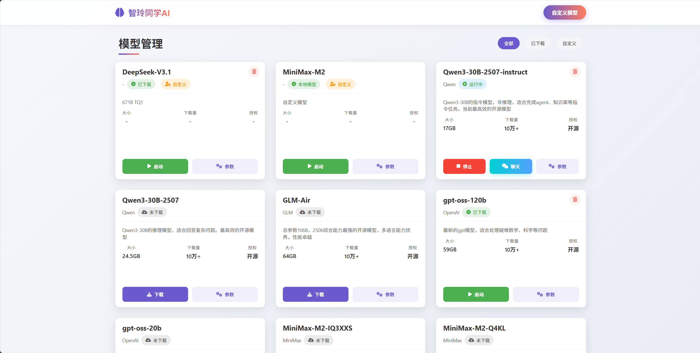
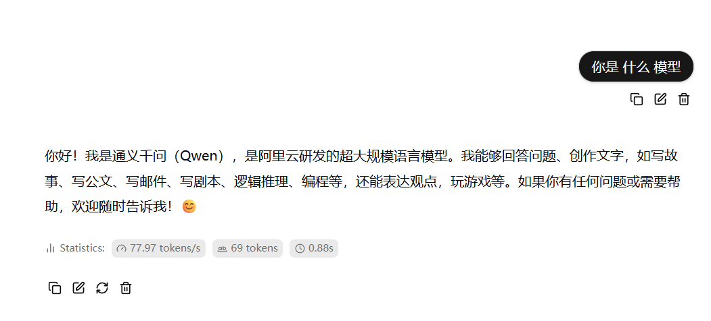

# 在AMD 395 AI PC上搭建你的第一个AI旅行助手

## 写在前面

如果你曾经为规划一次旅行而感到头疼——翻遍攻略网站，对比各种路线，计算预算是否够用，那么这篇教程将带你做一件很酷的事情：**在自己的电脑上，用AI帮你规划旅行**。

我们要用到的是**AMD 395 AI PC**。它搭载了AMD Ryzen™ AI 9 HX 395处理器，配备强大的NPU（神经网络处理单元）和GPU，基于**AMD ROCm**平台，足够运行30B参数的大语言模型。更重要的是，**所有计算都在本地完成**，你的旅行偏好、预算信息这些隐私数据不会上传到任何云端服务器。

> **关于演示环境**：本教程使用**玲珑AI工作站**（搭载AMD 395处理器）作为演示平台，因为它预装了"智玲同学"等AI管理工具，方便快速上手。**AMD 395处理器的所有特性同样适用于其他搭载该处理器的AI PC，下面提供三种部署本地模型方案**。

这个教程会带你从零开始，一步步搭建一个智能旅行规划助手。它能做到：
- 根据你的目的地和预算，自动规划每日行程
- 调用高德地图API，搜索真实的景点和天气信息
- 把完整的旅行计划保存成一份漂亮的Markdown文档

你不需要有任何AI开发经验，只需要跟着这个教程，把每一步做下来。我们会用到一些工具：HelloAgents框架（一个让Agent应用开发变简单的工具）、MCP协议（一种让AI能调用各种外部服务的标准），但你完全不需要提前了解它们——我们会在用到的时候，一点点解释清楚。

准备好了吗？让我们开始吧。

## 第一步：在AMD 395 AI PC上运行大模型

### AMD 395 AI PC的强大算力

**AMD Ryzen™ AI 9 HX 395**是AMD专为AI应用打造的处理器，它的核心优势包括：

- **强大的NPU（神经网络处理单元）**：专门优化AI推理任务
- **高性能GPU**：基于AMD RDNA™架构，支持大规模并行计算
- **AMD ROCm平台**：开源的GPU计算平台，兼容主流AI框架
- **大内存支持**：可运行30B+参数的大语言模型

如果你用过ChatGPT，你可能知道每次对话其实是把你的问题发送到OpenAI的服务器，然后等待回复。但在**AMD 395 AI PC**上，整个AI就在你面前的这台机器里，不用联网，不会泄露隐私，也不用担心云端API突然涨价或限流。这对于需要处理敏感旅行信息的场景来说，是个很大的优势。

### 选择适合你的部署方案

无论你使用的是Windows、Mac还是Linux系统，AMD 395处理器都能让你在本地运行大语言模型。下面提供三种主流方案，你可以根据自己的需求选择：

| 工具               | 适用平台          | 特点                                | 推荐场景               |
| ------------------ | ----------------- | ----------------------------------- | ---------------------- |
| **Ollama**         | Windows/Mac/Linux | 命令行工具，轻量级，模型管理简单    | 适合熟悉命令行的开发者 |
| **LM Studio**      | Windows/Mac/Linux | 图形界面，可视化操作，适合新手      | 适合需要图形界面的用户 |
| **玲珑"智玲同学"** | 玲珑AI工作站      | 预装工具，一键部署，针对AMD 395优化 | 适合玲珑工作站用户     |

> **关于ROCm**：AMD ROCm是开源的GPU计算平台，类似于NVIDIA的CUDA。上述工具在AMD 395上运行时，会自动利用ROCm加速推理。你不需要手动安装ROCm，工具会自动检测和调用GPU资源。

---

### 方案一：使用Ollama（推荐命令行用户）

Ollama就像是一个极简版的"模型管家"。你只需要敲几行命令，它就能帮你下载模型、启动服务，不需要复杂的配置。如果你习惯用命令行工作，或者想要一个轻量级的工具，Ollama是个不错的选择。它对AMD GPU的支持很好，会自动调用ROCm来加速推理。

#### 第一步：安装Ollama

首先，去Ollama的官网下载对应你系统的安装包：[https://ollama.com/download](https://ollama.com/download)

- 如果你用的是**Windows**（需要Windows 10或更高版本），下载`.exe`文件，双击安装就行，就像装普通软件一样。
- 如果你用的是**Mac**（需要macOS 14 Sonoma或更高版本），下载`.dmg`文件，拖到应用程序文件夹里。
- 如果你用的是**Linux**，打开终端，复制粘贴这条命令回车运行：
  ```bash
  curl -fsSL https://ollama.com/install.sh | sh
  ```

安装好之后，打开终端（Windows用户打开PowerShell，Mac和Linux用户打开Terminal），输入下面这行命令验证一下：

```bash
ollama --version
```

如果看到版本号（比如`ollama version 0.x.x`），说明安装成功了。

#### 第二步：下载并运行模型

现在让Ollama帮你下载模型。在终端里输入：

```bash
ollama run qwen2.5:32b
```

回车后，Ollama会自动下载Qwen2.5这个模型（大约18GB，相当于下载几部高清电影，需要等一会儿）。下载完成后，模型会自动启动。这时候Ollama已经在调用你AMD 395的GPU和NPU来加速了，你不需要做任何额外配置。

模型启动后，你会看到一个对话提示符`>>>`。试着输入：

```
>>> 你好，介绍一下你自己
```

如果模型回复了（类似"我是通义千问..."之类的），说明一切正常。按`Ctrl+D`（Mac是`Command+D`）可以退出对话。

#### 第三步：让模型作为服务运行

前面的方式是直接在终端里和模型聊天，但我们后续要用Python代码来调用模型，所以需要让Ollama以"服务"的方式在后台运行。

重新打开一个终端窗口（保持原来的窗口不动），输入：

```bash
ollama serve
```

这时候Ollama就在后台待命了，等着Python代码来调用。它开了一个本地服务器，地址是`http://127.0.0.1:11434`。你可以在浏览器里打开这个地址，如果看到"Ollama is running"，就说明服务已经启动了。

记住这个地址：`http://127.0.0.1:11434/v1`，等会写代码的时候要用到。另外，模型的名字要用`qwen2.5:32b`（和前面下载的名字对应）。

---

### 方案二：使用LM Studio（推荐图形界面用户）

如果你不太习惯敲命令，或者更喜欢用鼠标点点点，那LM Studio会是你的菜。它提供了一个漂亮的图形界面，下载模型、加载到GPU、启动服务，全都可以可视化操作。用起来就像在用一个聊天软件，非常直观。

#### 第一步：下载并安装LM Studio

打开LM Studio的官网：[https://lmstudio.ai/](https://lmstudio.ai/)

你会看到一个大大的下载按钮，它会自动识别你的系统（Windows、Mac或Linux），点击下载就行。安装过程和普通软件一样，双击安装包，一路下一步。

#### 第二步：搜索并下载模型

安装好后，打开LM Studio。你会看到一个很干净的界面，左边是菜单，中间是搜索框。

在搜索框里输入`qwen2.5`（或者`qwen3`），回车。LM Studio会从Hugging Face模型库里搜索相关的模型。你会看到一堆搜索结果，名字可能有点长，别紧张。

我们推荐选择带有`32b-instruct`字样的模型，比如`qwen2.5-32b-instruct-q4`。这里的`q4`表示"4位量化"，意思是模型被压缩过，占用的显存更少，速度也更快，但精度稍微降低一点点（对我们的旅行规划任务来说完全够用）。

找到合适的模型后，点击右侧的下载按钮（一个向下的箭头图标）。模型大小大约18GB，下载时间取决于你的网速。你可以在界面下方看到下载进度。

#### 第三步：加载模型到GPU

模型下载完成后，点击左边菜单的**"Chat"**（聊天）选项卡。

在界面上方，你会看到一个"Select a model to load"（选择要加载的模型）的下拉菜单。点击它，找到刚才下载的模型，选中它。

这时候界面下方会出现一些配置选项。找到"GPU Offload"（GPU卸载层数）这个滑块，把它拉到最右边，或者设置一个较大的数值（比如40层或更多）。这样做是为了让模型尽可能多地运行在AMD 395的GPU上，利用ROCm加速推理。LM Studio会自动检测你的AMD GPU，你不需要手动配置ROCm。

然后点击**"Load Model"**（加载模型）按钮。等待几秒钟，你会看到模型状态变成"Loaded"（已加载），同时显存占用率会上升——这说明模型已经加载到GPU里了。

#### 第四步：测试一下

现在你可以在聊天界面里试着和模型说几句话。在输入框里输入"你好，介绍一下你自己"，回车发送。如果模型回复了，说明一切正常。

#### 第五步：启动本地API服务

测试没问题后，点击左边菜单的**"Local Server"**（本地服务器）选项卡。

在这里，你会看到一个"Select a model"（选择模型）的下拉菜单，选择刚才加载的模型。然后点击大大的**"Start Server"**（启动服务器）按钮。

几秒钟后，服务器状态会变成"Running"（运行中），下方显示服务地址：`http://127.0.0.1:1234/v1`。

把这个地址记下来，等会写代码的时候要用到。模型的名字就填你选择的模型名称（比如`qwen2.5-32b-instruct`）。

现在，LM Studio已经在后台待命，等着Python代码来调用了。你可以把这个窗口最小化，继续下一步。

---

### 方案三：使用玲珑"智玲同学"（仅限玲珑工作站用户）

> **说明**：本方案仅适用于玲珑AI工作站（搭载AMD 395处理器）。该工作站预装了"智玲同学"模型管理工具，为入门用户提供了便捷的图形化部署体验。如果你使用的是其他搭载AMD 395的设备，请选择上述方案一或方案二。

"智玲同学"是玲珑AI工作站（第三方供应商产品）预装的模型管理工具，类似于手机上的应用商店，专门用来下载和管理AI模型。

**1. 打开智玲同学**

在浏览器中访问：[http://127.0.0.1:5100/](http://127.0.0.1:5100/)

你会看到三个核心功能：
- **模型库**：预置了常用的开源大模型，支持一键下载和启动
- **自定义**：支持添加任意GGUF格式的自定义模型
- **本地模型**：管理已下载的模型，支持启动、停止、聊天测试等操作



<div align="center">
  <p>图 1 智玲同学模型管理主界面（玲珑工作站）</p>
</div>

**2. 下载Qwen3-30B模型**

如图1所示，在模型库中找到"Qwen3-30B-2507-instruct"（阿里云开源的中文优化模型），点击"下载"。模型文件约18GB，下载时间取决于网速。

**3. 启动模型**

下载完成后，点击"启动"按钮。几秒钟后，状态变成"运行中"，显示地址：`http://127.0.0.1:1234/v1`

**4. 测试模型**

在"对话"选项卡中输入"你是什么模型"测试对话功能。



<div align="center">
  <p>图 2 模型下载和启动流程（玲珑工作站）</p>
</div>

---

### 确认模型已就绪

无论你选择哪种方案，完成部署后请确认以下信息：

✅ **模型已成功启动**：能在对话界面正常交互
✅ **API地址已记录**：后续代码需要连接该地址
✅ **GPU加速已启用**：AMD 395的GPU/NPU正在加速推理（可在任务管理器或工具界面中查看显存占用）

常见的API地址：
- Ollama：`http://127.0.0.1:11434/v1`
- LM Studio：`http://127.0.0.1:1234/v1`
- 智玲同学：`http://127.0.0.1:1234/v1`

> **技术说明**：这些工具在AMD 395上运行时，会通过ROCm自动调用GPU资源进行加速推理。ROCm是AMD的开源GPU计算平台，类似于NVIDIA的CUDA，支持PyTorch、TensorFlow等主流AI框架。你不需要手动配置ROCm，工具会自动处理底层加速逻辑。


## 第二步：理解MCP协议

### 为什么需要MCP

在正式写代码之前，我们需要花几分钟理解一个概念：MCP协议。别被"协议"这个词吓到，它其实很简单。

想象一下，你的AI助手就像一个聪明的秘书，但它只会思考和说话，不会自己去查天气、订酒店、搜索景点。如果要让它做这些事，传统的做法是给它写一堆"使用说明"——怎么连接天气API、怎么调用地图服务、怎么读写文件。每增加一个新功能，你就要写一套新的说明书。

MCP协议的出现，就是为了解决这个麻烦。它像是一个"万能转换器"，把各种外部服务（天气查询、地图搜索、文件操作）都变成AI能直接理解和使用的工具。你只需要告诉AI"有一个MCP工具"，它就能自动发现这个工具能做什么，然后在需要的时候自己去调用。

举个例子，我们这次要用的"高德地图MCP服务器"，它提供了16个工具：景点搜索、天气查询、路径规划、地理编码等等。你不需要为每个功能写代码，只要连接到这个服务器，AI就能自己决定什么时候该查天气、什么时候该搜景点。

### MCP的工作流程

让我们看看整个流程是怎样的。假设你问AI："帮我规划一个杭州3日游"。

首先，AI会思考："要规划旅行，我需要知道杭州的天气情况。"它发现自己有一个工具叫`amap_maps_weather`，于是调用它，传入参数`city=杭州`。MCP服务器接收到请求，去调用高德地图API，返回天气数据。AI拿到天气信息后，继续思考："接下来需要搜索杭州的景点。"于是又调用`amap_maps_text_search`工具，传入`keywords=景点, city=杭州`。搜索结果回来后，AI综合天气和景点信息，生成一份详细的旅行规划。

整个过程中，你只需要提一个需求，其他的都是AI自己决定的——什么时候调用工具、传入什么参数、如何综合信息。这就是MCP协议的魔力。

---

## 第三步：安装工具和准备API Key

这里假设读者已经安装好了python，如果没有安装可以自行搜索一些教程，这里提供一个高阅读量教程仅供参考：[Python安装与环境配置全程详细教学（包含Windows版和Mac版）](https://blog.csdn.net/sensen_kiss/article/details/141940274)

### 安装HelloAgents框架

现在模型已经跑起来了，我们需要安装一个叫HelloAgents的框架。它是一个专门为构建AI  Agent应用设计的工具，能帮我们用很少的代码就完成复杂的功能。同时有一个配套的LLM Agent零基础入门教程在[ 《从零开始构建智能体》](https://github.com/datawhalechina/hello-agents)，若想深入学习Agent知识，可以参考。

打开命令行（PowerShell或CMD都可以），输入：

```bash
pip install hello-agents==0.2.8
```

等待安装完成后，验证一下：

```bash
python -c "import hello_agents; print(hello_agents.__version__)"
```

如果看到输出`0.2.8`，说明安装成功了。

### 安装uv工具

接下来还需要安装一个叫`uv`的工具。它是一个Python包管理器，我们要用它来运行高德地图的MCP服务器。

```bash
pip install uv
```

安装完成后，命令行中就多了一个`uvx`命令。这个命令可以快速运行各种Python应用，不需要手动安装和配置。

### 申请高德地图API Key

我们的旅行助手要能搜索真实的景点和天气，就需要调用高德地图的API。别担心，高德提供的是免费服务，只需要注册一个账号。

访问高德开放平台：https://lbs.amap.com/

注册账号后，进入控制台，如图 3 所示，创建一个新应用。应用类型选择"Web服务"，然后你会得到一个API Key，把这个Key复制下来，等会要用。


<div align="center">
  
  <p>图 3 高德地图API申请</p>
</div>


### 第一次连接测试

在正式写完整的程序之前，我们先写一个小测试，确保能成功连接到AMD 395 AI PC上运行的模型。创建一个文件`test_connection.py`，输入以下代码：

```python
from hello_agents.core.llm import HelloAgentsLLM
import sys

# 连接AMD 395 AI PC上的本地模型
llm = HelloAgentsLLM(
    provider="amd395",  # 可以使用任意标识
    model="Qwen3-30B-2507-instruct",  # 与模型管理工具中启动的模型名称一致
    base_url="http://127.0.0.1:1234/v1",  # 默认端口为1234(根据使用的端口可能需要调整)
    api_key="amd395",  # 本地服务可填任意非空字符串
    verbose=False  # 关闭详细日志输出
)

# 测试连接
messages = [{"role": "user", "content": "你好，请介绍一下你自己。"}]

print("AMD 395 AI PC响应:")
print("-" * 50)

response_text = ""
for chunk in llm.think(messages):
    response_text += chunk

print("\n" + "-" * 50)
print(f"\n完整响应长度: {len(response_text)} 字符")
```

运行这个脚本：

```bash
python test_connection.py
```

如果看到模型的回复，说明一切正常。如果报错，检查一下智玲同学中的模型是否还在运行状态。

## 第四步：写代码，让AI帮你规划旅行

### 创建项目文件

创建一个新文件`travel_planner_mcp.py`，我们会一步步把代码写进去。

### 第一部分：导入库和配置

首先，导入需要的工具，并配置日志级别（避免过多干扰信息）：

```python
"""
AMD395 × HelloAgents × MCP实战：智能旅行规划助手
"""

import os
import logging
from hello_agents import SimpleAgent
from hello_agents.core.llm import HelloAgentsLLM
from hello_agents.tools import MCPTool

# 配置日志（避免过多干扰信息）
logging.basicConfig(level=logging.WARNING, format='%(message)s')
logging.getLogger('openai').setLevel(logging.ERROR)
logging.getLogger('httpx').setLevel(logging.ERROR)
```

### 第二部分：创建多Agent系统类

### 为什么需要多Agent架构？

在开始写代码之前，我们需要理解一个关键问题：**为什么不能让一个Agent完成所有工作？**

答案是：**SimpleAgent一次只能可靠地调用一个工具**。如果你让一个Agent既查天气、又搜景点、还要生成规划，它可能会：

- 只调用一个工具就结束
- 工具调用顺序混乱
- MCP连接反复断开

所以，我们采用**多Agent协作**的架构：

- **景点搜索Agent**：只负责搜索景点（调用`amap_maps_text_search`）
- **天气查询Agent**：只负责查询天气（调用`amap_maps_weather`）
- **行程规划Agent**：不调用工具，只负责整合信息生成规划

这样每个Agent只做一件事，做得又快又好。

让我们创建一个`MultiAgentTravelPlanner`类来管理这些Agent：

```python
import logging

# 配置日志（避免过多干扰信息）
logging.basicConfig(level=logging.WARNING, format='%(message)s')
logging.getLogger('openai').setLevel(logging.ERROR)
logging.getLogger('httpx').setLevel(logging.ERROR)


class MultiAgentTravelPlanner:
    """多Agent旅行规划系统"""

    def __init__(self, amap_api_key: str):
        """初始化多Agent系统"""
        print("\n🔄 初始化多Agent旅行规划系统...")

        # 1. 连接AMD 395 AI PC上的本地模型
        print("  ├─ 连接AMD 395 AI PC...")
        self.llm = HelloAgentsLLM(
            model="Qwen3-30B-2507-instruct",
            base_url="http://127.0.0.1:1234/v1",
            api_key="amd395"
        )

        # 测试连接
        try:
            messages = [{"role": "user", "content": "你好"}]
            response = ""
            for chunk in self.llm.think(messages):
                response += chunk
            print("  ├─ ✓ 模型连接成功")
        except Exception as e:
            print(f"  └─ ✗ 模型连接失败：{e}")
            raise

        # 2. 创建共享的MCP工具（关键：只创建一次，多个Agent共享）
        print("  ├─ 创建共享的高德地图MCP工具...")
        self.amap_tool = MCPTool(
            name="amap",
            description="高德地图服务",
            server_command=["uvx", "amap-mcp-server"],
            env={"AMAP_MAPS_API_KEY": amap_api_key},
            auto_expand=True
        )
        print("  ├─ ✓ MCP工具创建成功")

        # 3. 创建景点搜索Agent（只负责搜索景点）
        print("  ├─ 创建景点搜索Agent...")
        self.attraction_agent = SimpleAgent(
            name="景点搜索专家",
            llm=self.llm,
            system_prompt="""你是景点搜索专家。

你的任务：使用amap_maps_text_search工具搜索指定城市的景点。

输出格式：请简要列出景点名称和地址即可。"""
        )
        self.attraction_agent.add_tool(self.amap_tool)

        # 4. 创建天气查询Agent（只负责查询天气）
        print("  ├─ 创建天气查询Agent...")
        self.weather_agent = SimpleAgent(
            name="天气查询专家",
            llm=self.llm,
            system_prompt="""你是天气查询专家。

你的任务：使用amap_maps_weather工具查询指定城市的天气情况。

输出格式：请简要说明天气状况、温度、风力即可。"""
        )
        self.weather_agent.add_tool(self.amap_tool)

        # 5. 创建行程规划Agent（不调用工具，只负责整合信息）
        print("  ├─ 创建行程规划Agent...")
        self.planner_agent = SimpleAgent(
            name="行程规划专家",
            llm=self.llm,
            system_prompt="""你是行程规划专家。

你的任务：根据景点信息和天气信息，生成详细的旅行规划。

输出格式（Markdown）：
# {城市}N日游旅行规划

## 行程概览
- 目的地：...
- 旅行天数：...
- 总预算：...

## 天气情况
（根据天气信息填写）

## 详细行程
### 第1天：...
- 上午：...
- 下午：...
- 晚上：...
- 预算：...元

### 第2天：...
...

## 预算总结
...

## 旅行建议
..."""
        )

        print(f"  └─ ✓ 多Agent系统初始化成功\n")
```

这段代码做了什么？

1. **连接AMD 395 AI PC**：创建一个LLM连接，所有Agent共享这个模型
2. **创建共享MCP工具**：`self.amap_tool`作为实例变量，在整个类生命周期内保持活跃，不会断开
3. **创建3个专门的Agent**：
   - 景点搜索Agent：只调用`amap_maps_text_search`
   - 天气查询Agent：只调用`amap_maps_weather`
   - 行程规划Agent：不调用工具，只整合信息

### 第三部分：多Agent协作工作流程

现在给`MultiAgentTravelPlanner`类添加一个`plan_travel`方法，让3个Agent协作完成任务：

```python
    def plan_travel(self, destination: str, days: int, budget: float, preferences: str = ""):
        """
        使用多Agent协作规划旅行

        流程：
        1. 景点搜索Agent → 搜索景点
        2. 天气查询Agent → 查询天气
        3. 行程规划Agent → 整合信息生成计划
        """
        print("=" * 80)
        print("【开始多Agent协作规划旅行】")
        print("=" * 80)
        print(f"目的地：{destination}")
        print(f"天数：{days}天")
        print(f"预算：{budget}元")
        print(f"偏好：{preferences if preferences else '不限'}")
        print("=" * 80)
        print()

        # 步骤1: 景点搜索Agent搜索景点
        print("📍 步骤1: 景点搜索Agent工作中...")
        keywords = preferences if preferences else "景点"
        attraction_query = f"请使用amap_maps_text_search工具搜索{destination}的{keywords}相关景点，返回前10个结果"
        print(f"   查询: {attraction_query}")
        attraction_response = self.attraction_agent.run(attraction_query)
        print(f"   ✓ 景点搜索完成\n")

        # 步骤2: 天气查询Agent查询天气
        print("🌤️  步骤2: 天气查询Agent工作中...")
        weather_query = f"请使用amap_maps_weather工具查询{destination}的天气信息"
        print(f"   查询: {weather_query}")
        weather_response = self.weather_agent.run(weather_query)
        print(f"   ✓ 天气查询完成\n")

        # 步骤3: 行程规划Agent整合信息生成计划
        print("📋 步骤3: 行程规划Agent整合信息中...")
        print("   (这一步可能需要30-60秒，请耐心等待...)")

        planner_query = f"""请为我生成一个{destination}{days}日游的详细旅行规划：

【基本信息】
- 目的地：{destination}
- 旅行天数：{days}天
- 总预算：{budget}元
- 偏好：{preferences if preferences else "不限"}

【天气情况】
{weather_response[:500]}...

【可选景点】
{attraction_response[:800]}...

【要求】
1. 生成{days}天的详细行程安排
2. 每天安排2-3个主要景点
3. 包含住宿、餐饮、交通建议
4. 预算分配合理
5. 以Markdown格式输出

请开始生成规划："""

        print(f"   正在生成规划（约需30秒）...")
        result = self.planner_agent.run(planner_query)
        print(f"   ✓ 行程规划完成\n")

        return result
```

这段代码干了什么？我们给Agent写了一个很详细的需求说明，告诉它要规划哪个城市、多少天、预算多少、偏好什么。更重要的是，我们告诉它**该怎么做**：先查天气，再搜景点，然后整合信息。

Agent拿到这个任务后，会自己思考："好的，我要先调用`amap_maps_weather`工具查天气。"它会自动生成参数`city=杭州`，调用工具，拿到天气数据。然后继续思考："现在我知道天气了，接下来要搜景点。用户喜欢自然风光和历史文化，我可以搜索'西湖'、'灵隐寺'这些关键词。"于是又调用`amap_maps_text_search`工具。

最后，Agent把天气信息、景点列表、开放时间、门票价格等等信息整合起来，生成一份漂亮的旅行规划。

### 第四部分：保存规划结果

最后，我们把规划结果保存成一个Markdown文件：

```python
def save_to_markdown(content: str, destination: str, days: int):
    """保存行程到Markdown文件"""
    filename = f"{destination}_{days}日游_MCP.md"

    with open(filename, "w", encoding="utf-8") as f:
        f.write(f"*本行程由AMD 395 AI PC×HelloAgents×MCP自动生成*\n\n")
        f.write("---\n\n")
        f.write(content)

    print(f"\n✓ 行程已保存到文件：{filename}")
    return filename


def main():
    """主函数"""
    print("=" * 80)
    print("AMD 395 AI PC × HelloAgents × MCP实战：智能旅行规划助手")
    print("=" * 80)

    # 配置高德地图API Key
    amap_api_key = "your_api_key_here"  # 替换成你自己的API Key

    if not amap_api_key or amap_api_key == "your_api_key_here":
        print("\n✗ 错误：未配置高德地图API Key")
        print("\n请修改脚本，填写你的API Key")
        print("申请地址：https://lbs.amap.com/")
        return

    print(f"\n✓ 已配置高德地图API Key: {amap_api_key[:8]}...{amap_api_key[-4:]}")

    try:
        # 创建多Agent旅行规划系统
        planner = MultiAgentTravelPlanner(amap_api_key)

        # 规划旅行
        result = planner.plan_travel(
            destination="杭州",
            days=3,
            budget=3000,
            preferences="自然风光和历史文化"
        )

        # 输出结果
        print("\n" + "=" * 80)
        print("【规划完成】")
        print("=" * 80)
        print(result)

        # 保存到文件
        save_to_markdown(result, "杭州", 3)

        print("\n" + "=" * 80)
        print("✓ 旅行规划完成！")
        print("=" * 80)

    except Exception as e:
        print(f"\n✗ 发生错误：{e}")
        import traceback
        traceback.print_exc()


if __name__ == "__main__":
    main()
```

完整的代码文件就完成了！整个脚本大约300行，但逻辑很清晰：配置→连接模型→创建MCP工具→创建Agent→运行任务→保存结果。

### 运行程序

保存文件后，在命令行中运行：

```bash
python travel_planner_mcp.py
```

你会看到一连串的输出。首先是连接模型：

```
================================================================================
AMD 395 AI PC × HelloAgents × MCP实战：智能旅行规划助手
================================================================================

✓ 已配置高德地图API Key: 25dfaf05...8029

🔄 初始化多Agent旅行规划系统...
  ├─ 连接AMD 395 AI PC...
  ├─ ✓ 模型连接成功
  ├─ 创建共享的高德地图MCP工具...
  ├─ ✓ MCP工具创建成功
  ├─ 创建景点搜索Agent...
  ├─ 创建天气查询Agent...
  ├─ 创建行程规划Agent...
  └─ ✓ 多Agent系统初始化成功

================================================================================
【开始多Agent协作规划旅行】
================================================================================
目的地：杭州
天数：3天
预算：3000元
偏好：自然风光和历史文化
================================================================================

📍 步骤1: 景点搜索Agent工作中...
   查询: 请使用amap_maps_text_search工具搜索杭州的自然风光和历史文化相关景点
   ✓ 景点搜索完成

🌤️  步骤2: 天气查询Agent工作中...
   查询: 请使用amap_maps_weather工具查询杭州的天气信息
   ✓ 天气查询完成

📋 步骤3: 行程规划Agent整合信息中...
   (这一步可能需要30-60秒，请耐心等待...)
   正在生成规划（约需30秒）...
   ✓ 行程规划完成

================================================================================
【规划完成】
================================================================================
# 杭州3日游旅行规划
...（完整的行程内容）

✓ 行程已保存到文件：杭州_3日游_MCP.md

================================================================================
✓ 旅行规划完成！
================================================================================
```

整个过程大约需要30-60秒，取决于Agent思考和调用工具的次数。最终你会得到一份详细的旅行规划，保存在`杭州_3日游_MCP.md`文件里。

打开这个文件，你会发现里面的景点都是真实存在的，地址、开放时间都是从高德地图API查询到的实时数据。

---

## 写在最后

### 你刚刚做了什么

如果你跟着这个教程一步步走到这里，恭喜你！你刚刚在自己的电脑上搭建了一个智能旅行规划助手。更重要的是，你学会了三件事：

第一件事是**在本地运行AI**。你不再依赖ChatGPT或Claude这些云端服务，你有了一个完全属于自己的AI大脑。它能24小时待命，不会因为网络问题掉线，也不会因为OpenAI限流而卡顿。你的旅行偏好、预算信息、行程计划，全都在你的电脑里，不会上传到任何地方。

第二件事是**让AI使用工具**。以前的AI只会聊天，你问它"杭州今天天气怎么样"，它只能根据训练数据猜测。但现在，你的AI能自己调用高德地图API，查到实时的天气数据。这个能力是通过MCP协议实现的——一个让AI能连接各种外部服务的标准。

第三件事是**用框架快速搭建应用**。你用HelloAgents框架，不到300行代码就完成了一个完整的旅行助手。如果从零开始写，可能需要几千行代码。框架的价值就在这里——它把复杂的事情变简单，让你能把精力放在真正重要的地方。

### 如果你想走得更远

这个旅行助手只是一个起点。如果你想让它更强大，可以试试这些：

**让它能查更多信息**。高德地图MCP服务器提供了16个工具，我们只用了天气查询和景点搜索。你可以让它规划路线（骑行、步行、驾车都行），查询两地距离，甚至根据坐标反查地址。只要在提示词里告诉Agent有这些工具，它就会在需要的时候自己调用。

**让它处理更复杂的任务**。试试让它规划一个"北京→上海→杭州"的多城市联程，或者根据你的旅行照片生成游记。这需要调整提示词，告诉Agent该怎么思考、分几步完成任务。

**给它配个更强的大脑**。AMD 395 AI PC支持运行更大的模型，如果显存还有富余，可以试试Qwen3-70B。参数越多的模型，理解能力越强，生成的行程也会更详细、更合理。

**让更多人用起来**。现在这个程序只能在命令行里运行，但你可以用FastAPI做一个网页版，或者用Streamlit做一个图形界面。这样你的家人朋友也能用上你的旅行助手。

### 如果遇到了问题

**MCP工具连接失败？** 确保你已经安装了`uv`工具（`pip install uv`）。如果还不行，试试手动运行`uvx amap-mcp-server`，看看报什么错。大多数情况下是网络问题，uv需要联网下载MCP服务器。

**AI生成的行程不靠谱？** 这通常是提示词的问题。你可以在`system_prompt`里写得更详细一些，比如明确说"必须使用工具查询真实数据，不要编造信息"，或者给它一个示例行程作为参考。

**想在其他电脑上用？** 把AMD 395 AI PC的IP地址告诉其他电脑就行。比如IP是`192.168.1.100`，那么在其他电脑的代码里，把`base_url`改成`http://192.168.1.100:1234/v1`。只要在同一个局域网，就能访问。

### 为什么选择本地AI

最后，我想说说为什么要费这么大劲在本地跑AI。

云端API当然很方便，注册个账号，拿到Key，几行代码就能用。但它有三个问题：第一是**隐私**，你的每一条消息都会上传到服务商的服务器，你永远不知道它们会被怎么处理；第二是**成本**，看起来每次调用只要几分钱，但对于频繁使用的应用，这笔费用会越来越高；第三是**限制**，云端服务可能限流、可能涨价、可能突然停服，你完全没有主动权。

本地AI就不一样了。AMD 395 AI PC是一次性投入，之后无论你调用多少次、处理多敏感的数据，都不会产生额外费用，也不用担心隐私泄露。更重要的是，基于**AMD ROCm平台**，你可以完全自主地调整模型参数、修改提示词、更换不同的模型。这台机器是你的，AI也是你的，一切都在你的掌控之中。

这就是本地AI的价值。它不仅仅是一个技术选择，更是一种对隐私、成本和自主权的重新思考。

希望这个教程对你有帮助。如果有什么问题或想法，欢迎随时交流。祝你的AI之旅愉快！ 🎉


## 参考资料

如果你想深入了解相关技术，这些资料会有帮助：

- **AMD AI Academy**：https://www.amd.com/en/developer/resources/training/amd-ai-academy.html

- **HelloAgents框架**：https://github.com/jjyaoao/HelloAgents
  一个专为Agent初学者设计的AI Agent框架，有详细的中文文档和丰富的案例。

- **MCP协议文档**：https://modelcontextprotocol.io/
  由Anthropic推出的AI工具通信标准，正在成为行业共识。

- **Qwen模型系列**：https://github.com/QwenLM/Qwen
  阿里云开源的大语言模型系列，中文能力出色，支持Function Calling。

- **高德开放平台**：https://lbs.amap.com/
  提供地图、天气、路径规划等API服务，有免费额度可用。

---

*感谢你阅读这篇教程。如果觉得有用，欢迎分享给更多对本地AI感兴趣的朋友。*

