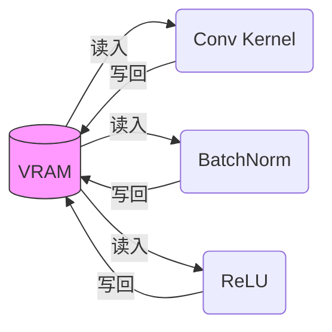
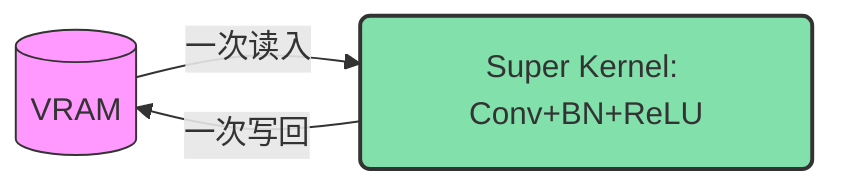

# 第 3 章：迈入 ROCm 编程世界——手写一个“PyTorch 算子”

[](https://rocm.docs.amd.com/)
[](https://pytorch.org/)
[]()
[]()

</div>

> **🖥️ 实验环境**
>
> - **设备**: AMD AI+ MAX395
> - **GPU**: Radeon 8060S
> - **架构**: gfx1151 (RDNA 3)
> - **ROCm 版本**: 7.x
> - **系统**: Ubuntu 24.04 / 22.04

---

## 🎯 本章学习目标

通过本章，你将掌握以下核心技能：

1. ✅ **HIP 语言基础与执行模型**：理解 Host 与 Device 的分工，吃透 Grid、Block、Thread 的三级调度架构与寻址方式。
2. ✅ **手写 Kernel 与性能剖析**：从底层 C++ 复现 Python 中的 Tensor 加法，避开“异步执行”的初学者陷阱。
3. ✅ **GPU 内存金字塔**：建立对寄存器、共享内存（LDS）和全局内存（VRAM）的层级认知。
4. ✅ **调用高性能库**：理解 rocBLAS 的内存排布与 MIOpen 的算子融合（Fusion）魔法。

在上一章中，我们了解了 GPU 的硬件架构。但在实际的 AI 开发中，当你写下 `c = a + b` 时，底层到底发生了什么？本章我们将脱掉 Python 的外衣，深入底层，亲手用 HIP 语言写一个算子！

---

## 🗣️ 3.1 HIP 语言与 GPU “人海战术”模型

### ❓ HIP 是什么？
**HIP（Heterogeneous-Compute Interface for Portability）** 是 AMD 推出的一种基于 C++ 的异构计算编程语言。它的语法与 NVIDIA 的 CUDA **高达相似**（仅仅是前缀从 `cuda` 变成了 `hip`）。掌握了 HIP，你实际上也就掌握了 CUDA。

### 📊 图解：GPU 的三级线程模型 (Grid - Block - Thread)

要让代码在 GPU 上并发，必须理解它的“人海战术”编制。GPU 上的任务调度分为三个层级：


| 调度层级           | 对应物理硬件       | 核心特点                                                     |
| :----------------- | :----------------- | :----------------------------------------------------------- |
| **Grid (网格)**    | 整个 GPU           | 包含所有的 Block，代表一次完整的核函数调用。                 |
| **Block (线程块)** | 单个 CU (计算单元) | 包含多个 Thread（最高通常为 1024 个）。同一个 Block 里的线程可以通过**共享内存 (LDS)** 高效交换数据。 |
| **Thread (线程)**  | ALU (流处理器)     | 最小的执行单元，负责计算一个或几个数据点。                   |

### 🧭 算子寻址指南：我是谁？我在哪？

初学者写算子最痛苦的就是：**成千上万个线程同时运行相同的代码，我怎么知道当前线程该处理哪个数据？** 
这就需要用到 HIP 内置的寻址变量。


**1. 一维数组寻址（比如向量加法）：**
假设我们要处理一个长度为 1000 的数组，每个 Block 有 256 个线程。

```cpp
// 公式：全局唯一 ID = 前面所有 Block 的线程总数 + 当前 Block 内的线程 ID
int idx = hipBlockIdx_x * hipBlockDim_x + hipThreadIdx_x;
```
*   `hipBlockDim_x`: 每个 Block 有多大？（256）
*   `hipBlockIdx_x`: 我在第几个 Block？（比如第 2 个）
*   `hipThreadIdx_x`: 我在当前 Block 排第几？（比如第 10 个）
*   *结果*：我的全局 ID 就是 `2 * 256 + 10 = 522`，我就去处理数组的第 522 个元素！

**2. 二维数组寻址（比如图像处理/矩阵乘法）：**
如果要处理一张 1920x1080 的图片，我们会启动一个 2D 的 Grid 和 2D 的 Block。
```cpp
// 计算当前线程对应的图像列号 (x) 和行号 (y)
int x = hipBlockIdx_x * hipBlockDim_x + hipThreadIdx_x;
int y = hipBlockIdx_y * hipBlockDim_y + hipThreadIdx_y;

// 将二维坐标拍平成一维数组的索引 (假设图像宽度为 width)
int idx = y * width + x;
```

---

## 🛠️ 3.2 揭秘 Tensor 加法：编写你的第一个 Kernel

在 PyTorch 中处理 1000 万个元素的张量加法时，GPU 会启动 1000 万个线程。下面是**标准**的 C++ 底层实现，包含了规范的错误捕捉（`HIP_CHECK`）和 `hipEvent` 纳秒级性能剖析。

### ✍️ 完整实战：带有计时器的 `vector_add.cpp`

```cpp
#include <hip/hip_runtime.h>
#include <iostream>
#include <vector>

// 💡 宏定义：捕捉底层 API 错误（工业界标配）
#define HIP_CHECK(command) {               \
    hipError_t status = command;           \
    if (status != hipSuccess) {            \
        std::cerr << "HIP Error: " << hipGetErrorString(status) \
                  << " at line " << __LINE__ << std::endl;      \
        exit(1);                           \
    }                                      \
}

// 🚀 核函数：向量加法
__global__ void vectorAdd(const float* a, const float* b, float* c, int n) {
    // 使用刚才学的 1D 寻址公式
    int id = hipBlockDim_x * hipBlockIdx_x + hipThreadIdx_x;
  
    // 边界保护：防止最后一个 Block 里的多余线程越界访问
    if (id < n) {
        c[id] = a[id] + b[id]; // 每个线程只负责一个元素的加法！
    }
}

int main() {
    int n = 10000000; // 1000万个元素
    size_t bytes = n * sizeof(float);

    // 1️⃣ Host 端内存分配与初始化
    std::vector<float> h_a(n, 1.0f);
    std::vector<float> h_b(n, 2.0f);
    std::vector<float> h_c(n, 0.0f);

    // 2️⃣ Device 端显存 (VRAM) 分配
    float *d_a, *d_b, *d_c;
    HIP_CHECK(hipMalloc(&d_a, bytes));
    HIP_CHECK(hipMalloc(&d_b, bytes));
    HIP_CHECK(hipMalloc(&d_c, bytes));

    // ⏱️ 创建事件计时器
    hipEvent_t start, stop;
    hipEventCreate(&start); hipEventCreate(&stop);

    // 3️⃣ 数据搬运：CPU -> GPU (记录耗时)
    hipEventRecord(start);
    HIP_CHECK(hipMemcpy(d_a, h_a.data(), bytes, hipMemcpyHostToDevice));
    HIP_CHECK(hipMemcpy(d_b, h_b.data(), bytes, hipMemcpyHostToDevice));
    hipEventRecord(stop);
    hipEventSynchronize(stop);
    float ms_memcpy_h2d;
    hipEventElapsedTime(&ms_memcpy_h2d, start, stop);

    // 4️⃣ 执行 Kernel 计算
    int threadsPerBlock = 256;
    // 向上取整计算需要的 Block 数量
    int blocksPerGrid = (n + threadsPerBlock - 1) / threadsPerBlock;
  
    hipEventRecord(start);
    // 启动核函数：<<<Grid, Block>>>
    hipLaunchKernelGGL(vectorAdd, dim3(blocksPerGrid), dim3(threadsPerBlock), 0, 0, d_a, d_b, d_c, n);
    hipEventRecord(stop);
    hipEventSynchronize(stop); // 等待 GPU 计时结束
    float ms_kernel;
    hipEventElapsedTime(&ms_kernel, start, stop);

    // 5️⃣ 数据搬运：GPU -> CPU
    HIP_CHECK(hipMemcpy(h_c.data(), d_c, bytes, hipMemcpyDeviceToHost));

    // 📊 打印性能数据
    std::cout << "验证: c[0] = " << h_c[0] << " (预期: 3.0)" << std::endl;
    std::cout << "[耗时] H2D 搬运 (PCIe): " << ms_memcpy_h2d << " ms" << std::endl;
    std::cout << "[耗时] Kernel 计算 (VRAM): " << ms_kernel << " ms" << std::endl;
  
    // 6️⃣ 释放显存
    hipFree(d_a); hipFree(d_b); hipFree(d_c);
    return 0;
}
```

### ⚙️ 编译与运行分析：探究底层的性能秘密

使用 `hipcc` 编译并运行：

```bash
hipcc vector_add.cpp -o vector_add -O3
./vector_add
```

**实际输出**：
```text
验证: c[0] = 3 (预期: 3.0)
[耗时] H2D 搬运 (PCIe): 7.77195 ms
[耗时] Kernel 计算 (VRAM): 1.5428 ms
```

<div style="background: #fff3e0; border: 1px solid #ff9800; border-radius: 8px; padding: 16px; margin: 16px 0;">
  <div style="display: flex; align-items: start;">
    <span style="font-size: 20px; margin-right: 10px;">⚠️</span>
    <div>
      <strong style="color: #ef6c00;">初学者陷阱：CPU 是不等待 GPU 的（异步机制）</strong><br>
      <span style="color: #ef6c00; line-height: 1.6;">
        当你执行 <code>hipLaunchKernelGGL</code> 时，CPU 把任务扔给 GPU 后，<strong>会立刻执行下一行代码</strong>，绝不会在原地等待 GPU 计算完！<br>
        如果你在 Kernel 刚启动后立刻去打印 Host 端的结果，你只会得到 <code>0.0</code>，因为 GPU 还没算完。<strong>解决方案</strong>：使用 <code>hipDeviceSynchronize()</code>，强制让 CPU 阻塞，直到 GPU 把之前收到的任务全部执行完毕。请务必牢记这个概念，这是 90% 新手 Debug 时遇到的第一个坑！
      </span>
    </div>
  </div>
</div>

<div style="background: #e3f2fd; border: 1px solid #2196f3; border-radius: 8px; padding: 16px; margin: 16px 0;">
  <div style="display: flex; align-items: start;">
    <span style="font-size: 20px; margin-right: 10px;">🔍</span>
    <div>
      <strong style="color: #1565c0;">深度解析：为什么 PyTorch 有时会卡顿？</strong><br>
      <span style="color: #1565c0; line-height: 1.6;">
        观察上面的输出你会发现，数据搬运（H2D）的耗时居然是 Kernel 纯计算耗时的 <strong>5倍</strong>！<br>
        因为 PCIe 总线的带宽最高也就几十 GB/s，而 GPU 内部的显存带宽高达几百甚至上千 GB/s。这就是为什么在深度学习训练循环中，<strong>严禁频繁调用 <code>.cpu()</code> 或者 <code>tensor.item()</code></strong>，这会导致 GPU 停下来等待极其缓慢的数据搬运总线。
      </span>
    </div>
  </div>
</div>

---

## 🛕 3.3 算子优化的内功心法：GPU 内存金字塔

为什么手写了 GPU 代码，速度还是慢？因为**数据存放在哪，决定了计算有多快**。要写出高性能算子，必须理解 GPU 的“内存金字塔”。


| 存储类型                | 在 HIP 中的声明         | 访问延迟        | 作用域与特点                                                 | 比喻           |
| :---------------------- | :---------------------- | :-------------- | :----------------------------------------------------------- | :------------- |
| **Register (寄存器)**   | `float val = 1.0;`      | 极快 (~1周期)   | **线程私有**。如果申请的变量过多，会导致“寄存器溢出”，性能暴跌。 | 工人手里的砖头 |
| **LDS (共享内存)**      | `__shared__ float s[];` | 快 (~20周期)    | **Block 内共享**。同 Block 里的线程用它来交换数据，是算子优化的**终极杀器**。 | 工地上的小推车 |
| **VRAM (全局显存)**     | `hipMalloc`             | 慢 (~200周期)   | **全局可见**。容量大（如 64GB），但带宽有限。优化核心是：减少访问 VRAM 的次数。 | 远处的建材仓库 |
| **Host RAM (系统内存)** | `malloc`                | 极慢 (PCIe瓶颈) | CPU 的内存，GPU 访问它需要过“收费站”（PCIe），必须尽量避免。 | 隔壁城市的工厂 |

**优化金科玉律：** 从 VRAM 读一次数据到 LDS 中，然后让线程在 LDS 和寄存器里反复计算成百上千次，最后再写回 VRAM。这就是**矩阵乘法（GEMM）**能达到几百 TFLOPS 算力的秘密！

---

## 📚 3.4 ROCm 核心生态库

由于极致榨干 LDS 和寄存器需要写成百上千行底层的分块（Tiling）和汇编代码，实际开发中我们高度依赖 ROCm 的官方生态库。

### 🧮 rocBLAS 实战：完整的 SGEMM 程序

`rocBLAS` 负责底层线性代数加速。在使用它之前，必须理解 BLAS 的**列主序（Column-Major）**存储陷阱：

```text
C++/Python 默认 (Row-Major): | rocBLAS 要求 (Column-Major):
[ 1, 2 ] => 内存: [1, 2, 3, 4] | [ 1, 2 ] => 内存: [1, 3, 2, 4]
[ 3, 4 ]                       | [ 3, 4 ]
```

**实战代码（带数据初始化的 SGEMM）：**

```cpp
#include <hip/hip_runtime.h>
#include <rocblas/rocblas.h>
#include <iostream>
#include <vector>

int main() {
    rocblas_int m = 1024, n = 1024, k = 1024;
    float alpha = 1.0f, beta = 0.0f;
    size_t size = m * n * sizeof(float);

    // 1. Host 端初始化
    std::vector<float> h_A(m * k, 1.0f);
    std::vector<float> h_B(k * n, 2.0f);
    std::vector<float> h_C(m * n, 0.0f);

    // 2. Device 端显存分配与拷贝
    float *d_A, *d_B, *d_C;
    hipMalloc(&d_A, size); hipMalloc(&d_B, size); hipMalloc(&d_C, size);
    hipMemcpy(d_A, h_A.data(), size, hipMemcpyHostToDevice);
    hipMemcpy(d_B, h_B.data(), size, hipMemcpyHostToDevice);

    // 3. 初始化 rocBLAS 句柄（Handle 管理上下文和资源）
    rocblas_handle handle;
    rocblas_create_handle(&handle);

    // 🚀 4. 调用高度优化的矩阵乘法 (C = alpha*A*B + beta*C)
    rocblas_sgemm(handle, rocblas_operation_none, rocblas_operation_none,
                  m, n, k, &alpha,
                  d_A, m, d_B, k, &beta, d_C, m);

    // 5. 拷回结果并打印左上角 4x4
    hipMemcpy(h_C.data(), d_C, size, hipMemcpyDeviceToHost);
  
    std::cout << "=== 结果矩阵 C 的左上角 4x4 局部 ===\n";
    for(int i=0; i<4; i++) {
        for(int j=0; j<4; j++) {
            // 列主序寻址：index = i + j * m
            std::cout << h_C[i + j * m] << "\t";
        }
        std::cout << "\n";
    }

    rocblas_destroy_handle(handle);
    hipFree(d_A); hipFree(d_B); hipFree(d_C);
    return 0;
}
```

使用 `hipcc` 编译并运行：

```bash
hipcc sgemm_test.cpp -o sgemm_test -lrocblas
./sgemm_test
```

**实际输出**：

```text
=== 结果矩阵 C 的左上角 4x4 局部 ===
2048	2048	2048	2048	
2048	2048	2048	2048	
2048	2048	2048	2048	
2048	2048	2048	2048
```

### 🧠 MIOpen 简介：算子融合（Kernel Fusion）的魔法

MIOpen 是 ROCm 的深度学习加速核动力（对标 NVIDIA 的 cuDNN）。当你在 PyTorch 里调用 `nn.Conv2d` 时，MIOpen 在底层会施展**算子融合（Kernel Fusion）**的魔法。

在传统方式下，执行一段 `Conv2D -> BatchNorm -> ReLU` 会反复读写显存，导致严重的内存带宽浪费（反复进出“远处的建材仓库”）：



**MIOpen 的融合魔法**会将这三步融合成一个极其庞大的超级 Kernel。数据在 GPU 内部的寄存器中直接完成卷积、标准化和激活的流水线作业，彻底斩断对慢速 VRAM 的频繁依赖：



---

## 📚 本章小结

通过本章的底层探索，你掌握了以下知识：

| 核心要点     | 总结说明                                                     |
| :----------- | :----------------------------------------------------------- |
| **执行模型** | 掌握了 Grid-Block-Thread 的三级调度，学会了用 `blockIdx` 和 `threadIdx` 进行一维和二维的寻址定位。 |
| **HIP 编程** | 成功编写了向量加法，了解了 `hipDeviceSynchronize()` 防止异步坑，并验证了 PCIe 带宽对 AI 计算的制约。 |
| **内存层级** | 建立了对 Register、LDS、VRAM 和 Host RAM 访问速度的直观感受。 |
| **底层库**   | 了解了 `rocBLAS` 的列主序陷阱，以及 `MIOpen` 令人惊叹的算子融合技术。 |
