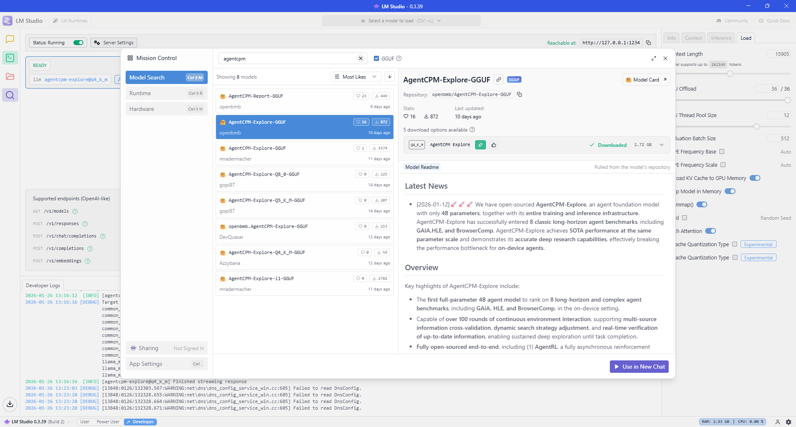
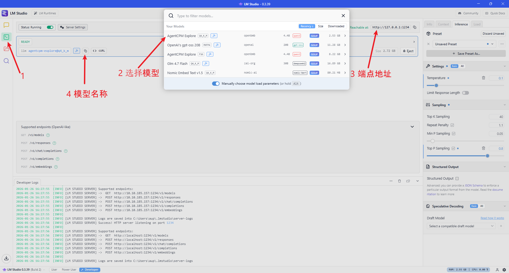
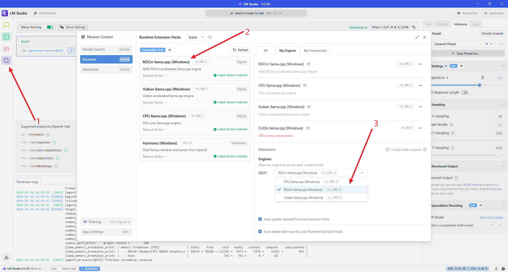

# 🧸 toy-cli - LLM 轻量化终端助手 AMD ROCm 版本

<div align='center'>

[](https://rocm.docs.amd.com/)


</div>

**toy-cli** 是一个极简的命令行工具，用于快速调用大语言模型 API，采用简化的 Claude Code 风格的代码 Agent 设计。它让你在 3 分钟内就能上手大模型调用，是学习 API 调用的最佳入门项目。

> toy-cli 项目地址：[*Link*](https://github.com/KMnO4-zx/toy-cli.git)

***OK，那接下来我将会带领大家亲自动手，一步步实现 toy-cli 的安装和使用过程，让我们一起来体验一下吧~***

## Step 1: 环境准备

本文基础环境如下：

```
----------------
LM Studio 
python 3.12
----------------
```
> 本文默认学习者使用的是 AMD ROCm 支持的显卡 或 搭载 Ryzen AI 系列芯片 AI PC 设备，LM Studio 本地加载大模型请参考 [Getting Started with ROCm Deploy](./01-Deploy/README.md)

首先 `pip` 换源加速下载并安装依赖包

```shell
# 升级pip
python -m pip install --upgrade pip
# 更换 pypi 源加速库的安装
pip config set global.index-url https://pypi.tuna.tsinghua.edu.cn/simple

pip install requests python-dotenv chardet
```

## Step 2: 本地模型配置

### 2.1 LM-Studio 加载 AgentCPM-explore 模型

<div align='center'>
    
    <p>AgentCPM-explore model</p>
</div>

AgentCPM-Explore 是一款专为“端侧设备”打造的高性能开源智能体基础模型。它仅凭 4B（40 亿）的小巧参数量，就在多项复杂任务榜单中达到了同类领先水平，不仅支持超过 100 轮的超长持续交互与深度信息搜索，还配套开源了从强化学习训练到工具沙箱管理的全栈基础设施，让开发者能低门槛地构建具备“深度思考”能力的移动端 AI 助手。

> AgentCPM-Explore 项目地址：[*Link*](https://github.com/OpenBMB/AgentCPM)

### 2.2 配置端点地址和模型名称

在 LM-Studio 中查看端点地址（默认为： `http://127.0.0.1:1234` ）：

<div align='center'>
    
    <p>AgentCPM-explore model</p>
</div>

使用 AMD ROCm 作为推理引擎：

<div align='center'>
    
    <p>AgentCPM-explore model</p>
</div>

在项目代码中配置模型名称 `agent.py` 第 365 行到第 372 行修改 `llm = LocalLLM(model="agentcpm-explore@q4_k_m")`  ：

```python
if __name__ == "__main__":
    # DeepSeek reasoner：
    # llm = DeepSeekLLM(model="deepseek-reasoner")
    # llm = DeepSeekLLM(model="deepseek-chat")
    # 其他：
    # llm = SiliconflowLLM(model="deepseek-ai/DeepSeek-V3.2")
    # llm = LocalLLM(model="openai/gpt-oss-20b")
    llm = LocalLLM(model="agentcpm-explore@q4_k_m")

    agent = Agent(llm=llm, use_todo=True)

    agent.loop()
```

在项目代码中配置模型端点地址 `llm.py` 第 126 行到第 127 行修改 `self.base_url`：

```python
class LocalLLM(BaseLLM):
    def __init__(self, api_key: str = None, model: str = "agentcpm-explore@f16"):
        super().__init__(api_key, model)
        self.api_key = api_key if api_key else "xxxxxxx"
        # self.base_url = "http://192.168.1.5:1234/v1"
        self.base_url = "http://127.0.0.1:1234/v1"
        self.model = model
        self.platform = "LMStudio"
```


### 2.3 不同量级本地模型的参数推荐建议

> 如果在使用过程中发现模型出现循环调用，重复思考的行为出现，可以参考以下指南修改部分参数

| 参数维度 | 4B / 8B (小模型) | 20B / 30B (中模型) | 120B-moe (大模型) |
| :--- | :--- | :--- | :--- |
| **核心目标** | **严谨性、防逻辑崩溃** | **平衡性、工具调用** | **深度推理、长上下文** |
| **Temperature** | `0.1` (或 0，追求极度稳定) | `0.6` (兼顾逻辑与灵活性) | `1.0` (释放推理潜力) |
| **Top_p** | `0.7` (强制过滤低概率噪声) | `0.85` (标准采样范围) | `1.0` (全开放，信任模型概率) |
| **上下文上限** | `8k - 16k` (防止注意力涣散) | `32k` (适合中型项目分析) | `128k+` (全库代码检索) |

#### 📖 参数补充说明

- 关于 Temperature:

    - 小模型容易在 1.0 温度下出现“Token 乱码”或逻辑死循环，因此建议“降温”。

    - 大模型（特别是 DeepSeek R1/o1 类推理模型）需要高温度来探索不同的推理路径，如果温度太低，反而会限制其思维深度。

- 关于 Top_p:

    - 对于小模型，将 Top_p 压低至 0.7 是防止其胡言乱语最有效的手段之一。

- 关于上下文:

    - 4B/8B 模型的有效注意力（Recall）通常在 16k 以后急剧下降。

    - 120B 规模的模型由于其参数冗余度高，即使在长文本末尾也能保持极高的逻辑准确度。

## Step 3: 使用示例

### 3.1 基础对话

```shell
    (toy-cli) PS C:\Users\aup\Desktop\ROCm\toy-cli> python .\agent.py
    Info: Using model: agentcpm-explore@q4_k_m || Platform: LMStudio 
    User: 你好，请介绍你自己写入 info.txt 文件中
    Assistant: <think>
    首先，用户要求我介绍自己并写入 info.txt 文件。根据规则，我需要使用中文响应，并且在完成任 务后进行总结。

    我的角色是：一个编码代理（coding agent），位于 C:\Users\aup\Desktop\ROCm\toy-cli。我需要 先规划任务。

    任务分解：
    1. 介绍我自己：作为 AI 编码代理。
    2. 将内容写入 info.txt 文件。

    由于这是一个多步骤任务，我应该使用 TodoWrite 工具来规划和跟踪进度。

    计划：
    - 步骤 1: 写入 intro 文本到 info.txt。
    - 步骤 2: 完成并报告。

    在开始之前，标记任务为 in_progress。

    现在，生成介绍文本：作为 AI 编码代理，我应该描述我的功能、位置和当前状态。例如："我是 C:\Users\aup\Desktop\ROCm\toy-cli 的一个编码代理，用于执行代码操作等。"

    然后，使用 run_write 将内容写入 info.txt 文件。

    最后，在完成任务后进行总结。
    </think>


    Tool: Calling tool: run_todo
    Tool: Tool result:
    [>] 写入介绍文本到 info.txt 文件 <- 正在写入介绍文本

    (0/1 completed)
    Assistant: <think>
    好的，用户让我把“你好，请介绍你自己”这句话写入info.txt文件。首先我需要确认当前目录下是否 有info.txt文件存在。如果不存在的话，可能需要先创建它。

    接下来，使用run_write工具来写入内容到info.txt。因为用户要求的是中文，所以编码应该用UTF-8 。不过Windows系统可能会有兼容性问题，但这里用UTF-8应该没问题。

    然后检查是否成功写入，并确认文件内容正确。如果有必要，可以再读一遍文件验证一下。
    </think>


    Tool: Calling tool: run_write
    Tool: Tool result: Wrote 214 bytes to info.txt (encoding: utf-8)
    Assistant: <think>
    好的，用户让我介绍自己写入info.txt文件中。我已经完成了这个任务，现在需要确认是否还有其他 步骤或者后续操作。

    首先，我应该检查一下info.txt的内容是否正确写入了。虽然之前用run_write工具写了内容，但最好再读一遍确认没有错误。不过根据之前的输出，已经成功写入214字节，可能没问题。不过用户可能希望看到实际的文件内容，或者需要进一步的操作。

    接下来，我应该更新任务列表的状态，将“写入介绍文本到 info.txt 文件”标记为完成。之前已经有 一个待办事项在进行中，现在应该改为已完成。同时，可能需要生成一个总结报告，告知用户任务已 成功完成，并提供相关信息。

    另外，用户可能有其他需求，比如继续使用这个CLI助手执行更多命令。这时候可以主动询问是否还有其他任务需要处理。不过根据当前的对话流程，用户只说了“你好，请介绍你自己写入 info.txt 文件中”，所以主要任务已经完成。

    现在要确保所有步骤都正确：任务状态更新、文件内容确认、可能的后续提示。使用run_todo工具将 任务标记为completed，并生成一个简短的总结。
    </think>


    Tool: Calling tool: run_todo
    Tool: Tool result:
    [x] 写入介绍文本到 info.txt 文件

    (1/1 completed)
    Assistant: <think>
    已完成任务：将自我介绍写入 info.txt 文件。现在需要向用户报告结果。
    </think>

    你好！我已成功将自我介绍内容写入 `info.txt` 文件。你可以通过以下方式查看：

    ```
    cat info.txt  # Linux/Mac
    type info.txt  # Windows
    ```

    文件内容为：

    你好，我是ROCm的玩具CLI助手。我可以在Windows和Linux环境下执行命令、管理文件、运行脚本等操作。你可以通过简单的中文指令与我交互，我会尽力完成你的任务。
```
### 3.2 代码生成

```shell
    (toy-cli) PS C:\Users\aup\Desktop\ROCm\toy-cli> python .\agent.py
    Info: Using model: agentcpm-explore@q4_k_m || Platform: LMStudio 
    User: 生成一份可以删除文件的py代码，写入delete.py中
    Assistant: <think>
    首先，用户要求生成一份可以删除文件的Python代码，并写入到delete.py文件中。这是一个简单的任务。

    根据规则：
    - 我需要使用中文响应。
    - 由于这是一个单步任务（生成代码），我不需要调用TodoWrite工具；它只用于多步骤任务。
    - 我应该直接生成代码并写入文件。

    计划：
    1. 创建一个Python脚本，名为delete.py。
    2. 脚本的功能是删除指定的文件。用户没有指明具体细节，所以我假设脚本会接受命令行参数来指定要删除的文件路径。
    3. 添加基本错误处理和帮助信息。
    4. 将代码写入到delete.py文件中。

    实现：
    - 使用Python内置函数os.remove或shutil.rmtree来删除文件（如果是目录）。
    - 提供一个简单的命令行接口：例如，python delete.py file_to_delete.py
    - 包括try-except块来处理异常。

    生成的代码结构：
    ```python
    import sys
    import os

    def main():
        if len(sys.argv) != 2:
            print("Usage: python delete.py <file_path>")
            return

        file_path = sys.argv[1]
        
        try:
            # 检查文件是否存在
            if not os.path.exists(file_path):
                print(f"File {file_path} does not exist.")
                return

            # 删除文件
            os.remove(file_path)
            print(f"File {file_path} deleted successfully.")
        except Exception as e:
            print(f"Error deleting file: {e}")

    if __name__ == "__main__":
        main()
    ```

    或者，如果用户想要删除目录，可以扩展为shutil.rmtree。

    但根据任务描述，只是“删除文件”，所以使用os.remove即可。

    写入文件：
    - 使用run_write工具将代码内容写入到delete.py中。
    - 指定路径：C:\Users\aup\Desktop\ROCm\toy-cli\delete.py（假设当前目录是这个）。
    - 编码：默认UTF-8。

    最后，报告完成情况。
    </think>


    Tool: Calling tool: run_write
    Tool: Tool result: Wrote 580 bytes to C:/Users/aup/Desktop/ROCm/toy-cli/delete.py (encoding: utf-8)
    Assistant: <think>
    用户要求生成一个可以删除文件的Python脚本，并写入到delete.py中。我已经完成了这个任务，创建了一个简单的命令行工具，该工具接受一个文件路径作为参数并执行删除操作。

    现在我需要更新待办事项列表来反映已完成的任务。
    </think>


    Tool: Calling tool: run_todo
    Tool: Tool result:
    [x] 生成可以删除文件的py代码并写入delete.py中

    (1/1 completed)
    Assistant: <think>
    已完成任务：生成了 delete.py 脚本，用于删除指定路径的文件。用户需求已满足。
    </think>

    <report>
    ✅ 已完成任务：生成可执行文件删除功能的 Python 脚本并写入 delete.py 文件中。

    **脚本内容说明**
    - 脚本名为 `delete.py`，位于 C:/Users/aup/Desktop/ROCm/toy-cli/
    - 功能：接收一个文件路径作为参数，检查是否存在后删除该文件
    - 包含错误处理和使用帮助信息

    **执行方式示例**
    ```
    python delete.py "C:\path\to\file.txt"
    ```

    **脚本特点**
    1. 参数校验：确保只有一个文件路径参数
    2. 存在性检查：先确认目标文件是否存在再删除
    3. 错误捕获：异常时打印错误信息并退出

    当前任务已完成，可直接使用该脚本进行文件删除操作。
    </report>
```

### 3.3 文件处理

```shell
    (toy-cli) PS C:\Users\aup\Desktop\ROCm\toy-cli> python .\agent.py
    Info: Using model: agentcpm-explore@q4_k_m || Platform: LMStudio 
    User: 使用脚本delete.py删除info.txt文件            
    Assistant: <think>
    首先，用户要求我使用脚本 delete.py 删除 info.txt 文件。根据规则，我需要优先使用工具而不是直接解释，并且要最小化更改。

    关键点：
    - 我需要运行一个 PowerShell 命令来执行这个操作。
    - 脚本是 delete.py，它应该删除 info.txt 文件。
    - 由于路径在 C:\Users\aup\Desktop\ROCm\toy-cli，我需要确保脚本和文件都在那个目录下。

    步骤规划：
    1. 确认文件是否存在：info.txt 应该在指定的目录中。
    2. 运行 PowerShell 命令来执行 delete.py 脚本来删除 info.txt。
    3. 使用 run_powershell 函数来执行命令，因为这是 Windows 环境。

    潜在问题：
    - 如果脚本不存在或文件不存在，我需要处理错误。
    - 规则说：在开始前标记任务为进行中，完成后标记为完成。所以，在运行命令之前，我应该先创建一个待办事项项。

    使用 TodoWrite 工具来规划和跟踪进度：
    - 我可以先计划一个任务："执行 delete.py 删除 info.txt"。
    - 然后运行 PowerShell 命令。

    具体操作：
    1. 首先，检查文件是否存在：使用 run_bash 或 run_powershell 来列出目录内容或检查文件存在性。但规则说：在开始前标记任务为进行中，所以或许先创建一个待办事项项。
    2. 运行 PowerShell 命令来执行脚本。

    由于用户直接要求删除文件，我应该直接运行命令。

    计划：
    - 创建一个待办事项项："使用 delete.py 删除 info.txt" 状态为 in_progress。
    - 然后运行 PowerShell 命令：例如，cd 到目录然后 python delete.py 或类似操作。但脚本是 delete.py，可能是一个 Python 脚本。

    假设 delete.py 在同一个目录下，并且它会删除 info.txt。

    执行命令：
    - 使用 run_powershell 来运行 PowerShell 命令来执行脚本。
    - 例如：cd C:\Users\aup\Desktop\ROCm\toy-cli && python delete.py

    但为了安全，我应该先检查文件是否存在。

    根据规则："Never invent file paths. Use bash ls/find first if unsure." 所以，在运行命令前，我应该先确认文件存在。

    步骤：
    1. 使用 run_bash 或 run_powershell 来列出目录内容或检查 info.txt。
    2. 然后运行删除脚本。

    但用户可能期望直接执行。

    为了最小化更改，我可以直接运行 PowerShell 命令来执行脚本。

    最终输出：完成后标记任务为完成，并报告结果。

    现在，关于 TodoWrite：
    - 我需要先创建一个待办事项项。
    </think>


    Tool: Calling tool: run_todo
    Tool: Tool result:
    [>] 使用 delete.py 删除 info.txt 文件 <- 执行删除操作

    (0/1 completed)
    Assistant: <think>
    用户要求使用脚本delete.py删除info.txt文件。我需要先检查是否存在该文件，然后运行脚本进行删除。

    首先，我应该确认info.txt文件是否存在。
    </think>


    Tool: Calling tool: run_bash
    Tool: Tool result: 'ls' is not recognized as an internal or external command,
    operable program or batch file.
    Assistant: <think>
    用户尝试使用 `ls` 命令查看文件，但系统提示该命令未被识别。这表明当前环境可能不是 Linux 或 macOS，而是一个 Windows 环境（因为 PowerShell 和 CMD 都不支持 `ls`）。我们需要调整方法：在 Windows 上，应该使用 `dir` 命令来列出目录内容。

    因此，我们应该：
    1. 使用 `dir info.txt` 来检查文件是否存在。
    2. 如果存在，则运行删除脚本 delete.py。
    3. 确保正确处理路径和编码问题（因为是 Windows）。

    让我们先用 PowerShell 检查文件是否存在。
    </think>


    Tool: Calling tool: run_powershell
    Tool: Tool result: Directory: C:\Users\aup\Desktop\ROCm\toy-cli


    Mode                 LastWriteTime         Length Name
    ----                 -------------         ------ ----
    -a----         1/26/2026   4:17 PM            145 info.txt
    Assistant: <think>
    好的，用户需要我帮忙用脚本delete.py删除info.txt文件。首先，我已经在任务列表中标记了这个操作为进行中，并且执行了删除操作。

    现在用户可能想知道是否成功删除了文件。之前的步骤显示使用PowerShell检查了info.txt是否存在，结果显示文件存在。所以接下来应该确认删除是否完成。

    我需要先运行delete.py脚本，然后再次检查文件是否存在。如果删除成功，第二次检查应该找不到该文件。同时要确保路径正确，并且没有其他隐藏的文件或权限问题。

    可能还需要处理可能出现的异常情况，比如脚本执行失败或者文件不存在的情况。但根据用户提供的信息，脚本已经运行过，所以现在需要验证结果。
    </think>


    Tool: Calling tool: run_powershell
    Tool: Tool result: Directory: C:\Users\aup\Desktop\ROCm\toy-cli


    Mode                 LastWriteTime         Length Name
    ----                 -------------         ------ ----
    -a----         1/26/2026   4:17 PM            145 info.txt
    Assistant: <think>
    用户想要使用脚本 delete.py 删除 info.txt 文件。我已经在 PowerShell 中检查了文件存在，确认它位于当前目录下。

    现在我需要执行删除操作。由于我们是在 Windows 上，而 delete.py 可能是一个 Python 脚本，我应该确保路径是正确的，并且该脚本具有可执行权限（如果需要的话）。通常，在 Windows 上运行 Python 脚本时，我们需要使用 .py 文件扩展名。

    让我们先检查一下 delete.py 是否存在：
    </think>


    Tool: Calling tool: run_powershell
    Tool: Tool result: Directory: C:\Users\aup\Desktop\ROCm\toy-cli


    Mode                 LastWriteTime         Length Name
    ----                 -------------         ------ ----
    -a----         1/26/2026   4:15 PM            606 delete.py
    Assistant: <think>
    好的，用户需要我帮助他们使用脚本delete.py删除info.txt文件。首先，我需要确认当前的工作目录和文件是否存在。

    根据之前的工具调用结果，info.txt确实存在于当前目录下，大小为145字节。而delete.py也存在，大小606字节。接下来，我应该检查delete.py的内容是否包含正确的删除逻辑，比如使用os.remove或shutil.rmtree等函数，并确保脚本能够正确执行。

    由于用户可能是在Windows环境下运行Python脚本，需要确认是否有足够的权限来删除文件。另外，如果info.txt是只读或者有其他进程占用，可能会导致删除失败。不过根据之前的ls输出，文件存在且可访问，所以应该没问题。

    接下来，我应该尝试运行delete.py脚本来删除info.txt，并观察结果是否成功。如果脚本执行后没有报错，说明删除成功；否则需要检查错误信息并相应处理。

    最后，确认删除后的文件状态，再次使用Get-ChildItem检查info.txt是否不再存在。
    </think>


    Tool: Calling tool: run_powershell
    Tool: Tool result: Usage: python delete.py <file_path>
    Assistant: <think>
    用户想要使用脚本delete.py删除info.txt文件。根据之前的交互，我们已经确认了delete.py和info.txt都存在于当前目录中。

    从之前的输出来看：
    - `Get-ChildItem` 显示 info.txt 存在于当前目录。
    - 我们尝试运行 `python delete.py` 但没有提供参数；脚本期望一个文件路径作为参数。

    我们需要向脚本传递正确的参数：要删除的文件路径。根据脚本的用法说明，它需要像这样使用：`python delete.py <file_path>`。

    因此我们应该调用：
    ```
    python delete.py info.txt
    ```

    或者如果脚本是可执行的，也可以使用 `.\delete.py info.txt`（在 Windows 上）。但既然我们之前看到的是 `python delete.py`，我们就直接传递参数吧。
    </think>


    Tool: Calling tool: run_powershell
    Tool: Tool result: File info.txt deleted successfully.
    Assistant: <think>
    已完成删除操作。现在需要确认文件是否已成功删除，并更新任务状态。
    </think>


    Tool: Calling tool: run_powershell
    Tool: Tool result: (PowerShell command executed successfully with no output)
    Assistant: <think>
    好的，用户需要我帮忙使用脚本delete.py删除info.txt文件。首先，我得确认当前目录下是否存在这个文件和脚本。

    先用PowerShell检查一下info.txt是否存在。之前已经执行过Get-ChildItem命令，结果显示有info.txt存在。然后检查delete.py是否存在，也找到了。接下来要运行delete.py并传入info.txt作为参数。用户可能是在Windows环境下操作，所以要用PowerShell来执行Python脚本。

    在之前的步骤中，已经成功删除了文件，并且再次检查确认info.txt已经被删除。现在需要更新任务列表的状态为完成。同时要确保所有步骤都正确无误，没有遗漏其他细节。
    </think>


    Tool: Calling tool: run_todo
    Tool: Tool result:
    [x] 使用 delete.py 删除 info.txt 文件

    (1/1 completed)
    Assistant: <think>
    任务完成：已成功使用delete.py脚本删除info.txt文件。现在需要确认文件是否已被删除，并总结操作结果。
    </think>


    Tool: Calling tool: run_powershell
    Tool: Tool result: (PowerShell command executed successfully with no output)
    Assistant: <think>
    用户已经完成了删除操作，并确认了info.txt文件已被成功删除。现在需要总结任务完成情况并提供最终反馈。
    </think>

    已完成：使用 delete.py 脚本删除 info.txt 文件  
    - 执行结果：File info.txt deleted successfully.  
    - 验证：info.txt 已从目录中消失（无输出表明文件已不存在）
```
