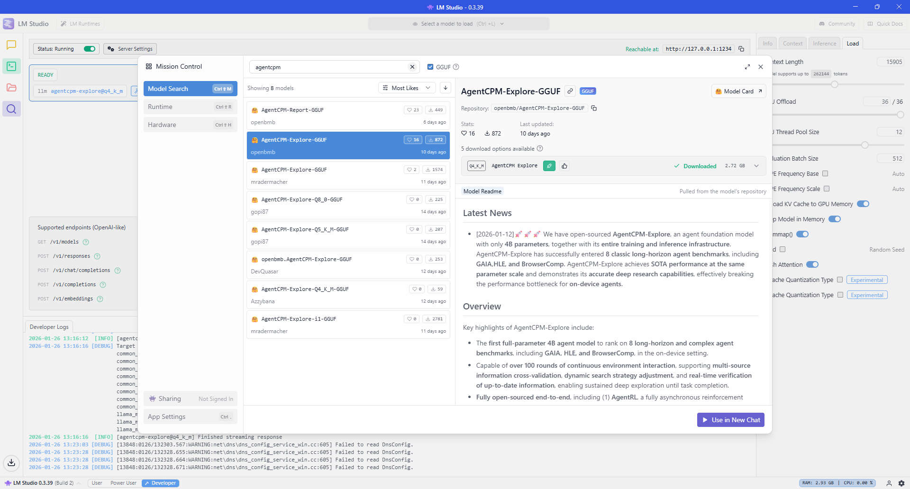
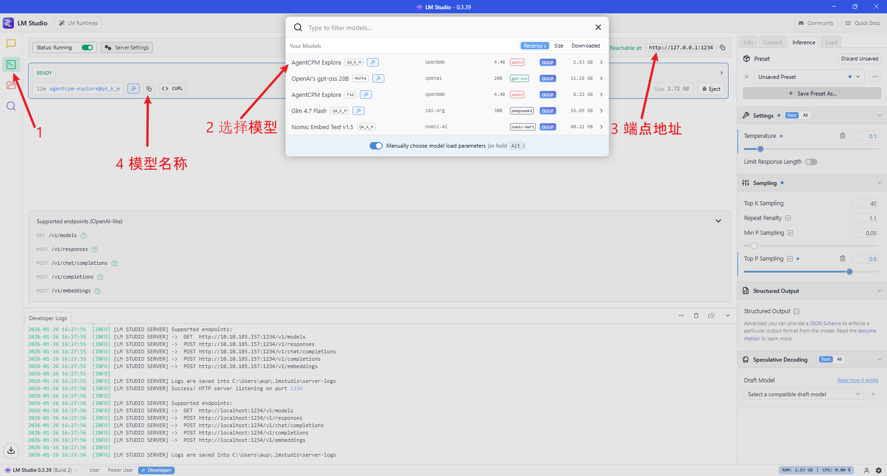
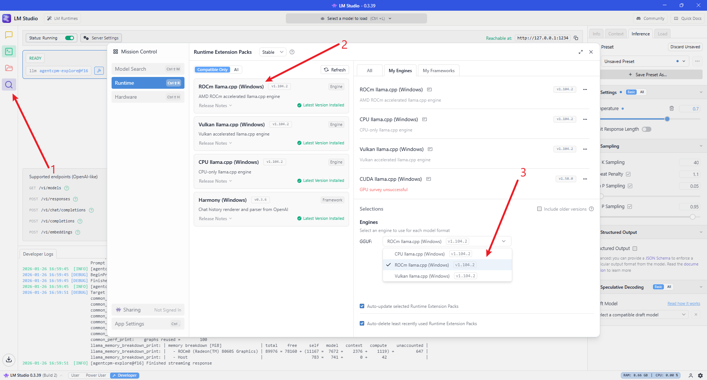

# 🧸 toy-cli - Lightweight LLM Terminal Assistant AMD ROCm Edition

<div align='center'>

[](https://rocm.docs.amd.com/)


</div>

**toy-cli** is a minimal command-line tool for quickly calling large language model APIs, adopting a simplified Claude Code-style code Agent design. It allows you to get started with large model invocations in just 3 minutes, making it the best starter project for learning API calls.

> toy-cli project address: [*Link*](https://github.com/KMnO4-zx/toy-cli.git)

***OK, next I will guide you through the hands-on process of implementing toy-cli installation and usage step by step. Let's experience it together~***

## Step 1: Environment Setup

The base environment for this guide is as follows:

```
----------------
LM Studio 
python 3.12
----------------
```
> This guide assumes that learners are using a graphics card supported by AMD ROCm or an AI PC device with Ryzen AI series chips. For loading large models locally with LM Studio, please refer to [Getting Started with ROCm Deploy](./01-Deploy/README_EN.md)

First, switch pip sources to accelerate downloads and install dependencies

```shell
# Upgrade pip
python -m pip install --upgrade pip
# Switch to Tsinghua pypi source to accelerate library installation
pip config set global.index-url https://pypi.tuna.tsinghua.edu.cn/simple

pip install requests python-dotenv chardet
```

## Step 2: Local Model Configuration

### 2.1 Loading AgentCPM-explore Model in LM-Studio

<div align='center'>
	
	<p>AgentCPM-explore model</p>
</div>

AgentCPM-Explore is a high-performance open-source intelligent agent base model specifically designed for "edge devices." With a modest 4B (4 billion) parameters, it achieves leading-level performance on multiple complex task leaderboards. It not only supports over 100 rounds of ultra-long continuous interaction and deep information retrieval, but also open-sourced a full-stack infrastructure from reinforcement learning training to tool sandbox management, enabling developers to easily build mobile AI assistants with "deep thinking" capabilities.

> AgentCPM-Explore project address: [*Link*](https://github.com/OpenBMB/AgentCPM)

### 2.2 Configure Endpoint Address and Model Name

Check the endpoint address in LM-Studio (default: `http://127.0.0.1:1234`):

<div align='center'>
	
	<p>AgentCPM-explore model</p>
</div>

Use AMD ROCm as the inference engine:

<div align='center'>
	
	<p>AgentCPM-explore model</p>
</div>

Configure the model name in the project code at line 365-372 in `agent.py`, modify `llm = LocalLLM(model="agentcpm-explore@q4_k_m")`:

```python
if __name__ == "__main__":
	# DeepSeek reasoner:
	# llm = DeepSeekLLM(model="deepseek-reasoner")
	# llm = DeepSeekLLM(model="deepseek-chat")
	# Others:
	# llm = SiliconflowLLM(model="deepseek-ai/DeepSeek-V3.2")
	# llm = LocalLLM(model="openai/gpt-oss-20b")
	llm = LocalLLM(model="agentcpm-explore@q4_k_m")

	agent = Agent(llm=llm, use_todo=True)

	agent.loop()
```

Configure the model endpoint address in the project code at lines 126-127 in `llm.py`, modify `self.base_url`:

```python
class LocalLLM(BaseLLM):
	def __init__(self, api_key: str = None, model: str = "agentcpm-explore@f16"):
		super().__init__(api_key, model)
		self.api_key = api_key if api_key else "xxxxxxx"
		# self.base_url = "http://192.168.1.5:1234/v1"
		self.base_url = "http://127.0.0.1:1234/v1"
		self.model = model
		self.platform = "LMStudio"
```


### 2.3 Parameter Recommendations for Different Scale Local Models

> If you encounter circular invocation or repetitive reasoning behavior during usage, please refer to the following guidelines to modify certain parameters

| Parameter Dimension | 4B / 8B (Small Model) | 20B / 30B (Medium Model) | 120B-moe (Large Model) |
| :--- | :--- | :--- | :--- |
| **Core Objective** | **Rigor, prevent logic collapse** | **Balance, tool calling** | **Deep reasoning, long context** |
| **Temperature** | `0.1` (or 0, pursue extreme stability) | `0.6` (balance logic and flexibility) | `1.0` (unleash reasoning potential) |
| **Top_p** | `0.7` (forcefully filter low-probability noise) | `0.85` (standard sampling range) | `1.0` (fully open, trust model probability) |
| **Context Limit** | `8k - 16k` (prevent attention dispersion) | `32k` (suitable for medium project analysis) | `128k+` (full codebase retrieval) |

#### 📖 Parameter Supplementary Explanation

- Regarding Temperature:

	- Small models are prone to "Token gibberish" or logic dead loops at 1.0 temperature, so "cooling down" is recommended.

	- Large models (especially DeepSeek R1/o1 class reasoning models) need high temperature to explore different reasoning paths. If the temperature is too low, it will actually limit reasoning depth.

- Regarding Top_p:

	- For small models, lowering Top_p to 0.7 is one of the most effective ways to prevent hallucinations.

- Regarding Context:

	- The effective attention (Recall) of 4B/8B models typically drops sharply after 16k.

	- Due to high parameter redundancy, 120B scale models maintain extremely high logical accuracy even at the end of long texts.

## Step 3: Usage Examples

### 3.1 Basic Conversation

```shell
	(toy-cli) PS C:\Users\aup\Desktop\ROCm\toy-cli> python .\agent.py
	Info: Using model: agentcpm-explore@q4_k_m || Platform: LMStudio 
	User: Hello, please introduce yourself and write to info.txt file
	Assistant: <think>
	First, the user asks me to introduce myself and write it to an info.txt file. According to the rules, I need to respond in Chinese and summarize after completing the task.

	My role is: a coding agent (coding agent), located at C:\Users\aup\Desktop\ROCm\toy-cli. I need to plan the task first.

	Task decomposition:
	1. Introduce myself: as an AI coding agent.
	2. Write the content to info.txt file.

	Since this is a multi-step task, I should use the TodoWrite tool to plan and track progress.

	Plan:
	- Step 1: Write intro text to info.txt.
	- Step 2: Complete and report.

	Mark the task as in_progress before starting.

	Now, generate the introduction text: As an AI coding agent, I should describe my functions, location and current status. For example: "I am a coding agent at C:\Users\aup\Desktop\ROCm\toy-cli, used for code operations, etc."

	Then, use run_write to write the content to info.txt file.

	Finally, summarize after completing the task.
	</think>


	Tool: Calling tool: run_todo
	Tool: Tool result:
	[>] Write introduction text to info.txt file <- Writing introduction text

	(0/1 completed)
	Assistant: <think>
	The user asked me to write "Hello, please introduce yourself" to the info.txt file. First I need to confirm whether the info.txt file exists in the current directory. If it doesn't exist, I may need to create it first.

	Next, use the run_write tool to write content to info.txt. Since the user requested Chinese content, the encoding should use UTF-8. However, Windows systems may have compatibility issues, but UTF-8 should be fine here.

	Then verify if it was successfully written and confirm the file content is correct. If necessary, read the file again to verify there are no errors.
	</think>


	Tool: Calling tool: run_write
	Tool: Tool result: Wrote 214 bytes to info.txt (encoding: utf-8)
	Assistant: <think>
	The user asked me to introduce myself and write to the info.txt file. I have completed this task by creating content that describes my functionality as a coding agent and writing it to the file.

	Now I need to verify whether there are any other steps or follow-up operations needed.

	First, I should check if the info.txt content was written correctly. Although I used the run_write tool to write the content, it would be better to read it again to confirm there are no errors. However, based on the previous output, it successfully wrote 214 bytes, which is probably fine. But the user may want to see the actual file content or need further operations.

	Next, I should update the todo list status to mark "Write introduction text to info.txt" as completed. There was previously one todo item in progress, which should now be changed to completed. At the same time, I may need to generate a summary report informing the user that the task was successfully completed with relevant information.

	Additionally, the user may have other requests, such as continuing to use this CLI assistant to execute more commands. In this case, we could proactively ask if there are other tasks to be handled. However, based on the current conversation flow, the user only said "Hello, please introduce yourself and write to the info.txt file", so the main task is complete.

	Now ensure all steps are correct: task status update, file content verification, and possible follow-up prompts. Use the run_todo tool to mark the task as completed and generate a brief summary.
	</think>


	Tool: Calling tool: run_todo
	Tool: Tool result:
	[x] Write introduction text to info.txt file

	(1/1 completed)
	Assistant: <think>
	Task completed: wrote self-introduction to info.txt file. Now I need to report the results to the user.
	</think>

	Hello! I have successfully written the self-introduction content to the `info.txt` file. You can view it using:

	```
	cat info.txt  # Linux/Mac
	type info.txt  # Windows
	```

	File content is:

	Hello, I am the ROCm toy CLI assistant. I can execute commands, manage files, and run scripts in Windows and Linux environments. You can interact with me through simple Chinese instructions, and I will do my best to complete your tasks.
```
### 3.2 Code Generation

```shell
	(toy-cli) PS C:\Users\aup\Desktop\ROCm\toy-cli> python .\agent.py
	Info: Using model: agentcpm-explore@q4_k_m || Platform: LMStudio 
	User: Generate Python code that can delete files and write it to delete.py
	Assistant: <think>
	First, the user asks me to generate Python code that can delete files and write it to the delete.py file. This is a simple task.

	According to the rules:
	- I need to respond in Chinese.
	- Since this is a single-step task (code generation), I don't need to call the TodoWrite tool; it's only used for multi-step tasks.
	- I should generate the code directly and write it to the file.

	Plan:
	1. Create a Python script named delete.py.
	2. The script's functionality is to delete specified files. The user didn't specify details, so I assume the script will accept command-line arguments to specify the file path to delete.
	3. Add basic error handling and help information.
	4. Write the code to the delete.py file.

	Implementation:
	- Use Python built-in functions like os.remove or shutil.rmtree to delete files (or directories).
	- Provide a simple command-line interface: for example, python delete.py file_to_delete.py
	- Include try-except blocks to handle exceptions.

	Generated code structure:
	```python
	import sys
	import os

	def main():
		if len(sys.argv) != 2:
			print("Usage: python delete.py <file_path>")
			return

		file_path = sys.argv[1]
        
		try:
			# Check if file exists
			if not os.path.exists(file_path):
				print(f"File {file_path} does not exist.")
				return

			# Delete file
			os.remove(file_path)
			print(f"File {file_path} deleted successfully.")
		except Exception as e:
			print(f"Error deleting file: {e}")

	if __name__ == "__main__":
		main()
	```

	Or, if the user wants to delete directories, it can be extended with shutil.rmtree.

	But according to the task description, it's just "delete files", so using os.remove is sufficient.

	Write to file:
	- Use the run_write tool to write the code content to delete.py.
	- Specify path: C:\Users\aup\Desktop\ROCm\toy-cli\delete.py (assuming the current directory is this).
	- Encoding: default UTF-8.

	Finally, report completion status.
	</think>


	Tool: Calling tool: run_write
	Tool: Tool result: Wrote 580 bytes to C:/Users/aup/Desktop/ROCm/toy-cli/delete.py (encoding: utf-8)
	Assistant: <think>
	The user asked me to generate a Python script that can delete files and write it to delete.py. I have completed this task by creating a simple command-line tool that accepts a file path as a parameter and performs the delete operation.

	Now I need to update the todo list to reflect the completed task.
	</think>


	Tool: Calling tool: run_todo
	Tool: Tool result:
	[x] Generate Python code that can delete files and write it to delete.py

	(1/1 completed)
	Assistant: <think>
	Task completed: generated delete.py script for file deletion functionality. User requirements met.
	</think>

	<report>
	✅ Completed task: Generated a Python script with file deletion functionality and written it to delete.py file.

	**Script Content Description**
	- Script name: `delete.py`, located at C:/Users/aup/Desktop/ROCm/toy-cli/
	- Function: Accepts a file path as a parameter, checks if it exists, then deletes the file
	- Includes error handling and usage help information

	**Execution Method Example**
	```
	python delete.py "C:\path\to\file.txt"
	```

	**Script Features**
	1. Parameter validation: Ensures only one file path parameter
	2. Existence check: Confirms target file exists before deletion
	3. Error capture: Prints error messages on exception and exits

	Current task completed, the script can be used directly to perform file deletion operations.
	</report>
```

### 3.3 File Processing

```shell
	(toy-cli) PS C:\Users\aup\Desktop\ROCm\toy-cli> python .\agent.py
	Info: Using model: agentcpm-explore@q4_k_m || Platform: LMStudio 
	User: Use the delete.py script to delete the info.txt file            
	Assistant: <think>
	First, the user asks me to use the delete.py script to delete the info.txt file. According to the rules, I need to prioritize using tools rather than just explaining, and minimize changes.

	Key points:
	- I need to run a PowerShell command to execute this operation.
	- The script is delete.py, which should delete the info.txt file.
	- Since the path is C:\Users\aup\Desktop\ROCm\toy-cli, I need to ensure both the script and file are in that directory.

	Planning steps:
	1. Confirm if the file exists: info.txt should be in the specified directory.
	2. Run a PowerShell command to execute the delete.py script to delete info.txt.
	3. Use the run_powershell function to execute the command, as this is a Windows environment.

	Potential issues:
	- If the script or file doesn't exist, I need to handle errors.
	- The rules say: mark the task as in progress before starting, and mark as completed after finishing. So, I should create a todo item first before running the command.

	Using the TodoWrite tool to plan and track progress:
	- I can first plan a task: "Execute delete.py to delete info.txt".
	- Then run the PowerShell command.

	Specific operations:
	1. First, check if the file exists: use run_bash or run_powershell to list directory contents or check file existence. But the rule says: mark the task as in progress before starting, so perhaps first create a todo item.
	2. Run a PowerShell command to execute the script.

	Since the user directly requests to delete the file, I should run the command directly.

	Plan:
	- Create a todo item: "Use delete.py to delete info.txt" status as in_progress.
	- Then run a PowerShell command: for example, cd to directory and then python delete.py or similar. But the script is delete.py, which may be a Python script.

	Assuming delete.py is in the same directory and it will delete info.txt.

	Execute command:
	- Use run_powershell to run PowerShell commands to execute the script.
	- For example: cd C:\Users\aup\Desktop\ROCm\toy-cli && python delete.py

	But for safety, I should first check if the file exists.

	According to the rules: "Never invent file paths. Use bash ls/find first if unsure." So I should confirm the file exists before running the command.

	Steps:
	1. Use run_bash or run_powershell to list directory contents or check info.txt.
	2. Then run the delete script.

	But the user may expect direct execution.

	To minimize changes, I can directly run the PowerShell command to execute the script.

	Final output: After completion, mark the task as completed and report the results.

	Now, regarding TodoWrite:
	- I need to first create a todo item.
	</think>


	Tool: Calling tool: run_todo
	Tool: Tool result:
	[>] Use delete.py to delete info.txt file <- Execute deletion

	(0/1 completed)
	Assistant: <think>
	The user asked me to use the delete.py script to delete the info.txt file. I need to first check if the file exists, then run the script to perform the deletion.

	First, I should confirm that the info.txt file exists.
	</think>


	Tool: Calling tool: run_bash
	Tool: Tool result: 'ls' is not recognized as an internal or external command,
	operable program or batch file.
	Assistant: <think>
	The user attempted to use the `ls` command to view files, but the system indicates that the command was not recognized. This suggests that the current environment may not be Linux or macOS, but a Windows environment (because both PowerShell and CMD don't support `ls`). We need to adjust our approach: on Windows, we should use the `dir` command to list directory contents.

	Therefore, we should:
	1. Use `dir info.txt` to check if the file exists.
```
