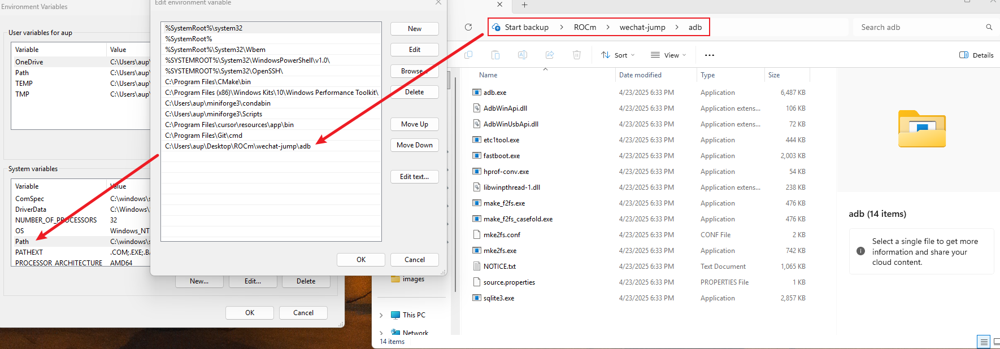

# 🎮 基于 YOLOv10 微信跳一跳 AMD ROCm 版本

<div align='center'>

[](https://rocm.docs.amd.com/)

</div>

**微信跳一跳自动化**是基于YOLOv10目标检测的微信跳一跳游戏自动化工具，通过计算机视觉识别游戏中的小人和目标平台，自动计算距离并控制手机进行精准跳跃。本项目已支持 AMD ROCm 平台训练和推理，支持 Ryzen AI 系列芯片。

> 微信跳一跳项目地址：[*Link*](https://github.com/KMnO4-zx/wechat-jump.git)

***OK，那接下来我将会带领大家亲自动手，一步步实现微信跳一跳自动化的训练和使用过程，让我们一起来体验一下吧~***

## Step 1: 环境准备

本文基础环境如下：

```
----------------
windows 22.04
python 3.12
rocm 7.12.0
pytorch 2.9.1
----------------
```

首先 `pip` 换源加速下载并安装依赖包

```shell
# 升级pip
python -m pip install --upgrade pip

# 安装ROCm相关依赖 包含 torch torchvision torchaudio等核心库
# 以 Ryzen AI 系列为例 
python -m pip install --index-url https://repo.amd.com/rocm/whl/gfx1151/ "rocm[libraries,devel]"
python -m pip install --index-url https://repo.amd.com/rocm/whl/gfx1151/ torch torchvision torchaudio

# 更换 pypi 源加速库的安装
pip config set global.index-url https://pypi.tuna.tsinghua.edu.cn/simple

# 安装其他依赖
pip install -r requirements_rocm_windows.txt
```

> 本项目使用 Ryzen AI MAX 395/370 运行测试，其他 Radeon 系列适配情况请查看 https://rocm.docs.amd.com/en/7.12.0-preview/compatibility/compatibility-matrix.html

### 安装 ADB 工具

ADB（Android Debug Bridge）是用于与Android设备通信的命令行工具。

**Windows 安装方式：**

1. 官方下载：https://developer.android.google.cn/tools/releases/platform-tools?authuser=4&hl=zh-cn
2. 下载并解压后，设置解压路径至系统环境变量中

<div align='center'>
    
    <p>环境变量配置示例</p>
</div>

**macOS 安装方式：**

```bash
# 使用提供的安装脚本
chmod +x install_adb_mac.sh
./install_adb_mac.sh

# 或手动安装
brew install android-platform-tools
```

### 安卓手机设置

1. 开启开发者选项
2. 启用USB调试
3. 连接电脑并授权ADB调试
4. 验证连接：`adb devices`

## Step 2: 数据准备

### 2.1 自动截图收集数据

首先，我们需要收集游戏截图作为训练数据。运行自动截图脚本：

```shell
# 自动截图收集训练数据
python simple_screenshot.py
```

脚本会每2秒自动截图一次，保存到 `dataset/screenshot_dataset/` 目录。按 `Ctrl+C` 停止截图。

> 建议收集至少 200-500 张不同场景的游戏截图，包括：
> - 不同距离的跳跃场景
> - 不同形状的平台
> - 不同角度和光照条件

### 2.2 数据标注

使用 `labelimg` 工具对截图进行标注：

```shell
# 启动标注工具
labelimg
```

标注步骤：

1. 打开 `dataset/screenshot_dataset/` 目录
2. 选择 YOLO 格式
3. 标注两个类别：
   - **类别 0 (cube)**: 目标平台
   - **类别 1 (human)**: 小人
4. 保存标注文件到 `dataset/yolo_label/` 目录

标注完成后，每个图片会对应一个同名的 `.txt` 标注文件，格式如下：

```text
0 0.5 0.3 0.1 0.15  # 类别 x_center y_center width height (归一化坐标)
1 0.2 0.7 0.05 0.1
```

### 2.3 数据集划分

使用 `dataset_split.py` 脚本将数据集划分为训练集、验证集和测试集：

```shell
# 划分数据集（默认比例：训练集80%，验证集10%，测试集10%）
python dataset_split.py
```

脚本会自动将数据划分到 `yolo_dataset/` 目录下：

```
yolo_dataset/
├── images/
│   ├── train/    # 训练集图片
│   ├── val/      # 验证集图片
│   └── test/     # 测试集图片
└── labels/
    ├── train/    # 训练集标签
    ├── val/      # 验证集标签
    └── test/     # 测试集标签
```

## Step 3: 模型训练

### 3.1 准备数据集配置文件

在 `yolo_dataset/` 目录下创建 `data.yaml` 文件：

```yaml
path: ./yolo_dataset
train: images/train
val: images/val
test: images/test

names:
  0: cube
  1: human
```

### 3.2 开始训练

运行训练脚本：

```shell
python train.py
```

训练脚本会：

1. 加载预训练的 YOLOv10n 模型
2. 使用 ROCm 加速训练（自动使用 `cuda` 设备）
3. 训练 500 个 epoch
4. 保存最佳模型到 `runs/detect/train/weights/best.pt`

训练参数说明：

- **模型**: YOLOv10n（轻量级模型，适合移动端和边缘设备）
- **输入尺寸**: 640x640
- **训练轮数**: 500 epochs
- **设备**: 自动使用 ROCm (cuda)

> 训练时间取决于数据集大小和硬件性能，通常在 Ryzen AI 设备上需要 1-3 小时

### 3.3 模型测试

训练完成后，可以使用 `detect.py` 测试模型效果：

```shell
# 测试训练好的模型
python detect.py
```

## Step 4: 使用自动化工具

### 4.1 运行主程序

训练完成后，运行主程序开始自动化游戏：

```shell
python main.py
```

主程序会：

1. 加载训练好的模型（`./runs/detect/train/weights/best.pt`）
2. 自动截图获取游戏画面
3. 使用 YOLO 模型检测小人和目标平台
4. 计算距离并自动跳跃
5. 实时显示检测结果

### 4.2 参数调整

在 `main.py` 中可以调整跳跃系数 `k`：

```python
jump.jump(k=1.3)  # 根据手机分辨率调整系数，屏幕越大，k值越大
```

不同手机分辨率的系数参考：

- 1080p: `k=1.3`
- 1440p: `k=1.5`
- 需要根据实际测试调整

### 4.3 核心算法

**1. 目标检测**

使用 YOLOv10 模型检测游戏中的：
- 目标平台位置（类别 0: cube）
- 小人位置（类别 1: human）

**2. 距离计算**

```python
# 计算两个目标中心点的欧氏距离
distance = np.sqrt((cube_box[0] - humen_box[0]) ** 2 + 
                   (cube_box[1] - (humen_box[1] + humen_box[3] * 0.5)) ** 2)
```

**3. 跳跃控制**

```python
# 根据距离计算按压时间，模拟跳跃
press_time = int(distance * k)  # k 为跳跃系数
jump.adb_tap(x, y, duration_ms=press_time)
```

## 写在最后

*微信跳一跳自动化项目展示了如何使用深度学习技术解决实际问题。通过 YOLOv10 目标检测模型，我们可以精准识别游戏中的关键元素，并通过 ADB 实现自动化控制。本项目已支持 AMD ROCm 平台，让更多开发者能够在 AMD 硬件上体验深度学习的魅力。*

### 项目特色

- 🤖 **智能识别**：使用YOLOv10模型精准识别游戏中的小人和目标平台
- 📏 **距离计算**：通过欧氏距离计算跳跃所需的力度
- 📱 **ADB控制**：自动控制Android手机进行截图和模拟点击
- 🎯 **高精度**：基于深度学习的目标检测，识别准确率高
- 🔄 **自动化**：一键运行，全程自动化操作

### 性能指标

- 目标检测准确率：>99.5%
- 跳跃成功率：>90%
- 平均响应时间：<2.5秒

### 注意事项

⚠️ **免责声明**：本项目仅供学习和研究使用，使用本工具可能违反游戏服务条款，请自行承担风险。

### 故障排除

**1. ADB连接失败**

```bash
# 重启ADB服务
adb kill-server
adb start-server
```

**2. 模型文件不存在**

- 确保已完成模型训练
- 检查模型路径是否正确（默认：`./runs/detect/train/weights/best.pt`）

**3. 截图失败**

- 检查手机USB调试是否开启
- 确认ADB权限已授权
- 验证连接：`adb devices`

**4. 跳跃不准确**

- 调整跳跃系数 `k` 的值
- 检查模型检测效果
- 确保数据集质量足够好

---

⭐ 如果这个项目对你有帮助，请给个星星支持一下！
