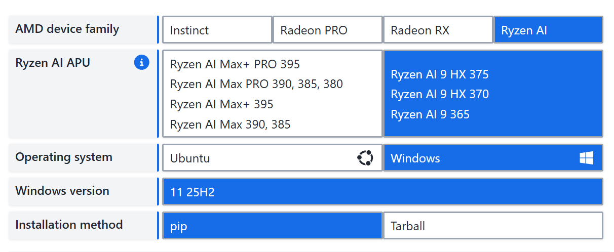

# 大模型通用微调教程

在大模型（LLM）的应用中，提示词工程（Prompt Engineering）虽然高效，但在处理高度自定义任务、垂直领域专业知识或需要小尺寸模型实现高难度任务时，微调（Fine-tuning） 往往是不可或缺的步骤。本教程将带你掌握使用 `transformers` + `peft` 框架进行大模型有监督微调（SFT）的完整流程。

本教程基于 AMD 395 MAX 硬件环境，虽然该机器主要用于大模型推理，但其不错的计算能力也能胜任小规模微调任务。我们将演示如何在有限资源下，使用低代码量实现大模型的微调。

> 注意：本教程除了环境配置部分外，其余部分均仅讲解微调的核心原理和流程，具体微调代码实践请参照本仓库的 `Fine-tune` 目录下的实战教程。

## 环境配置

首先需要安装 ROCm 以及相关依赖库。请参考 [ROCm 7.10.0 Release Notes](https://rocm.docs.amd.com/en/7.10.0-preview/about/release-notes.html) 进行安装。ROCm 7.10.0 之后的版本都将便捷的支持将 ROCm 使用 pip 便捷的安装到 Python 的虚拟环境中，极大的简化了安装流程。并且对于 AMD 395 MAX 这类较新的显卡，ROCm 7.10.0 版本提供了更好的支持。



接下来，我们以 AMD 395 MAX Windows 系统为例，展示如何配置 Python 虚拟环境并安装所需依赖。

### Step 1: 创建并激活 Python 虚拟环境

```bash
conda create -n llm-finetune python=3.10 -y
conda activate llm-finetune
```

### Step 2: 安装 ROCm 相关依赖

```bash
python -m pip install --index-url https://repo.amd.com/rocm/whl/gfx1150/ "rocm[libraries,devel]"
```

安装完成之后可以使用 `hipinfo` 命令查看 ROCm 是否安装成功。如果显示了 GPU 相关信息，说明安装成功。如下所示：

```bash
--------------------------------------------------------------------------------
device#                           0
Name:                             AMD Radeon(TM) 8060S Graphics
pciBusID:                         244
pciDeviceID:                      0
pciDomainID:                      0
multiProcessorCount:              20
maxThreadsPerMultiProcessor:      2048
isMultiGpuBoard:                  0
clockRate:                        2900 Mhz
memoryClockRate:                  800 Mhz
memoryBusWidth:                   512
totalGlobalMem:                   107.87 GB
totalConstMem:                    2147483647

···

arch.has3dGrid:                   1
arch.hasDynamicParallelism:       0
gcnArchName:                      gfx1151
maxAvailableVgprsPerThread:       256 DWORDs
peers:
non-peers:                        device#0

memInfo.total:                    107.87 GB
memInfo.free:                     107.72 GB (100%)
```

### Step 3: 安装 Pytroch

在 ROCm 环境下安装 PyTorch，可以参考 [ROCm Pytorch 安装指南](https://rocm.docs.amd.com/en/7.10.0-preview/rocm-for-ai/pytorch-comfyui.html)。以下是安装命令：

```bash
python -m pip install --index-url https://repo.amd.com/rocm/whl/gfx1150/ torch torchvision torchaudio
```

静待安装完成之后，可以通过以下命令验证 PyTorch 是否正确安装：

```python
python -c "import torch; print(torch.cuda.is_available())"
```

如果输出 `True`，说明 PyTorch 已成功配置为使用 ROCm。

### Step 4: 安装微调相关依赖

接下来，安装 `transformers` 和 `peft` 库等：

```bash
pip config set global.index-url https://pypi.tuna.tsinghua.edu.cn/simple

pip install modelscope
pip install transformers
pip install accelerate
pip install datasets
pip install peft
pip install swanlab
```

### Step 5: 模型下载

这一步，我们来下载模型权重文件。请将下面代码中的 `请修改我！！！` 替换为你希望保存模型的本地路径。

> 注意：确保该路径有足够的存储空间来保存模型文件。且这一步仅以 Qwen/Qwen3-0.6B 模型为例，实际使用中可根据需求替换为其他支持微调的模型。

```python
from modelscope import snapshot_download
model_dir = snapshot_download('Qwen/Q', cache_dir='请修改我！！！', revision='master')

print(f"模型下载完成，保存路径为：{model_dir}")
```

## 微调数据集构造

### 什么是有监督微调（SFT）

目前我们所使用的 LLM 一般经过了预训练、有监督微调、人类反馈强化学习三个步骤的训练。预训练是 LLM 强大能力的根本来源，事实上，LLM 所覆盖的海量知识基本都是源于预训练语料。但是，预训练赋予了 LLM 能力，却还需要第二步将其激发出来。经过预训练的 LLM 好像一个博览群书但又不求甚解的书生，对什么样的偏怪问题，都可以流畅地接出下文，但他偏偏又不知道问题本身的含义，只会“死板背书”。因此，我们还需要第二步来教这个博览群书的学生如何去使用它的知识，也就是 SFT（Supervised Fine-Tuning，有监督微调）。所谓有监督微调，其实就是将输入和输出同时给模型，让他根据输出不断去拟合从输入到输出的逻辑，类似于将问题和答案同时给模型，让模型基于答案学习解决问题的过程。在传统 NLP 时代，我们一般会针对每一个任务对模型进行微调。例如，一个经典的 NLP 任务可能是情感分类，也就是判断一句输入文本是积极情绪还是消极情绪，那么就会构造很多输入文本和其情感判断的数据，让模型去学会如何判断输入文本的情感。

而面对能力强大的 LLM，我们往往不再是在指定下游任务上进行微调，而是选择训练模型的“通用指令遵循能力”，也就是一般通过指令微调的方式来进行 SFT。所谓指令微调，即我们训练的输入是各种类型的用户指令，而需要模型拟合的输出则是我们希望模型在收到该指令后做出的回复。例如，我们的一条训练样本可以是：

```text
input:告诉我今天的天气预报？
output:根据天气预报，今天天气是晴转多云，最高温度26摄氏度，最低温度9摄氏度，昼夜温差大，请注意保暖哦
```

也就是说，SFT 的主要目标是让模型从多种类型、多种风格的指令中获得泛化的指令遵循能力，也就是能够理解并回复用户的指令。因此，我们使用指令数据对模型进行 SFT 时，需要告知模型用户的指令和模型遵循这个指令所应该的输出。一般 SFT 所使用的指令数据集包括以下三个键:

```
{
    "instruction":"即输入的用户指令",
    "input":"执行该指令可能需要的补充输入，没有则置空",
    "output":"即模型应该给出的回复"
}
```

例如，如果我们的指令是将目标文本“今天天气真好”翻译成英文，那么该条样本可以构建成如下形式：

```
{
    "instruction":"将下列文本翻译成英文：",
    "input":"今天天气真好",
    "output":"Today is a nice day！"
}
```

同时，为使模型能够学习到和预训练不同的范式，在 SFT 的过程中，往往会针对性设置特定格式。例如，LLaMA 的 SFT 格式为：

```
### Instruction:\n{{content}}\n\n### Response:\n
```

其中的 content 即为具体的用户指令，也就是说，对于每一个用户指令，将会嵌入到上文的 content 部分，这里的用户指令不仅指上例中的 “instruction”，而是指令和输入的拼接，即模型可以执行的一条完整指令。例如，针对上例，LLaMA 获得的输入应该是：

```
### Instruction:\n将下列文本翻译成英文：今天天气真好\n\n### Response:\n
```

其需要拟合的输出则是：

```
### Instruction:\n将下列文本翻译成英文：今天天气真好\n\n### Response:\nToday is a nice day！
```

### 构造微调数据集

因此，当我们进行 LLM SFT 以提升 LLM 在指定下游任务的表现时，我们需要将训练数据构造成上述格式，并对数据集进行处理来支持模型微调。接下来，我们以角色扮演任务（要求 LLM 扮演甄嬛，以甄嬛的语气、风格与用户对话）为例，演示如何进行微调数据集构造。

我们使用从《甄嬛传》剧本提取出来的对话作为基准来构建训练数据集。提取出来的对话包括上述格式的键：

```
instruction：即对话的上文；
input：此处置为空；
output：即甄嬛的回复。
```

微调数据集可以在此处下载：https://github.com/KMnO4-zx/huanhuan-chat/blob/master/dataset/train/lora/huanhuan.json

```python
from datasets import Dataset
import pandas as pd
from transformers import AutoTokenizer, AutoModelForCausalLM, DataCollatorForSeq2Seq, TrainingArguments, Trainer

# 将JSON文件转换为CSV文件
df = pd.read_json('./huanhuan.json') # 注意修改
ds = Dataset.from_pandas(df)
```

```python
{
    'instruction': '小姐，别的秀女都在求中选，唯有咱们小姐想被撂牌子，菩萨一定记得真真儿的——',
    'input': '',
    'output': '嘘——都说许愿说破是不灵的。'
}
```

接下来我们需要定义一个数据处理函数，该函数能够使用 Qwen3-0.6B 的 tokenizer（分词器，即将自然语言文本转化为向量）对提供的训练文本进行处理并送到模型中进行学习。

如上所说，不同 LLM 存在不同的指令格式，在我们进行训练时，需要遵守 LLM 预定义的指令格式，才能使训练取得较好的效果。我们首先查看一下 wen3-0.6B 的指令格式：

> 注意：可以使用 `tokenizer.get_chat_template()` 方法查看模型的指令格式。

```python
# 加载模型 tokenizer 
tokenizer = AutoTokenizer.from_pretrained('your model path', trust_remote=True)

# 打印一下 chat template
messages = [
    {"role": "system", "content": "===system_message_test==="},
    {"role": "user", "content": "===user_message_test==="},
    {"role": "assistant", "content": "===assistant_message_test==="},
]

text = tokenizer.apply_chat_template(
    messages,
    tokenize=False,
    add_generation_prompt=True,
    enable_thinking=True
)
print(text)
```

```
<|im_start|>system
===system_message_test===<|im_end|>
<|im_start|>user
===user_message_test===<|im_end|>
<|im_start|>assistant
<think>

</think>

===assistant_message_test===<|im_end|>
<|im_start|>assistant
```

接着，我们基于上文打印的指令格式，完成数据集处理函数：

```python
def process_func(example):
    MAX_LENGTH = 1024 # 设置最大序列长度为1024个token
    input_ids, attention_mask, labels = [], [], [] # 初始化返回值
    # 适配chat_template
    instruction = tokenizer(
        f"<s><|im_start|>system\n现在你要扮演皇帝身边的女人--甄嬛<|im_end|>\n" 
        f"<|im_start|>user\n{example['instruction'] + example['input']}<|im_end|>\n"  
        f"<|im_start|>assistant\n<think>\n\n</think>\n\n",  
        add_special_tokens=False   
    )
    response = tokenizer(f"{example['output']}", add_special_tokens=False)
    # 将instructio部分和response部分的input_ids拼接，并在末尾添加eos token作为标记结束的token
    input_ids = instruction["input_ids"] + response["input_ids"] + [tokenizer.pad_token_id]
    # 注意力掩码，表示模型需要关注的位置
    attention_mask = instruction["attention_mask"] + response["attention_mask"] + [1]
    # 对于instruction，使用-100表示这些位置不计算loss（即模型不需要预测这部分）
    labels = [-100] * len(instruction["input_ids"]) + response["input_ids"] + [tokenizer.pad_token_id]  
    if len(input_ids) > MAX_LENGTH:  # 超出最大序列长度截断
        input_ids = input_ids[:MAX_LENGTH]
        attention_mask = attention_mask[:MAX_LENGTH]
        labels = labels[:MAX_LENGTH]
    return {
        "input_ids": input_ids,
        "attention_mask": attention_mask,
        "labels": labels
    }
```

以上就是我们进行微调数据集构造的完整流程。接下来，我们将学习什么是高效微调（PEFT），并使用 PEFT 方法对大模型进行微调。

## 高效微调（PEFT）

### 什么是高效微调？

目前，主流的模型微调方法包括全量微调与高效微调。全量微调即在 SFT 过程中会更新模型全部的参数，因此需要较大的算力，成本较为高昂。针对全量微调的昂贵问题，业界提出了高效微调的方法，即通过向模型中插入新的层，在微调时仅更新新层的少量参数等方法来降低微调的算力需求。

目前，最主流的高效微调方法是 LoRA 微调。LoRA 微调的基本原理是，向模型中插入一些低秩矩阵层作为 LoRA 微调的目标参数，在微调时仅更新这部分参数。由于 LoRA 微调一般只需要模型在预训练的基础上学会一些较简单的任务，因此即使只更新部分插入参数，仍然能达到较好的微调效果。同时，LoRA 插入的低秩矩阵是对原参数的分解，在推理时，可通过矩阵计算直接将 LoRA 参数合并到原模型，从而避免了推理速度的降低。关于 LoRA 微调的更多原理，可以参考 [Happy LLM](https://github.com/datawhalechina/happy-llm/blob/main/docs/chapter6/%E7%AC%AC%E5%85%AD%E7%AB%A0%20%E5%A4%A7%E6%A8%A1%E5%9E%8B%E8%AE%AD%E7%BB%83%E6%B5%81%E7%A8%8B%E5%AE%9E%E8%B7%B5.md) 中关于 LoRA 微调的部分。

因此，LoRA 成为目前微调 LLM 的主流方法，尤其是对于资源受限、有监督训练数据受限的情况下，LoRA 微调往往会成为 LLM 微调的首选方法。

### 使用 PEFT 进行 LoRA 微调

`peft` 框架是 Huggingface 官方推出的高效微调框架，支持多种高效微调方法，包括 LoRA 微调。

```python
# 首先配置 LoRA 参数
from peft import LoraConfig, TaskType, get_peft_model

config = LoraConfig(
    task_type=TaskType.CAUSAL_LM, # 任务类型为 CLM，即 SFT 任务的类型
    target_modules=["q_proj", "k_proj", "v_proj", "o_proj", "gate_proj", "up_proj", "down_proj"], # 目标模块，即需要进行 LoRA 微调的模块
    inference_mode=False, # 训练模式
    r=8, # Lora 秩，即 LoRA 微调的维度
    lora_alpha=32, # Lora alaph，具体作用参见 Lora 原理
    lora_dropout=0.1# Dropout 比例
)
```

- task_type：任务类型，这里是因 SFT 任务属于因果语言建模任务，因此选择 CAUSAL_LM。
- target_modules：把 LoRA 小网络插到哪些层（示例把 attention+FFN 的 7 个线性层全插了）。
- inference_mode=False：现在是训练模式，旁路可训。
- r=8：旁路中间维度，越大表达能力越强、参数越多。
- lora_alpha=32：旁路输出放大倍数，相当于“学习率倍率”。
- lora_dropout=0.1：给旁路加 10 % dropout，防过拟合。

### 微调参数配置

```python
# 配置训练参数
args = TrainingArguments(
    output_dir="./output", # 输出目录
    per_device_train_batch_size=16, # 每个设备上的训练批量大小
    gradient_accumulation_steps=2, # 梯度累积步数
    logging_steps=10, # 每10步打印一次日志
    num_train_epochs=3, # 训练轮数
    save_steps=100, # 每100步保存一次模型
    learning_rate=1e-4, # 学习率
    save_on_each_node=True, # 是否在每个节点上保存模型
    gradient_checkpointing=True, # 是否使用梯度检查点
    report_to="none", # 不使用任何报告工具
)
# 然后使用 trainer 训练即可
trainer = Trainer(
    model=model,
    args=args,
    train_dataset=tokenized_id,
    data_collator=DataCollatorForSeq2Seq(tokenizer=tokenizer, padding=True),
    callbacks=[swanlab_callback]
)
# 开始训练
trainer.train()
```

- output_dir 指定所有中间检查点和最终模型的保存路径；
- per_device_train_batch_size=16 表示每张 GPU 一次喂 16 条样本；
- gradient_accumulation_steps=2 让每两步才做一次权重更新，等价于全局 batch=16×2=32，从而在小卡上也能用大 batch；
- num_train_epochs=3 决定把整个训练集扫三遍；
- learning_rate=1e-4 给出参数每次更新的步长；
- save_steps=100 和 logging_steps=10 分别每 100 步存一次可恢复检查点、每 10 步打印一次 loss，方便监控与断点续跑；
- gradient_checkpointing=True 通过“以时间换空间”在前向时丢弃中间激活，显存占用直接减半，能塞下更长序列；
- save_on_each_node=True 确保多机训练时每个节点都有完整拷贝，避免网络单点故障；
- report_to="none" 关闭外部实验跟踪，减少额外依赖。

### 合并 LoRA 权重

LoRA 微调仅保存微调后的 LoRA 参数，因此推理微调模型需要加载 LoRA 参数并合并：

```python
from transformers import AutoModelForCausalLM, AutoTokenizer
import torch
from peft import PeftModel

mode_path = '原始模型路径'# 基座模型参数路径
lora_path = 'lora 权重路径' # 这里改成你的 lora 输出对应 checkpoint 地址

# 加载tokenizer
tokenizer = AutoTokenizer.from_pretrained(mode_path)

# 加载模型
model = AutoModelForCausalLM.from_pretrained(mode_path, device_map="auto",torch_dtype=torch.bfloat16, trust_remote_code=True)

# 加载lora权重
model = PeftModel.from_pretrained(model, model_id=lora_path)

prompt = "你是谁？"
inputs = tokenizer.apply_chat_template(
                                    [{"role": "user", "content": "假设你是皇帝身边的女人--甄嬛。"},{"role": "user", "content": prompt}],
                                    add_generation_prompt=True,
                                    tokenize=True,
                                    return_tensors="pt",
                                    return_dict=True,
                                    enable_thinking=False
                                )
inputs = inputs.to("cuda")


gen_kwargs = {"max_length": 2500, "do_sample": True, "top_k": 1}
with torch.no_grad():
    outputs = model.generate(**inputs, **gen_kwargs)
    outputs = outputs[:, inputs['input_ids'].shape[1]:]
    print(tokenizer.decode(outputs[0], skip_special_tokens=True))
```

