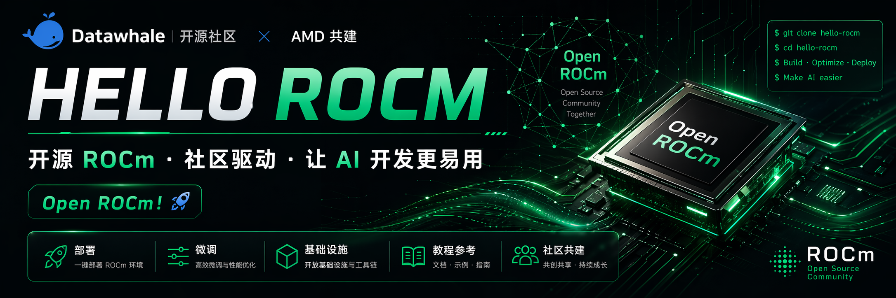

<div align=center>
  
  <strong>AMD YES! 🚀</strong>
</div>

<div align="center">

*开源 · 社区驱动 · 让 AMD AI 生态更易用*

<p align="center">
  <a href="../../README_en.md"></a>
  <a href="README.md"></a>
  <a href="../zh-TW/README.md"></a>
  <a href="../ja-JP/README.md"></a>
  <a href="../es-ES/README.md"></a>
  <a href="../fr-FR/README.md"></a>
  <a href="../ko-KR/README.md"></a>
  <a href="../ar-SA/README.md"></a>
  <a href="../vi-VN/README.md"></a>
  <a href="../de-DE/README.md"></a>
</p>

</div>
<div align="center">

<a href="https://datawhalechina.github.io/hello-rocm/"></a>

</div>

&emsp;&emsp;自 **ROCm 7.10.0** (2025年12月11日发布) 以来，ROCm 已支持像 CUDA 一样在 Python 虚拟环境中无缝安装，并正式支持 **Linux 和 Windows** 双系统。这标志着 AMD 在 AI 领域的重大突破——学习者与大模型爱好者在硬件选择上不再局限于 NVIDIA，AMD GPU 正成为一个强有力的竞争选择。

&emsp;&emsp;然而，**硬件门槛的降低并不意味着学习路径自动清晰**。对于已经具备大模型基础、希望在 AMD GPU 上付诸实践的学习者来说，真正的问题才刚刚开始：如何在 AMD GPU 上把一个模型部署起来？如何在此基础上对模型进行微调与训练？如何理解 ROCm 的 GPU 编程体系、完成从 CUDA 到 ROCm 的迁移？最终，这些能力又如何汇聚成一个可以落地运行的 AI 应用？

&emsp;&emsp;**hello-rocm** 正是为这条路径而生。本项目系统覆盖 AMD ROCm 平台上大模型的完整使用链路，带你从**把第一个模型跑起来**，走到**在 AMD GPU 上构建真实 AI 应用**，中间经过微调训练与 GPU 编程的每一个关键环节——让 AMD GPU 不只是一块显卡，而是你进入 AI 开发世界的真实起点。

&emsp;&emsp;**项目的主要内容就是教程，让更多的学生和未来的从业者了解和熟悉 AMD ROCm 的使用方法！任何人都可以提出 issue 或是提交 PR，共同构建维护这个项目。**

> &emsp;&emsp;***学习建议：建议先完成 [00-Environment](../../docs/zh/00-environment/index.md) 中的环境安装（ROCm + PyTorch + uv），再学习部署与微调，最后探索算子优化与 GPU 编程。初学者可在环境就绪后从 LM Studio 或 vLLM 部署开始。***

### hello-rocm Skill：把本项目装进你的 AI 助手

&emsp;&emsp;如果你使用支持 Skills、Rules 或 Agent 配置的 AI 编程工具，可以直接使用本项目内置的 **hello-rocm Skill**。它会根据本仓库的目录结构、Reference 索引、GPU 架构表、部署教程和排障清单，为你定位到具体文档与官方链接。

```text
请使用当前仓库的 src/hello-rocm-skill 作为 hello-rocm Skill；如果你的工具支持 Skills、Rules 或 Agent 配置，请把它安装或加载到合适位置（例如 .claude/skills、.cursor/skills 或 .agents/skills），然后根据该 Skill 帮我学习、部署和排查 AMD ROCm。
```

&emsp;&emsp;你可以这样问：我的 AMD GPU 能不能跑 ROCm？我想最快跑通一个本地大模型应该看哪篇？vLLM / Ollama / llama.cpp 在 ROCm 上怎么装？`torch.cuda.is_available()` 返回 False 怎么排查？更多说明见 [hello-rocm Skill 使用指南](../../docs/zh/04-references/index.md#hello-rocm-skill)。

### 最新动态

- *2026.3.11:* [*ROCm 7.12.0 Release Notes*](https://rocm.docs.amd.com/en/7.12.0-preview/index.html)

- *2025.12.11:* [*ROCm 7.10.0 Release Notes*](https://rocm.docs.amd.com/en/7.10.0-preview/about/release-notes.html)

### 已支持模型

<p align="center">
  <strong>✨ 主流大模型：环境配置 · 多框架推理 · 微调实践 ✨</strong><br>
  <em>ROCm 统一环境安装（Windows / Ubuntu）+ ROCm 7+ · 按模型分目录教程（持续扩充）</em><br>
 <a href="../../docs/zh/00-environment/index.md">00-环境安装教程</a> 
</p>

<table align="center" border="0" cellspacing="0" cellpadding="0" style="border-collapse: collapse; border: none !important;">

  <tr>
    <td colspan="2" align="center" style="border: none !important;"><strong>Qwen3</strong></td>
  </tr>
  <tr>
    <td valign="top" width="50%" style="border: none !important;">
      • <a href="../../docs/zh/01-deploy/qwen3/lm-studio-rocm7-deploy.md">LM Studio部署</a><br>
      • <a href="../../docs/zh/01-deploy/qwen3/vllm-rocm7-deploy.md">vLLM部署</a><br>
      • <a href="../../docs/zh/01-deploy/qwen3/ollama-rocm7-deploy.md">Ollama部署</a><br>
      • <a href="../../docs/zh/01-deploy/qwen3/llamacpp-rocm7-deploy.md">llama.cpp部署</a><br>
    </td>
    <td valign="top" width="50%" style="border: none !important;">
      • <a href="../../docs/zh/02-fine-tune/qwen3/qwen3-0.6b-lora-swanlab.md">Qwen3-0.6B LoRA微调</a><br>
      • <a href="../../src/fine-tune/models/qwen3/01-Qwen3-8B-LoRA.ipynb">Qwen3-8B LoRA微调</a><br>
    </td>
  </tr>
  <tr>
    <td colspan="2" align="center" style="border: none !important;"><strong>Gemma4</strong></td>
  </tr>
  <tr>
    <td valign="top" width="50%" style="border: none !important;">
      • <a href="../../docs/zh/01-deploy/gemma4/gemma4_model.md">Gemma 4 模型介绍</a><br>
      • <a href="../../docs/zh/01-deploy/gemma4/lm-studio-rocm7-deploy.md">LM Studio部署</a><br>
      • <a href="../../docs/zh/01-deploy/gemma4/vllm-rocm7-deploy.md">vLLM部署</a><br>
      • <a href="../../docs/zh/01-deploy/gemma4/ollama-rocm7-deploy.md">Ollama部署</a><br>
      • <a href="../../docs/zh/01-deploy/gemma4/llamacpp-rocm7-deploy.md">llama.cpp部署</a><br>
    </td>
    <td valign="top" width="50%" style="border: none !important;">
      • <a href="../../src/fine-tune/models/gemma4/01-Gemma4-E4B-LoRA及SwanLab可视化记录.ipynb">Gemma4 - E4B LoRA微调（基于TRL）</a><br>
    </td>
  </tr>
</table>

## 项目意义

&emsp;&emsp;什么是 ROCm？

> ROCm（Radeon Open Compute）是 AMD 推出的开源 GPU 计算平台，旨在为高性能计算和机器学习提供开放的软件栈。它支持 AMD GPU 进行并行计算，是 CUDA 在 AMD 平台上的替代方案。

&emsp;&emsp;百模大战正值火热，开源 LLM 层出不穷。然而，目前大多数大模型教程和开发工具都基于 NVIDIA CUDA 生态。对于想要使用 AMD GPU 的开发者来说，缺乏系统性的学习资源是一个痛点。

&emsp;&emsp;自 ROCm 7.10.0（2025 年 12 月 11 日） 起，AMD 通过 TheRock 项目对 ROCm 底层架构进行了重构，将计算运行时与操作系统解耦，使同一套 ROCm 上层接口可以同时运行在 Linux 与 Windows 上，并支持像 CUDA 一样直接安装到 Python 虚拟环境中使用。这意味着 ROCm 不再是只面向 Linux 的"工程工具"，而是升级为一个真正面向 AI 学习者与开发者的跨平台 GPU 计算平台——无论使用 Windows 还是 Linux，用户都可以更低门槛地使用 AMD GPU 进行训练和推理，大模型与 AI 玩家在硬件选择上不再被 NVIDIA 单一生态所绑定，AMD GPU 正逐步成为一个可以被普通用户真实使用的 AI 计算平台。

&emsp;&emsp;本项目旨在基于核心贡献者的经验，提供 AMD ROCm 平台上大模型部署、微调、训练的完整教程；我们希望充分聚集共创者，一起丰富 AMD AI 生态。

&emsp;&emsp;***我们希望成为 AMD GPU 与普罗大众的桥梁，以自由、平等的开源精神，拥抱更恢弘而辽阔的 AI 世界。***

## 项目受众

&emsp;&emsp;本项目适合以下学习者：


* 手头有一张AMD显卡，想体验一下大模型本地运行;
* 想要使用 AMD GPU 进行大模型开发，但找不到系统教程；
* 希望低成本、高性价比地部署和运行大模型；
* 对 ROCm 生态感兴趣，想要亲自上手实践；

## 项目规划及进展

&emsp;&emsp;本项目拟围绕 ROCm 大模型应用全流程组织，包括统一环境基线（00-Environment）、部署应用、微调训练、算子优化等：


### 项目结构

```
hello-rocm/
├── docs/                   # VitePress 文档源文件
│   ├── zh/                 # 中文文档
│   │   ├── 00-environment/ # ROCm 基础环境安装与配置
│   │   ├── 01-deploy/      # ROCm 大模型部署实践
│   │   ├── 02-fine-tune/   # ROCm 大模型微调实践
│   │   ├── 03-infra/       # ROCm 算子优化实践
│   │   ├── 04-references/  # ROCm 优质参考资料
│   │   └── 05-amd-yes/     # AMD 实践案例集合
│   └── en/                 # English docs
├── src/                    # 源码与脚本
└── assets/                 # 公共资源
```

### 00. Environment - ROCm 基础环境

<p align="center">
  <strong>🛠️ ROCm 基础环境安装与配置</strong><br>
  <em>统一环境基线 · ROCm 7.12.0 · Windows / Ubuntu · uv + PyTorch</em><br>
  📖 <strong><a href="../../docs/zh/00-environment/index.md">Getting Started with ROCm Environment</a></strong>
</p>

<table align="center" border="0" cellspacing="0" cellpadding="0" style="border-collapse: collapse; border: none !important;">
  <tr>
    <td valign="top" width="50%" style="border: none !important;" align="center">
      • <a href="../../docs/zh/00-environment/rocm-gpu-architecture-table.md">GPU 架构与 pip 索引对照表</a><br>
      • Windows 11 安装、驱动与安全项前置说明<br>
      • Ubuntu 24.04 安装（uv 方式与备选一键脚本）<br>
      • 安装校验、卸载与切换其他 GPU 架构
    </td>
  </tr>
</table>

### 01. Deploy - ROCm 大模型部署

<p align="center">
  <strong>🚀 ROCm 大模型部署实践</strong><br>
  <em>零基础快速上手 AMD GPU 大模型部署</em><br>
  📖 <strong><a href="../../docs/zh/01-deploy/index.md">Getting Started with ROCm Deploy</a></strong>
</p>

<table align="center" border="0" cellspacing="0" cellpadding="0" style="border-collapse: collapse; border: none !important;">
  <tr>
    <td valign="top" width="50%" style="border: none !important;" align="center">
      • LM Studio 零基础大模型部署<br>
      • vLLM 零基础大模型部署<br>
      • Ollama 零基础大模型部署<br>
      • llama.cpp 零基础大模型部署<br>
      • ATOM 零基础大模型部署
    </td>
  </tr>
</table>

### 02. Fine-tune - ROCm 大模型微调

<p align="center">
  <strong>🔧 ROCm 大模型微调实践</strong><br>
  <em>在 AMD GPU 上进行高效模型微调</em><br>
  📖 <strong><a href="../../docs/zh/02-fine-tune/index.md">Getting Started with ROCm Fine-tune</a></strong>
</p>

<table align="center" border="0" cellspacing="0" cellpadding="0" style="border-collapse: collapse; border: none !important;">
  <tr>
    <td valign="top" width="50%" style="border: none !important;" align="center">
      • 大模型零基础微调教程<br>
      • 大模型单机微调脚本<br>
      • 大模型多机多卡微调教程
    </td>
  </tr>
</table>

### 03. Infra - ROCm 算子优化与 GPU 编程

<p align="center">
  <strong>⚙️ ROCm 算子优化与 GPU 编程</strong><br>
  <em>从 AMD AI 硬件全景到 HIP 算子与性能分析</em><br>
  📖 <strong><a href="../../docs/zh/03-infra/index.md">开始学习 ROCm 算子优化与 GPU 编程</a></strong>
</p>

<table align="center" border="0" cellspacing="0" cellpadding="0" style="border-collapse: collapse; border: none !important;">
  <tr>
    <td valign="top" width="50%" style="border: none !important;" align="center">
      • AMD AI 硬件全景与 ROCm 生态<br>
      • GPU 软件栈与硬件架构深度解析<br>
      • HIP 编程入门与手写 Kernel 实战<br>
      • 自定义 PyTorch 算子与 Autograd 集成
    </td>
  </tr>
</table>

### 04. References - ROCm 优质参考资料

<p align="center">
  <strong>📚 ROCm 优质参考资料</strong><br>
  <em>精选的 AMD 官方与社区资源</em><br>
  📖 <strong><a href="../../docs/zh/04-references/index.md">ROCm References</a></strong>
</p>

<table align="center" border="0" cellspacing="0" cellpadding="0" style="border-collapse: collapse; border: none !important;">
  <tr>
    <td valign="top" width="100%" align="center" style="border: none !important;">
      • <a href="https://rocm.docs.amd.com/">ROCm 官方文档</a><br>
      • <a href="https://github.com/amd">AMD GitHub</a><br>
      • <a href="https://rocm.docs.amd.com/en/latest/about/release-notes.html">ROCm Release Notes</a><br>
      • <a href="../../docs/zh/04-references/index.md#amd-gpu-架构白皮书">AMD GPU 架构白皮书（CDNA / RDNA）</a><br>
      • <a href="../../docs/zh/04-references/index.md#框架与推理服务rocm-快速安装入口">框架与推理服务 ROCm 快速安装入口</a><br>
      • 相关新闻
    </td>
  </tr>
</table>

### 05. AMD-YES - AMD 实践案例集合

<p align="center">
  <strong>✨ AMD 实践案例集合</strong><br>
  <em>社区驱动的 AMD GPU 项目实践</em><br>
  📖 <strong><a href="../../docs/zh/05-amd-yes/index.md">Getting Started with ROCm AMD-YES</a></strong>
</p>

<table align="center" border="0" cellspacing="0" cellpadding="0" style="border-collapse: collapse; border: none !important;">
  <tr>
    <td valign="top" width="50%" style="border: none !important;" align="center">
      • toy-cli - LLM 轻量化终端助手<br>
      • YOLOv10 微信跳一跳 - 游戏 AI 实战（在 ROCm 环境下训练并使用 yolov10）<br>
      • Chat-甄嬛 - 古风对话大模型<br>
      • 智能旅行规划助手 - HelloAgents Agent 实战<br>
      • Torch-RecHub - 推荐系统实战（CTR、召回、多任务、ONNX 导出）<br>
      • happy-llm - 分布式大模型训练
    </td>
  </tr>
</table>

## 贡献指南

&emsp;&emsp;我们欢迎所有形式的贡献！无论是：

* 完善或新增教程
* 修复错误与 Bug
* 分享你的 AMD 项目
* 提出建议与想法

&emsp;&emsp;参与前请先阅读 **[规范指南](../../规范指南.md)**（目录、命名、配图与文档结构与 **Qwen3** 等教程对齐），再阅读 **[CONTRIBUTING.md](../../CONTRIBUTING.md)**（Issue / PR 流程与模型专项目录约定）。

&emsp;&emsp;如果你在使用 ROCm、部署模型或阅读教程时遇到故障排查与常见问题，也欢迎加入我们的 **[社区讨论](https://zcnijjcepfie.feishu.cn/docx/R2a4dDRUBoo1R2x7mOjcPpPPnOO)**，和社区一起补充经验、反馈问题、完善教程。

&emsp;&emsp;想要深度参与的同学可以联系我们，我们会将你加入到项目的维护者中。

## 致谢
### 核心贡献者


- [宋志学(不要葱姜蒜)-项目负责人](https://github.com/KMnO4-zx) （Datawhale成员，self-llm, happy-llm 项目负责人）
- [陈榆-项目负责人](https://github.com/lucachen) （内容创作者-谷歌开发者机器学习技术专家）
- [陈思州-项目成员](https://github.com/jjyaoao) (Datawhale 成员, hello-agents 项目负责人)
- [潘嘉航-项目成员](https://github.com/amdjiahangpan) （内容创作者-AMD软件工程师）
- [刘伟鸿-项目成员](https://github.com/Weihong-Liu) （Datawhale成员）
- [郝东波-项目成员](https://github.com/wlkq151172) （内容创作者-江南大学研究生）
- [柯慕灵-项目成员](https://github.com/1985312383)（Datawhale成员，Torch-RecHub 项目负责人）
> 注：欢迎更多贡献者加入！

### 其他

- 如果有任何想法可以联系我们，也欢迎大家多多提出 issue
- 特别感谢以下为教程做出贡献的同学！
- 感谢 AMD University Program 对本项目的支持！！

<div align=center style="margin-top: 30px;">
  <a href="https://github.com/datawhalechina/hello-rocm/graphs/contributors">
    
  </a>
</div>


## License

[MIT License](../../LICENSE)

---

<div align="center">

**让我们一起构建 AMD AI 的未来！** 💪

Made with ❤️ by the hello-rocm community

</div>
