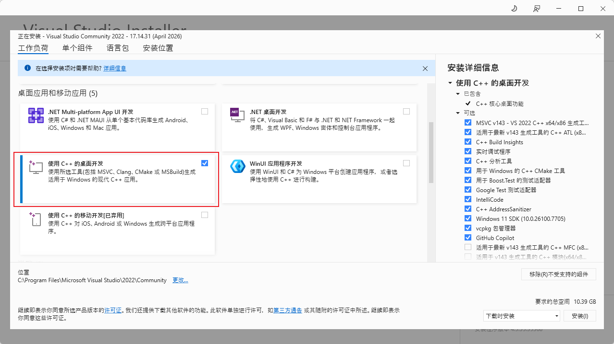

<div align=center>
  <h1>00-Environment</h1>
  <div align='center'>

  [](https://rocm.docs.amd.com/)

  </div>
  <strong>🛠️ ROCm Environment Setup</strong>
</div>

<div align="center">

*Unified environment baseline · ROCm 7.14.0 (TheRock) · Prerequisite for all subsequent chapters*

[Back to Home](/) | [中文](./)

</div>

## Introduction

&emsp;&emsp;This chapter serves as the environment baseline for the entire **hello-rocm** project. It targets **ROCm 7.14.0** (ROCm Core SDK, released 2026-07-15) and covers installation, verification, and uninstallation on both Windows and Ubuntu.

&emsp;&emsp;All subsequent chapters (01-Deploy, 02-Fine-tune, etc.) depend on this setup. To use a different ROCm version or GPU architecture, refer to the [GPU Architecture Reference Table](/00-environment/rocm-gpu-architecture-table) for substitutions.

> 🚀 **Milestone release: ROCm officially transitions to [TheRock](https://github.com/ROCm/TheRock)**. 7.14.0 is the most significant architectural shift since Windows / pip support arrived in 7.10.0, moving ROCm from a "monolithic bundle" toward a "modular ecosystem":
> - **Leaner core**: the Core SDK keeps only essential runtime and development components;
> - **Use case-specific expansions**: optional domain SDKs for AI, data science, and HPC;
> - **Modular installation**: install only the components your workflow needs — smaller footprint, faster innovation.
>
> This has **no impact on this project's pip / uv install flow** (wheels are still distributed from `repo.amd.com/rocm/whl/`). If you use the Linux **apt / dnf system-package** path instead, note the changes to package names and install directory (see [Section 2.5 · apt Install (TheRock)](#25-alternative-apt-install-therock)). See the [TheRock transition guide](https://rocm.docs.amd.com/en/latest/about/transition-guide-TheRock.html) for details.

> 💡 **Platform recommendation**: Windows supports ROCm for quick inference and experimentation, but the full ROCm toolchain (rocminfo, amd-smi, multi-GPU, containerized deployment, etc.) is best supported on **Ubuntu**. **We recommend Ubuntu 24.04 as the primary development environment**; Windows works well for lightweight inference and quick testing.

> ⚠️ **Windows users must read**: Before installation, verify that your **Adrenalin Driver version** and **Windows version** meet the requirements (see version table below), or ROCm will not function.

---

## Version Requirements

| Item | Requirement | Download |
|:---|:---|:---|
| ROCm | 7.14.0 (ROCm Core SDK / TheRock) | [Official install page](https://rocm.docs.amd.com/en/latest/install/rocm.html) |
| PyTorch | 2.12.0 | Via uv (see below) |
| Python | 3.11 / 3.12 / 3.13 / 3.14 | Managed by uv |
| **Windows Version** | **11 25H2** | — |
| **Adrenalin Driver (Windows)** | **26.5.1** | [**⬇️ Download Adrenalin 26.5.1**](https://www.amd.com/en/resources/support-articles/release-notes/RN-RAD-WIN-26-5-1.html#Downloads) |
| **Visual Studio 2022 (Windows)** | **Community, select "Desktop development with C++"** | [**⬇️ Download VS 2022**](https://visualstudio.microsoft.com/downloads/) |
| Ubuntu | 24.04.4 (GA kernel 6.8) / 26.04 (GA kernel 7.0) | [Ubuntu Downloads](https://ubuntu.com/download/desktop) |

> ⚠️ **Ryzen APU users note (Ubuntu 24.04)**: Ryzen APUs (gfx1150 / 1151 / 1152 / 1153 / 1103) require the **OEM kernel 6.14** on Ubuntu 24.04: `sudo apt install linux-oem-24.04c`, then reboot.

### AI Ecosystem Compatibility

ROCm 7.14.0 provides optimized support for popular deep learning frameworks and AI inference engines (a full upgrade over 7.13.0):

| Framework / Engine | Supported Version | Notes |
|:---|:---|:---|
| PyTorch | 2.12.0 | Profiler backend switched to rocprofiler-sdk (replaces roctracer) |
| JAX | 0.10.0 | — |
| vLLM | 0.23.0 | Inference-ready images and packages |
| SGLang | 0.5.13 | — |
| TensorFlow | 2.21 | — |

> 💡 These versions replace the 7.13.0-era PyTorch 2.9.1 / JAX 0.8.2 / vLLM 0.19.1 / SGLang 0.5.9. vLLM images are distributed per GPU architecture. See [vLLM inference and serving](https://rocm.docs.amd.com/en/latest/ai-inference/vllm.html).

---

## Table of Contents

- [GPU Architecture Reference Table (separate file)](/00-environment/rocm-gpu-architecture-table)
- [1. Windows Installation](#1-windows-11-installation)
- [2. Ubuntu Installation](#2-ubuntu-2404-installation)
  - [2.5 Alternative: apt Install (TheRock)](#25-alternative-apt-install-therock)
- [3. Verify Installation](#3-verify-installation)
- [4. Uninstall ROCm](#4-uninstall-rocm)
- [5. Switching GPU Architectures](#5-switching-gpu-architectures)

---

## 1. Windows 11 Installation

> Example: **Ryzen AI Max+ 395 (gfx1151)**
>
> 📖 Official docs: [Install ROCm on Windows](https://rocm.docs.amd.com/en/latest/install/rocm.html?fam=ryzen&gpu=max-395&os=windows&windows-ver=11&gfx=gfx1151&i=pip) | [Install PyTorch](https://rocm.docs.amd.com/projects/ai-ecosystem/en/latest/frameworks/pytorch/install.html?fam=ryzen&os=windows&pytorch-ver=2.12.0&i=pip&gpu=max-395&gfx=gfx1151)

### 1.1 Prerequisites Check

| ✅ Check | Requirement |
|:---|:---|
| **Windows Version** | **Must be Windows 11 25H2** (Settings → System → About) |
| **Adrenalin Driver** | **Must be 26.5.1** ([⬇️ Download](https://www.amd.com/en/resources/support-articles/release-notes/RN-RAD-WIN-26-5-1.html#Downloads)) |
| **Visual Studio 2022** (Optional) | Community edition, select "Desktop development with C++" ([⬇️ Download](https://visualstudio.microsoft.com/downloads/)). Required for AMD Quark or custom op compilation |

<div align='center'>
    
</div>

### 1.2 Remove Conflicting Software

- Control Panel → Programs → Uninstall a program → Remove all **HIP SDK** entries

### 1.3 Disable Windows Security Features

The following features interfere with ROCm and **must be disabled**:

- **WDAG**: Control Panel → Programs and Features → Turn Windows features on or off → Uncheck "Microsoft Defender Application Guard"
- **SAC**: Settings → Privacy & Security → Windows Security → App & browser control → Smart App Control settings → **Off**

### 1.4 Install uv (Python Package Manager)

This project uses [uv](https://docs.astral.sh/uv/) to manage Python environments and dependencies, replacing the traditional pip + venv workflow. uv is written in Rust and is 10-100x faster.

```powershell
# Windows install (PowerShell)
irm https://astral.sh/uv/install.ps1 | iex

# Or via winget
# winget install astral-sh.uv

# Verify
uv --version
```

> 📖 More install methods: [uv documentation](https://docs.astral.sh/uv/getting-started/installation/)

### 1.5 Install ROCm + PyTorch

```powershell
# Install Python 3.12 (uv has built-in version management)
uv python install 3.12

# Create virtual environment
uv venv --python 3.12
.venv\Scripts\activate

# Install ROCm runtime + libraries (gfx1151 = Ryzen AI Max+ 395/390/385)
uv pip install --index-url https://repo.amd.com/rocm/whl-multi-arch/ "rocm[libraries,device-gfx1151]==7.14.0"

# Install PyTorch
uv pip install --index-url https://repo.amd.com/rocm/whl-multi-arch/ "torch[device-gfx1151]==2.12.0+rocm7.14.0" "torchvision[device-gfx1151]==0.27.0+rocm7.14.0" "torchaudio==2.11.0+rocm7.14.0"

# Install other project dependencies (if requirements.txt exists)
uv pip install -r requirements.txt
```

> ⚠️ Do NOT copy ROCm DLLs to System32 — this causes conflicts.
>
> 💡 **New 7.14.0 syntax**: wheels are now served from a single multi-arch index `whl-multi-arch/`, and you select your GPU architecture via the `[device-gfxXXXX]` extra (no more per-arch `--index-url`). The `gfx1151` above corresponds to the **Ryzen AI Max series** (395/390/385). For other GPUs, just swap the architecture tag in the extra:
>
> | Your GPU | device extras tag |
> |:---|:---|
> | Ryzen AI 9 HX (PRO) 475 / 375 etc. | `device-gfx1150` |
> | Ryzen AI 7 (PRO) 450 / 350 etc. | `device-gfx1152` |
> | Ryzen AI 7 445 / AI 5 435 (new in 7.14.0) | `device-gfx1153` |
> | Radeon RX 9070 XT / 9070 GRE / AI PRO R9700S | `device-gfx1201` |
> | Radeon RX 9060 XT / 9060 XT LP / 9060 | `device-gfx1200` |
> | Radeon RX 7900 XTX / PRO W7900 | `device-gfx1100` |
> | Instinct MI300X / MI325X | `device-gfx942` |
> | All architectures (larger, broadest compatibility) | `device-all` |
>
> For example, gfx1150: `"rocm[libraries,device-gfx1150]==7.14.0"` and `"torch[device-gfx1150]==2.12.0+rocm7.14.0"`.
>
> Full reference: [GPU Architecture Table](/00-environment/rocm-gpu-architecture-table) or [Official Compatibility Matrix](https://rocm.docs.amd.com/en/latest/compatibility/compatibility-matrix.html).

---

## 2. Ubuntu 24.04 Installation

> Example: **Ryzen AI Max+ PRO 395 (gfx1151)**
>
> 📖 Official docs: [Install ROCm on Ubuntu](https://rocm.docs.amd.com/en/latest/install/rocm.html?fam=ryzen&gpu=max-395&os=ubuntu&os-version=24.04&gfx=gfx1151&i=pip) | [Install PyTorch](https://rocm.docs.amd.com/projects/ai-ecosystem/en/latest/frameworks/pytorch/install.html?fam=ryzen&os=linux&pytorch-ver=2.12.0&i=pip&gpu=max-395&gfx=gfx1151)

### 2.1 Install uv and Dependencies

```bash
sudo apt install -y libatomic1 libquadmath0

# Install uv
curl -LsSf https://astral.sh/uv/install.sh | sh

# Verify
uv --version
```

### 2.2 Install ROCm + PyTorch (uv, recommended)

```bash
# Install Python 3.12
uv python install 3.12

# Create virtual environment
uv venv --python 3.12
source .venv/bin/activate

# Install ROCm runtime + libraries (gfx1151 = Ryzen AI Max+ 395/390/385)
uv pip install --index-url https://repo.amd.com/rocm/whl-multi-arch/ "rocm[libraries,device-gfx1151]==7.14.0"

# Install PyTorch
uv pip install --index-url https://repo.amd.com/rocm/whl-multi-arch/ "torch[device-gfx1151]==2.12.0+rocm7.14.0" "torchvision[device-gfx1151]==0.27.0+rocm7.14.0" "torchaudio==2.11.0+rocm7.14.0"

# Install other project dependencies (if requirements.txt exists)
uv pip install -r requirements.txt
```

> 💡 For other GPUs, just swap the architecture tag in the extra (e.g. `device-gfx1150`, `device-gfx942`, `device-all`) — see [Section 1.5](#15-install-rocm--pytorch) or the [GPU Architecture Table](/00-environment/rocm-gpu-architecture-table).

### 2.3 Alternative: One-Click Install Script

For a fully automated installation (kernel, driver, ROCm), use the project's install script:

```bash
git clone -b unified-installer https://github.com/amdjiahangpan/rocm-install-script.git
cd rocm-install-script
chmod +x install.sh
sudo ./install.sh
```

> 📖 Script details and options: [rocm-install-script (unified-installer branch)](https://github.com/amdjiahangpan/rocm-install-script/tree/unified-installer)

### 2.4 Configure GPU Access Permissions (Linux)

> 💡 This step can be done anytime after installation; takes effect after reboot.

```bash
sudo usermod -a -G render,video "$LOGNAME"
# Log out and back in, or reboot
```

### 2.5 Alternative: apt Install (TheRock)

> 💡 If you don't use pip / uv and prefer a **system-wide install** via the **system package manager** (apt), note that 7.14.0 introduces the TheRock packaging system — package names and the install directory have changed.

| Change | ROCm Core SDK 7.14.0 | ROCm Legacy (7.2 and earlier) |
|:---|:---|:---|
| Install directory | `/opt/rocm/core` | `/opt/rocm/` |
| Package prefix | `amdrocm-*` (e.g. `amdrocm-blas`) | `rocm-*` / `roc*` / `hip*` |
| Shared extras dir | `/opt/rocm/extras-7/` | N/A |
| Package consolidation | hipBLAS + rocBLAS → `amdrocm-blas`, etc. | Separate packages |

```bash
sudo apt update
sudo apt install sudo wget gpg
# After adding the amdrocm repository per the official install page:

# Install all GPU architectures (larger footprint, broadest compatibility)
sudo apt install amdrocm-core-sdk7.14

# Or install for a specific architecture (smaller, requires knowing your GPU arch, e.g. gfx110x)
sudo apt install amdrocm-core-sdk7.14-gfx110x
```

> ✅ **Compatibility**: 7.14.0 maintains **ABI/API compatibility with ROCm 7.2 legacy — no recompilation required**. With apt, the `amdrocm` meta package configures `update-alternatives` and provides backward-compatible symlinks for `/opt/rocm/bin`, `/opt/rocm/lib`, and other `/opt/rocm/` directories. For tarball installs, update `PATH` / `LD_LIBRARY_PATH` / `ROCM_PATH` to point to `/opt/rocm/core`.
>
> ⚠️ **Note**: `amd-smi` replaces the now-removed ROCm SMI; ASAN packages are not available in 7.14.0 and are planned for a future release.
>
> 📖 Full package mapping and migration details: [TheRock transition guide](https://rocm.docs.amd.com/en/latest/about/transition-guide-TheRock.html) and [official install page](https://rocm.docs.amd.com/en/latest/install/rocm.html).

---

## 3. Verify Installation

### 3.1 PyTorch Check (Windows / Linux)

```bash
python -c "import torch; print('PyTorch:', torch.__version__); print('ROCm available:', torch.cuda.is_available()); print('Device:', torch.cuda.get_device_name(0) if torch.cuda.is_available() else 'N/A')"
```

Expected output:

```
PyTorch: 2.12.0+rocm7.14.0
ROCm available: True
Device: AMD Radeon Graphics
```

> 💡 ROCm uses HIP to provide CUDA API compatibility, so `torch.cuda.is_available()` returning `True` is expected behavior.

### 3.2 Simple Computation Test

```python
import torch
x = torch.randn(3, 3, device='cuda')
y = torch.randn(3, 3, device='cuda')
print(x @ y)
```

### 3.3 Linux-only Tools

```bash
rocminfo | grep -E "Name:|Marketing Name:"
amd-smi monitor   # ROCm SMI was removed in 7.14.0 — use amd-smi
hipinfo           # available with pip installation
```

### 3.4 Troubleshooting

| Symptom | Cause | Solution |
|:---|:---|:---|
| `torch.cuda.is_available()` = `False` | Driver version mismatch | Windows: confirm [Adrenalin 26.5.1](https://www.amd.com/en/resources/support-articles/release-notes/RN-RAD-WIN-26-5-1.html#Downloads); Linux: confirm inbox / OEM kernel (Ryzen APUs need `linux-oem-24.04c`) |
| `No GPU detected` (Linux) | Not in render/video group | `sudo usermod -a -G render,video $LOGNAME` + reboot |
| DLL load error (Windows) | SAC/WDAG not disabled | See [Section 1.3](#13-disable-windows-security-features) |

---

## 4. Uninstall ROCm

### Windows

Simply delete the `.venv` folder (via File Explorer, or in CMD):

```cmd
rmdir /s /q .venv
```

To uninstall Adrenalin driver: Control Panel → Programs → Uninstall a program → AMD Software

### Ubuntu

```bash
rm -rf .venv
```

---

## 5. Switching GPU Architectures

Since 7.14.0, wheels are served from a single multi-arch index `https://repo.amd.com/rocm/whl-multi-arch/`, and you select the architecture via the `[device-gfxXXXX]` extra. Simply replace the architecture tag in the install command with the corresponding value:

| GPU Example | LLVM Target | device extras tag |
|:---|:---|:---|
| MI355X / MI350X / MI350P | gfx950 | `device-gfx950` |
| MI300X / MI325X | gfx942 | `device-gfx942` |
| RX 9070 XT / 9070 GRE / AI PRO R9700S | gfx1201 | `device-gfx1201` |
| RX 9060 XT / 9060 XT LP / 9060 | gfx1200 | `device-gfx1200` |
| RX 7900 XTX / PRO W7900 | gfx1100 | `device-gfx1100` |
| Radeon PRO W6800 / V620 | gfx1030 | `device-gfx1030` |
| Ryzen AI Max 395 | gfx1151 | `device-gfx1151` |
| Ryzen AI PRO 400 / AI 9 HX 475 | gfx1150 | `device-gfx1150` |
| Ryzen AI 200 PRO / AI 7 350 | gfx1152 | `device-gfx1152` |
| Ryzen AI 7 445 / AI 5 435 (new in 7.14.0) | gfx1153 | `device-gfx1153` |
| All architectures | — | `device-all` |

For example, to switch to gfx942 (MI300X):

```bash
uv pip install --index-url https://repo.amd.com/rocm/whl-multi-arch/ "rocm[libraries,device-gfx942]==7.14.0"
uv pip install --index-url https://repo.amd.com/rocm/whl-multi-arch/ "torch[device-gfx942]==2.12.0+rocm7.14.0" "torchvision[device-gfx942]==0.27.0+rocm7.14.0" "torchaudio==2.11.0+rocm7.14.0"
```

> 💡 For the apt system-package path, use the architecture-specific meta package instead (e.g. `amdrocm-core-sdk7.14-gfx110x`) — see [Section 2.5](#25-alternative-apt-install-therock).

Full reference: [GPU Architecture Table](/00-environment/rocm-gpu-architecture-table)

---

> 📖 Official documentation:
> - [ROCm 7.14.0 Release Notes](https://rocm.docs.amd.com/en/latest/about/release-notes.html)
> - [TheRock Transition Guide](https://rocm.docs.amd.com/en/latest/about/transition-guide-TheRock.html)
> - [Compatibility Matrix](https://rocm.docs.amd.com/en/latest/compatibility/compatibility-matrix.html)
> - [Install ROCm](https://rocm.docs.amd.com/en/latest/install/rocm.html)
> - [Install PyTorch](https://rocm.docs.amd.com/projects/ai-ecosystem/en/latest/frameworks/pytorch/install.html)
> - [Install JAX](https://rocm.docs.amd.com/en/latest/frameworks/jax/install.html)
> - [vLLM Inference and Serving](https://rocm.docs.amd.com/en/latest/ai-inference/vllm.html)
> - [ComfyUI Image Generation](https://rocm.docs.amd.com/en/latest/ai-inference/comfyui.html)
> - [xDiT Diffusion Inference](https://rocm.docs.amd.com/en/latest/ai-inference/xdit.html)
> - [Inference Optimization](https://rocm.docs.amd.com/en/latest/ai-inference/optimization.html)
