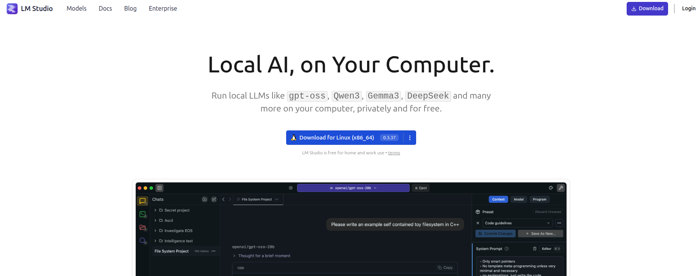
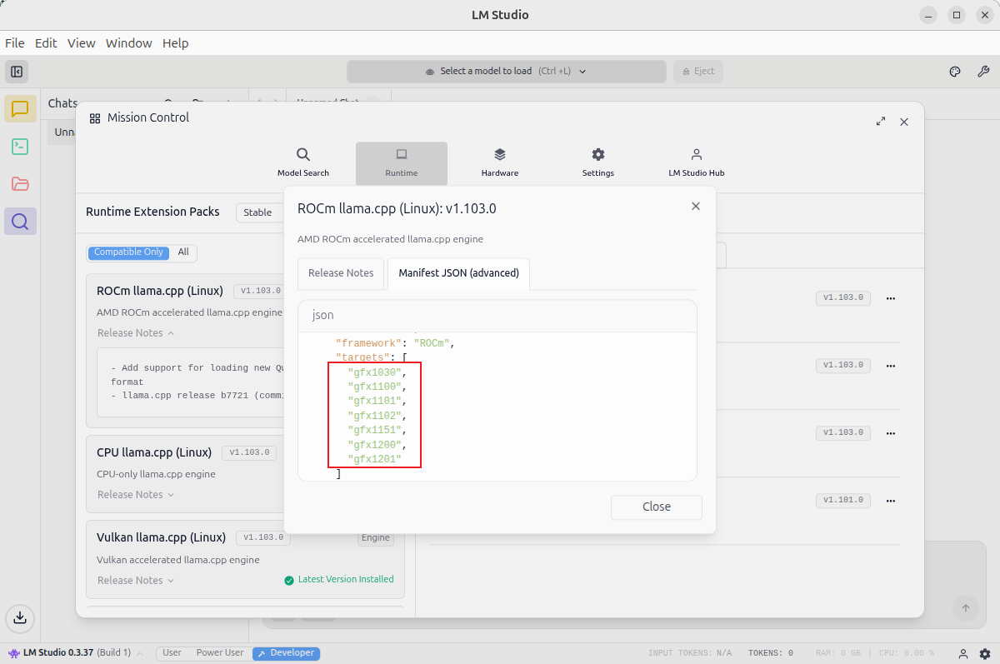

## LM Studio LLM Deployment from Scratch (Ubuntu 24.04 + ROCm 7+)

This section explains how to deploy Gemma 4 on Ubuntu 24.04 using **LM Studio + ROCm version llama.cpp**, and provides performance examples for Gemma 4 E4B-it Q4_K_M.

> Before starting this section, make sure you have completed the environment setup and correctly installed ROCm 7.1.0 (refer to `env-prepare-ubuntu24-rocm7.md`).

---

### 1. Using LM Studio (with ROCm Version llama.cpp Backend)

#### 1.1 Download LM Studio AppImage

First, download the installer from the official website:

```bash
https://lmstudio.ai/
```

Download the latest `.AppImage` file to your local machine.

Screenshot:

<div align='center'>
    
</div>

---

#### 1.2 Extract the AppImage

Extract the AppImage contents into the `squashfs-root` directory:

```bash
chmod u+x LM-Studio-*.AppImage
./LM-Studio-*.AppImage --appimage-extract
```

---

#### 1.3 Fix chrome-sandbox Permissions

Navigate to the `squashfs-root` directory and set the appropriate permissions for the `chrome-sandbox` file (this binary is required for the application to run securely):

```bash
cd squashfs-root
sudo chown root:root chrome-sandbox
sudo chmod 4755 chrome-sandbox
```

---

#### 1.4 Launch LM Studio

Start the LM Studio application from the current directory:

```bash
./lm-studio
```

---

### 2. Install the ROCm Version llama.cpp Backend

In LM Studio, select the **ROCm version of the llama.cpp backend** to install:

<div align='center'>
    
</div>

Note the supported architecture list for the ROCm version of llama.cpp currently provided by LM Studio (GPU architecture support status):

<div align='center'>
    
</div>

<div align='center'>
    
</div>

---

### 3. Load the Gemma 4 E4B-it Q4_K_M Model

In LM Studio's **Discover** page, search for the keyword:

```
gemma-4-E4B-it GGUF
```

Select and download a Q4_K_M quantized version from a trusted community source (e.g., `bartowski/google_gemma-4-E4B-it-GGUF`; check LM Studio's latest catalog for the most current options).

> Tips:
> - Downloading Gemma series models for the first time requires accepting the model terms of use on Hugging Face and logging in / configuring the corresponding Token in LM Studio.
> - If you have more VRAM, you can switch to `gemma-4-26B-A4B-it` or `gemma-4-31B-it` GGUF quantized versions.

---

### 4. Gemma 4 E4B-it Q4_K_M Performance Example

Load the **Gemma 4 E4B-it Q4_K_M** model in LM Studio, set the context length to 4096 (Gemma 4 E4B natively supports 128K — you can gradually increase it based on your VRAM), and you're ready for chat and inference:

- **tokens/s depends on your actual hardware** (Gemma 4 E4B activates only 4.5B effective parameters during inference, typically faster than comparable 8B models at the same Q4_K_M quantization)

Screenshot example:

<div align='center'>
    
</div>

> To experience Gemma 4's image / video / audio multimodal capabilities, use a Gemma 4 GGUF package in LM Studio that is labeled as supporting **Vision / Multimodal** (usually includes an `mmproj` projection file), then simply drag and drop images or audio into the chat window.
