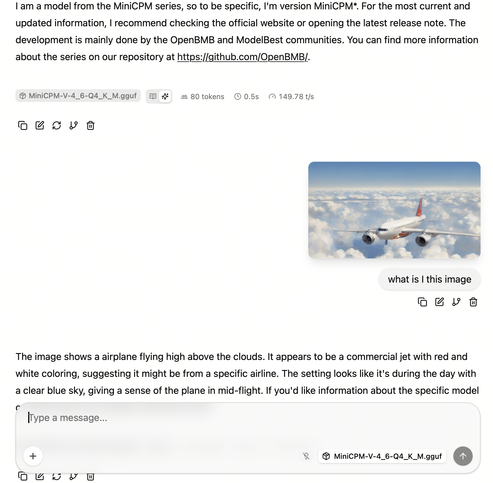

## llama.cpp Deployment of MiniCPM-V (Ubuntu 24.04 + ROCm 7+)

### Model Overview

[MiniCPM-V](https://github.com/OpenBMB/MiniCPM-V) is an on-device multimodal model series developed by ModelBest and Tsinghua University NLP Lab (OpenBMB). MiniCPM-V 4.6 has only 1.3B parameters (SigLIP2 vision encoder + Qwen3.5 language backbone) and supports image understanding and text conversation.

- Model: [openbmb/MiniCPM-V-4_6](https://huggingface.co/openbmb/MiniCPM-V-4_6)
- GGUF: [openbmb/MiniCPM-V-4_6-gguf](https://huggingface.co/openbmb/MiniCPM-V-4_6-gguf)

This guide deploys **MiniCPM-V 4.6 Q4_K_M (GGUF)** using **llama.cpp**, covering:

- Prebuilt executables (recommended)
- Docker + official ROCm image for building from source

Unlike the text-only MiniCPM, MiniCPM-V is a vision-language model that requires both a GGUF weights file and an **`mmproj` multimodal projector** file. Use `llama-mtmd-cli` / `llama-server --mmproj` for inference.

> Prerequisite: ROCm 7+ system installation and verification is complete
> (see `env-prepare-ubuntu24-rocm7.md`). Verified on **AMD Ryzen AI MAX+ 395 (Radeon 8060S,
> gfx1151), ROCm 7.13**.

---

### Method 1 (Recommended): Prebuilt Executables

#### 1. Download the Prebuilt Version

Use the prebuilt llama.cpp provided by Lemonade, where:

- **370** corresponds to the **gfx1150** architecture
- **395** corresponds to the **gfx1151** architecture

Related links:

- https://github.com/lemonade-sdk/llamacpp-rocm
- https://github.com/lemonade-sdk/llamacpp-rocm/releases

```bash
mkdir -p ~/minicpmv-rocm && cd ~/minicpmv-rocm
# Pick the asset matching your architecture (gfx1151 shown here)
curl -L -o llama-rocm-gfx1151.zip \
  https://github.com/lemonade-sdk/llamacpp-rocm/releases/download/b1292/llama-b1292-ubuntu-rocm-gfx1151-x64.zip
mkdir -p llama-bin && unzip -q llama-rocm-gfx1151.zip -d llama-bin
```

---

#### 2. Verify ROCm 7+ Installation (Must Be System-level ROCm)

```bash
amd-smi
```

You should see your GPU model, driver, and ROCm version, e.g.:

```
MARKET_NAME: Radeon 8060S Graphics
TARGET_GRAPHICS_VERSION: gfx1151
ROCm version: 7.13.0
```

Confirm llama.cpp can see the GPU:

```bash
cd ~/minicpmv-rocm/llama-bin
export LD_LIBRARY_PATH=$PWD:/opt/rocm/lib:$LD_LIBRARY_PATH
./llama-cli --list-devices
# Available devices:
#   ROCm0: Radeon 8060S Graphics (65536 MiB, ... free)
```

---

#### 3. Set Permissions and Environment Variables

```bash
cd ~/minicpmv-rocm/llama-bin
chmod +x llama-cli llama-server llama-mtmd-cli
export LD_LIBRARY_PATH=$PWD:/opt/rocm/lib:$LD_LIBRARY_PATH
```

> The Lemonade build bundles its own ROCm runtime libraries next to the binaries, so add `$PWD` to `LD_LIBRARY_PATH` in addition to `/opt/rocm/lib`.

---

#### 4. Download MiniCPM-V 4.6 GGUF + mmproj Projector

Multimodal models require **two** files:

- Quantized LLM weights (`*Q4_K_M*.gguf`)
- Vision projector (`mmproj-*.gguf`)

Using the Chinese Hugging Face mirror:

```bash
mkdir -p ~/models/MiniCPM-V-4_6-gguf && cd ~/models/MiniCPM-V-4_6-gguf
export HF_ENDPOINT=https://hf-mirror.com

# Model weights (Q4_K_M, ~505 MB) and the multimodal projector (~1.1 GB)
for f in MiniCPM-V-4_6-Q4_K_M.gguf mmproj-model-f16.gguf; do
  curl -L --fail -o "$f" \
    "https://hf-mirror.com/openbmb/MiniCPM-V-4_6-gguf/resolve/main/$f"
done
```

> You can also use `hfd.sh` + `aria2` for resumable downloads. File names may change with upstream updates — search `MiniCPM-V-4_6-gguf` on Hugging Face for the latest version.

---

#### 5. CLI Multimodal Test (`llama-mtmd-cli`)

`llama-mtmd-cli` is the multimodal CLI. Pass the projector with `--mmproj` and an image with `--image`:

```bash
cd ~/minicpmv-rocm/llama-bin
export LD_LIBRARY_PATH=$PWD:/opt/rocm/lib:$LD_LIBRARY_PATH

./llama-mtmd-cli \
  -m ~/models/MiniCPM-V-4_6-gguf/MiniCPM-V-4_6-Q4_K_M.gguf \
  --mmproj ~/models/MiniCPM-V-4_6-gguf/mmproj-model-f16.gguf \
  -ngl 99 -c 4096 --temp 0.2 \
  --image /path/to/image.jpeg \
  -p "Describe this image in detail."
```

---

#### 6. Start llama-server (OpenAI-compatible API)

```bash
export LD_LIBRARY_PATH=$PWD:/opt/rocm/lib:$LD_LIBRARY_PATH
cd ~/minicpmv-rocm/llama-bin

./llama-server \
  -m ~/models/MiniCPM-V-4_6-gguf/MiniCPM-V-4_6-Q4_K_M.gguf \
  --mmproj ~/models/MiniCPM-V-4_6-gguf/mmproj-model-f16.gguf \
  -ngl 99 -c 4096 --host 127.0.0.1 --port 8080
```

---

#### 7. Test the API

**Text completion:**

```bash
curl -s -X POST http://127.0.0.1:8080/v1/completions \
  -H "Content-Type: application/json" \
  -d '{
  "model": "MiniCPM-V-4_6",
  "prompt": "Explain large language models in one sentence",
  "max_tokens": 128
}' | jq -r '
.choices[0].text as $txt |
(.usage.completion_tokens / (.timings.predicted_ms / 1000)) as $tps |
"Generated text:\n\($txt)\n\ntokens/s: \($tps|tostring)"
'
```

**Multimodal chat** (image via base64):

```bash
IMG_B64=$(base64 -w0 /path/to/image.jpeg)
curl -s -X POST http://127.0.0.1:8080/v1/chat/completions \
  -H "Content-Type: application/json" \
  -d '{
  "model": "MiniCPM-V-4_6",
  "max_tokens": 128,
  "messages": [{"role": "user", "content": [
    {"type": "text", "text": "Describe this image in one sentence."},
    {"type": "image_url", "image_url": {"url": "data:image/jpeg;base64,'"$IMG_B64"'"}}
  ]}]
}' | jq -r '.choices[0].message.content'
```

Reference: **~190 tokens/s** decode for both text and multimodal on Radeon 8060S (gfx1151), ROCm 7.13, ctx=4096 (first multimodal turn includes image encoding time). Actual speed depends on hardware.

---

### Method 2: Docker (Official ROCm llama.cpp Image)

> Docker requires `amdgpu-dkms`:
> https://rocm.docs.amd.com/projects/install-on-linux/en/latest/how-to/docker.html

#### 1. Start the Container

```bash
export MODEL_PATH='~/models'

sudo docker run -it \
  --name=$(whoami)_llamacpp_minicpmv \
  --privileged --network=host \
  --device=/dev/kfd --device=/dev/dri \
  --group-add video --cap-add=SYS_PTRACE \
  --security-opt seccomp=unconfined \
  --ipc=host --shm-size 16G \
  -v $MODEL_PATH:/data \
  rocm/dev-ubuntu-24.04:7.0-complete
```

---

#### 2. Prepare the Workspace

```bash
apt-get update && apt-get install -y nano libcurl4-openssl-dev cmake git
mkdir -p /workspace && cd /workspace
```

---

#### 3. Clone llama.cpp

```bash
git clone https://github.com/ROCm/llama.cpp
cd llama.cpp
```

---

#### 4. Set ROCm Architecture

```bash
# AI MAX 395 (gfx1151) example
export LLAMACPP_ROCM_ARCH=gfx1151
```

---

#### 5. Build llama.cpp

```bash
HIPCXX="$(hipconfig -l)/clang" HIP_PATH="$(hipconfig -R)" \
cmake -S . -B build \
  -DGGML_HIP=ON \
  -DAMDGPU_TARGETS=$LLAMACPP_ROCM_ARCH \
  -DCMAKE_BUILD_TYPE=Release \
  -DLLAMA_CURL=ON && \
cmake --build build --config Release -j$(nproc)
```

---

#### 6. Run the Multimodal Test

MiniCPM-V requires both the model weights and the mmproj projector:

```bash
./build/bin/llama-mtmd-cli \
  -m /data/MiniCPM-V-4_6-gguf/MiniCPM-V-4_6-Q4_K_M.gguf \
  --mmproj /data/MiniCPM-V-4_6-gguf/mmproj-model-f16.gguf \
  -ngl 99 -c 4096 \
  --image /data/image.jpeg \
  -p "What is in this image?"
```

---

### Screenshot Example

<div align='center'>
    
</div>
