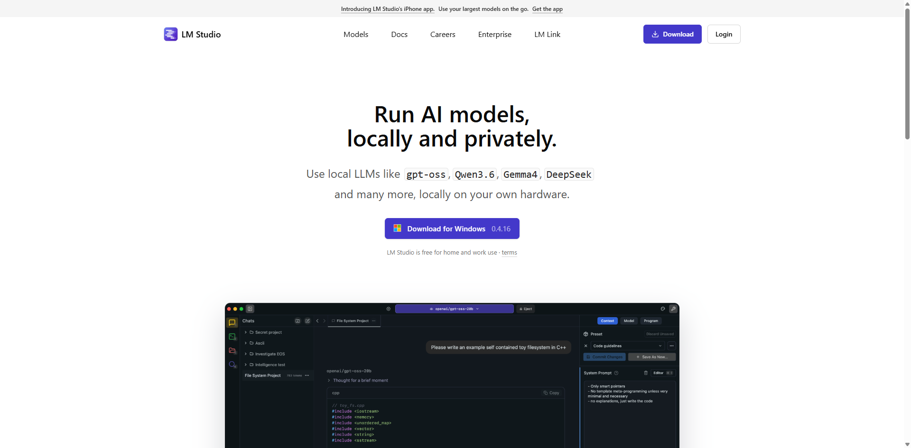
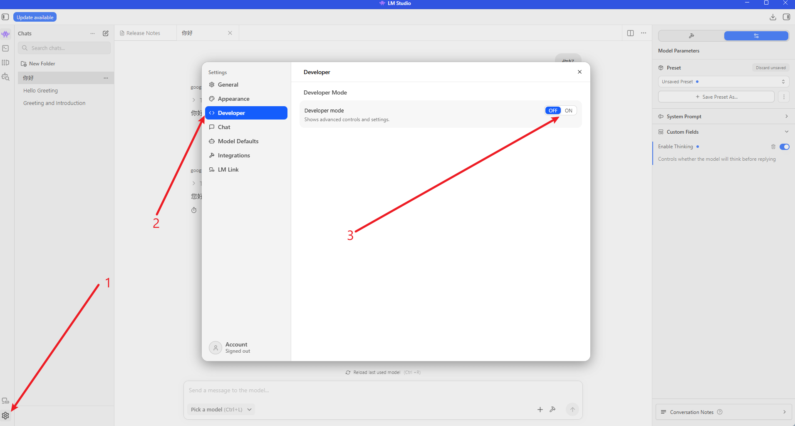
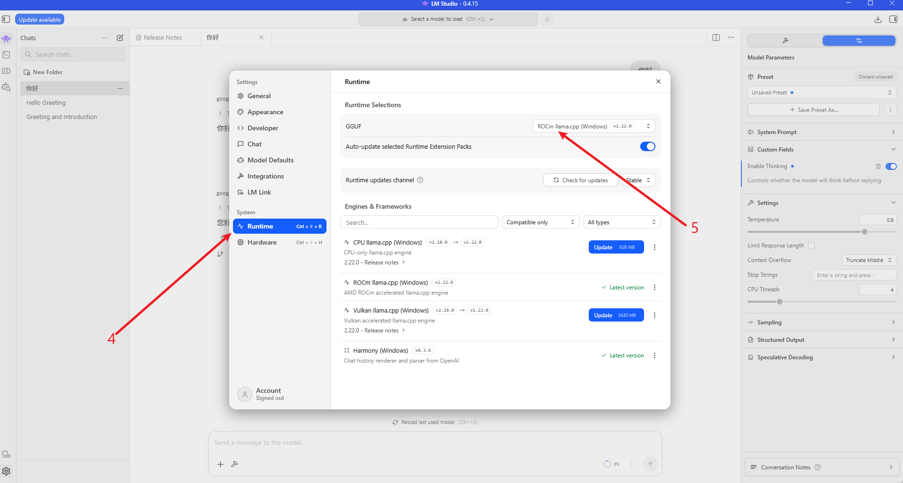
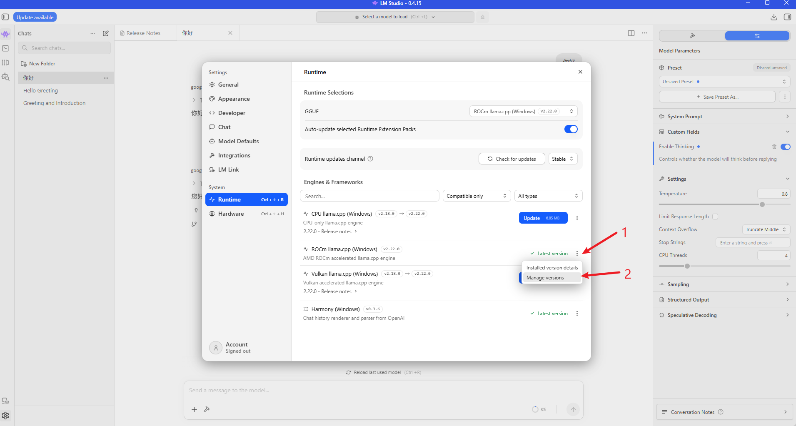
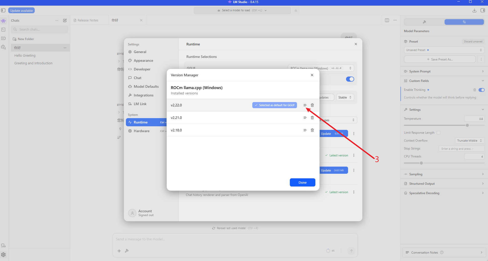
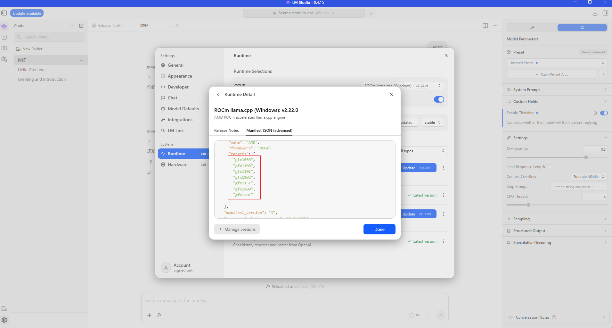
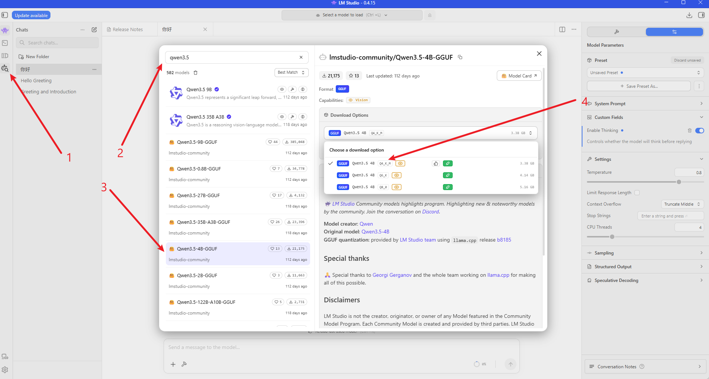
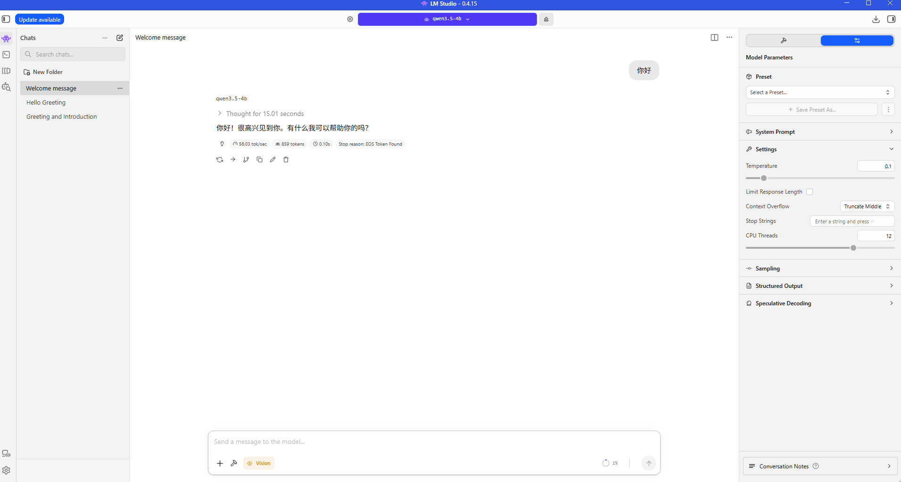

## LM Studio Deployment for Qwen3.5 (Ubuntu 24.04 + ROCm 7+)

This guide shows how to use **LM Studio + ROCm llama.cpp backend** to run Qwen3.5 GGUF models on AMD GPUs.

> Prerequisite: complete [ROCm 7.13 environment setup](./env-prepare-ubuntu24-rocm7.md).

### 1. Download LM Studio

Download the latest AppImage from:

```bash
https://lmstudio.ai/
```

The following screenshots show the LM Studio download page and ROCm backend selection flow:

<div align='center'>
    
</div>

### 2. Extract and Start LM Studio

```bash
chmod u+x LM-Studio-*.AppImage
./LM-Studio-*.AppImage --appimage-extract
cd squashfs-root
sudo chown root:root chrome-sandbox
sudo chmod 4755 chrome-sandbox
./lm-studio
```

### 3. Install the ROCm llama.cpp Backend

Select the ROCm llama.cpp backend in LM Studio:

<div align='center'>
    
    
</div>

LM Studio lists the GPU architectures supported by the ROCm llama.cpp backend:

<div align='center'>
    
    
    
</div>

### 4. Load a Qwen3.5 GGUF Model

Choose a Qwen3.5 GGUF model that fits your VRAM budget. For smaller GPUs, start with Q4_K_M or a similar quantization.

<div align='center'>
    
</div>

### 5. Performance Notes

Record the model name, quantization, context length, GPU model, and tokens/s when adding benchmark screenshots.

<div align='center'>
    
</div>
