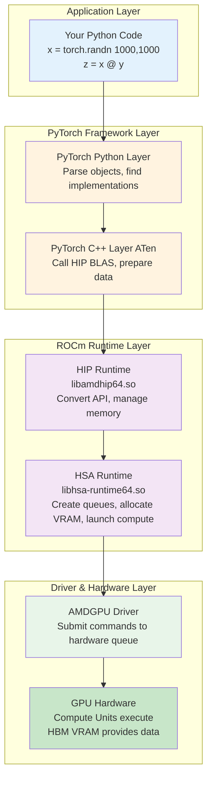
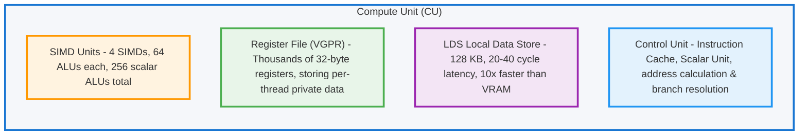

## Decoding AI Accelerators — From Software Stack to Hardware Architecture

<div align='center'>

[](https://rocm.docs.amd.com/)
[](https://pytorch.org/)
[]()
[]()

</div>

> **Lab Environment**
> - **Device**: AMD AI+ MAX395
> - **GPU**: Radeon 8060S
> - **Architecture**: gfx1151 (RDNA 3)
> - **ROCm Version**: 7.x
> - **OS**: Ubuntu 24.04 / 22.04

### Learning Objectives

By the end of this chapter, you will understand three core things:

1. **Software Call Chain**: How PyTorch code flows through HIP → HSA → Driver → GPU for execution
2. **Paradigm Shift**: From CPU's "low latency" to GPU's "high throughput" — how the SIMT model works
3. **Hardware Architecture**: AMD GPU's CU, LDS, HBM, and why memory bandwidth matters

---

## 2.1 From Python to GPU: The Complete Journey of Code Execution

When you write PyTorch code like `x + y`, do you know how many layers of "translation" that line goes through before it finally executes on the GPU? In this section, we'll use Linux tools to trace the entire call chain.

<div align='center'>
    
    <p><b>Figure 2.1</b> Overview of Python-to-GPU flow: PyTorch code passes through HIP, HSA, and the Driver before executing in parallel on the GPU</p>
</div>

### 2.1.1 Unboxing the Black Box: Tracing PyTorch's Dependency Chain with `ldd`

> PyTorch is just a high-level wrapper. The real work on the GPU is done by the underlying ROCm software stack. Let's use `ldd` (a tool for viewing dynamic library dependencies) to peek inside.

#### Tracing Command

```bash
# Find the torch library path
TORCH_LIB=$(python -c "import torch; print(torch.__file__)" | sed 's/__init__.py/lib/')

# View core dependencies (filter for amd/rocm related)
ldd $TORCH_LIB/libtorch_python.so | grep -E "amd|hip|hsa"
```

#### Example Output

<div align='center'>
    
    <p><b>Figure 2.2</b> Using ldd to view PyTorch's ROCm dependency libraries</p>
</div>

These libraries form the **core of the ROCm software stack**. Let's break them down:

#### Four Core Components

| Component | Library | Role | NVIDIA Equivalent |
|:---|:---|:---|:---|
| **Translator** | `libamdhip64.so` | Converts CUDA-style API calls to AMD instructions | `libcudart` |
| **Dispatcher** | `libhsa-runtime64.so` | Actually schedules GPU, manages memory, and launches compute | HSA heterogeneous compute infrastructure |
| **Math Libraries** | `hipblas`/`hipfft` etc. | High-performance math libraries (matrix multiply, FFT, etc.) | cuBLAS/cuFFT |
| **Compiler Frontend** | `libamd_comgr.so` | Dynamically compiles HIP code into binary objects | NVRTC |

#### Math Library Details

| Library | Purpose | Use Case |
|:---|:---|:---|
| `hipblas` | Matrix operations (BLAS) | Linear layers, matrix multiplication |
| `hipfft` | Fast Fourier Transform | Signal processing, certain attention mechanisms |
| `hiprand` | Random number generation | Dropout, noise injection |
| `hipsparse` | Sparse matrix operations | Sparse attention mechanisms |

> **Why do we need these math libraries?**
>
> These libraries are hand-optimized by AMD engineers in assembly language, performing 10-100x faster than HIP code you'd write yourself. When you run a Qwen model, the bulk of matrix operations are handled by `hipblas`.

---

### 2.1.2 The Big Picture: Complete Call Chain

The earlier diagram showed in cartoon style "how a single line of Python code makes its way to the GPU."

Now let's take a more engineering-oriented view, breaking down this chain by software stack layers:



#### Key Data Flow

| Stage | Location | Task |
|:---|:---|:---|
| **1. CPU Side** | System Memory | Prepare data, call APIs |
| **2. PCIe Bus** | Bus Transfer | Move data from system memory to VRAM |
| **3. GPU Side** | GPU Cores | Compute Units execute in parallel |
| **4. Return** | Bus Transfer | Results move from VRAM back to system memory |

---

### 2.1.3 Compiler Perspective: How ROCm Uses LLVM/Clang to "Lower" High-Level Code

> The GPU can't understand your Python/HIP code. The compiler must perform a series of transformations before the GPU can execute it.

<div align='center'>
    
    <p><b>Figure 2.3</b> HIP / LLVM / ISA compilation pipeline: from C++/HIP source code to GPU executable binary</p>
</div>

#### Example: How a Simple HIP Function Gets Compiled

> **Hands-on Exercise**: Let's use actual compile commands to output LLVM IR and ISA.

Create the file `simple_add.cpp`:

```cpp
// file: code/simple_add.cpp
#include <hip/hip_runtime.h>
#include <iostream>

__global__ void add(float* a, float* b, float* c, int n) {
    int i = blockIdx.x * blockDim.x + threadIdx.x;
    if (i < n) {
        c[i] = a[i] + b[i];
    }
}

int main() {
    int n = 1024;
    size_t bytes = n * sizeof(float);

    float *a, *b, *c;
    hipMalloc(&a, bytes);
    hipMalloc(&b, bytes);
    hipMalloc(&c, bytes);

    float *h_a = new float[n];
    float *h_b = new float[n];
    for(int i = 0; i < n; i++) {
        h_a[i] = 1.0f;
        h_b[i] = 2.0f;
    }

    hipMemcpy(a, h_a, bytes, hipMemcpyHostToDevice);
    hipMemcpy(b, h_b, bytes, hipMemcpyHostToDevice);

    hipLaunchKernelGGL(add, dim3(1), dim3(n), 0, 0, a, b, c, n);
    hipDeviceSynchronize();

    float *h_c = new float[n];
    hipMemcpy(h_c, c, bytes, hipMemcpyDeviceToHost);

    std::cout << "Result: " << h_c[0] << ", " << h_c[n-1] << std::endl;

    delete[] h_a;
    delete[] h_b;
    delete[] h_c;
    hipFree(a);
    hipFree(b);
    hipFree(c);

    return 0;
}
```

**Method 1: Output LLVM IR directly with hipcc**

```bash
# Output unoptimized LLVM IR
hipcc --offload-arch=gfx1151 \
      -emit-llvm \
      -S \
      -O0 \
      simple_add.cpp -o simple_add_O0.ll

# Output optimized LLVM IR
hipcc --offload-arch=gfx1151 \
      -emit-llvm \
      -S \
      -O3 \
      simple_add.cpp -o simple_add_O3.ll

# View generated LLVM IR (GPU kernel portion only)
sed -n '/__CLANG_OFFLOAD_BUNDLE____START__ hip-amdgcn/,/__CLANG_OFFLOAD_BUNDLE____END__ hip-amdgcn/p' simple_add_O0.ll | grep -A 40 "define protected amdgpu_kernel"
sed -n '/__CLANG_OFFLOAD_BUNDLE____START__ hip-amdgcn/,/__CLANG_OFFLOAD_BUNDLE____END__ hip-amdgcn/p' simple_add_O3.ll | grep -A 40 "define protected amdgpu_kernel"
```

**Actual Output Example** (Unoptimized LLVM IR -O0):

```llvm
; Generated file: simple_add_O0.ll
define protected amdgpu_kernel void @_Z3addPfS_S_i(ptr addrspace(1) noundef %0, ptr addrspace(1) noundef %1, ptr addrspace(1) noundef %2, i32 noundef %3) #4 {
  %5 = alloca i32, align 4, addrspace(5)
  %6 = alloca i32, align 4, addrspace(5)
  %7 = alloca i32, align 4, addrspace(5)
  %8 = alloca i32, align 4, addrspace(5)
  %9 = alloca i32, align 4, addrspace(5)
  %10 = alloca i32, align 4, addrspace(5)
  %11 = alloca ptr, align 8, addrspace(5)
  %12 = alloca ptr, align 8, addrspace(5)
  %13 = alloca ptr, align 8, addrspace(5)
  %14 = alloca ptr, align 8, addrspace(5)
  %15 = alloca ptr, align 8, addrspace(5)
  %16 = alloca ptr, align 8, addrspace(5)
  %17 = alloca i32, align 4, addrspace(5)
  %18 = alloca i32, align 4, addrspace(5)
  store ptr addrspace(1) %0, ptr addrspacecast(ptr addrspace(5) %11 to ptr), align 8
  %27 = load ptr, ptr addrspacecast(ptr addrspace(5) %11 to ptr), align 8
  store ptr addrspace(1) %1, ptr addrspacecast(ptr addrspace(5) %12 to ptr), align 8
  %28 = load ptr, ptr addrspacecast(ptr addrspace(5) %12 to ptr), align 8
  store ptr addrspace(1) %2, ptr addrspacecast(ptr addrspace(5) %13 to ptr), align 8
  %29 = load ptr, ptr addrspacecast(ptr addrspace(5) %13 to ptr), align 8
  %32 = call i64 @__ockl_get_group_id(i32 noundef 0) #17
  %33 = trunc i64 %32 to i32
  %36 = call i64 @__ockl_get_local_size(i32 noundef 0) #17
  %37 = trunc i64 %36 to i32
  %38 = mul i32 %33, %37
  %41 = call i64 @__ockl_get_local_id(i32 noundef 0) #17
  %42 = trunc i64 %41 to i32
  %43 = add i32 %38, %42
  store i32 %43, ptr addrspacecast(ptr addrspace(5) %18 to ptr), align 4
  %44 = load i32, ptr addrspacecast(ptr addrspace(5) %18 to ptr), align 4
  %45 = load i32, ptr addrspacecast(ptr addrspace(5) %17 to ptr), align 4
  %46 = icmp slt i32 %44, %45
  br i1 %46, label %47, label %63

47:
  %48 = load ptr, ptr addrspacecast(ptr addrspace(5) %14 to ptr), align 8
  %50 = sext i32 %49 to i64
  %52 = load float, ptr %51, align 4
  %58 = fadd contract float %52, %57
  store float %58, ptr %62, align 4
  br label %63

63:
  ret void
}
; O0 version: ~75 lines of code
```

**Actual Output Example** (Optimized LLVM IR -O3):

```llvm
; Generated file: simple_add_O3.ll
define protected amdgpu_kernel void @_Z3addPfS_S_i(ptr addrspace(1) noundef readonly captures(none) %0, ...) local_unnamed_addr #0 {
  ; No stack allocations! All variables in registers
  %5 = tail call i32 @llvm.amdgcn.workgroup.id.x()
  %6 = tail call ptr addrspace(4) @llvm.amdgcn.implicitarg.ptr()
  %8 = load i16, ptr addrspace(4) %7, align 4, !tbaa !6
  %9 = zext i16 %8 to i32
  %10 = mul i32 %5, %9
  %11 = tail call noundef range(i32 0, 1024) i32 @llvm.amdgcn.workitem.id.x()
  %12 = add i32 %10, %11
  %13 = icmp slt i32 %12, %3
  br i1 %13, label %14, label %22

14:
  %15 = sext i32 %12 to i64
  %19 = load float, ptr addrspace(1) %18, align 4, !tbaa !10
  %20 = load float, ptr addrspace(1) %17, align 4, !tbaa !10
  %21 = fadd contract float %19, %20
  store float %21, ptr addrspace(1) %16, align 4, !tbaa !10
  br label %22

22:
  ret void
}
; O3 version: only ~35 lines of code
```

> **O0 vs O3 Key Differences**
>
> | Dimension | O0 | O3 |
> |:---|:---|:---|
> | **Stack usage** | 18 allocas (private memory) | Zero stack allocations |
> | **Function calls** | `@__ockl_get_group_id` wrapper functions | Direct `@llvm.amdgcn.workgroup.id.x()` intrinsics |
> | **Code size** | ~75 lines | ~35 lines (50% reduction) |
> | **Memory access** | Redundant load/store pairs | All variables kept in registers |
> | **TBAA annotations** | None | Added `!tbaa` for type-based alias analysis optimization |
> | **Parameter attributes** | None | Added `readonly`/`captures(none)` to aid optimization |

---

**(Optional) Output AMDGPU ISA Assembly**:

```bash
# Output ISA assembly
hipcc --offload-arch=gfx1151 -S -O3 simple_add.cpp -o simple_add.s

# View generated assembly (GPU kernel portion only)
sed -n '/__CLANG_OFFLOAD_BUNDLE____START__ hip-amdgcn/,/__CLANG_OFFLOAD_BUNDLE____END__ hip-amdgcn/p' simple_add.s | head -100
```

**Actual Output Example** (AMDGPU ISA Assembly):

```asm
# __CLANG_OFFLOAD_BUNDLE____START__ hip-amdgcn-amd-amdhsa--gfx1151
        .amdgcn_target "amdgcn-amd-amdhsa--gfx1151"
        .amdhsa_code_object_version 6
        .text
        .protected      _Z3addPfS_S_i
        .globl  _Z3addPfS_S_i
        .p2align        8
        .type   _Z3addPfS_S_i,@function
_Z3addPfS_S_i:
; %bb.0:
        s_clause 0x1
        s_load_b32 s3, s[0:1], 0x2c
        s_load_b32 s4, s[0:1], 0x18
        s_waitcnt lgkmcnt(0)
        s_and_b32 s3, s3, 0xffff
        s_delay_alu instid0(SALU_CYCLE_1)
        v_mad_u64_u32 v[0:1], null, s2, s3, v[0:1]
        s_mov_b32 s2, exec_lo
        v_cmpx_gt_i32_e64 s4, v0
        s_cbranch_execz .LBB0_2
; %bb.1:
        s_load_b128 s[4:7], s[0:1], 0x0
        v_ashrrev_i32_e32 v1, 31, v0
        s_load_b64 s[0:1], s[0:1], 0x10
        s_delay_alu instid0(VALU_DEP_1) | instskip(SKIP_1) | instid1(VALU_DEP_1)
        v_lshlrev_b64 v[0:1], 2, v[0:1]
        s_waitcnt lgkmcnt(0)
        v_add_co_u32 v2, vcc_lo, s4, v0
        s_delay_alu instid0(VALU_DEP_1) | instskip(SKIP_1) | instid1(VALU_DEP_1)
        v_add_co_ci_u32_e64 v3, null, s5, v1, vcc_lo
        v_add_co_u32 v4, vcc_lo, s6, v0
        v_add_co_ci_u32_e64 v5, null, s7, v1, vcc_lo
        global_load_b32 v2, v[2:3], off
        global_load_b32 v3, v[4:5], off
        v_add_co_u32 v0, vcc_lo, s0, v0
        s_delay_alu instid0(VALU_DEP_1)
        v_add_co_ci_u32_e64 v1, null, s1, v1, vcc_lo
        s_waitcnt vmcnt(0)
        v_add_f32_e32 v2, v2, v3
        global_store_b32 v[0:1], v2, off
.LBB0_2:
        s_endpgm
```

**Key Assembly Instructions Explained**:

| Instruction | Description |
|:---|:---|
| `s_load_b32` | Scalar load: load from constant memory into SGPR |
| `v_mad_u64_u32` | Vector multiply-add: compute thread global ID |
| `v_cmpx_gt_i32` | Vector compare: bounds check, also updates execution mask |
| `global_load_b32` | Global memory load: read data from VRAM |
| `v_add_f32_e32` | Vector float add: perform the actual addition |
| `global_store_b32` | Global memory store: write back to VRAM |
| `s_endpgm` | End program: terminate kernel execution |

#### Why Do We Need Runtime Compilation (JIT)?

PyTorch has a powerful capability: **runtime compilation**. When you write a custom operator, PyTorch will:

1. Call `hiprtc` (HIP Runtime Compilation) at runtime
2. Use `libamd_comgr` to compile your HIP code
3. Generate binaries tailored to the current GPU architecture
4. Load and execute on the GPU

This is why PyTorch can "dynamically compile" HIP operators.

---

### 2.1.4 Hands-On: Writing Your First HIP Program

> **Goal**: Now let's skip Python and write a HIP program directly in C++ to verify the entire call chain.

#### Create the file `hello_rocm.cpp`

```cpp
// file: code/hello_rocm.cpp
#include <hip/hip_runtime.h>
#include <iostream>
#include <cstdlib>

#define HIP_CHECK(call)                                                         \
    do {                                                                        \
        hipError_t err = call;                                                  \
        if (err != hipSuccess) {                                                \
            std::cerr << "HIP Error: " << hipGetErrorString(err)                \
                      << " at line " << __LINE__ << std::endl;                  \
            std::exit(EXIT_FAILURE);                                            \
        }                                                                       \
    } while (0)

__global__ void vector_add(float *a, float *b, float *c, int n) {
    int i = blockDim.x * blockIdx.x + threadIdx.x;
    if (i < n) {
        c[i] = a[i] + b[i];
    }
}

int main() {
    int n = 1024;
    size_t bytes = n * sizeof(float);

    float *h_a, *h_b, *h_c;
    h_a = (float*)malloc(bytes);
    h_b = (float*)malloc(bytes);
    h_c = (float*)malloc(bytes);

    for(int i=0; i<n; i++) {
        h_a[i] = 1.0f;
        h_b[i] = 2.0f;
    }

    float *d_a, *d_b, *d_c;
    HIP_CHECK(hipMalloc(&d_a, bytes));
    HIP_CHECK(hipMalloc(&d_b, bytes));
    HIP_CHECK(hipMalloc(&d_c, bytes));

    HIP_CHECK(hipMemcpy(d_a, h_a, bytes, hipMemcpyHostToDevice));
    HIP_CHECK(hipMemcpy(d_b, h_b, bytes, hipMemcpyHostToDevice));

    hipLaunchKernelGGL(vector_add, dim3(1), dim3(n), 0, 0, d_a, d_b, d_c, n);
    HIP_CHECK(hipDeviceSynchronize());

    HIP_CHECK(hipMemcpy(h_c, d_c, bytes, hipMemcpyDeviceToHost));

    std::cout << "Element [0]: " << h_a[0] << " + " << h_b[0] << " = " << h_c[0] << std::endl;
    std::cout << "Element [1023]: " << h_a[1023] << " + " << h_b[1023] << " = " << h_c[1023] << std::endl;
    std::cout << ">>> ROCm HIP Kernel executed successfully on AMD GPU!" << std::endl;

    HIP_CHECK(hipFree(d_a)); HIP_CHECK(hipFree(d_b)); HIP_CHECK(hipFree(d_c));
    free(h_a); free(h_b); free(h_c);

    return 0;
}
```

#### Compile and Run

```bash
# Check that hipcc compiler is ready
which hipcc

# Compile
hipcc hello_rocm.cpp -o hello_rocm

# Run
./hello_rocm
```

**Expected Output**:

```
Element [0]: 1 + 2 = 3
Element [1023]: 1 + 2 = 3
>>> ROCm HIP Kernel executed successfully on AMD GPU!
```

<div align='center'>
    
    <p><b>Figure 2.4</b> HIP program execution flow: CPU handles scheduling, GPU handles parallel computation</p>
</div>

#### Program Execution Flow

| Step | CPU Side | GPU Side |
|:---|:---|:---|
| **1. Allocate Memory** | `malloc` allocates system memory | `hipMalloc` allocates VRAM |
| **2. Data Transfer** | `hipMemcpy(H2D)` moves data to VRAM | Waiting for data |
| **3. Launch Compute** | `hipLaunchKernelGGL` dispatches compute task | 1024 threads compute in parallel |
| **4. Synchronize** | `hipDeviceSynchronize` waits for GPU | Computation complete |
| **5. Result Transfer** | `hipMemcpy(D2H)` moves results back to memory | Returns results |

> Congratulations! You just completed: your first manual GPU memory management, your first manual GPU kernel launch, and your first complete walkthrough of PyTorch's entire underlying call chain.

---

## 2.2 Hardware Thinking Revolution: The Paradigm Shift from CPU to GPU

Now you know how code gets to the GPU, but a more fundamental question is: **Why must AI use GPUs? Why can't CPUs handle it?**

The answer lies in the **fundamentally different design philosophies** of CPUs and GPUs.

### 2.2.1 Why Can't CPUs Handle AI?

#### CPU Design Philosophy: Low Latency

CPUs are designed for **general-purpose computing**, with the following design goals:

| Design Goal | Description |
|:---|:---|
| **Low latency** | Complete individual tasks as quickly as possible |
| **Complex control flow** | Support complex branch prediction, out-of-order execution |
| **Large caches** | L1/L2/L3 caches reduce memory access latency |
| **Few powerful cores** | Typically 4-128 cores, each very capable |

**Tasks CPUs excel at**: OS scheduling, database queries, complex business logic, branch-heavy algorithms.

---

#### AI Compute Characteristics: High Throughput

AI (deep learning) workloads are completely different:

| Characteristic | Description |
|:---|:---|
| **Data parallel** | Process thousands of data points simultaneously |
| **Simple rules** | Mainly matrix multiplication and convolution |
| **Compute intensive** | Each data point requires massive floating-point operations |
| **Memory bandwidth sensitive** | Needs to move large amounts of data quickly |

<div align='center'>
    
    <p><b>Figure 2.5</b> CPU low-latency vs GPU high-throughput design philosophy comparison</p>
</div>

<!-- <div align='center'>
    
    <p><b>Figure 2.6</b> CPU is like a sports car, pursuing low latency; GPU is like a freight train, pursuing high throughput</p>
</div> -->

#### CPU vs AI Needs Mismatch

| CPU Optimization | AI Requirement | Result |
|:---|:---|:---|
| Large caches to reduce latency | High bandwidth for data movement | Cache too small for the model |
| Few powerful cores | Thousands of weak cores in parallel | Insufficient parallelism |
| Complex branch prediction | Simple repetitive computation | Branch predictor wastes resources |

---

#### Performance Comparison: ResNet-50 Inference

Let's illustrate with a real example: running ResNet-50 inference on CPU vs GPU.

> **Hands-on Exercise**: Let's actually test this on the Radeon 8060S (gfx1151)!

Create the file `bench_resnet.py`:

```python
# file: code/bench_resnet.py
import torch
import torchvision
import time

device_cpu = torch.device("cpu")
device_gpu = torch.device("cuda" if torch.cuda.is_available() else "cpu")

print(f"=== GPU Info ===")
if torch.cuda.is_available():
    print(f"GPU Device: {torch.cuda.get_device_name(0)}")
    props = torch.cuda.get_device_properties(0)
    print(f"Architecture: {props.name}")
    print(f"VRAM: {props.total_memory / 1024**3:.1f} GB")
    print(f"Compute Capability: {props.major}.{props.minor}")
else:
    print("No GPU detected")

print("\n=== Loading ResNet-50 Model ===")
model = torchvision.models.resnet50(pretrained=True)
model.eval()

batch_size = 32
dummy_input = torch.randn(batch_size, 3, 224, 224)

# ========== CPU Inference Test ==========
print("\n=== CPU Inference Test ===")
model_cpu = model.to(device_cpu)

for _ in range(3):
    with torch.no_grad():
        _ = model_cpu(dummy_input)

start = time.time()
num_iterations = 10
with torch.no_grad():
    for _ in range(num_iterations):
        _ = model_cpu(dummy_input)
end = time.time()

cpu_time_ms = (end - start) / num_iterations * 1000 / batch_size
cpu_throughput = batch_size * num_iterations / (end - start)

print(f"CPU Average Latency: {cpu_time_ms:.2f} ms/image")
print(f"CPU Throughput: {cpu_throughput:.2f} img/s")

# ========== GPU Inference Test ==========
if torch.cuda.is_available():
    print("\n=== GPU Inference Test ===")
    model_gpu = model.to(device_gpu)
    dummy_input_gpu = dummy_input.to(device_gpu)

    for _ in range(10):
        with torch.no_grad():
            _ = model_gpu(dummy_input_gpu)
        torch.cuda.synchronize()

    torch.cuda.synchronize()
    start = time.time()
    num_iterations = 100
    with torch.no_grad():
        for _ in range(num_iterations):
            _ = model_gpu(dummy_input_gpu)
    torch.cuda.synchronize()
    end = time.time()

    gpu_time_ms = (end - start) / num_iterations * 1000 / batch_size
    gpu_throughput = batch_size * num_iterations / (end - start)

    print(f"GPU Average Latency: {gpu_time_ms:.2f} ms/image")
    print(f"GPU Throughput: {gpu_throughput:.2f} img/s")

    speedup = cpu_time_ms / gpu_time_ms
    print(f"\nGPU Speedup: {speedup:.1f}x")
    print(f"\nVRAM Usage: {torch.cuda.max_memory_allocated() / 1024**3:.2f} GB")
```

**Run the test**:

```bash
python bench_resnet.py
```

**Expected Output Example** (on Radeon 8060S):

<div align='center'>
    
    <p><b>Figure 2.7</b> ResNet-50 CPU vs GPU inference performance comparison (Radeon 8060S)</p>
</div>

> **GPU vs CPU Performance Analysis**
>
> - Radeon 8060S (gfx1151) is a consumer-grade GPU, but still has dozens of CUs
> - Each CU can run multiple wavefronts simultaneously (each wavefront is 32/64 threads)
> - Compared to CPU: even multi-core CPUs have far less parallelism than GPUs
> - **The core difference**: GPUs use "strength in numbers," CPUs use "elite forces"

---

### 2.2.2 SIMT Model Illustrated: The Magic of Single Instruction, Multiple Threads

The core technology of GPUs is **SIMT (Single Instruction, Multiple Threads)** — "single instruction, multiple threads."

<div align='center'>
    
    <p><b>Figure 2.8</b> SIMT / Wavefront execution model: same instruction, multiple threads processing different data</p>
</div>

<div align='center'>
    
    <p><b>Figure 2.9</b> Control units vs ALUs: transistor allocation differences between CPU and GPU</p>
</div>

#### Key Concepts

| Concept | NVIDIA | AMD | Description |
|:---|:---|:---|:---|
| **Thread group** | Warp (32 threads) | **Wavefront (32/64 threads)** | A group of threads executing the same instruction together |
| **Branch divergence** | Warp Divergence | Wavefront Divergence | Performance degrades when there are if-else branches |

> **What does the diagram above illustrate?**
> - **CPU**: Tasks execute sequentially one after another, like a single person queuing at a cafeteria
> - **GPU**: 32 threads (one Wavefront) execute the same instruction simultaneously, like an entire class doing exercises together

#### Branch Divergence

When threads within a wavefront need to execute different code paths, **branch divergence** occurs, causing performance degradation.

<div align='center'>
    
    <p><b>Figure 2.10</b> Branch divergence: threads in the same Wavefront taking different branches get serialized into multiple passes</p>
</div>

**Bad code**:

```cpp
__global__ void bad_branch(float* data) {
    int i = threadIdx.x;
    if (i % 2 == 0) {  // Branch divergence!
        data[i] *= 2.0f;
    } else {
        data[i] += 1.0f;
    }
}
```

**What happens**:

- Wavefront contains threads 0-31
- Threads 0,2,4,... execute the `if` branch
- Threads 1,3,5,... execute the `else` branch
- **The GPU must serialize both branches**, halving performance!

**Good code**:

```cpp
__global__ void good_branch(float* data) {
    int i = threadIdx.x;
    data[i] = data[i] * 2.0f + 1.0f;  // No branches, fully parallel
}
```

---

#### Hands-On Test: Branch Divergence Performance Impact

> **Hands-on Test**: Let's actually measure the performance impact of branch divergence!

Create the file `bench_divergence.cpp`:

```cpp
// file: code/bench_divergence.cpp
#include <hip/hip_runtime.h>
#include <iostream>
#include <vector>
#include <cstdlib>

#define HIP_CHECK(call) \
    do { \
        hipError_t err = call; \
        if (err != hipSuccess) { \
            std::cerr << "HIP Error: " << hipGetErrorString(err) \
                      << " at line " << __LINE__ << std::endl; \
            std::exit(EXIT_FAILURE); \
        } \
    } while (0)

constexpr int WARP_SIZE = 32;

// Version 1: Traditional reduction with branches + synchronization
__global__ void reduce_branchy(const float* __restrict__ in,
                               float* __restrict__ out,
                               int n) {
    extern __shared__ float sdata[];
    int tid = threadIdx.x;
    int global = blockIdx.x * blockDim.x * 2 + tid;

    float sum = 0.0f;
    if (global < n) sum += in[global];
    if (global + blockDim.x < n) sum += in[global + blockDim.x];
    sdata[tid] = sum;
    __syncthreads();

    for (int stride = blockDim.x / 2; stride > 0; stride >>= 1) {
        if (tid < stride) {
            sdata[tid] += sdata[tid + stride];
        }
        __syncthreads();
    }

    if (tid == 0) out[blockIdx.x] = sdata[0];
}

// Wavefront shuffle sum
__device__ __forceinline__ float wf_reduce_sum(float v) {
    for (int offset = WARP_SIZE / 2; offset > 0; offset >>= 1) {
        v += __shfl_down(v, offset, WARP_SIZE);
    }
    return v;
}

__global__ void reduce_shuffle(const float* __restrict__ in,
                               float* __restrict__ out,
                               int n) {
    extern __shared__ float wf_sums[];

    int tid = threadIdx.x;
    int idx = blockIdx.x * blockDim.x * 2 + tid;

    float v = 0.0f;
    if (idx < n) v += in[idx];
    if (idx + blockDim.x < n) v += in[idx + blockDim.x];

    float wf_sum = wf_reduce_sum(v);

    int lane = tid % WARP_SIZE;
    int wid  = tid / WARP_SIZE;

    if (lane == 0) wf_sums[wid] = wf_sum;
    __syncthreads();

    if (wid == 0) {
        int num_waves = (blockDim.x + WARP_SIZE - 1) / WARP_SIZE;
        float x = (lane < num_waves) ? wf_sums[lane] : 0.0f;
        float block_sum = wf_reduce_sum(x);
        if (lane == 0) out[blockIdx.x] = block_sum;
    }
}

// Host: multi-pass reduction until one value remains
float run_reduce(const float* d_in, int n,
                 bool use_shuffle,
                 int threads, int iterations) {
    hipEvent_t start, stop;
    HIP_CHECK(hipEventCreate(&start));
    HIP_CHECK(hipEventCreate(&stop));

    int max_blocks = (n + (threads * 2 - 1)) / (threads * 2);
    float* d_buf1 = nullptr;
    float* d_buf2 = nullptr;
    HIP_CHECK(hipMalloc(&d_buf1, max_blocks * sizeof(float)));
    HIP_CHECK(hipMalloc(&d_buf2, max_blocks * sizeof(float)));

    auto launch_once = [&](int cur_n, const float* cur_in, float* cur_out) {
        int blocks = (cur_n + (threads * 2 - 1)) / (threads * 2);
        size_t smem = 0;
        if (use_shuffle) {
            int num_waves = (threads + WARP_SIZE - 1) / WARP_SIZE;
            smem = num_waves * sizeof(float);
            hipLaunchKernelGGL(reduce_shuffle, dim3(blocks), dim3(threads),
                               smem, 0, cur_in, cur_out, cur_n);
        } else {
            smem = threads * sizeof(float);
            hipLaunchKernelGGL(reduce_branchy, dim3(blocks), dim3(threads),
                               smem, 0, cur_in, cur_out, cur_n);
        }
        return blocks;
    };

    // warmup
    {
        int cur_n = n;
        const float* cur_in = d_in;
        float* cur_out = d_buf1;
        while (cur_n > 1) {
            int next_n = launch_once(cur_n, cur_in, cur_out);
            cur_n = next_n;
            cur_in = cur_out;
            cur_out = (cur_out == d_buf1) ? d_buf2 : d_buf1;
        }
        HIP_CHECK(hipDeviceSynchronize());
    }

    HIP_CHECK(hipEventRecord(start));
    for (int it = 0; it < iterations; ++it) {
        int cur_n = n;
        const float* cur_in = d_in;
        float* cur_out = d_buf1;

        while (cur_n > 1) {
            int next_n = launch_once(cur_n, cur_in, cur_out);
            cur_n = next_n;
            cur_in = cur_out;
            cur_out = (cur_out == d_buf1) ? d_buf2 : d_buf1;
        }
    }
    HIP_CHECK(hipEventRecord(stop));
    HIP_CHECK(hipEventSynchronize(stop));

    float ms = 0.0f;
    HIP_CHECK(hipEventElapsedTime(&ms, start, stop));

    HIP_CHECK(hipFree(d_buf1));
    HIP_CHECK(hipFree(d_buf2));
    HIP_CHECK(hipEventDestroy(start));
    HIP_CHECK(hipEventDestroy(stop));
    return ms;
}

int main() {
    int n = 1024 * 1024 * 1000; // 10M
    size_t bytes = n * sizeof(float);

    std::cout << "=== Vector Sum (Reduction) Divergence Comparison ===\n";
    std::cout << "Data size: " << n << " (" << bytes / 1024.0 / 1024.0 << " MB)\n";
    std::cout << "WARP_SIZE (AMD wavefront): " << WARP_SIZE << "\n";

    std::vector<float> h(n, 1.0f);
    float* d_in = nullptr;
    HIP_CHECK(hipMalloc(&d_in, bytes));
    HIP_CHECK(hipMemcpy(d_in, h.data(), bytes, hipMemcpyHostToDevice));

    int threads = 256;
    int iterations = 50;

    std::cout << "\n=== reduce_branchy (branch + sync) ===\n";
    float t1 = run_reduce(d_in, n, false, threads, iterations);
    std::cout << "Total time: " << t1 << " ms\n";
    std::cout << "Average per iteration: " << t1 / iterations << " ms\n";

    std::cout << "\n=== reduce_shuffle (shuffle, fewer branches) ===\n";
    float t2 = run_reduce(d_in, n, true, threads, iterations);
    std::cout << "Total time: " << t2 << " ms\n";
    std::cout << "Average per iteration: " << t2 / iterations << " ms\n";

    std::cout << "\n=== Comparison ===\n";
    float speedup = t1 / t2;
    std::cout << "Shuffle version speedup: " << speedup << "x\n";
    std::cout << "Performance improvement: " << (speedup - 1.f) * 100.f << "%\n";

    HIP_CHECK(hipFree(d_in));
    return 0;
}
```

**Compile and run**:

```bash
hipcc bench_divergence.cpp -o bench_divergence -O3
./bench_divergence
```

**Expected Output** (on Radeon 8060S):

```
=== Vector Sum (Reduction) Divergence Comparison ===
Data size: 1048576000 (4000 MB)
WARP_SIZE (AMD wavefront): 32

=== reduce_branchy (branch + sync) ===
Total time: 1104.58 ms
Average per iteration: 22.0915 ms

=== reduce_shuffle (shuffle, fewer branches) ===
Total time: 960.202 ms
Average per iteration: 19.204 ms

=== Comparison ===
Shuffle version speedup: 1.15036x
Performance improvement: 15.0359%
```

> **Conclusion**
>
> The test results show that using shuffle instructions to reduce branch divergence yields **~15%** performance improvement. While the improvement in this example isn't dramatic, branch divergence can have a much larger impact in other scenarios. When writing GPU code in practice, avoid using if-else branches within wavefronts whenever possible.

#### Why 32 or 64 Threads Per Group?

| Option | Pros | Cons |
|:---|:---|:---|
| **Too few (e.g., 8)** | Flexible | High hardware scheduling overhead |
| **Too many (e.g., 1024)** | High throughput | Branch divergence impact too severe |
| **32/64** | Right balance of parallelism and flexibility | |

> **Architecture note**: Older architectures use 64, newer architectures (like gfx1151) use 32

---

### 2.2.3 Data-Parallel Thinking: How to Decompose Problems for the GPU

#### Parallelism Analysis: What Tasks Are Suited for GPU?

| Characteristic | Good for GPU | Bad for GPU |
|:---|:---|:---|
| **Data size** | Large datasets (>1000 elements) | Small data (<100 elements) |
| **Data dependencies** | Independent data | Complex inter-data dependencies |
| **Compute pattern** | Regular repetition (matrix, convolution) | Complex logic (recursion, backtracking) |
| **Branches** | Few if-else | Many if-else |
| **Memory access** | Sequential access | Random jumps |

#### Example Comparison

**Good for GPU**: Matrix multiplication (each element computed independently), image convolution (each pixel processed independently), vector addition `c[i] = a[i] + b[i]`

**Bad for GPU**: Fibonacci sequence (has dependencies), quicksort (too many branches), graph traversal (irregular memory access)

---

#### Memory Access Patterns: Coalesced vs Random Access

<div align='center'>
    
    <p><b>Figure 2.11</b> Coalesced vs random access: consecutive threads accessing consecutive addresses yields maximum memory efficiency</p>
</div>

**Coalesced Access — Fast**:

```cpp
__global__ void good_access(float* data) {
    int i = threadIdx.x;  // 0, 1, 2, 3, ...
    // Consecutive threads access consecutive memory -> one memory transaction
    float x = data[i];
}
```

```
Thread 0 -> data[0]  (bytes 0-3)
Thread 1 -> data[1]  (bytes 4-7)
Thread 2 -> data[2]  (bytes 8-11)
...
Thread 31 -> data[31] (bytes 124-127)
Total: one memory transaction, reading 128 bytes, serving 32 threads
```

**Strided Access — Slow**:

```cpp
__global__ void bad_access(float* data) {
    int i = threadIdx.x;
    float x = data[i * 128];  // stride of 128
}
```

```
Thread 0 -> data[0]    -> needs 1 x 128-byte transaction
Thread 1 -> data[128]  -> needs 1 x 128-byte transaction
...
Thread 31 -> data[3968] -> needs 1 x 128-byte transaction
Total: 32 memory transactions!
```

---

## 2.3 Inside the AMD GPU: Hardware Architecture Deep Dive

Now let's dive into the AMD GPU hardware and understand how its internals are organized.

### 2.3.1 Compute Unit (CU): The GPU's "Work Crew"

<div align='center'>
    
    <p><b>Figure 2.12</b> AMD GPU Compute Unit internals: SIMD, VGPR, SGPR, LDS, and scheduler working together</p>
</div>

#### CU Internal Structure

A Compute Unit (CU) is the basic compute unit of the GPU, containing these components:



**Using the Radeon 8060S (gfx1151 architecture) as an example**

**Component Details**:

| Component | Full Name | Analogy | Key Characteristics |
| :--- | :--- | :--- | :--- |
| **SIMD Units** | Single Instruction Multiple Data Units | **Workers**: Everyone follows the same command, but carries different bricks | Each CU typically has 4 SIMDs, responsible for executing vector instructions |
| **VGPR** | Vector General Purpose Registers | **Worker's backpack**: Per-thread private storage | **Extremely fast but scarce**. The count limits how many workers can operate simultaneously |
| **SGPR** | Scalar General Purpose Registers | **Team leader's notebook**: Stores data shared by all threads | Processed by the scalar unit, doesn't consume vector unit resources |
| **LDS** | Local Data Store | **Team's local warehouse**: Threads within the same CU can exchange data | 10-20x faster than VRAM, used for intra-block communication |

> **Architecture Notes**
>
> - **CDNA (e.g., MI300)**: Designed for compute, typically uses **Wave64** mode (64 threads per group)
> - **RDNA (e.g., Radeon 7900)**: Designed for gaming, typically uses **Wave32** mode (32 threads per group), but can also compile to Wave64 for compute tasks

---

#### Key Parameters

| Parameter | Description |
|:---|:---|
| **CU count** | Radeon 8060S has dozens of CUs (exact number depends on the chip model) |
| **SIMDs per CU** | 2-4 | Each SIMD has 32/64 ALUs |
| **Total ALUs per CU** | Hundreds | Depends on architecture |
| **Theoretical peak FP32 throughput** | Multi-TFLOPS range | Depends on CU count and clock frequency |

---

#### How Many Threads Can a CU Run Simultaneously?

This is a key question for GPU performance optimization. We need to understand several concepts:

| Concept | Description |
|:---|:---|
| **Work-Item (Thread)** | The smallest unit of execution |
| **Work-Group (Thread Block)** | A group of threads that can share LDS |
| **Wavefront** | 32/64 threads (architecture-dependent), executing the same instruction together |

**Concurrency calculation**:

- Each wavefront requires: 32 or 64 VGPRs (assuming 1 register per thread), some amount of LDS (if used), instruction slots
- Each CU can run **multiple wavefronts** simultaneously (exact number depends on architecture)

```
CU count x wavefronts/CU x 32/64 threads/wavefront = tens of thousands to hundreds of thousands of threads
```

#### Why More Thread Groups Than Physical Cores?

- GPUs have a limited number of physical ALUs
- But can run far more threads than physical cores (**several to 10x more**!)
- **Reason**: Memory latency hiding
  - When Wave A waits for memory (takes ~500 cycles), the scheduler instantly switches to Wave B for computation
  - **As long as there are enough queued Waves, the CU never stalls**

---

#### Occupancy: Resource Utilization

<div align='center'>
    
    <p><b>Figure 2.13</b> Occupancy and register pressure: the more registers each thread uses, the fewer Wavefronts can reside simultaneously</p>
</div>

**Formula**: Occupancy = Actual concurrent wavefronts / Theoretical maximum wavefronts

**Influencing factors**:

| Resource | Limiting Factor | Optimization |
|:---|:---|:---|
| **VGPR** | Too many registers per thread | Reduce register usage |
| **LDS** | Work-group uses too much LDS | Reduce LDS usage |
| **Instruction slots** | Code too large | Reduce code size |

**Example comparison**:

```cpp
// High register usage -> Low Occupancy
__global__ void heavy_register(float* data) {
    float a, b, c, d, e, f, g, h;  // 8 registers
    // ... complex computation
}

// Low register usage -> High Occupancy
__global__ void light_register(float* data) {
    float a = data[threadIdx.x];
    a *= 2.0f;
    data[threadIdx.x] = a;
}
```

> **Hands-on Analysis**: Use the rocprof tool to analyze GPU program Occupancy and performance metrics

**Install rocprof** (if not already installed):

```bash
# Ubuntu/Debian
sudo apt install hip-dev rocprofiler-dev roctracer-dev -y

# Verify installation
/opt/rocm/bin/rocprof --version
```

**Create test program** `test_occupancy.cpp`:

```cpp
// file: code/test_occupancy.cpp
#include <hip/hip_runtime.h>
#include <iostream>
#include <cstdlib>
#include <cmath>

#define HIP_CHECK(call) \
    do { \
        hipError_t err = call; \
        if (err != hipSuccess) { \
            std::cerr << "HIP Error: " << hipGetErrorString(err) \
                      << " at line " << __LINE__ << std::endl; \
            std::exit(EXIT_FAILURE); \
        } \
    } while (0)

// Heavy kernel: force each thread to use >64 VGPRs
__global__ void heavy_kernel(float* data, int n) {
    int idx = blockIdx.x * blockDim.x + threadIdx.x;
    if (idx < n) {
        volatile float v0 = data[idx];
        volatile float v1 = v0 * 1.01f;
        volatile float v2 = v1 * 1.02f;
        volatile float v3 = v2 * 1.03f;
        volatile float v4 = v3 * 1.04f;
        volatile float v5 = v4 * 1.05f;
        volatile float v6 = v5 * 1.06f;
        volatile float v7 = v6 * 1.07f;
        volatile float v8 = v7 * 1.08f;
        volatile float v9 = v8 * 1.09f;

        volatile float a[20];
        #pragma unroll
        for(int i=0; i<20; i++) {
            a[i] = v0 * (float)(i+1);
        }

        float sum = 0.0f;
        #pragma unroll
        for(int i=0; i<20; i++) {
            sum += a[i] * v1;
            sum -= v2 * v3;
            sum += v4 / (v5 + 1e-6f);
            sum *= (v6 + v7);
        }

        data[idx] = sum + v8 + v9;
    }
}

// Control group: low register pressure kernel
__global__ void light_kernel(float* data, int n) {
    int idx = blockIdx.x * blockDim.x + threadIdx.x;
    if (idx < n) {
        float val = data[idx];
        val *= 2.0f;
        data[idx] = val;
    }
}

int main() {
    int n = 1024 * 1024 * 20; // 20M floats
    size_t bytes = n * sizeof(float);

    float *d_data;
    HIP_CHECK(hipMalloc(&d_data, bytes));

    const int threads = 256;
    const int blocks = (n + threads - 1) / threads;

    std::cout << "Data size: " << n << " elements (" << bytes/1024/1024 << " MB)" << std::endl;

    hipLaunchKernelGGL(light_kernel, dim3(blocks), dim3(threads), 0, 0, d_data, n);
    HIP_CHECK(hipDeviceSynchronize());

    std::cout << "=== Running heavy_kernel (High Register Pressure) ===" << std::endl;
    for(int i=0; i<5; i++) {
        hipLaunchKernelGGL(heavy_kernel, dim3(blocks), dim3(threads), 0, 0, d_data, n);
    }
    HIP_CHECK(hipDeviceSynchronize());

    std::cout << "\n=== Running light_kernel (Low Register Pressure) ===" << std::endl;
    for(int i=0; i<5; i++) {
        hipLaunchKernelGGL(light_kernel, dim3(blocks), dim3(threads), 0, 0, d_data, n);
    }
    HIP_CHECK(hipDeviceSynchronize());

    HIP_CHECK(hipFree(d_data));
    return 0;
}
```

**Compile and analyze with rocprof**:

```bash
# Compile
hipcc test_occupancy.cpp -o test_occupancy -O3

# Run analysis (generates results.csv)
rocprof --stats ./test_occupancy

# View the generated CSV file
cat results.csv
```

**rocprof Output Example** (key fields):

```
"Index","KernelName","arch_vgpr","scr","DurationNs"
0,"light_kernel(float*, int)",8,0,804159
1,"heavy_kernel(float*, int)",72,144,34497058
```

**Key Metrics Explained**:

| Metric | Light Kernel | Heavy Kernel | Difference |
|:---|:---|:---|:---|
| **arch_vgpr (vector registers)** | **8** | **72** | **9x difference!** |
| **DurationNs (execution time)** | ~720,000 ns (0.72ms) | ~34,500,000 ns (34.5ms) | **~48x difference!** |
| **scr (Scratch Memory)** | 0 | **144** | Register spill occurred |

**Calculating Theoretical Occupancy**:

For the gfx1151 architecture (Radeon 8060S), each CU has a total of 1024 VGPRs, 64 KB of LDS, and a theoretical maximum of 32 wavefronts per CU.

```python
# file: code/calc_occupancy.py

def calculate_occupancy_arch1151(vgpr_per_thread, lds_per_workgroup, threads_per_wg):
    total_physical_vgprs = 65536 // 4  # 16384
    wave_size = 32  # RDNA3 defaults to Wave32
    max_waves_per_simd = 32
    vgpr_granularity = 8

    aligned_vgpr = ((vgpr_per_thread + vgpr_granularity - 1) // vgpr_granularity) * vgpr_granularity
    vgpr_per_wave = aligned_vgpr * wave_size

    if vgpr_per_wave == 0:
        waves_by_vgpr = max_waves_per_simd
    else:
        waves_by_vgpr = total_physical_vgprs // vgpr_per_wave

    max_lds_bytes = 65536
    waves_per_wg = (threads_per_wg + wave_size - 1) // wave_size

    if lds_per_workgroup > 0:
        max_wgs_by_lds = max_lds_bytes // lds_per_workgroup
        waves_by_lds = max_wgs_by_lds * waves_per_wg
    else:
        waves_by_lds = max_waves_per_simd

    limit_waves = min(waves_by_vgpr, waves_by_lds, max_waves_per_simd)
    active_waves = (limit_waves // waves_per_wg) * waves_per_wg
    occupancy_pct = (active_waves / max_waves_per_simd) * 100

    return active_waves, occupancy_pct

print("=== Theoretical Occupancy Calculation (RDNA3 / gfx1151) ===\n")

vgpr_heavy = 72
occ_heavy, pct_heavy = calculate_occupancy_arch1151(vgpr_heavy, 0, 256)
print(f"Heavy Kernel (VGPR={vgpr_heavy}):")
print(f"  Active Waves: {occ_heavy} / 32")
print(f"  Occupancy:    {pct_heavy:.1f}%")

vgpr_light = 8
occ_light, pct_light = calculate_occupancy_arch1151(vgpr_light, 0, 256)
print(f"\nLight Kernel (VGPR={vgpr_light}):")
print(f"  Active Waves: {occ_light} / 32")
print(f"  Occupancy:    {pct_light:.1f}%")
```

**Output**:

```
Heavy Kernel (VGPR=72):
  Active Waves: 8 / 32
  Occupancy:    12.5%

Light Kernel (VGPR=8):
  Active Waves: 32 / 32
  Occupancy:    100.0%
```

**Ultimate Performance Analysis Report**

| Performance Killer | Symptom | Explanation |
| :--- | :--- | :--- |
| **1. Extremely low parallelism** | **Occupancy: 12.5%** | **87.5% of the CU's compute resources are idle**. It could run 32 Waves, but only runs 8. The GPU can't hide memory latency by switching threads — it just stalls |
| **2. Resource fragmentation** | **Waves: 8 / 14** | Although VGPRs could fit 14 Waves, the Workgroup requires 8 Waves as a unit, and the remaining slots can't fit another Workgroup — wasted |
| **3. Memory spill (most critical)** | **scr: 144 bytes** | Even at only 12.5% Occupancy, registers still aren't enough! The compiler is forced to "spill" some variables to slow Scratch Memory, dropping read/write speed from several TB/s to hundreds of GB/s |

> **rocprof Common Commands**
>
> | Command | Purpose |
> |:---|:---|
> | `rocprof --stats ./your_program` | Basic performance analysis |
> | `rocprof --sys-trace --hip-trace ./your_program` | Trace HIP API and HSA runtime |
> | `rocprof-plot -i results.csv -o report.html` | Generate HTML report |

> **Optimization Tips**
>
> - Occupancy > 70%: Usually sufficient, no need to chase 100%
> - Reduce register usage: simplify computations, reuse variables
> - Reduce LDS usage: design workgroup sizes carefully
> - Use the `--maxrregcount=N` compiler flag to limit register count

---

### 2.3.2 VRAM vs System Memory (DRAM): The "Toll" of Data Movement

Another GPU bottleneck is **memory bandwidth**.

#### Why Is HBM Bandwidth So Expensive?

| Memory Type | Bandwidth | Latency | Capacity | Cost |
|:---|:---|:---|:---|:---|
| **DDR4 (CPU)** | ~25 GB/s | ~80 ns | 128 GB | Cheap |
| **GDDR6 (Gaming GPU)** | ~500 GB/s | ~100 ns | 24 GB | Moderate |
| **HBM3 (MI300X)** | **5.3 TB/s** | ~120 ns | 192 GB | Very expensive |

#### What Does MI300X's 5.3 TB/s Mean?

- Equivalent to transferring **1000 HD movies per second**
- Or transferring **the entire English Wikipedia 100 times per second**

#### Why Is HBM So Fast?

| Technology | Description |
|:---|:---|
| **Stacked packaging** | Memory chips stacked directly next to the GPU |
| **Ultra-wide bus** | 4096-bit (vs DDR4's 64-bit) |
| **Short distance** | Signal path is only a few millimeters |

---

#### The PCIe Gen5 Bottleneck

Data movement between GPU and CPU goes through the **PCIe** bus, which is far slower than HBM:

| PCIe Version | Bandwidth (x16) | Time to Transfer 32 GB |
|:---|:---|:---|
| **PCIe 4.0** | 32 GB/s | 1 second |
| **PCIe 5.0** | 64 GB/s | 0.5 seconds |

**Real-world impact**:

```python
# Prepare data on CPU
x = torch.randn(1024, 1024, 1024)  # 4 GB

# Move to GPU
x = x.cuda()  # PCIe 5.0: ~0.06 seconds

# Compute on GPU
y = x @ x.T  # GPU takes just a few milliseconds!
```

> **Hands-on Test**: Let's actually measure the bandwidth difference between PCIe and GPU VRAM!

Create the file `bench_bandwidth.py`:

```python
# file: code/bench_bandwidth.py
import torch
import time

torch.manual_seed(42)

print("=== Memory Bandwidth Test ===")

if not torch.cuda.is_available():
    print("Error: No GPU device detected!")
    exit(1)

device_id = 0
device = torch.device(f"cuda:{device_id}")
props = torch.cuda.get_device_properties(device_id)

print(f"GPU Device: {torch.cuda.get_device_name(device_id)}")
print(f"Architecture: {props.name}")
print(f"Total VRAM: {props.total_memory / 1024**3:.2f} GB\n")

# Test 1: PCIe / Bus Bandwidth (CPU -> GPU)
print("=== Test 1: PCIe Bandwidth (CPU -> GPU) ===")

sizes_mb = [1, 10, 100, 500, 1024, 2048]

for size_mb in sizes_mb:
    size_bytes = size_mb * 1024 * 1024
    data_cpu = torch.randn(size_bytes // 4, dtype=torch.float32).pin_memory()

    data_cpu.to(device, non_blocking=True)
    torch.cuda.synchronize()

    start_event = torch.cuda.Event(enable_timing=True)
    end_event = torch.cuda.Event(enable_timing=True)

    start_event.record()
    data_gpu = data_cpu.to(device, non_blocking=True)
    end_event.record()

    torch.cuda.synchronize()
    elapsed_ms = start_event.elapsed_time(end_event)

    bandwidth_gbs = (size_mb / 1024) / (elapsed_ms / 1000)
    print(f"Data size: {size_mb:4d} MB | Time: {elapsed_ms:8.2f} ms | Bandwidth: {bandwidth_gbs:6.2f} GB/s")

# Test 2: GPU VRAM Bandwidth (GPU Internal)
print("\n=== Test 2: GPU VRAM Bandwidth (GPU Internal) ===")

test_sizes_mb = [100, 500, 1024]
max_safe_mb = int((props.total_memory / 1024**3) * 1024 * 0.4)
test_sizes_mb = [s for s in test_sizes_mb if s <= max_safe_mb]
if not test_sizes_mb: test_sizes_mb = [max_safe_mb]

for size_mb in test_sizes_mb:
    size_elements = (size_mb * 1024 * 1024) // 4
    src = torch.randn(size_elements, device=device, dtype=torch.float32)
    dst = torch.empty_like(src)

    dst.copy_(src)
    torch.cuda.synchronize()

    iterations = 50
    start_event = torch.cuda.Event(enable_timing=True)
    end_event = torch.cuda.Event(enable_timing=True)

    start_event.record()
    for _ in range(iterations):
        dst.copy_(src)
    end_event.record()

    torch.cuda.synchronize()
    total_time_ms = start_event.elapsed_time(end_event)
    avg_time_ms = total_time_ms / iterations

    total_data_gb = (size_mb * 2) / 1024
    bandwidth_gbs = total_data_gb / (avg_time_ms / 1000)

    print(f"Data size: {size_mb:4d} MB | Time: {avg_time_ms:8.2f} ms | Bandwidth: {bandwidth_gbs:6.2f} GB/s")

# Test 3: Compute vs Transfer
print("\n=== Test 3: Compute Time vs Data Transfer Time ===")

data_size_mb = 256
N = 1024 * 1024 * (data_size_mb // 4)
data_cpu = torch.randn(N, dtype=torch.float32).pin_memory()

data_gpu = data_cpu.to(device, non_blocking=True)
torch.cuda.synchronize()

start_event = torch.cuda.Event(enable_timing=True)
end_event = torch.cuda.Event(enable_timing=True)

start_event.record()
data_gpu = data_cpu.to(device, non_blocking=True)
end_event.record()
torch.cuda.synchronize()
transfer_time_ms = start_event.elapsed_time(end_event)

torch.relu(data_gpu)
torch.cuda.synchronize()

start_event.record()
result = torch.relu(data_gpu)
end_event.record()
torch.cuda.synchronize()
compute_time_ms = start_event.elapsed_time(end_event)

print(f"Data transfer (PCIe): {transfer_time_ms:.2f} ms")
print(f"Simple compute (GPU): {compute_time_ms:.2f} ms (ReLU)")

ratio = transfer_time_ms / compute_time_ms
print(f"\nData transfer is {ratio:.1f}x slower than compute!")
print("   (This proves: frequent data movement becomes a system bottleneck)")

print("\n=== Theoretical Bandwidth Comparison ===")
print(f"PCIe 4.0 x16 theoretical bandwidth: 32 GB/s")
print(f"PCIe 5.0 x16 theoretical bandwidth: 64 GB/s")
print(f"LPDDR5X theoretical bandwidth:    ~270 GB/s (Radeon 8060S)")

del data_cpu, data_gpu, src, dst, result
torch.cuda.empty_cache()
```

**Run the test**:

```bash
python bench_bandwidth.py
```

**Output** (on Radeon 8060S):

```
=== Memory Bandwidth Test ===
GPU Device: AMD Radeon 8060S
Architecture: AMD Radeon 8060S
Total VRAM: 62.47 GB

=== Test 1: PCIe Bandwidth (CPU -> GPU) ===
Data size:    1 MB | Time:     0.29 ms | Bandwidth:   3.34 GB/s
Data size:   10 MB | Time:     0.29 ms | Bandwidth:  34.23 GB/s
Data size:  100 MB | Time:     1.22 ms | Bandwidth:  80.34 GB/s
Data size:  500 MB | Time:     6.11 ms | Bandwidth:  79.98 GB/s
Data size: 1024 MB | Time:    12.17 ms | Bandwidth:  82.19 GB/s
Data size: 2048 MB | Time:    24.79 ms | Bandwidth:  80.68 GB/s

=== Test 2: GPU VRAM Bandwidth (GPU Internal) ===
Data size:  100 MB | Time:     0.97 ms | Bandwidth: 201.87 GB/s
Data size:  500 MB | Time:     4.93 ms | Bandwidth: 197.89 GB/s
Data size: 1024 MB | Time:    10.19 ms | Bandwidth: 196.21 GB/s

=== Test 3: Compute Time vs Data Transfer Time ===
Data transfer (PCIe): 3.21 ms
Simple compute (GPU): 2.43 ms (ReLU)

Data transfer is 1.3x slower than compute!
   (This proves: frequent data movement becomes a system bottleneck)
```

> **Key Findings (Strix Halo Specific)**
>
> - **Host-to-Device bandwidth is impressive: ~80 GB/s** (far exceeding PCIe 4.0/5.0, thanks to the APU's unified memory architecture)
> - **GPU VRAM bandwidth: ~200 GB/s** (consistent with LPDDR5X quad-channel theoretical values)
> - **Data transfer is still the bottleneck:** Despite extremely high interconnect bandwidth, data transfer still takes **30%+ longer** than GPU internal memory access/compute
>
> Therefore, even on high-performance APUs, minimizing CPU-GPU data transfers remains the golden rule of optimization.

---

**Solutions**:

| Solution | Description |
|:---|:---|
| **Data prefetching** | Move data to GPU ahead of time |
| **Pipeline overlap** | Overlap compute and data transfer |
| **Model parallelism** | Distribute model across multiple GPUs to reduce cross-device communication |

---

#### Data Locality Optimization: How to Keep the GPU Fed

GPUs compute fast, but need a continuous data stream. If data supply can't keep up, the GPU "starves."

**Starvation example**:

```cpp
__global__ void starving(float* data) {
    int i = threadIdx.x;
    // Every access goes to VRAM -> high latency
    for (int j = 0; j < 100; j++) {
        data[i] += data[i + j * 1024];
    }
}
```

**Optimization: Use shared memory caching**

When you need to repeatedly access the same data, LDS is a game-changer.

```cpp
__global__ void optimized(float* data) {
    __shared__ float s_data[256];  // On-chip shared memory
    int i = threadIdx.x;

    // Access VRAM only once, put into shared memory
    s_data[i] = data[i];
    __syncthreads();  // Wait for all threads to finish loading

    // All subsequent reads from shared memory (10x faster)
    for (int j = 0; j < 100; j++) {
        s_data[i] += s_data[(i + j) % 256];
    }

    data[i] = s_data[i];  // Write back at the end
}
```

> **Access Speed Comparison**
>
> | Memory Level | Latency |
> |:---|:---|
> | **VRAM (HBM)** | 100-200 cycles (slow) |
> | **Shared Memory (LDS)** | 10-20 cycles (10x faster) |
> | **Registers (VGPR)** | 1 cycle (extremely fast) |

**Performance improvement**: Typically 2-10x faster.

---

## Chapter Summary

Through this chapter, you learned:

| Topic | Key Takeaway |
|:---|:---|
| **Software Stack** | How PyTorch code flows through HIP -> HSA -> Driver -> GPU for execution |
| **Paradigm Shift** | From CPU's "low latency" to GPU's "high throughput," how the SIMT model works |
| **Hardware Architecture** | AMD GPU's CU, LDS, HBM, and why memory bandwidth matters |

**Next**: In the next chapter, we'll learn how to optimize GPU operators and fully leverage these hardware features.

---

## Hands-On Exercises

Through this chapter, you've obtained several complete test programs. Now put them into practice:

### Required Exercises

1. **Trace dependencies**

```bash
TORCH_LIB=$(python -c "import torch; print(torch.__file__)" | sed 's/__init__.py/lib/')
ldd $TORCH_LIB/libtorch_python.so | grep -E "amd|hip|hsa"
```

2. **Write HIP code**: Run `hello_rocm.cpp` to verify GPU is working properly; try modifying the kernel to implement vector multiplication instead of addition

3. **Performance comparison test**

```bash
python bench_resnet.py
```

4. **Branch divergence test**

```bash
hipcc bench_divergence.cpp -o bench_divergence -O3
./bench_divergence
```

5. **Memory bandwidth test**

```bash
python bench_bandwidth.py
```

### Advanced Exercises

6. **Occupancy analysis**

```bash
hipcc test_occupancy.cpp -o test_occupancy -O3
rocprof --stats ./test_occupancy
cat results.csv
```

7. **Optimization challenge**: Try optimizing the code in `bench_divergence.cpp` to eliminate branch divergence; try optimizing register usage in `test_occupancy.cpp` to improve Occupancy

---

## References

| Resource | Link |
|:---|:---|
| **ROCm Documentation** | [https://rocm.docs.amd.com/](https://rocm.docs.amd.com/) |
| **AMD GPU Architecture** | [https://www.amd.com/en/products/graphics/data-center-gpus](https://www.amd.com/en/products/graphics/data-center-gpus) |
| **HIP Programming Guide** | [https://rocm.docs.amd.com/projects/HIP/en/latest/](https://rocm.docs.amd.com/projects/HIP/en/latest/) |
| **LLVM AMDGPU Backend** | [https://llvm.org/docs/AMDGPUUsage.html](https://llvm.org/docs/AMDGPUUsage.html) |
