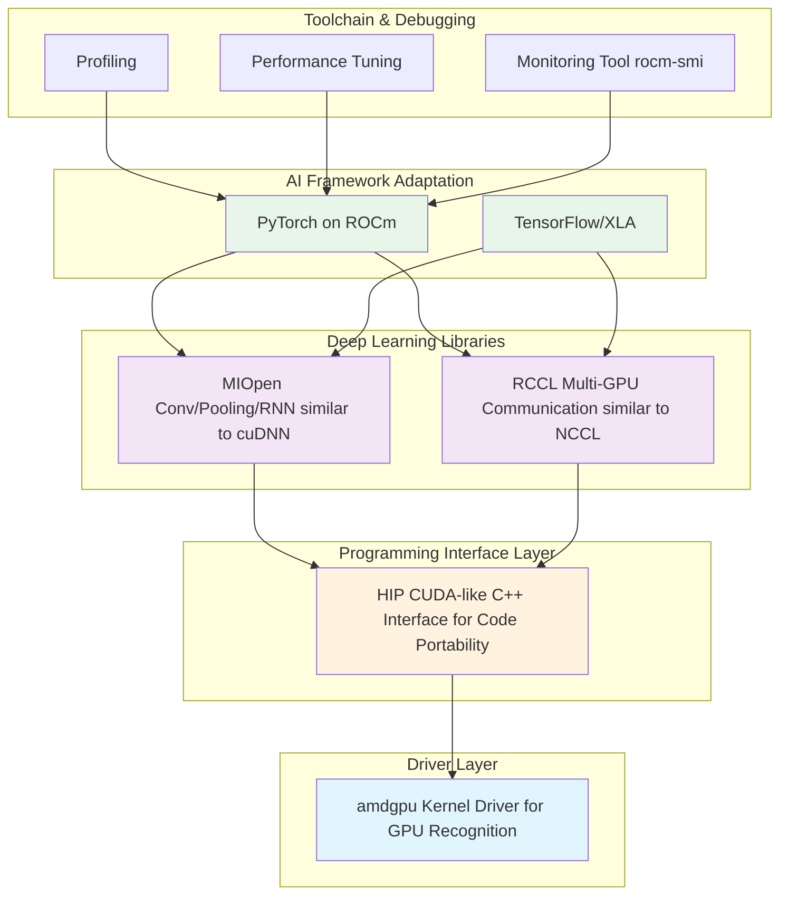

## Embracing the New Era of AMD AI Computing

<div align='center'>

[](https://rocm.docs.amd.com/)
[](https://pytorch.org/)

</div>

> **System Environment**: Ubuntu 24.04 / 22.04 · ROCm 7.2+ · PyTorch 2.9+

### Learning Objectives

This chapter aims to help you understand three things:

1. **What your AMD device can do** — A panoramic view of AI capabilities from Ryzen AI local NPU, to Radeon discrete GPUs and Instinct accelerators
2. **What ROCm is** — Why it's an AI "infrastructure" rather than just a "driver"
3. **Hands-on practice** — Running ResNet training and Qwen 2.5 large model inference with PyTorch on AMD platforms

---

## 1.1 What Can Your AMD GPU Do?

> In the past, talking about AI was almost synonymous with "NVIDIA + CUDA." This landscape has now been disrupted — AMD has formed a complete AI product line from low-power AI PCs, to desktop/workstation GPUs, to data center accelerators, all unified under the ROCm software stack.

### 1.1.1 Panoramic View: From AI PC to Discrete GPUs

AMD's AI hardware can be roughly divided into three tiers:

#### 1) AI PC: Ryzen AI (NPU + GPU)

Taking the 2026 **Ryzen AI 400 series** as an example, NPU compute power can reach up to **60 TOPS**, meeting or even exceeding Microsoft's Copilot+ PC requirement of 40 TOPS[1][2].

A typical Ryzen AI 400 chip internally contains:

| Component | Function | Typical Applications |
| :--- | :--- | :--- |
| **Zen 5 CPU Cores** | General-purpose computing, data preprocessing | Data preprocessing, logic control |
| **RDNA 3.5/4 Integrated GPU** | Medium-scale model training, small model inference | 7B-level inference, LoRA fine-tuning, image/video generation |
| **XDNA 2 NPU** | Efficient local AI inference tasks | Speech recognition, real-time translation, Copilot+ features |

---

#### 2) Desktop/Workstation: Radeon RX / Radeon Pro

For most developers, an accessible choice is the **Radeon RX 7000 / 9000 series (RDNA 3 / RDNA 4)**:

| Type | Representative Models | Features |
| :--- | :--- | :--- |
| **Gaming Cards** | Radeon RX 7700, RX 9070, etc. | Great value, suitable for developers and individual users |
| **Professional Cards** | Radeon AI PRO / Radeon Pro W series | More VRAM, better stability, suitable for professional work |

**RDNA 4 AI Acceleration Highlights**[3]:

- 2 AI accelerators integrated per Compute Unit
- AI compute performance improved by over 4x (compared to previous-gen RDNA 3)
- Thousand-TOPS-class operations (some 9000 series cards, with 16GB+ VRAM)

**Typical Desktop/Workstation Use Cases**:

- Local Stable Diffusion / ComfyUI full pipeline
- Medium-scale (7B–14B) LLM inference and LoRA fine-tuning
- Image classification, detection, and segmentation training tasks

---

#### 3) Data Center: Instinct MI Series

If you're doing large-scale training or deploying 70B or even 400B-level models, AMD's **Instinct MI300X / MI350X / MI355X** series is the primary hardware[4][5]:

**Instinct Series Core Advantages**:

| Feature | Description | Application Value |
| :--- | :--- | :--- |
| **Massive VRAM** | Up to **192GB HBM** high-bandwidth memory | Supports ultra-long context large models (e.g., Qwen3-Coder-Next 80B) |
| **Advanced Precision** | Supports **FP8 precision, 256k context length** | Meets the needs of latest code models and multimodal models[5] |
| **Deep Optimization** | ROCm 7 has operator-level optimizations for Llama 3.x, GLM, DeepSeek, etc. | Significantly improves training and inference throughput[4] |

**Use Cases**:

- Large model training (70B+)
- Multi-GPU / multi-node inference clusters
- Enterprise AI service platforms

---

### 1.1.2 ROCm Ecosystem Status: It's More Than Just a "Driver"

> Many people think "installing ROCm is just installing a driver," but ROCm is more like a complete **open-source AI computing platform**, similar to the "CUDA ecosystem" but the AMD version.

#### What is ROCm?

ROCm (Radeon Open Compute) mainly consists of several layers:



**In one sentence**: **ROCm = AMD's version of the CUDA ecosystem + even more open**

#### Key Points of ROCm 7.2

Based on 2026 official information and media reports[1][4][6], ROCm 7.2 has several important changes for developers:

| # | Feature | Description |
| :--- | :--- | :--- |
| **1** | **Dual-platform Official Support** | Windows (Adrenalin 26.1.1) + Linux (Ubuntu, etc.) one-click installation |
| **2** | **Extended Consumer Support** | No longer limited to data centers, now officially supports Radeon RX 7000/9000 + Ryzen AI 300/400 |
| **3** | **Deep Optimization for PyTorch** | Kernel-level optimization for Llama, GLM, DeepSeek, and other models — "install and use" |
| **4** | **Deep Integration with Ubuntu** | Native support starting from Ubuntu 26.04 LTS, providing a long-term stable AI environment[7] |

---

## 1.2 PyTorch on ROCm: Seamless Integration

This section focuses on three core questions:

| Question | Description |
| :--- | :--- |
| **How to install?** | Version selection behind pip install (stable / Nightly / Windows) |
| **Is it really compatible?** | Why `torch.cuda.is_available()` returns True on AMD |
| **What can it run?** | Hands-on: ResNet Training Demo + Qwen 2.5 Inference Demo |

---

### 1.2.1 Installation: The Secrets Behind pip install (Official / Nightly Selection)

#### Version Tier Overview

PyTorch on ROCm packages can generally be divided into three tiers:

#### 1. Stable Release — AMD Official Recommendation

> AMD recommends using **repo.radeon.com** ROCm WHL files, rather than the PyTorch.org versions (which are not fully tested by AMD).

**Prerequisites** [8]:

- Python 3.12 environment
- Ubuntu 24.04 / 22.04

**Step 1: Update pip**

```bash
# Install pip (if not already installed)
sudo apt install python3-pip -y

# Update pip and wheel
pip3 install --upgrade pip wheel
```

**Step 2: Download and Install PyTorch for ROCm**

Ubuntu 22.04 example:

```bash
# Download WHL files
wget https://repo.radeon.com/rocm/manylinux/rocm-rel-7.2/torch-2.9.1%2Brocm7.2.0.lw.git7e1940d4-cp312-cp312-linux_x86_64.whl
wget https://repo.radeon.com/rocm/manylinux/rocm-rel-7.2/torchvision-0.24.0%2Brocm7.2.0.gitb919bd0c-cp312-cp312-linux_x86_64.whl
wget https://repo.radeon.com/rocm/manylinux/rocm-rel-7.2/triton-3.5.1%2Brocm7.2.0.gita272dfa8-cp312-cp312-linux_x86_64.whl
wget https://repo.radeon.com/rocm/manylinux/rocm-rel-7.2/torchaudio-2.9.0%2Brocm7.2.0.gite3c6ee2b-cp312-cp312-linux_x86_64.whl

# Uninstall old versions (if they exist)
pip3 uninstall torch torchvision triton torchaudio

# Install new versions
pip3 install torch-2.9.1+rocm7.2.0.lw.git7e1940d4-cp312-cp312-linux_x86_64.whl \
  torchvision-0.24.0+rocm7.2.0.gitb919bd0c-cp312-cp312-linux_x86_64.whl \
  torchaudio-2.9.0+rocm7.2.0.gite3c6ee2b-cp312-cp312-linux_x86_64.whl \
  triton-3.5.1+rocm7.2.0.gita272dfa8-cp312-cp312-linux_x86_64.whl
```

> **Note**: When installing in a non-virtual Python 3.12 environment, you must add the `--break-system-packages` flag.

**Step 3: Verify Installation**

```bash
# Verify PyTorch is correctly installed
python3 -c 'import torch' 2> /dev/null && echo 'Success' || echo 'Failure'

# Verify GPU is available
python3 -c 'import torch; print(torch.cuda.is_available())'

# Display GPU device name
python3 -c "import torch; print(f'device name [0]:', torch.cuda.get_device_name(0))"

# Display full PyTorch environment info
python3 -m torch.utils.collect_env
```

**Expected Output**:

```
Success
True
device name [0]: AMD Radeon 8060S  # or other supported AMD GPU
```

> **Use Case**: Production environments and daily training (AMD official recommendation)

---

#### 2. Docker Installation (Optional)

Using Docker provides better portability and pre-built container environments.

**Install Docker**:

```bash
sudo apt install docker.io
```

**Pull and Run the PyTorch Docker Image** (Ubuntu 24.04):

```bash
# Pull image
sudo docker pull rocm/pytorch:rocm7.2_ubuntu24.04_py3.12_pytorch_release_2.9.1

# Start container
sudo docker run -it \
  --cap-add=SYS_PTRACE \
  --security-opt seccomp=unconfined \
  --device=/dev/kfd \
  --device=/dev/dri \
  --group-add video \
  --ipc=host \
  --shm-size 8G \
  rocm/pytorch:rocm7.2_ubuntu24.04_py3.12_pytorch_release_2.9.1
```

> You can use the `-v` flag to mount a host data directory into the container.

---

#### 3. Windows-Specific ROCm SDK Wheels

For PyTorch on Windows + ROCm 7.2, AMD officially provides complete wheel links[9]:

- First install the ROCm SDK components (Python 3.12 environment);
- Then install the torch/torchvision/torchaudio wheels with the `+rocmsdk20260116` tag.

Typical command (CMD example):

```bat
pip install --no-cache-dir ^
  https://repo.radeon.com/rocm/windows/rocm-rel-7.2/torch-2.9.1%2Brocmsdk20260116-cp312-cp312-win_amd64.whl ^
  https://repo.radeon.com/rocm/windows/rocm-rel-7.2/torchaudio-2.9.1%2Brocmsdk20260116-cp312-cp312-win_amd64.whl ^
  https://repo.radeon.com/rocm/windows/rocm-rel-7.2/torchvision-0.24.1%2Brocmsdk20260116-cp312-cp312-win_amd64.whl
```

---

#### How to Choose an Installation Method?

| Your Needs | Recommended Approach | Description |
| :--- | :--- | :--- |
| **Stability (Linux)** | **repo.radeon.com WHL files** | AMD official recommendation, fully tested |
| **Quick Deployment** | **Docker image** | Pre-built environment, ready to use, cross-platform |
| **New Hardware Early Access** | **Nightly ROCm wheels** | New hardware support + new features, occasional rough edges |
| **Windows Users** | **AMD Official ROCm SDK** | Windows + Radeon + Ryzen AI environment |

---

### 1.2.2 Compatibility Revealed: `torch.cuda.is_available()` Returns True on AMD?

Many people are surprised when they first install PyTorch on an AMD GPU and find that `torch.cuda.is_available()` returns **True**. This is not a bug — it's a **compatibility design**.

```python
import torch
print(torch.cuda.is_available())
print(torch.cuda.get_device_name(0))
print(torch.version.hip)
```

**Results**:

- `torch.cuda.is_available()` surprisingly returns **True**;
- `torch.cuda.get_device_name(0)` displays **Radeon RX 9070 XT**, **Radeon PRO W7900**, or **Instinct MI300X**, etc.;
- `torch.version.hip` shows something like `7.2.26015-fc0010cf6a`.

> **Why does torch.cuda return True on AMD?**
>
> - The PyTorch ecosystem (Hugging Face, etc.) relies on `torch.cuda.*` APIs to detect GPUs
> - For compatibility, the ROCm backend reuses the `cuda` namespace
> - Under the hood, it actually runs **HIP/ROCm** — no code modifications needed

**Conclusion**: On AMD platforms:

- `torch.cuda.*` means "GPU acceleration is available, backed by ROCm/HIP"
- `torch.version.rocm` is where you actually check the ROCm version

---

### 1.2.3 Hands-on 1: ResNet Image Classification Training Demo

> **Goal**: Below is a **ResNet18 + CIFAR10** training demo that runs directly on AMD GPUs. The code logic is adapted from AMD's official ROCm blog example[10], slightly simplified and annotated.

#### Environment Preparation

Ensure you have the following in your current Python environment:

- PyTorch with ROCm support installed
- The following dependencies installed:

```bash
pip install torchvision datasets matplotlib
```

#### Complete Training Script

```python
# file: code/resnet_cifar10_amd.py
import random
import datetime
import torch
import torchvision
from datasets import load_dataset
import matplotlib.pyplot as plt


def get_dataloaders(batch_size=256):
    dataset = load_dataset("cifar10")
    dataset.set_format("torch")

    train_loader = torch.utils.data.DataLoader(
        dataset["train"], shuffle=True, batch_size=batch_size
    )
    test_loader = torch.utils.data.DataLoader(
        dataset["test"], batch_size=batch_size
    )
    return train_loader, test_loader


def get_transform():
    mean = torch.tensor([0.4914, 0.4822, 0.4465]).view(1, 3, 1, 1)
    std = torch.tensor([0.2023, 0.1994, 0.2010]).view(1, 3, 1, 1)

    def transform(x):
        if x.ndim == 4 and x.shape[1] != 3:
            x = x.permute(0, 3, 1, 2)
        x = x.float() / 255.0
        x = (x - mean.to(x.device)) / std.to(x.device)
        return x

    return transform


def build_model():
    model = torchvision.models.resnet18(num_classes=10)
    loss_fn = torch.nn.CrossEntropyLoss()
    optimizer = torch.optim.Adam(model.parameters(), lr=0.01, weight_decay=1e-4)
    return model, loss_fn, optimizer


def train_model(model, loss_fn, optimizer, train_loader, test_loader, transform, num_epochs):
    print(f"Number of GPUs: {torch.cuda.device_count()}")
    print([torch.cuda.get_device_name(i) for i in range(torch.cuda.device_count())])
    device = torch.device("cuda" if torch.cuda.is_available() else "cpu")

    model.to(device)
    accuracy = []
    t0 = datetime.datetime.now()

    for epoch in range(num_epochs):
        print(f"Epoch {epoch+1}/{num_epochs}")
        t0_epoch_train = datetime.datetime.now()

        model.train()
        train_losses, n_examples = [], 0
        for batch in train_loader:
            batch = {k: v.to(device) for k, v in batch.items()}

            optimizer.zero_grad()
            preds = model(transform(batch["img"]))
            loss = loss_fn(preds, batch["label"])
            loss.backward()
            optimizer.step()

            train_losses.append(loss.detach())
            n_examples += batch["label"].shape[0]

        train_loss = torch.stack(train_losses).mean().item()
        t_epoch_train = datetime.datetime.now() - t0_epoch_train

        model.eval()
        with torch.no_grad():
            t0_epoch_test = datetime.datetime.now()
            test_losses, n_test_examples, n_test_correct = [], 0, 0
            for batch in test_loader:
                batch = {k: v.to(device) for k, v in batch.items()}

                preds = model(transform(batch["img"]))
                loss = loss_fn(preds, batch["label"])

                test_losses.append(loss)
                n_test_examples += batch["img"].shape[0]
                n_test_correct += (batch["label"] == preds.argmax(dim=1)).sum()

            test_loss = torch.stack(test_losses).mean().item()
            test_accuracy = n_test_correct / n_test_examples
            t_epoch_test = datetime.datetime.now() - t0_epoch_test
            accuracy.append(test_accuracy.cpu())

        print(f"  Epoch time: {t_epoch_train+t_epoch_test}")
        print(f"  Examples/second (train): {n_examples/t_epoch_train.total_seconds():0.4g}")
        print(f"  Examples/second (test): {n_test_examples/t_epoch_test.total_seconds():0.4g}")
        print(f"  Train loss: {train_loss:0.4g}")
        print(f"  Test loss: {test_loss:0.4g}")
        print(f"  Test accuracy: {test_accuracy*100:0.4g}%")

    total_time = datetime.datetime.now() - t0
    print(f"Total training time: {total_time}")
    return accuracy


def main():
    torch.manual_seed(0)
    random.seed(0)

    model, loss, optimizer = build_model()
    train_loader, test_loader = get_dataloaders()
    transform = get_transform()

    test_accuracy = train_model(
        model, loss, optimizer, train_loader, test_loader, transform, num_epochs=8
    )

    plt.plot(test_accuracy)
    plt.xlabel("Epoch")
    plt.ylabel("Test Accuracy")
    plt.title("ResNet18 on CIFAR10 (AMD ROCm)")
    plt.savefig("resnet_cifar10_amd.png")
    print("Training complete, accuracy curve saved as resnet_cifar10_amd.png")


if __name__ == "__main__":
    main()
```

#### How to Run

```bash
python resnet_cifar10_amd.py
```

#### Output

<div align='center'>
    
    <p><b>Figure 1.1</b> ResNet18 CIFAR10 Training Accuracy Curve</p>
</div>

<div align='center'>
    
    <p><b>Figure 1.2</b> ResNet18 CIFAR10 Training Results (AMD ROCm)</p>
</div>

---

### 1.2.4 Hands-on 2: Qwen 2.5 Model Inference Demo (vLLM + ROCm)

> **Goal**: This section demonstrates how to run Alibaba's Qwen2.5 series large model inference on AMD GPUs via **vLLM + ROCm 7**.
>
> **Note**: This example uses Qwen2.5-7B-Instruct, suitable for both desktop Radeon and data center Instinct series GPUs.

#### Step 1: Start vLLM Environment with Docker

Using Docker provides a quick pre-configured vLLM + ROCm environment:

```bash
docker run -it \
  --network=host \
  --device=/dev/kfd \
  --device=/dev/dri \
  --group-add=video \
  --ipc=host \
  --cap-add=SYS_PTRACE \
  --security-opt seccomp=unconfined \
  --shm-size 8G \
  -v $(pwd):/workspace \
  --name vllm \
  rocm/vllm-dev:rocm7.2_navi_ubuntu24.04_py3.12_pytorch_2.9_vllm_0.14.0rc0
```

**Parameter Description**:

| Parameter | Description |
| :--- | :--- |
| `--network=host` | Use host network for easy service access |
| `--device=/dev/kfd --device=/dev/dri` | Mount GPU devices |
| `--group-add=video` | Add to video group for GPU access |
| `--ipc=host --shm-size 8G` | Shared memory configuration for multi-process communication |
| `-v $(pwd):/workspace` | Mount current directory to container's /workspace |

---

#### Step 2: Environment Preparation

After entering the container, install base libraries:

```bash
pip install transformers accelerate
```

---

#### Step 3: Download Model (Using ModelScope)

Install ModelScope:

```bash
pip install modelscope
```

Enter `python` in the terminal to start interactive mode:

```python
from modelscope import snapshot_download

# Download to current directory
model_dir = snapshot_download('Qwen/Qwen2.5-7B-Instruct', cache_dir='./')
print(f"Model downloaded to: {model_dir}")
```

Example output:

```
Model downloaded to: ./Qwen/Qwen2___5-7B-Instruct
```

---

#### Step 4: Start vLLM Inference Service

```bash
python -m vllm.entrypoints.openai.api_server \
  --model ./Qwen/Qwen2___5-7B-Instruct \
  --host 0.0.0.0 \
  --port 3000 \
  --dtype float16 \
  --gpu-memory-utilization 0.9 \
  --swap-space 16 \
  --disable-log-requests \
  --tensor-parallel-size 1 \
  --max-num-seqs 64 \
  --max-num-batched-tokens 32768 \
  --max-model-len 32768 \
  --distributed-executor-backend mp
```

**Parameter Description**:

| Parameter | Description |
| :--- | :--- |
| `--model` | Model path |
| `--dtype float16` | Use half-precision floating point |
| `--gpu-memory-utilization 0.9` | GPU VRAM utilization |
| `--swap-space 16` | Swap space size (GB) |
| `--max-model-len 32768` | Maximum context length |

---

#### Step 5: Test the Inference Service

Send a request with curl:

```bash
curl -s http://127.0.0.1:3000/v1/chat/completions \
  -H "Content-Type: application/json" \
  -d '{
    "model": "./Qwen/Qwen2___5-7B-Instruct",
    "messages": [
      {"role": "system", "content": "You are a helpful assistant."},
      {"role": "user", "content": "Introduce Qwen2.5-7B-Instruct in one sentence."}
    ],
    "temperature": 0.7,
    "max_tokens": 256
  }' | jq .
```

#### Expected Results

If everything works correctly, you'll receive a JSON response containing the answer generated by the Qwen2.5 model:

<div align='center'>
    
    <p><b>Figure 1.3</b> Qwen2.5-7B-Instruct vLLM Inference Result</p>
</div>

---

### 1.2.5 Hands-on 3: Qwen 2.5 Native PyTorch Inference

> **Goal**: This section demonstrates how to run Qwen2.5 model inference on AMD GPUs directly using **PyTorch + Transformers**, without relying on inference frameworks like vLLM.
>
> **Use Case**: Scenarios that require more flexible control, research into model internals, or simple single-GPU inference.

#### Step 1: Environment Preparation

Ensure the necessary dependencies are installed:

```bash
pip install torch transformers accelerate
```

---

#### Step 2: Create Inference Script

Create file `qwen_pytorch_inference.py`:

```python
# file: code/qwen_pytorch_inference.py
import torch
import time
from transformers import AutoModelForCausalLM, AutoTokenizer

# Model path
MODEL_PATH = "./Qwen/Qwen2___5-7B-Instruct"
DEVICE = "cuda:0"


def run_inference():
    print(f"=== AMD ROCm PyTorch Inference Test ===")

    if torch.cuda.is_available():
        props = torch.cuda.get_device_properties(0)
        print(f"Using device: {torch.cuda.get_device_name(0)} ({props.total_memory / 1024**3:.1f} GB)")
    else:
        print("[Warning] No ROCm/CUDA device detected, will run on CPU (extremely slow)")

    print("\n[1/3] Loading Tokenizer...")
    try:
        tokenizer = AutoTokenizer.from_pretrained(MODEL_PATH, local_files_only=True, trust_remote_code=True)
    except Exception as e:
        print(f"[Error] Tokenizer loading failed: {e}")
        return

    print("\n[2/3] Loading model weights (BFloat16)...")
    st = time.time()
    try:
        model = AutoModelForCausalLM.from_pretrained(
            MODEL_PATH,
            torch_dtype=torch.bfloat16,
            device_map=DEVICE,
            trust_remote_code=True,
        )
    except Exception as e:
        print(f"[Fatal Error] Model loading failed: {e}")
        print("If this is an out-of-memory error, try using a quantized model.")
        return

    print(f"Model loading time: {time.time() - st:.2f} seconds")

    prompt = "Hello, please use this high-performance GPU to write a seven-character quatrain about AMD GPU's rise."
    messages = [
        {"role": "system", "content": "You are a talented poet."},
        {"role": "user", "content": prompt}
    ]

    print("\n[3/3] Starting inference...")

    text = tokenizer.apply_chat_template(messages, tokenize=False, add_generation_prompt=True)
    model_inputs = tokenizer([text], return_tensors="pt").to(DEVICE)

    st = time.time()
    with torch.no_grad():
        generated_ids = model.generate(
            model_inputs.input_ids,
            max_new_tokens=512,
            temperature=0.7,
            top_p=0.9,
            pad_token_id=tokenizer.eos_token_id
        )
    et = time.time()

    input_len = model_inputs.input_ids.shape[1]
    output_ids = generated_ids[:, input_len:]
    response = tokenizer.batch_decode(output_ids, skip_special_tokens=True)[0]

    tokens_gen = output_ids.shape[1]
    speed = tokens_gen / (et - st)

    print("\n" + "="*20 + " Generated Result " + "="*20)
    print(response)
    print("="*50)
    print(f"Generation speed: {speed:.2f} tokens/s")
    print(f"VRAM usage: {torch.cuda.max_memory_allocated() / 1024**3:.2f} GB")


if __name__ == "__main__":
    import os
    os.environ["TORCH_ROCM_AOTRITON_ENABLE_EXPERIMENTAL"] = "1"
    run_inference()
```

---

#### Step 3: Run Inference

```bash
python qwen_pytorch_inference.py
```

#### Expected Output

<div align='center'>
    
    <p><b>Figure 1.4</b> Qwen2.5-7B-Instruct Native PyTorch Inference Result</p>
</div>

---

## References

| # | Description | Link |
| :--- | :--- | :--- |
| [1] | AMD ROCm 7.2 Officially Released: Supporting Multiple New Hardware, Optimizing Instinct AI Performance | [Link](https://so.html5.qq.com/page/real/search_news?docid=70000021_7796976caaa35752) |
| [2] | AMD Expands AI Leadership Across Client, Graphics, and ... | [Link](https://www.amd.com/en/newsroom/press-releases/2026-1-5-amd-expands-ai-leadership-across-client-graphics-.html) |
| [3] | AI Acceleration with AMD Radeon Graphics Cards | [Link](https://www.amd.com/en/products/graphics/radeon-ai.html) |
| [4] | AMD ROCm 7.2 Update Reports (IT之家 and Other Sources) | [Link](https://so.html5.qq.com/page/real/search_news?docid=70000021_9816977467427752) |
| [5] | Day 0 Support for Qwen3-Coder-Next on AMD Instinct GPUs | [Link](https://www.amd.com/en/developer/resources/technical-articles/2026/day-0-support-for-qwen3-coder-next-on-amd-instinct-gpus.html) |
| [6] | ROCm 7 Software | [Link](https://www.amd.com/zh-cn/products/software/rocm/whats-new.html) |
| [7] | Ubuntu to Natively Support AMD ROCm Software | [Link](https://so.html5.qq.com/page/real/search_news?docid=70000021_494693a705e92252) |
| [8] | Install PyTorch via PIP (Linux ROCm) | [Link](https://rocm.docs.amd.com/projects/radeon-ryzen/en/latest/docs/install/installrad/native_linux/install-pytorch.html) |
| [9] | Install PyTorch via PIP (Windows ROCm) | [Link](https://rocm.docs.amd.com/projects/radeon-ryzen/en/latest/docs/install/installrad/windows/install-pytorch.html) |
| [10] | ResNet for image classification using AMD GPUs | [Link](https://rocm.blogs.amd.com/artificial-intelligence/resnet/README.html) |
