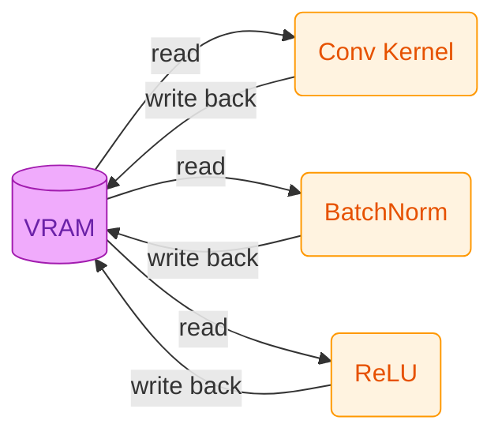
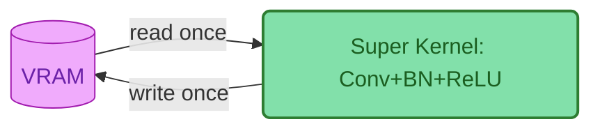

## Chapter 3: Entering the ROCm Programming World — Writing Your First HIP Operator

> **Lab Environment**
> - **Device**: AMD AI+ MAX395
> - **GPU**: Radeon 8060S
> - **Architecture**: gfx1151 (RDNA 3)
> - **ROCm Version**: 7.x
> - **OS**: Ubuntu 24.04 / 22.04

### Learning Objectives

By the end of this chapter, you will master the following core skills:

1. **HIP Language Basics & Execution Model**: Understand the division of labor between Host and Device, and fully grasp the three-level scheduling architecture of Grid, Block, and Thread along with their addressing schemes.
2. **Handwriting Kernels & Performance Profiling**: Reproduce Python's Tensor addition from low-level C++, avoiding the beginner's trap of "asynchronous execution."
3. **GPU Memory Pyramid**: Build an understanding of the hierarchy among registers, shared memory (LDS), and global memory (VRAM).
4. **Calling High-Performance Libraries**: Understand rocBLAS's memory layout and MIOpen's operator fusion magic.

In the previous chapter, we explored the GPU's hardware architecture. But in real AI development, when you write `c = a + b`, what actually happens under the hood? In this chapter, we'll strip away the Python layer and dive deep to handwrite an operator using the HIP language!

---

## 3.1 HIP Language and the GPU's "Strength in Numbers" Model

### What is HIP?

**HIP (Heterogeneous-Compute Interface for Portability)** is a C++-based heterogeneous computing programming language from AMD. Its syntax is highly similar to NVIDIA's CUDA (the only difference is the prefix changes from `cuda` to `hip`). By mastering HIP, you've essentially mastered CUDA as well.

### Illustrated: GPU's Three-Level Thread Model (Grid - Block - Thread)

To run code concurrently on the GPU, you must understand its "strength in numbers" organization. Task scheduling on the GPU is divided into three levels:

<div align='center'>
    
    <p><b>Figure 3.1</b> GPU three-level thread model: Grid contains multiple Blocks, Block contains multiple Threads</p>
</div>

| Scheduling Level | Physical Hardware | Key Characteristics |
|:---|:---|:---|
| **Grid** | Entire GPU | Contains all Blocks, representing one complete kernel invocation. |
| **Block (Thread Block)** | Single CU (Compute Unit) | Contains multiple Threads (typically up to 1024). Threads within the same Block can efficiently exchange data via **shared memory (LDS)**. |
| **Thread** | ALU (Stream Processor) | The smallest execution unit, responsible for computing one or a few data points. |

### Operator Addressing Guide: Who Am I? Where Am I?

The most painful part for beginners writing operators is: **thousands of threads run the same code simultaneously — how do I know which data the current thread should process?**
This is where HIP's built-in addressing variables come in.

<div align='center'>
    
    <p><b>Figure 3.2</b> HIP thread addressing: the meaning of blockIdx, threadIdx, and blockDim</p>
</div>

**1. One-dimensional array addressing (e.g., vector addition):**

Suppose we need to process an array of length 1000, with 256 threads per Block.

```cpp
// Formula: Global unique ID = total threads in all preceding Blocks + thread ID within current Block
int idx = hipBlockIdx_x * hipBlockDim_x + hipThreadIdx_x;
```

- `hipBlockDim_x`: How large is each Block? (256)
- `hipBlockIdx_x`: Which Block am I in? (e.g., Block 2)
- `hipThreadIdx_x`: What's my position within the current Block? (e.g., thread 10)
- *Result*: My global ID is `2 * 256 + 10 = 522`, so I process the 522nd element of the array!

**2. Two-dimensional array addressing (e.g., image processing / matrix multiplication):**

If processing a 1920x1080 image, we launch a 2D Grid with 2D Blocks.

```cpp
// Calculate the image column (x) and row (y) for the current thread
int x = hipBlockIdx_x * hipBlockDim_x + hipThreadIdx_x;
int y = hipBlockIdx_y * hipBlockDim_y + hipThreadIdx_y;

// Flatten 2D coordinates to a 1D array index (assuming image width is 'width')
int idx = y * width + x;
```

---

## 3.2 Unveiling Tensor Addition: Writing Your First Kernel

When PyTorch processes a tensor addition of 10 million elements, the GPU launches 10 million threads. Below is the standard C++ low-level implementation, including proper error checking (`HIP_CHECK`) and nanosecond-level performance profiling with `hipEvent`.

### Complete Hands-On: `vector_add.cpp` with Timer

```cpp
#include <hip/hip_runtime.h>
#include <iostream>
#include <vector>

// Macro: catch low-level API errors (industry standard)
#define HIP_CHECK(command) {               \
    hipError_t status = command;           \
    if (status != hipSuccess) {            \
        std::cerr << "HIP Error: " << hipGetErrorString(status) \
                  << " at line " << __LINE__ << std::endl;      \
        exit(1);                           \
    }                                      \
}

// Kernel function: vector addition
__global__ void vectorAdd(const float* a, const float* b, float* c, int n) {
    // Using the 1D addressing formula we just learned
    int id = hipBlockDim_x * hipBlockIdx_x + hipThreadIdx_x;

    // Bounds protection: prevent out-of-bounds access from extra threads in the last Block
    if (id < n) {
        c[id] = a[id] + b[id]; // Each thread handles only one element's addition!
    }
}

int main() {
    int n = 10000000; // 10 million elements
    size_t bytes = n * sizeof(float);

    // 1. Host-side memory allocation and initialization
    std::vector<float> h_a(n, 1.0f);
    std::vector<float> h_b(n, 2.0f);
    std::vector<float> h_c(n, 0.0f);

    // 2. Device-side VRAM allocation
    float *d_a, *d_b, *d_c;
    HIP_CHECK(hipMalloc(&d_a, bytes));
    HIP_CHECK(hipMalloc(&d_b, bytes));
    HIP_CHECK(hipMalloc(&d_c, bytes));

    // Create event timers
    hipEvent_t start, stop;
    hipEventCreate(&start); hipEventCreate(&stop);

    // 3. Data transfer: CPU -> GPU (record time)
    hipEventRecord(start);
    HIP_CHECK(hipMemcpy(d_a, h_a.data(), bytes, hipMemcpyHostToDevice));
    HIP_CHECK(hipMemcpy(d_b, h_b.data(), bytes, hipMemcpyHostToDevice));
    hipEventRecord(stop);
    hipEventSynchronize(stop);
    float ms_memcpy_h2d;
    hipEventElapsedTime(&ms_memcpy_h2d, start, stop);

    // 4. Execute kernel computation
    int threadsPerBlock = 256;
    // Round up to calculate needed Block count
    int blocksPerGrid = (n + threadsPerBlock - 1) / threadsPerBlock;

    hipEventRecord(start);
    // Launch kernel: <<<Grid, Block>>>
    hipLaunchKernelGGL(vectorAdd, dim3(blocksPerGrid), dim3(threadsPerBlock), 0, 0, d_a, d_b, d_c, n);
    hipEventRecord(stop);
    hipEventSynchronize(stop); // Wait for GPU timing to finish
    float ms_kernel;
    hipEventElapsedTime(&ms_kernel, start, stop);

    // 5. Data transfer: GPU -> CPU
    HIP_CHECK(hipMemcpy(h_c.data(), d_c, bytes, hipMemcpyDeviceToHost));

    // Print performance data
    std::cout << "Verification: c[0] = " << h_c[0] << " (expected: 3.0)" << std::endl;
    std::cout << "[Timing] H2D Transfer (PCIe): " << ms_memcpy_h2d << " ms" << std::endl;
    std::cout << "[Timing] Kernel Compute (VRAM): " << ms_kernel << " ms" << std::endl;

    // 6. Free VRAM
    hipFree(d_a); hipFree(d_b); hipFree(d_c);
    return 0;
}
```

### Compilation & Runtime Analysis: Exploring Low-Level Performance Secrets

Compile and run with `hipcc`:

```bash
hipcc vector_add.cpp -o vector_add -O3
./vector_add
```

**Actual Output**:

```text
Verification: c[0] = 3 (expected: 3.0)
[Timing] H2D Transfer (PCIe): 7.77195 ms
[Timing] Kernel Compute (VRAM): 1.5428 ms
```

<div style="background: #fff3e0; border: 1px solid #ff9800; border-radius: 8px; padding: 16px; margin: 16px 0;">
  <div style="display: flex; align-items: start;">
    <span style="font-size: 20px; margin-right: 10px;">⚠️</span>
    <div>
      <strong style="color: #ef6c00;">Beginner's Trap: The CPU Doesn't Wait for the GPU (Asynchronous Mechanism)</strong><br>
      <span style="color: #ef6c00; line-height: 1.6;">
        When you call <code>hipLaunchKernelGGL</code>, the CPU tosses the task to the GPU and then <strong>immediately executes the next line of code</strong> — it will never wait in place for the GPU to finish!<br>
        If you try to print host-side results right after launching the kernel, you'll only get <code>0.0</code> because the GPU hasn't finished computing yet. <strong>Solution</strong>: Use <code>hipDeviceSynchronize()</code> to force the CPU to block until the GPU has completed all previously submitted tasks. Make sure to remember this concept — it's the first pitfall 90% of newcomers encounter when debugging!
      </span>
    </div>
  </div>
</div>

<div style="background: #e3f2fd; border: 1px solid #2196f3; border-radius: 8px; padding: 16px; margin: 16px 0;">
  <div style="display: flex; align-items: start;">
    <span style="font-size: 20px; margin-right: 10px;">🔍</span>
    <div>
      <strong style="color: #1565c0;">Deep Dive: Why Does PyTorch Sometimes Stutter?</strong><br>
      <span style="color: #1565c0; line-height: 1.6;">
        Looking at the output above, you'll notice that data transfer (H2D) takes <strong>5x longer</strong> than the pure kernel computation!<br>
        This is because PCIe bus bandwidth tops out at tens of GB/s, while internal GPU VRAM bandwidth reaches hundreds or even thousands of GB/s. This is why in deep learning training loops, you must <strong>never frequently call <code>.cpu()</code> or <code>tensor.item()</code></strong> — doing so forces the GPU to stall and wait for the extremely slow data transfer bus.
      </span>
    </div>
  </div>
</div>

---

## 3.3 The Inner Art of Operator Optimization: GPU Memory Pyramid

Why is your handwritten GPU code still slow? Because **where data is stored determines how fast computation runs**. To write high-performance operators, you must understand the GPU's "memory pyramid."

<div align='center'>
    
    <p><b>Figure 3.3</b> GPU memory pyramid: from ultra-fast registers to slow system memory, speed differences span thousands of times</p>
</div>

| Memory Type | HIP Declaration | Access Latency | Scope & Characteristics | Analogy |
|:---|:---|:---|:---|:---|
| **Register** | `float val = 1.0;` | Ultra-fast (~1 cycle) | **Thread-private**. Requesting too many variables causes "register spill," tanking performance. | A brick in the worker's hands |
| **LDS (Shared Memory)** | `__shared__ float s[];` | Fast (~20 cycles) | **Shared within Block**. Threads in the same Block use it to exchange data — the **ultimate weapon** of operator optimization. | A hand cart at the work site |
| **VRAM (Global Memory)** | `hipMalloc` | Slow (~200 cycles) | **Globally visible**. Large capacity (e.g., 64 GB) but limited bandwidth. Optimization focus: minimize VRAM access count. | A distant building materials warehouse |
| **Host RAM (System Memory)** | `malloc` | Very slow (PCIe bottleneck) | CPU's memory. GPU must cross a "toll booth" (PCIe) to access it — avoid at all costs. | A factory in the next city |

**The Golden Rule of Optimization:** Read data from VRAM into LDS once, then let threads compute back and forth in LDS and registers hundreds or thousands of times, and finally write back to VRAM. This is the secret behind how **matrix multiplication (GEMM)** achieves hundreds of TFLOPS!

---

## 3.4 ROCm Core Ecosystem Libraries

Since squeezing every last drop out of LDS and registers requires writing hundreds or thousands of lines of low-level tiling and assembly code, real-world development relies heavily on ROCm's official ecosystem libraries.

### rocBLAS in Practice: Complete SGEMM Program

`rocBLAS` handles low-level linear algebra acceleration. Before using it, you must understand BLAS's **column-major** storage pitfall:

```text
C++/Python default (Row-Major): | rocBLAS requires (Column-Major):
[ 1, 2 ] => memory: [1, 2, 3, 4] | [ 1, 2 ] => memory: [1, 3, 2, 4]
[ 3, 4 ]                         | [ 3, 4 ]
```

**Hands-on code (SGEMM with data initialization):**

```cpp
#include <hip/hip_runtime.h>
#include <rocblas/rocblas.h>
#include <iostream>
#include <vector>

int main() {
    rocblas_int m = 1024, n = 1024, k = 1024;
    float alpha = 1.0f, beta = 0.0f;
    size_t size = m * n * sizeof(float);

    // 1. Host-side initialization
    std::vector<float> h_A(m * k, 1.0f);
    std::vector<float> h_B(k * n, 2.0f);
    std::vector<float> h_C(m * n, 0.0f);

    // 2. Device-side VRAM allocation and copy
    float *d_A, *d_B, *d_C;
    hipMalloc(&d_A, size); hipMalloc(&d_B, size); hipMalloc(&d_C, size);
    hipMemcpy(d_A, h_A.data(), size, hipMemcpyHostToDevice);
    hipMemcpy(d_B, h_B.data(), size, hipMemcpyHostToDevice);

    // 3. Initialize rocBLAS handle (Handle manages context and resources)
    rocblas_handle handle;
    rocblas_create_handle(&handle);

    // 4. Call highly optimized matrix multiplication (C = alpha*A*B + beta*C)
    rocblas_sgemm(handle, rocblas_operation_none, rocblas_operation_none,
                  m, n, k, &alpha,
                  d_A, m, d_B, k, &beta, d_C, m);

    // 5. Copy back results and print top-left 4x4
    hipMemcpy(h_C.data(), d_C, size, hipMemcpyDeviceToHost);

    std::cout << "=== Top-left 4x4 of result matrix C ===\n";
    for(int i=0; i<4; i++) {
        for(int j=0; j<4; j++) {
            // Column-major addressing: index = i + j * m
            std::cout << h_C[i + j * m] << "\t";
        }
        std::cout << "\n";
    }

    rocblas_destroy_handle(handle);
    hipFree(d_A); hipFree(d_B); hipFree(d_C);
    return 0;
}
```

Compile and run with `hipcc`:

```bash
hipcc sgemm_test.cpp -o sgemm_test -lrocblas
./sgemm_test
```

**Actual Output**:

```text
=== Top-left 4x4 of result matrix C ===
2048	2048	2048	2048
2048	2048	2048	2048
2048	2048	2048	2048
2048	2048	2048	2048
```

### MIOpen Introduction: The Magic of Kernel Fusion

MIOpen is ROCm's deep learning acceleration engine (counterpart to NVIDIA's cuDNN). When you call `nn.Conv2d` in PyTorch, MIOpen works its **kernel fusion** magic behind the scenes.

In the traditional approach, executing `Conv2D -> BatchNorm -> ReLU` repeatedly reads from and writes to VRAM, causing severe memory bandwidth waste (constantly going back and forth to the "distant warehouse"):



**MIOpen's fusion magic** merges these three steps into one massive super-kernel. Data completes the convolution, normalization, and activation pipeline directly within the GPU's registers, completely eliminating frequent dependency on slow VRAM:



---

## Chapter Code

Complete source code for this chapter is located in the `code/` directory:

| File | Description | Compile Command |
|:---|:---|:---|
| `src/infra/handwrite-rocm-operator/code/vector_add.cpp` | Vector addition kernel with timer | `hipcc src/infra/handwrite-rocm-operator/code/vector_add.cpp -o vector_add -O3` |
| `src/infra/handwrite-rocm-operator/code/sgemm_test.cpp` | rocBLAS SGEMM matrix multiplication | `hipcc src/infra/handwrite-rocm-operator/code/sgemm_test.cpp -o sgemm_test -lrocblas` |

---

## Chapter Summary

Through this chapter's low-level exploration, you've mastered the following:

| Key Takeaway | Summary |
|:---|:---|
| **Execution Model** | Mastered the Grid-Block-Thread three-level scheduling, learned 1D and 2D addressing with `blockIdx` and `threadIdx`. |
| **HIP Programming** | Successfully wrote vector addition, learned about `hipDeviceSynchronize()` to avoid async pitfalls, and verified PCIe bandwidth constraints on AI computation. |
| **Memory Hierarchy** | Built intuitive understanding of Register, LDS, VRAM, and Host RAM access speeds. |
| **Low-Level Libraries** | Learned about `rocBLAS`'s column-major pitfall and `MIOpen`'s impressive kernel fusion technology. |
