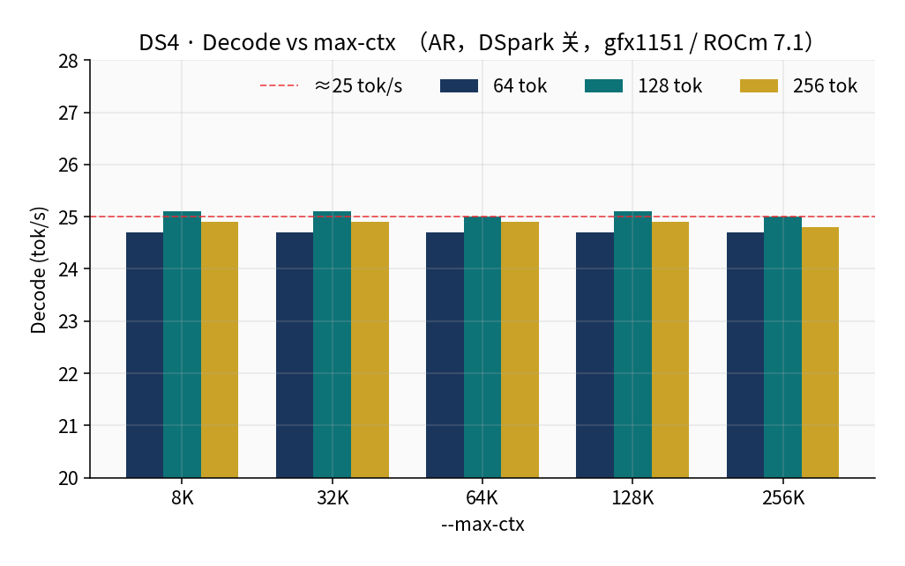
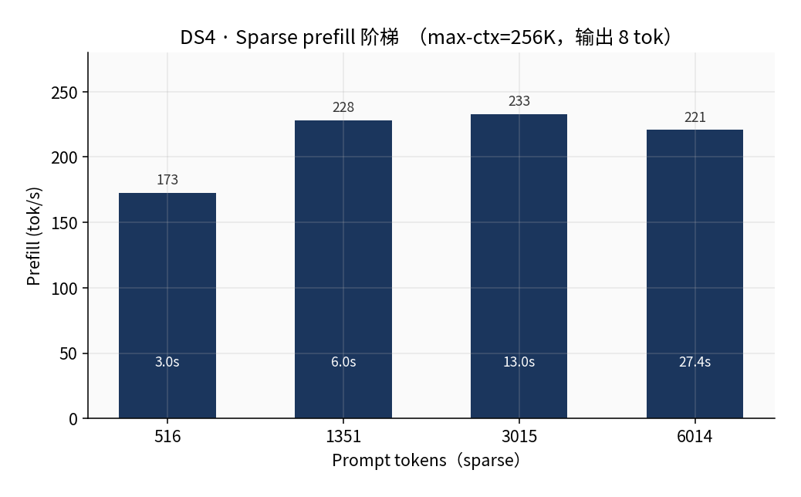
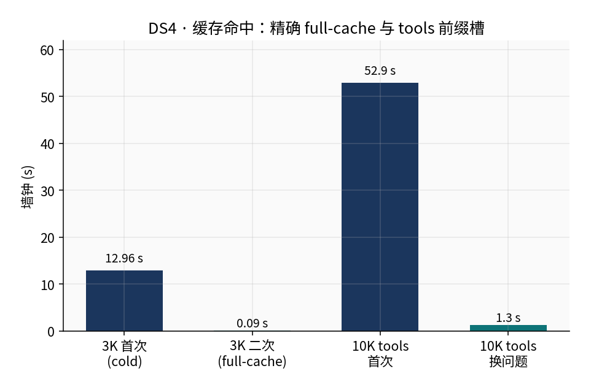
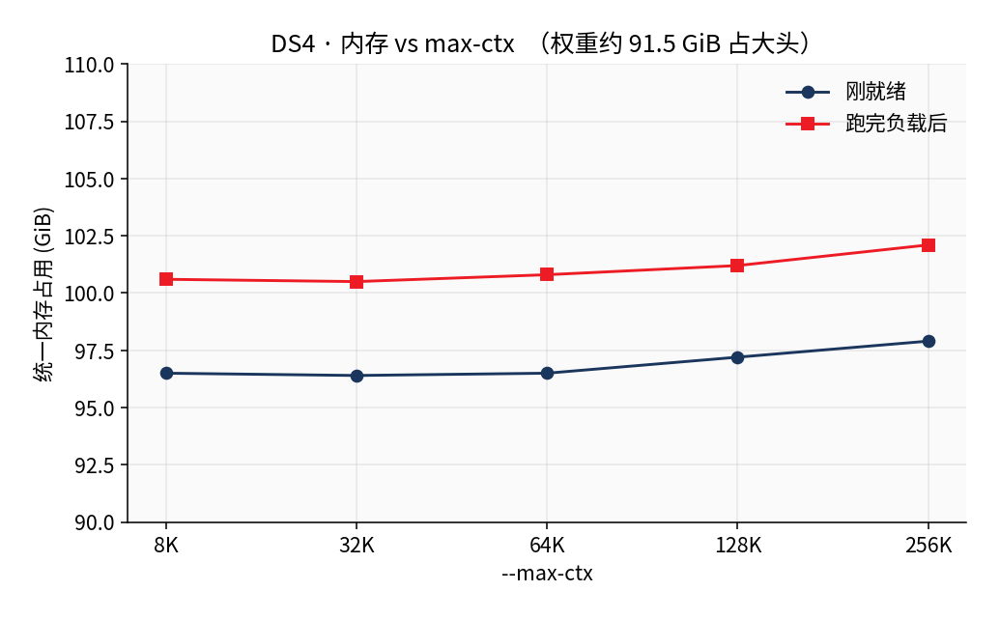

# ⚡ DeepSeek-V4-Flash — Native HIP on Strix Halo

<div align='center'>

[](https://rocm.docs.amd.com/)
[](https://www.amd.com/en/products/processors/laptop/ryzen-ai-300.html)
[](https://github.com/Luce-Org/lucebox)

</div>

This page shows how to serve **DeepSeek-V4-Flash** (DS4) on an **AMD Ryzen AI MAX+ 395 (Radeon 8060S, `gfx1151`) with 128 GB unified memory**, using [Luce-Org/lucebox](https://github.com/Luce-Org/lucebox) `dflash_server` and an OpenAI-compatible API.

> Prerequisite: finish the [ROCm environment setup](/00-environment/). Measured on **Ubuntu 24.04 + ROCm 7.1.0**, GPU perf level `high` (sclk 2900 MHz).  
> This is not a vLLM / stock llama.cpp / LM Studio guide. The ROCmFPX checkpoint and sparse prefill need lucebox's HIP backend.

---

### Model

DeepSeek-V4-Flash is a MoE model (43 layers, MLA, 256 routed experts). On Strix Halo the usual checkpoint is Lucebox **ROCmFPX MIX-STRIX** (~**91.5 GiB**), plus an optional ~10 GiB DSpark draft.

| Item | Value |
|:---|:---|
| Weights | `DeepSeek-V4-Flash-0731-ROCMFPX-MIX-STRIX.gguf` from [Lucebox/DeepSeek-V4-Flash-0731-ROCmFP3](https://huggingface.co/Lucebox/DeepSeek-V4-Flash-0731-ROCmFP3) |
| Draft (optional) | [Lucebox/DeepSeek-V4-Flash-0731-DSpark-GGUF](https://huggingface.co/Lucebox/DeepSeek-V4-Flash-0731-DSpark-GGUF) |
| Runtime | lucebox `dflash_server`, HIP / `gfx1151`. Do **not** set `HSA_OVERRIDE_GFX_VERSION` |
| Context | up to 262144; 8K→256K decode stayed flat on this machine |
| Upstream write-up | [DeepSeek V4 Flash on Strix Halo](https://www.lucebox.com/blog/deepseek-v4-strix-halo) |

**Memory floor:** plan for **≥ 120 GiB** unified memory. Resident use is about 97–103 GiB. It cannot share the machine with [Qwen3.8-Flash-CIRU](./qwen3.8.md).

---

### 1. Check hardware and ROCm

```bash
amd-smi
rocminfo | grep -A2 -E 'Name:|Marketing Name|gfx1151'
```

You should see something like:

```
MARKET_NAME: Radeon 8060S Graphics
TARGET_GRAPHICS_VERSION: gfx1151
```

Optional clocks (needs sudo; part of the official 32 tok/s recipe):

```bash
echo performance | sudo tee /sys/firmware/acpi/platform_profile
sudo rocm-smi -d 0 --setperflevel high
```

Confirm `/opt/rocm/lib/llvm/bin/clang++` exists and `HSA_OVERRIDE_GFX_VERSION` is unset (forcing `11.0.0` picks the wrong Tensile library; sparse / DSpark often abort).

---

### 2. Build dflash_server

```bash
mkdir -p ~/rocm-llm && cd ~/rocm-llm
sudo apt-get install -y cmake ninja-build git
# or: python3 -m pip install --user ninja

git clone --depth 1 --recurse-submodules https://github.com/Luce-Org/lucebox.git
cd lucebox

export ROCM_PATH=/opt/rocm
export HIP_PATH=/opt/rocm
export PATH="/opt/rocm/bin:$PATH"
unset HSA_OVERRIDE_GFX_VERSION

cmake -S server -B server/build-hip -G Ninja \
  -DCMAKE_BUILD_TYPE=Release \
  -DCMAKE_HIP_COMPILER=/opt/rocm/lib/llvm/bin/clang++ \
  -DDFLASH27B_GPU_BACKEND=hip \
  -DDFLASH27B_HIP_ARCHITECTURES=gfx1151 \
  -DDFLASH27B_HIP_SM80_EQUIV=ON \
  -DCMAKE_HIP_FLAGS=-DDFLASH_WAVE_SIZE=32 \
  -DGGML_HIP_MMQ_MFMA=ON \
  -DGGML_HIP_NO_VMM=ON \
  -DGGML_HIP_GRAPHS=OFF

cmake --build server/build-hip --target dflash_server -j"$(nproc)"
./server/build-hip/dflash_server --help | grep -E 'ds4-prefill|ds4-fused-decode|ds4-expert'
```

You should see `--ds4-prefill`, `--ds4-fused-decode`, and `--ds4-expert-top-k`.

---

### 3. Download weights

```bash
mkdir -p ~/models/ds4-flash/draft
export HF_ENDPOINT=https://hf-mirror.com
python3 -m pip install -q "huggingface_hub>=0.26"

python3 - <<'PY'
import os
from huggingface_hub import hf_hub_download

home = os.path.expanduser("~")
print(hf_hub_download(
    repo_id="Lucebox/DeepSeek-V4-Flash-0731-ROCmFP3",
    filename="DeepSeek-V4-Flash-0731-ROCMFPX-MIX-STRIX.gguf",
    local_dir=f"{home}/models/ds4-flash",
))
print(hf_hub_download(
    repo_id="Lucebox/DeepSeek-V4-Flash-0731-DSpark-GGUF",
    filename="DeepSeek-V4-Flash-0731-DSpark-draft-Q4RMFP4-denseF16.gguf",
    local_dir=f"{home}/models/ds4-flash/draft",
))
PY
```

Drop `HF_ENDPOINT` if you prefer huggingface.co directly.

---

### 4. Start the server

Recommended daily flags: **sparse prefill, expert top-4, DSpark off**. Speculative verify often costs more than it saves on short / tool turns.

```bash
export ROCM_PATH=/opt/rocm
export HIP_PATH=/opt/rocm
export LD_LIBRARY_PATH=/opt/rocm/lib:/opt/rocm/lib64:${LD_LIBRARY_PATH:-}
export HIP_VISIBLE_DEVICES=0
export HSA_ENABLE_SDMA=0
export HSA_XNACK=1
unset HSA_OVERRIDE_GFX_VERSION

export DFLASH_DS4_SPEC=0
export LUCE_MMVQ_MAX_NCOLS=4

MODEL=~/models/ds4-flash/DeepSeek-V4-Flash-0731-ROCMFPX-MIX-STRIX.gguf

~/rocm-llm/lucebox/server/build-hip/dflash_server "$MODEL" \
  --host 127.0.0.1 --port 8000 \
  --target-device hip:0 \
  --ds4-fused-decode \
  --ds4-expert-top-k 4 \
  --ds4-prefill sparse \
  --chunk 2048 \
  --agent-turn-cache \
  --prefill-cache-slots 16 \
  --prefix-cache-slots 32 \
  --max-concurrency 1 \
  --max-ctx 262144 \
  --default-max-tokens 8192 \
  --model-name DeepSeek-V4-Flash
```

The log should show `Device 0: ... gfx1151` and `prefill=sparse`. Weight load takes a while (on the order of ten-plus minutes). Wait for the port.

> Do not add `--kv-cache-dir`. The deepseek4 backend keeps snapshots in memory only; the server prints `disk-cache disabled: backend snapshots are memory-only`. Prefix state is gone after restart.

---

### 5. Smoke test

```bash
curl -s http://127.0.0.1:8000/v1/models

curl -s -X POST http://127.0.0.1:8000/v1/chat/completions \
  -H 'Content-Type: application/json' \
  -d '{
    "model": "DeepSeek-V4-Flash",
    "messages": [{"role": "user", "content": "Reply with only: ok"}],
    "max_tokens": 16,
    "temperature": 0
  }' | jq .
```

You should get a short reply and no abort.

---

### 6. Measured results

Host: Ryzen AI MAX+ 395 / Radeon 8060S (`gfx1151`), 124.9 GiB unified memory, ROCm 7.1.0, GPU `high` @ 2900 MHz. Numbers are server-side timings.

#### 6.1 Decode stays flat from 8K to 256K

<div align='center'>
  
</div>

| max-ctx | 64 tok | 128 tok | 256 tok |
|:---|---:|---:|---:|
| 8K | 24.7 | 25.1 | 24.9 |
| 32K | 24.7 | 25.1 | 24.9 |
| 64K | 24.7 | 25.0 | 24.9 |
| 128K | 24.7 | 25.1 | 24.9 |
| 256K | 24.7 | 25.0 | 24.8 |

Units: tok/s. `spec_decode_ran=false`. Leaving `--max-ctx 256K` on has no speed cost on this workload.

#### 6.2 Sparse prefill ≈ 210–230 tok/s

<div align='center'>
  
</div>

| Prompt | tok/s | Wall |
|:---|---:|---:|
| 516 | 172.6 | 3.05 s |
| 1351 | 228.2 | 6.00 s |
| 3015 | 232.8 | 13.04 s |
| 6014 | 220.7 | 27.36 s |

Streaming TTFT on a ~3K prompt is ≈ **13.1 s** (full prefill; no early tokens). Docker exact mode on a similar length was about 24 tok/s / 100 s.

> **Quality trade-off:** sparse prefill + expert top-4 is approximate. Upstream notes ~60% exact-copy for adaptive weights at top-4. Use `--ds4-prefill exact` if you need bit-exact compute; prefill drops to ~24 tok/s.

#### 6.3 Cache: 0.09 s on an exact repeat, but `tools` is required

<div align='center'>
  
</div>

| Case | Cold | Hot |
|:---|---:|---:|
| Same 3K prompt again | 13.0 s | **0.09 s** |
| 10K tools prefix, follow-up / new question | 52.9 s | **1.3–2.4 s** |

The request **must** send an OpenAI `tools` array. The server only pins the inline prefix slot when `tools` is non-empty. Putting tool text in `system` and omitting `tools` forces a full prefill every turn.

#### 6.4 Memory

<div align='center'>
  
</div>

Ready: 96.5–97.9 GiB. After load: 100.6–102.1 GiB. Growing `--max-ctx` from 8K to 256K adds only about **1.5 GiB**.

---

### 7. Client notes

```json
{
  "model": "DeepSeek-V4-Flash",
  "messages": [{"role": "user", "content": "Hello"}],
  "tools": [],
  "temperature": 0.7,
  "max_tokens": 2048
}
```

| Item | Hint |
|:---|:---|
| Base URL | `http://127.0.0.1:8000/v1` |
| Tools | Send them in `tools`, not in `system` |
| Thinking | Leave off. A 36K thinking turn took 233 s of prefill here |
| Concurrency | `--max-concurrency 1` |
| DSpark | Off for daily use. Short-output accept ≈ 0.50 |

---

### 8. FAQ

<details>
<summary>Q: Abort or GGML_ASSERT after start?</summary>

Make sure `HSA_OVERRIDE_GFX_VERSION` is unset and the binary was built for `gfx1151`. Older Docker images often override to `11.0.0`.

</details>

<details>
<summary>Q: Every turn spends 10+ seconds in prefill?</summary>

Check that the request includes a `tools` array. Without it the prefix slot is not pinned.

</details>

<details>
<summary>Q: Can I run this next to Qwen3.8-Flash-CIRU?</summary>

No. Both want ~96 GiB. Stop one before starting the other.

</details>

<details>
<summary>Q: Official numbers say 32 tok/s, why ~25?</summary>

Those used ROCm 7.2.4, locked clocks, DSpark on, and longer outputs. This recipe keeps decode predictable at ~25 tok/s with speculation off.

</details>

---

### References

- [Lucebox: DeepSeek V4 Flash on Strix Halo](https://www.lucebox.com/blog/deepseek-v4-strix-halo)
- [Luce-Org/lucebox](https://github.com/Luce-Org/lucebox)
- [MIX-STRIX weights](https://huggingface.co/Lucebox/DeepSeek-V4-Flash-0731-ROCmFP3)
- Sister guide: [Qwen3.8-Flash-CIRU](./qwen3.8.md)
