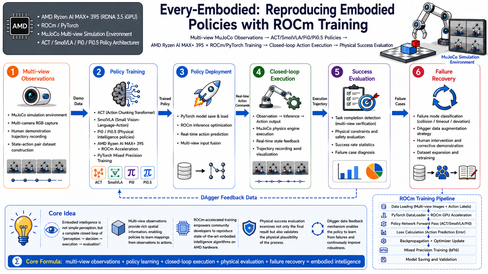
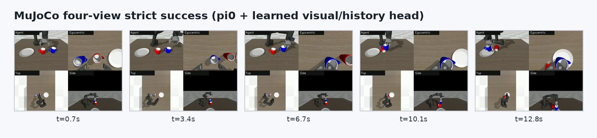

# Every Embodied: Replicating Embodied Intelligence Policies on ROCm

    

ROCm isn't just for deploying and fine-tuning language models – it can also handle vision encoding, policy training, action inference, and batch evaluation in embodied intelligence. Datawhale's [Every Embodied](https://github.com/datawhalechina/every-embodied) project provides a set of MuJoCo desktop manipulation experiments and replicates the training and debugging workflows for ACT, SmolVLA, Pi0, and Pi0.5 on AMD Ryzen AI MAX+ 395 / ROCm environments.

This page focuses on the Every Embodied ROCm replication work. Complete code, notebooks, environment commands, experimental results, and troubleshooting processes are maintained in the Every Embodied repository to avoid duplicating the same material across two repositories.

  
  
MuJoCo four-view cup grasping strict success sequence

## What You'll Learn

This series doesn't just show a single success video – it covers the complete closed loop from data to physical success criteria:

1. Perform keyboard teleoperation in MuJoCo, recording multi-view images, robot states, and action trajectories.
2. Organize data into LeRobot format and verify episodes, timestamps, action dimensions, and normalization statistics.
3. Train ACT, SmolVLA, Pi0/Pi0.5 on ROCm, recording VRAM usage, temperature, loss, and checkpoints.
4. Deploy policies back to the simulation environment for closed-loop inference and batch evaluation with randomized positions and different colored cups.
5. Use strict physical success conditions composed of "lift, carry, release, final placement" rather than just loss or single-frame visuals.
6. Diagnose failure causes through teacher-forced replay, open-loop action traces, DAgger/recovery data, weighted sampling, and action representation audits.

## Models and Experimental Content

| Model | Main Content in Series | Current Reading Focus | Notebook |
|:---|:---|:---|:---|
| ACT | Single and randomized data training, joint action diagnostics, DAgger/recovery data | Why small-data imitation learning accumulates errors in closed loop | [ACT ROCm Training](https://github.com/datawhalechina/every-embodied/blob/main/16-%E4%B8%93%E9%A2%98%E7%BB%84%E9%98%9F%E5%AD%A6%E4%B9%A0/04-AMD-ROCm%E7%AD%96%E7%95%A5%E5%A4%8D%E5%88%BB%E4%B8%93%E9%A2%98/notebooks/08_act_training_rocm.ipynb) |
| SmolVLA | Pretrained weight loading, red/blue cup sampling imbalance, weighted sampling and random position evaluation | How data coverage and sampling distribution affect generalization | [SmolVLA ROCm Training](https://github.com/datawhalechina/every-embodied/blob/main/16-%E4%B8%93%E9%A2%98%E7%BB%84%E9%98%9F%E5%AD%A6%E4%B9%A0/04-AMD-ROCm%E7%AD%96%E7%95%A5%E5%A4%8D%E5%88%BB%E4%B8%93%E9%A2%98/notebooks/09_smolvla_training_rocm.ipynb) |
| Pi0 | Permission and weight smoke tests, separate evaluation of raw policy vs. learned auxiliary heads | Not misreporting scripted finisher success as end-to-end VLA success | [Pi0 ROCm Training](https://github.com/datawhalechina/every-embodied/blob/main/16-%E4%B8%93%E9%A2%98%E7%BB%84%E9%98%9F%E5%AD%A6%E4%B9%A0/04-AMD-ROCm%E7%AD%96%E7%95%A5%E5%A4%8D%E5%88%BB%E4%B8%93%E9%A2%98/notebooks/10_pi0_training_rocm.ipynb) · [Strict End-to-End Diagnostics](https://github.com/datawhalechina/every-embodied/blob/main/16-%E4%B8%93%E9%A2%98%E7%BB%84%E9%98%9F%E5%AD%A6%E4%B9%A0/04-AMD-ROCm%E7%AD%96%E7%95%A5%E5%A4%8D%E5%88%BB%E4%B8%93%E9%A2%98/notebooks/12_pi0_strict_input_end_to_end.ipynb) |
| Pi0.5 | LeRobot v3 data specification, EEF-delta action representation, chunk alignment and recovery training | Why action direction, execution window, and closed-loop correction are more critical than simply increasing training steps | [Pi0.5 Random Position & EEF-delta](https://github.com/datawhalechina/every-embodied/blob/main/16-%E4%B8%93%E9%A2%98%E7%BB%84%E9%98%9F%E5%AD%A6%E4%B9%A0/04-AMD-ROCm%E7%AD%96%E7%95%A5%E5%A4%8D%E5%88%BB%E4%B8%93%E9%A2%98/notebooks/13_pi05_random_position_eef_delta.ipynb) |

The series clearly distinguishes three result categories: **raw policy**, **learnable auxiliary modules** using only vision/language/proprioceptive state, and **diagnostic scaffolding** that injects target positions or hand-written stage rules. These serve different purposes and their success rates cannot be compared directly.

## Project Resources

- [Every Embodied Project README](https://github.com/datawhalechina/every-embodied#readme)
- [Every Embodied ROCm Policy Replication Notebooks](https://github.com/datawhalechina/every-embodied/tree/main/16-%E4%B8%93%E9%A2%98%E7%BB%84%E9%98%9F%E5%AD%A6%E4%B9%A0/04-AMD-ROCm%E7%AD%96%E7%95%A5%E5%A4%8D%E5%88%BB%E4%B8%93%E9%A2%98/notebooks)

Start with the device-check and physical-success-evaluation notebooks before data collection, training, and deployment. This verifies that the evaluator identifies success correctly before long training runs expose action-direction, data-format, or success-condition errors.

## Hardware and Software Notes

The series primarily validates on AMD Ryzen AI MAX+ 395, using Ubuntu, ROCm, PyTorch, LeRobot, and MuJoCo. Ryzen AI MAX+ 395 uses a unified memory architecture where system memory and GPU available memory are shared, so you still need to monitor GPU allocation, system memory, and temperature during training – you can't treat all unified memory as unconditionally usable dedicated VRAM.

Compatibility between different ROCm, PyTorch, and LeRobot versions will vary. Before starting replication, refer to the device check notebooks in the series, locked versions, and the current [ROCm compatibility documentation](https://rocm.docs.amd.com/en/latest/compatibility/compatibility-matrix.html).

## Why It's Worth Trying

After migrating embodied intelligence policies to ROCm, the truly difficult part usually isn't changing `cuda` strings to `hip`, but aligning model dependencies, data formats, action semantics, execution frequency, and physical evaluation protocols simultaneously. Every Embodied preserves these failure cases and repair tools together, so you can directly see what engineering steps are still missing between "loss looks normal" and "actually completing the task in simulation."
