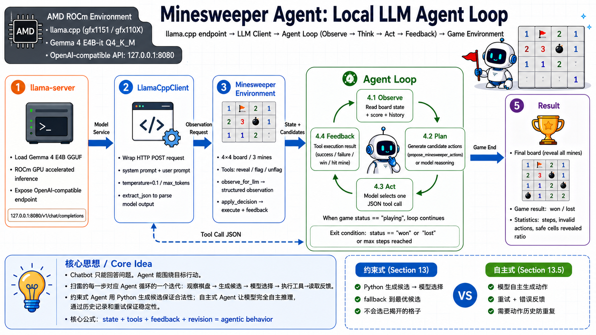

# 💣 Minesweeper Agent - Play Minesweeper with a Local LLM

<div align='center'>

[](https://rocm.docs.amd.com/)

</div>

<div align='center'>
    
</div>

This case uses a 4×4 Minesweeper board as the Agent's runtime environment, demonstrating how an Agent interacts with an environment through tools and corrects its behavior based on feedback. The model is Gemma 4 E4B-it Q4_K_M, served via llama.cpp with an OpenAI-compatible API.

- Notebook: [minesweeper_agent.ipynb](https://github.com/datawhalechina/hello-rocm/blob/master/src/amd-yes/minesweeper_agent/minesweeper_agent.ipynb)
- Game environment: [minesweeper_game.py](https://github.com/datawhalechina/hello-rocm/blob/master/src/amd-yes/minesweeper_agent/minesweeper_game.py)

## What's Covered

1. Structural differences between a Chatbot and an Agent.
2. Downloading, starting, and verifying llama.cpp (ROCm prebuilt).
3. Minesweeper environment initialization and manual interaction.
4. Step-by-step Agent loop breakdown: Observation → Candidate Actions → LLM selection → Tool execution → Feedback.
5. Comparison experiment: model free-generation vs Python deterministic candidates.
6. Full constrained Agent loop (with candidate actions).
7. Full autonomous Agent loop (with action history + retry mechanism).
8. Stability design: candidate action constraints, low temperature, JSON format, fallback, action history.

## Prerequisites

### Option 1: AMD Radeon Cloud (no local GPU required)

If you don't have an AMD GPU, you can use the official AMD free cloud compute platform. Log in via browser and run the Jupyter Notebook directly:

- Platform: <https://developer.amd.com.cn/login?source=91kadjjnI>
- 100 free GPU hours upon registration
- Built-in Jupyter environment, no local setup needed

See the full guide: [AMD Radeon Cloud](/zh/cloud/amd-radeon-cloud)

### Option 2: Local Setup

Hardware:
- AMD GPU with ROCm 7.0+ support (e.g., Ryzen AI Max+ 395, Radeon RX 7000/9000 series)

Software:
- Ubuntu 24.04 or Windows 11 (ROCm 7.12+)
- Python 3.12
- Jupyter Notebook

Local environment setup:

```bash
# Create virtual environment
uv venv --python=3.12
source .venv/bin/activate  # Linux
# .venv\Scripts\activate   # Windows

# Install dependencies
uv pip install jupyter requests
```

Launch the Notebook:

```bash
cd src/amd-yes/minesweeper_agent/
jupyter notebook
```

### Inference Service

- llama.cpp ROCm prebuilt ([lemonade-sdk/llamacpp-rocm b1292](https://github.com/lemonade-sdk/llamacpp-rocm/releases/tag/b1292))
- Model: Gemma 4 E4B-it Q4_K_M GGUF (~5.4 GB)

> 📖 For full ROCm environment setup, see [00-Environment](/en/00-environment/).

## Model Download

**ModelScope (direct access from China, no login required):**

```bash
wget https://www.modelscope.cn/models/bartowski/google_gemma-4-E4B-it-GGUF/resolve/master/google_gemma-4-E4B-it-Q4_K_M.gguf
```

**Hugging Face:**

```bash
wget https://huggingface.co/bartowski/google_gemma-4-E4B-it-GGUF/resolve/main/google_gemma-4-E4B-it-Q4_K_M.gguf
```

## Related Resources

- [Gemma 4 llama.cpp Deployment Guide](/en/01-deploy/gemma4/llamacpp-rocm7-deploy.md)
- [toy-cli Terminal Agent Tutorial](/en/05-amd-yes/toy-cli)
- [hello-rocm 04-References](/en/04-references/)
