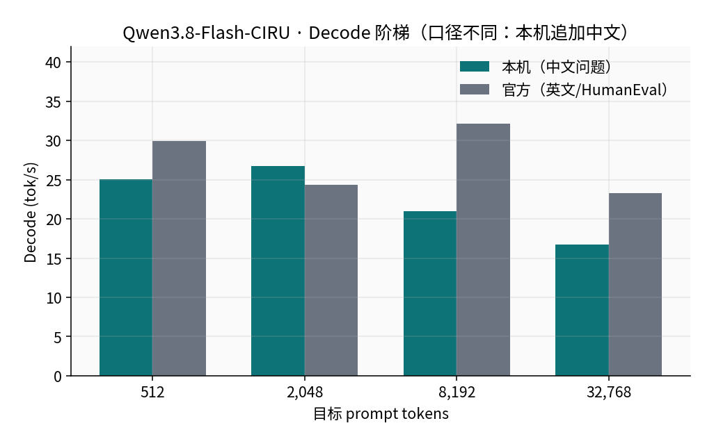
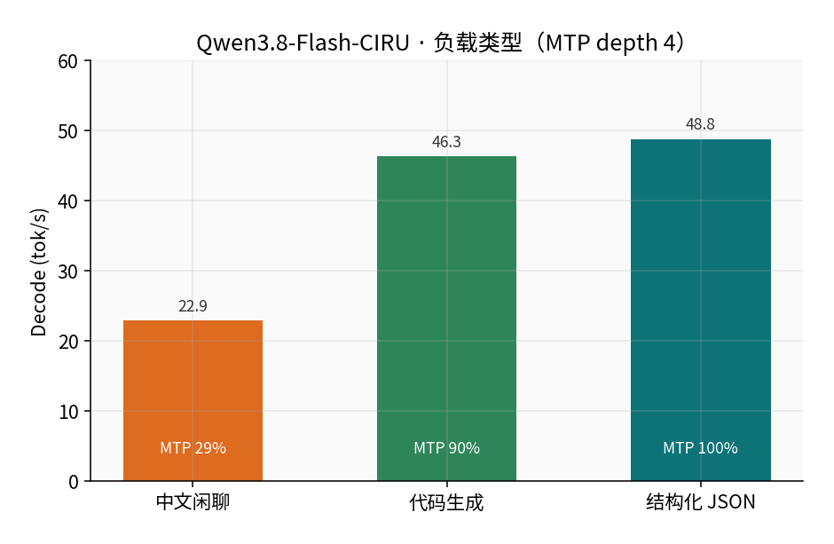
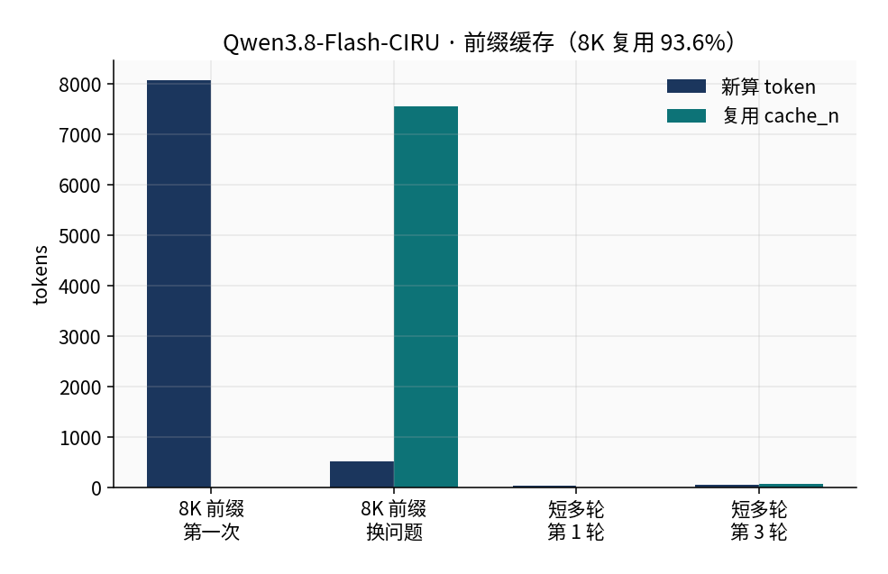

# 🌀 Qwen3.8-Flash-CIRU — llama-server on Strix Halo

<div align='center'>

[](https://rocm.docs.amd.com/)
[](https://www.amd.com/en/products/processors/laptop/ryzen-ai-300.html)
[](https://github.com/ciru-ai/Qwen3.8-Flash-CIRU-STRIX-IU4)

</div>

This page shows how to build CIRU `llama-server` from [ciru-ai/Qwen3.8-Flash-CIRU-STRIX-IU4](https://github.com/ciru-ai/Qwen3.8-Flash-CIRU-STRIX-IU4) **v1.1** on an **AMD Ryzen AI MAX+ 395 (Radeon 8060S, `gfx1151`) with 128 GB unified memory**, load the Hugging Face `jcbtc/Qwen3.8-Flash-CIRU-STRIX-IU4` GGUF + PLE + MTP pack, and expose an OpenAI-compatible API.

> Prerequisite: finish the [ROCm environment setup](/00-environment/). Measured on **Ubuntu 24.04 + ROCm 7.1.0**, GPU perf level `high` (sclk 2900 MHz).  
> This is **not** stock llama.cpp and **not** lucebox `dflash_server`. A generic GGUF loader cannot read the PLE sidecar.

---

### Model

Qwen3.8-Flash-CIRU-STRIX-IU4 is an IU4 / PLE release for Strix Halo: ~74 GiB main GGUF, ~49 GiB PLE payload paged from NVMe, ~3.9 GiB MTP draft. `/v1/models` reports about **126B MoE** (`n_params=125,743,653,760`) and a 262144 context.

| Item | Value |
|:---|:---|
| Runtime | CIRU `llama-server` v1.1 (git tag `v1.1`) |
| Weights | [jcbtc/Qwen3.8-Flash-CIRU-STRIX-IU4](https://huggingface.co/jcbtc/Qwen3.8-Flash-CIRU-STRIX-IU4) |
| Disk | ~**127 GiB** full pack; always `sha256sum -c checksums.sha256` |
| Resident RAM | ~96 / 125 GiB (4 GiB PLE page cache) |
| Recipe | `profiles/strix-halo-production.env`; this host uses MTP depth **4** (upstream default 3) |

It cannot share 128 GB unified memory with [DeepSeek-V4-Flash](./ds4.md).

---

### 1. Check hardware and ROCm

```bash
amd-smi
rocminfo | grep -A2 -E 'Name:|Marketing Name|gfx1151'
df -h .   # keep ~130 GiB free
```

Lock the GPU if you can:

```bash
echo performance | sudo tee /sys/firmware/acpi/platform_profile
sudo rocm-smi -d 0 --setperflevel high
```

If DS4 (`dflash_server`) is still up, stop it first:

```bash
pkill -x dflash_server || true
ss -tlnp | grep -E ':8000|:8080' || true
```

---

### 2. Build CIRU llama-server

```bash
mkdir -p ~/rocm-llm && cd ~/rocm-llm
git clone --branch v1.1 --depth 1 \
  https://github.com/ciru-ai/Qwen3.8-Flash-CIRU-STRIX-IU4.git
cd Qwen3.8-Flash-CIRU-STRIX-IU4

export ROCM_ROOT=/opt/rocm
export PATH="/opt/rocm/bin:$PATH"
unset HSA_OVERRIDE_GFX_VERSION

./scripts/ciru/build-linux-amd.sh
./build-gfx1151/bin/llama-server --version
./build-gfx1151/bin/llama-server --help | grep -E 'ple-sidecar|spec-draft-model'
```

The script builds `build-gfx1151/bin/llama-server` with `GGML_HIP` / `gfx1151`. Help text should list `--ple-sidecar` and `--spec-draft-model`.

---

### 3. Download and verify weights

```bash
export HF_ENDPOINT=https://hf-mirror.com
python3 -m pip install -q "huggingface_hub>=0.26"

python3 - <<'PY'
from huggingface_hub import snapshot_download
path = snapshot_download(
    repo_id="jcbtc/Qwen3.8-Flash-CIRU-STRIX-IU4",
    local_dir="model",
)
print("local_dir", path)
PY

ls -lh model/Qwen3.8-Flash-CIRU-STRIX-IU4.gguf \
       model/mtp/Qwen3.8-Flash-CIRU-STRIX-IU4-MTP-Q8_0.gguf \
       model/ple/ple.payload.bin \
       model/ple/ple.manifest.json \
       model/ple/ple.scale.bf16

(cd model && sha256sum -c checksums.sha256)
```

Files that checksummed cleanly here:

| File | Size |
|:---|---:|
| `Qwen3.8-Flash-CIRU-STRIX-IU4.gguf` | 74 GiB |
| `ple/ple.payload.bin` | 49 GiB |
| `mtp/Qwen3.8-Flash-CIRU-STRIX-IU4-MTP-Q8_0.gguf` | 3.9 GiB |

`run-server.sh` reads `model/` under the repo by default. Point `MODEL_DIR` elsewhere if needed.

---

### 4. Start the server

`scripts/ciru/run-server.sh` loads `profiles/strix-halo-production.env` (4 GiB PLE cache, 8 GiB prompt cache, ctx 262144, MTP). After a depth sweep this host uses **4** instead of the upstream default 3.

```bash
export ROCM_PATH=/opt/rocm
export HIP_PATH=/opt/rocm
export LD_LIBRARY_PATH=/opt/rocm/lib:/opt/rocm/lib64:${LD_LIBRARY_PATH:-}
unset HSA_OVERRIDE_GFX_VERSION

cd ~/rocm-llm/Qwen3.8-Flash-CIRU-STRIX-IU4
mkdir -p slot-state

# Agents / short replies: turn thinking off so max_tokens is not eaten by reasoning
HOST=0.0.0.0 PORT=8080 MTP_DEPTH=4 \
  ./scripts/ciru/run-server.sh \
  --reasoning off \
  --chat-template-kwargs '{"enable_thinking":false}'
```

Load is about **60 s** (main + MTP). Then:

```bash
curl -s http://127.0.0.1:8080/health
curl -s http://127.0.0.1:8080/v1/models | jq '.data[0].id'
```

You should see `Qwen3.8-Flash-CIRU-STRIX-IU4`. Roll back with `MTP_DEPTH=3`. To think, omit the off switch and send `"chat_template_kwargs": {"enable_thinking": true}` with a larger `max_tokens`.

---

### 5. Smoke test

```bash
curl -s -X POST http://127.0.0.1:8080/v1/chat/completions \
  -H 'Content-Type: application/json' \
  -d '{
    "model": "Qwen3.8-Flash-CIRU-STRIX-IU4",
    "messages": [{"role": "user", "content": "Reply with only: ok"}],
    "max_tokens": 16,
    "temperature": 0,
    "chat_template_kwargs": {"enable_thinking": false}
  }' | jq -r '.choices[0].message.content'
```

With thinking off, a short prompt returned `ok` in about 0.5 s and no `reasoning_content`.

Quality smoke (`temperature=0`, thinking off, MTP depth 4) passed: `23*17=391`, Chinese compression, palindrome helper, Shanghai weather JSON, pinyin sort.

---

### 6. Measured results

Same host as the DS4 page. Server-side `timings`. HumanEval / ARC scores below are from the CIRU README and were **not** re-run in full here.

#### 6.1 Prefill matches or beats upstream at 512–8K

Cold prompts, 128 generated tokens, **MTP depth 3** (aligned with the published recipe).

<div align='center'>
  
</div>

| Target tokens | Local prefill | Official prefill | Local decode | Official decode |
|---:|---:|---:|---:|---:|
| 512 | **402.7** | 298.3 | 25.1 | 30.0 |
| 2,048 | **380.6** | 377.0 | **26.7** | 24.4 |
| 8,192 | **384.7** | 372.8 | 21.0 | 32.1 |
| 32,768 | 220.6 | 228.3 | 16.8 | 23.3 |

8K cold prefill is about **21 s**. 32K is within a few percent of official. Local decode at 8K/32K is lower because the ladder appends a Chinese question (MTP accept 37–70%); official numbers come from high-accept English / HumanEval.

<div align='center'>
  
</div>

#### 6.2 Workload: code / JSON about 2× Chinese chat

Production **MTP depth 4**:

<div align='center'>
  
</div>

| Workload | decode tok/s | MTP accept |
|:---|---:|---:|
| Chinese chat | 22.9 | 28.9% |
| Code | **46.3** | 90.0% |
| Structured JSON | **48.8** | 100% |

The Q8_0 MTP draft is much better on English / symbols. Short Chinese streaming TTFP ≈ **0.23 s**.

#### 6.3 MTP depth sweet spot is 4

Same prompts, only `--spec-draft-n-max` changes:

<div align='center'>
  
</div>

| depth | Chinese | Code | JSON | vs official depth 3 |
|---:|---:|---:|---:|:---|
| 1 | **28.3** | 34.7 | 35.6 | best Chinese, weak code |
| 3 (official) | 24.7 | 45.7 | 38.6 | baseline |
| **4 (used here)** | 26.2 | **51.8** | **48.9** | code **+13%**, structured **+27%** |
| 5 | 18.9 | 42.1 | 43.4 | Chinese collapses |
| 6 | 16.4 | 47.5 | 43.9 | wasted drafts |

Depth ≥ 5 drops Chinese accept to ~23%. Six restarts, no MTP position / HSA / pager failures.

#### 6.4 Prefix cache

<div align='center'>
  
</div>

~8K prefix, new question: first turn `cache_n=0`, second turn reused **7548 / (7548+517) = 93.6%** and only recomputed ~0.5K tokens. Keep `cache_prompt: true` and do not rewrite the system prompt or tool JSON every turn.

Raising the PLE page cache from 4 GiB to 12 GiB did not move 8K/32K prefill. Keep the official 4 GiB.

---

### 7. Client notes

```json
{
  "model": "Qwen3.8-Flash-CIRU-STRIX-IU4",
  "messages": [{"role": "user", "content": "Hello"}],
  "temperature": 0.7,
  "top_p": 0.8,
  "top_k": 20,
  "presence_penalty": 1.5,
  "cache_prompt": true,
  "chat_template_kwargs": {"enable_thinking": false}
}
```

| Item | Hint |
|:---|:---|
| Base URL | `http://127.0.0.1:8080/v1` |
| Thinking | Off by default; turn on only when needed and raise `max_tokens` |
| Speed | ~0.2 s TTFP on short Chinese; ~23–28 tok/s Chinese; ~46–52 tok/s code / JSON |
| Long context | ~21 s to first token on a cold 8K prompt |
| Concurrency | `--parallel 1` |
| SSD | 49 GiB PLE is paged; a slow disk will show up in prefill |

Pick CIRU for code, JSON, and exact compute. Pick DS4 for long Chinese, a flat 25 tok/s decode, or if you want to avoid NVMe paging.

---

### 8. FAQ

<details>
<summary>Q: Can stock llama.cpp / Lemonade binaries load this?</summary>

No. Without `--ple-sidecar` the expert weights are wrong. Use the CIRU runtime.

</details>

<details>
<summary>Q: Short replies are only reasoning, no answer?</summary>

Start with `--reasoning off` and send `enable_thinking: false`. A small `max_tokens` fills `reasoning_content` first.

</details>

<details>
<summary>Q: Checksum failed?</summary>

Do not mix half-downloaded blobs. Delete the file and retry, then `sha256sum -c checksums.sha256`.

</details>

<details>
<summary>Q: Memory explodes if DS4 is also up?</summary>

Expected. `pkill -x dflash_server` (or `pkill -x llama-server`) before switching.

</details>

---

### References

- [CIRU repo v1.1](https://github.com/ciru-ai/Qwen3.8-Flash-CIRU-STRIX-IU4)
- [Hugging Face weights](https://huggingface.co/jcbtc/Qwen3.8-Flash-CIRU-STRIX-IU4)
- Sister guide: [DeepSeek-V4-Flash native HIP](./ds4.md)
