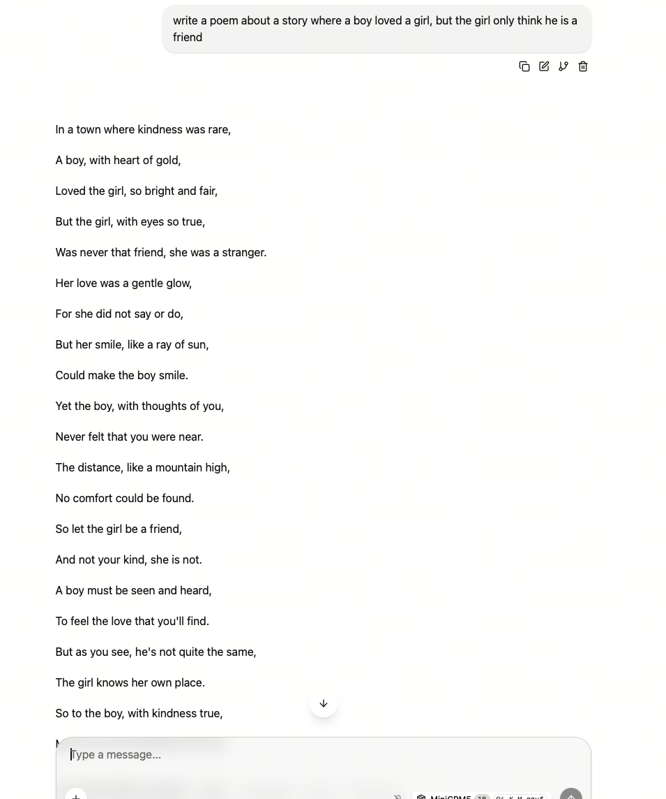

## llama.cpp 部署 MiniCPM（Ubuntu 24.04 + ROCm 7+）

### 模型简介

[MiniCPM](https://github.com/OpenBMB/MiniCPM) 是由面壁智能（ModelBest）与清华大学自然语言处理实验室（OpenBMB）联合开发的端侧大语言模型系列。MiniCPM5-1B 是该系列最新的纯文本模型，仅 1B 参数，支持思考模式（Think / No-think），适合在资源受限的设备上部署。

- 模型仓库：[openbmb/MiniCPM5-1B](https://huggingface.co/openbmb/MiniCPM5-1B)
- GGUF 量化：[openbmb/MiniCPM5-1B-GGUF](https://huggingface.co/openbmb/MiniCPM5-1B-GGUF)

本节使用 **llama.cpp** 部署 **MiniCPM5-1B Q4_K_M（GGUF）**，包括：

- 使用预构建的可执行文件（推荐）
- 使用 Docker + 官方 ROCm 镜像自行编译

MiniCPM 是纯文本模型，只需加载单个 GGUF 文件。如需部署多模态版本（图像+文本），请参见 `minicpmv/` 目录。

> 前置条件：已完成 ROCm 7+ 系统安装与验证（见 `env-prepare-ubuntu24-rocm7.md`）。
> 已在 **AMD Ryzen AI MAX+ 395（Radeon 8060S，gfx1151），ROCm 7.13** 上验证。

---

### 一、方式一（推荐）：预构建的可执行文件

#### 1. 下载预构建版本

使用 Lemonade 提供的预构建版本，其中：

- **370** 对应 **gfx1150** 架构
- **395** 对应 **gfx1151** 架构

相关链接：

- https://github.com/lemonade-sdk/llamacpp-rocm
- https://github.com/lemonade-sdk/llamacpp-rocm/releases

```bash
mkdir -p ~/minicpm-rocm && cd ~/minicpm-rocm
# 选择与你架构匹配的文件（此处为 gfx1151）
curl -L -o llama-rocm-gfx1151.zip \
  https://github.com/lemonade-sdk/llamacpp-rocm/releases/download/b1292/llama-b1292-ubuntu-rocm-gfx1151-x64.zip
mkdir -p llama-bin && unzip -q llama-rocm-gfx1151.zip -d llama-bin
```

---

#### 2. 确认 ROCm 7+ 安装（必须为系统版 ROCm）

```bash
amd-smi
```

应能看到 GPU 型号、驱动、ROCm 版本，例如：

```
MARKET_NAME: Radeon 8060S Graphics
TARGET_GRAPHICS_VERSION: gfx1151
ROCm version: 7.13.0
```

确认 llama.cpp 能识别到 GPU：

```bash
cd ~/minicpm-rocm/llama-bin
export LD_LIBRARY_PATH=$PWD:/opt/rocm/lib:$LD_LIBRARY_PATH
./llama-cli --list-devices
# Available devices:
#   ROCm0: Radeon 8060S Graphics (65536 MiB, ... free)
```

---

#### 3. 设置权限和环境变量

```bash
cd ~/minicpm-rocm/llama-bin
chmod +x llama-cli llama-server
export LD_LIBRARY_PATH=$PWD:/opt/rocm/lib:$LD_LIBRARY_PATH
```

> Lemonade 构建会把自带的 ROCm 运行库放在可执行文件旁边，因此除 `/opt/rocm/lib` 外，还需把 `$PWD` 加入 `LD_LIBRARY_PATH`。

---

#### 4. 下载 MiniCPM5-1B GGUF

llama.cpp 使用 **GGUF 模型格式**。MiniCPM5-1B 提供以下量化版本：

| 文件 | 大小 | 说明 |
| --- | --- | --- |
| `MiniCPM5-1B-F16.gguf` | 2.1 GB | 无损精度 |
| `MiniCPM5-1B-Q8_0.gguf` | 1.1 GB | 精度损失极小 |
| `MiniCPM5-1B-Q4_K_M.gguf` | 657 MB | 适合显存有限的场景 |

使用国内 Hugging Face 镜像下载：

```bash
mkdir -p ~/models/MiniCPM5-1B-GGUF && cd ~/models/MiniCPM5-1B-GGUF
export HF_ENDPOINT=https://hf-mirror.com

curl -L --fail -o MiniCPM5-1B-Q4_K_M.gguf \
  "https://hf-mirror.com/openbmb/MiniCPM5-1B-GGUF/resolve/main/MiniCPM5-1B-Q4_K_M.gguf"
```

> 也可使用 `huggingface-cli download` 或 `hfd.sh` + `aria2` 进行断点续传下载。

---

#### 5. CLI 文本测试（`llama-cli`）

```bash
cd ~/minicpm-rocm/llama-bin
export LD_LIBRARY_PATH=$PWD:/opt/rocm/lib:$LD_LIBRARY_PATH

./llama-cli \
  -m ~/models/MiniCPM5-1B-GGUF/MiniCPM5-1B-Q4_K_M.gguf \
  -ngl 99 -c 4096 --temp 0.7 --top-p 0.95 -n 2048
```

MiniCPM5-1B 支持思考模式，在最终回答前可能会输出 `[Start thinking]` 思考过程。

---

#### 6. 启动 llama-server（OpenAI 兼容接口）

```bash
export LD_LIBRARY_PATH=$PWD:/opt/rocm/lib:$LD_LIBRARY_PATH
cd ~/minicpm-rocm/llama-bin

./llama-server \
  -m ~/models/MiniCPM5-1B-GGUF/MiniCPM5-1B-Q4_K_M.gguf \
  -ngl 99 -c 8192 --jinja --host 127.0.0.1 --port 8080
```

> `--jinja` 启用模型自带的聊天模板，MiniCPM5-1B 推荐开启。

---

#### 7. 测试接口

```bash
curl -s -X POST http://127.0.0.1:8080/v1/chat/completions \
  -H "Content-Type: application/json" \
  -d '{
  "model": "MiniCPM5-1B",
  "messages": [{"role": "user", "content": "1+1=? 然后用一句话解释"}],
  "temperature": 0.7, "top_p": 0.95, "max_tokens": 256
}' | jq -r '
.choices[0].message.content as $txt |
(.usage.completion_tokens / (.timings.predicted_ms / 1000)) as $tps |
"回答:\n\($txt)\n\ntokens/s: \($tps|tostring)"
'
```

参考性能（Radeon 8060S，gfx1151，ROCm 7.13，ctx=8192）：解码约 **185 tokens/s**。实际速度取决于硬件。

#### 生成参数参考

| 模式 | `--temp` | `--top-p` | 适用场景 |
| --- | --- | --- | --- |
| 思考模式 | 0.9 | 0.95 | 推理、数学、代码 |
| 直接回答 | 0.7 | 0.95 | 日常对话、低延迟 |

---

### 二、方式二：Docker 方式（官方 ROCm llama.cpp 镜像）

> 若使用 Docker，需要安装 `amdgpu-dkms`：
> https://rocm.docs.amd.com/projects/install-on-linux/en/latest/how-to/docker.html

#### 1. 下载容器镜像

```bash
export MODEL_PATH='~/models'

sudo docker run -it \
  --name=$(whoami)_llamacpp_minicpm \
  --privileged --network=host \
  --device=/dev/kfd --device=/dev/dri \
  --group-add video --cap-add=SYS_PTRACE \
  --security-opt seccomp=unconfined \
  --ipc=host --shm-size 16G \
  -v $MODEL_PATH:/data \
  rocm/dev-ubuntu-24.04:7.0-complete
```

---

#### 2. 容器内准备工作区

```bash
apt-get update && apt-get install -y nano libcurl4-openssl-dev cmake git
mkdir -p /workspace && cd /workspace
```

---

#### 3. 克隆 llama.cpp 仓库

```bash
git clone https://github.com/ROCm/llama.cpp
cd llama.cpp
```

---

#### 4. 设定 ROCm 架构

```bash
# 以 AI MAX 395 (gfx1151) 为例
export LLAMACPP_ROCM_ARCH=gfx1151
```

---

#### 5. 编译 llama.cpp

```bash
HIPCXX="$(hipconfig -l)/clang" HIP_PATH="$(hipconfig -R)" \
cmake -S . -B build \
  -DGGML_HIP=ON \
  -DAMDGPU_TARGETS=$LLAMACPP_ROCM_ARCH \
  -DCMAKE_BUILD_TYPE=Release \
  -DLLAMA_CURL=ON && \
cmake --build build --config Release -j$(nproc)
```

---

#### 6. 运行测试

```bash
./build/bin/llama-cli \
  -m /data/MiniCPM5-1B-GGUF/MiniCPM5-1B-Q4_K_M.gguf \
  -ngl 99 -c 4096 -p "用两句话解释 AMD ROCm。"
```

#### 从自定义检查点生成 GGUF

如果你微调了自己的 MiniCPM5-1B，可使用 llama.cpp 转换和量化：

```bash
python ./convert_hf_to_gguf.py /path/to/your-MiniCPM5-fp16-hf --outfile F16.gguf --outtype f16
./build/bin/llama-quantize F16.gguf MiniCPM5-1B-Q4_K_M.gguf Q4_K_M
```

---

### 效果截图

<div align='center'>
    
</div>
