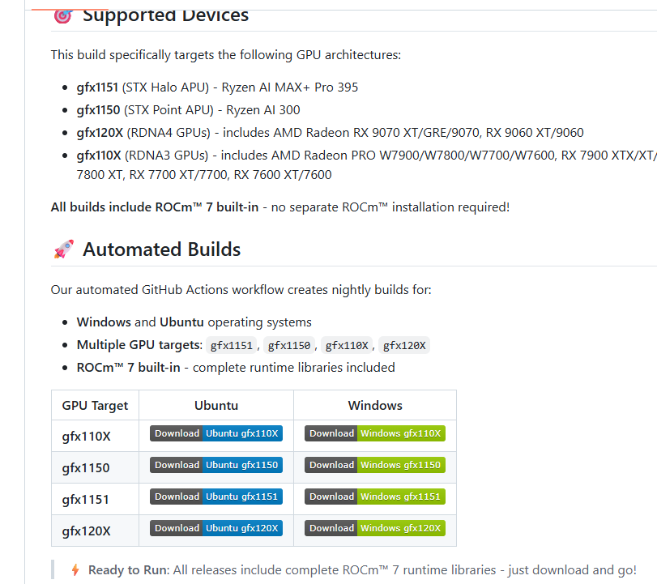
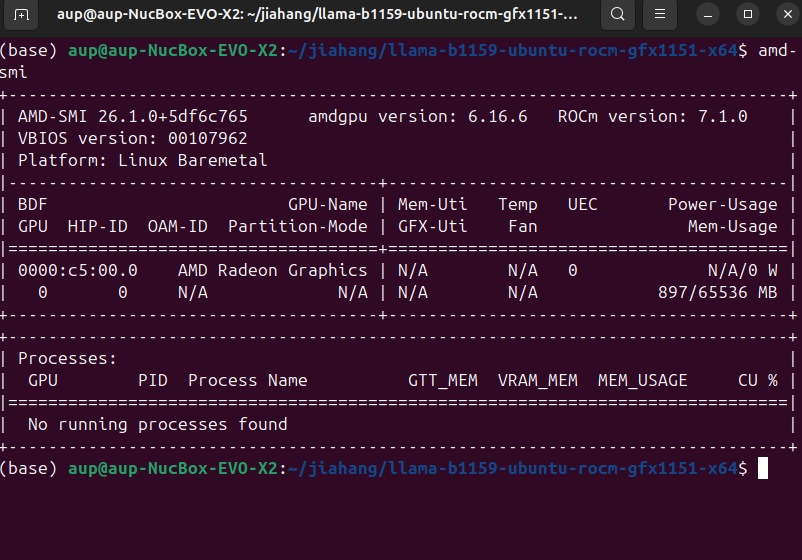

## llama.cpp 零基础环境部署（Ubuntu 24.04 + ROCm 7+）

本节介绍如何在 Ubuntu 24.04 + ROCm 7+ 环境下，使用 **llama.cpp** 运行 Qwen3.5 系列 GGUF 模型，包括：

- 使用预构建的 ROCm 可执行文件（推荐）
- 使用 Docker + ROCm 镜像自行编译

> 前置条件：已完成 [Ubuntu 24.04 环境准备](./env-prepare-ubuntu24-rocm7.md)。

---

### 一、方式一（推荐）：预构建的可执行文件

#### 1. 下载预构建版本

使用 Lemonade 提供的预构建版本，其中：

- **370** 对应 **gfx1150** 架构
- **395** 对应 **gfx1151** 架构

相关链接：

- https://github.com/lemonade-sdk/llamacpp-rocm
- https://github.com/lemonade-sdk/llamacpp-rocm/releases

下方截图为 GitHub Release 页面示例，可复用：

<div align='center'>
    
</div>

---

#### 2. 确认 ROCm 7+ 安装

使用 `amd-smi` 确认 GPU 型号、驱动、ROCm 版本：

```bash
amd-smi
```

示例输出如下，可看到 GPU 型号、驱动版本和 ROCm 版本：

<div align='center'>
    
</div>

---

#### 3. 进入 llama 后端目录并设置权限 / 环境变量

```bash
cd llama-*x64/
sudo chmod +x *
export LD_LIBRARY_PATH=/opt/rocm/lib:$LD_LIBRARY_PATH
```

---

#### 4. 准备 Qwen3.5 GGUF 模型

llama.cpp 使用 **GGUF 模型格式**。请从 Hugging Face 或其他可信来源下载 Qwen3.5-4B 对应的 GGUF 量化文件。

```bash
mkdir -p ~/models/qwen3.5
cd ~/models/qwen3.5

wget https://huggingface.co/Manojb/Qwen3.5-4B-UD-Q4_K_XL.gguf/blob/main/Qwen3.5-4B-UD-Q4_K_XL.gguf
```

---

#### 5. 启动 llama-server

```bash
export LD_LIBRARY_PATH=/opt/rocm/lib:$LD_LIBRARY_PATH
cd llama-*x64/

./llama-server \
  -m ~/models/qwen3.5/qwen3.5-4b-q4_k_m.gguf \
  -ngl 99
```

---

#### 6. 测试接口（curl + jq 计算 tokens/s）

使用 `curl` 请求本地的 `llama-server` 接口，并统计 tokens/s：

```bash
curl -s -X POST http://127.0.0.1:8080/v1/completions \
  -H "Content-Type: application/json" \
  -d '{
  "model": "qwen3.5-4b-q4_k_m",
  "prompt": "用一句话解释大语言模型",
  "max_tokens": 128
}' | jq -r '
.choices[0].text as $txt |
(.usage.completion_tokens / (.timings.predicted_ms / 1000)) as $tps |
"生成文本:\n\($txt)\n\ntokens/s: \($tps|tostring)"
'
```

---

### 二、方式二：Docker 方式（官方 ROCm llama.cpp 镜像）

如果更习惯使用 Docker，可以参考官方文档：

- https://rocm.docs.amd.com/projects/install-on-linux/en/latest/install/3rd-party/llama-cpp-install.html

> 注意：若使用 Docker，需要安装 `amdgpu-dkms`。

#### 1. 启动容器

```bash
export MODEL_PATH='~/models'

sudo docker run -it \
  --name=$(whoami)_llamacpp \
  --privileged --network=host \
  --device=/dev/kfd --device=/dev/dri \
  --group-add video --cap-add=SYS_PTRACE \
  --security-opt seccomp=unconfined \
  --ipc=host --shm-size 16G \
  -v $MODEL_PATH:/data \
  rocm/dev-ubuntu-24.04:7.0-complete
```

#### 2. 容器内准备工作区

```bash
apt-get update && apt-get install -y nano libcurl4-openssl-dev cmake git
mkdir -p /workspace && cd /workspace
```

#### 3. 克隆 ROCm 官方 llama.cpp 仓库

```bash
git clone https://github.com/ROCm/llama.cpp
cd llama.cpp
```

#### 4. 设定 ROCm 架构（以 Ryzen AI Max+ 395 为例）

```bash
export LLAMACPP_ROCM_ARCH=gfx1151
```

如需同时为多种微架构编译，可使用：

```bash
export LLAMACPP_ROCM_ARCH=gfx803,gfx900,gfx906,gfx908,gfx90a,gfx942,gfx1010,gfx1030,gfx1032,gfx1100,gfx1101,gfx1102,gfx1150,gfx1151
```

#### 5. 编译并安装 llama.cpp

```bash
HIPCXX="$(hipconfig -l)/clang" HIP_PATH="$(hipconfig -R)" cmake -S . -B build -DGGML_HIP=ON -DAMDGPU_TARGETS=$LLAMACPP_ROCM_ARCH -DCMAKE_BUILD_TYPE=Release -DLLAMA_CURL=ON && \
cmake --build build --config Release -j$(nproc)
```

#### 6. 运行 Qwen3.5 GGUF 测试

```bash
./build/bin/llama-cli -m /data/qwen3.5/qwen3.5-4b-q4_k_m.gguf -ngl 99
```

