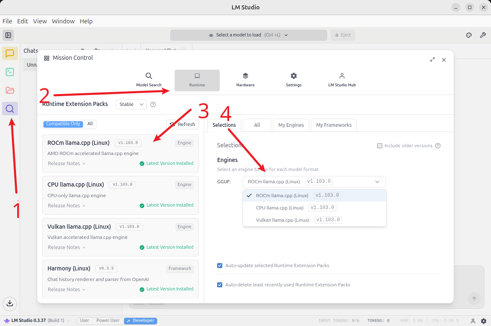
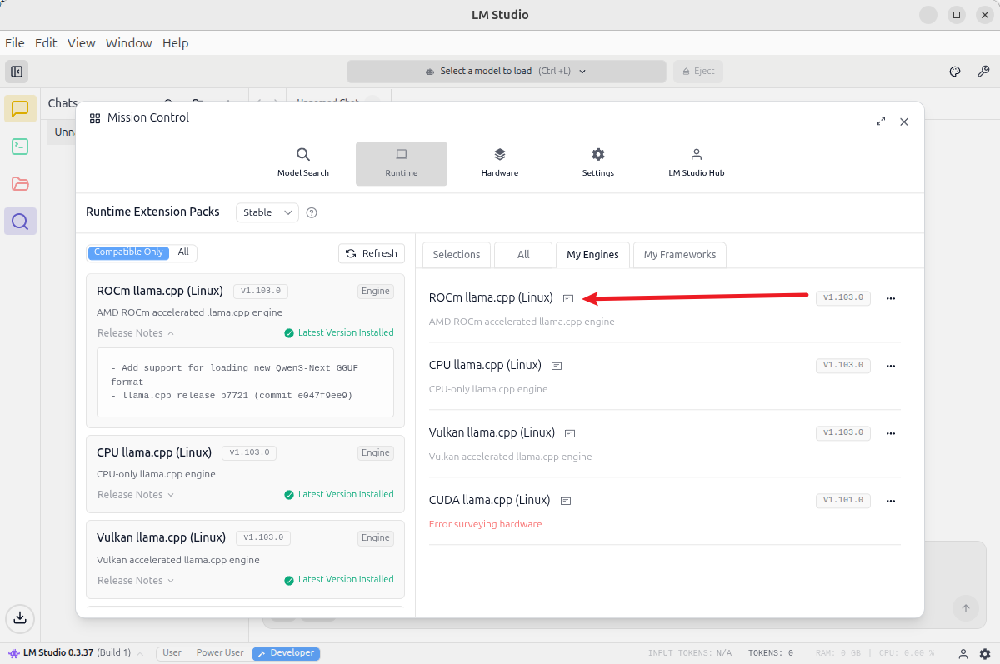
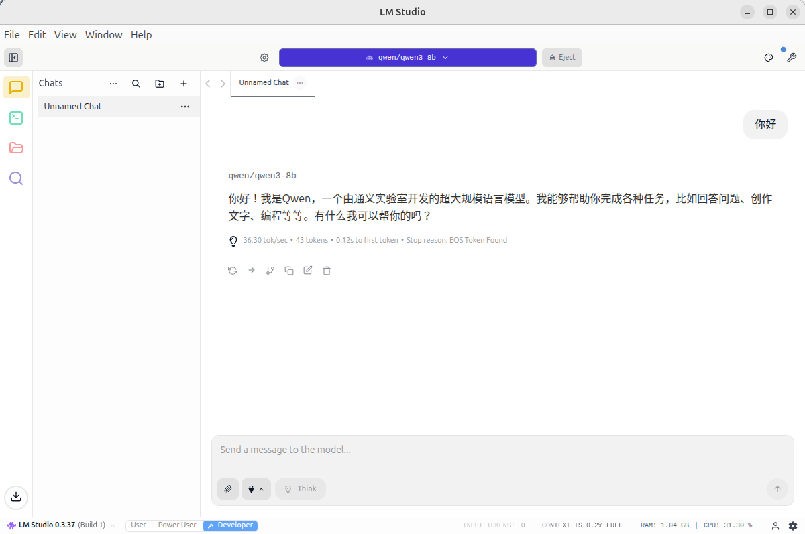

## LM Studio 零基础大模型部署（Ubuntu 24.04 + ROCm 7+）

本节介绍如何在 Ubuntu 24.04 上，基于 **ROCm 7+** 使用 **LM Studio + ROCm 版 llama.cpp** 部署大模型，并给出 Qwen3-8B Q4_K_M 的性能示例。

> 在开始本节前，请确保已完成环境准备并正确安装 ROCm 7.1.0（参考 `env-prepare-ubuntu24-rocm7.md`）。

---

### 1. 使用 LM Studio（选择 ROCm 版本 llama.cpp 后端推理）

#### 1.1 下载 LM Studio AppImage

首先从官网下载安装包：

```bash
https://lmstudio.ai/
```

下载最新的 `.AppImage` 文件到本地。

示意图：

<div align='center'>
    
</div>

---

#### 1.2 解压 AppImage

提取 AppImage 内容并解压到 `squashfs-root` 目录：

```bash
chmod u+x LM-Studio-*.AppImage
./LM-Studio-*.AppImage --appimage-extract
```

---

#### 1.3 修复 chrome-sandbox 权限

进入 `squashfs-root` 目录中，并为 `chrome-sandbox` 文件设置适当权限（该二进制文件是应用安全运行所需）：

```bash
cd squashfs-root
sudo chown root:root chrome-sandbox
sudo chmod 4755 chrome-sandbox
```

---

#### 1.4 启动 LM Studio

在当前文件夹下启动 LM Studio 应用程序：

```bash
./lm-studio
```

---

### 2. 安装 ROCm 版本 llama.cpp 后端推理

在 LM Studio 中选择 **ROCm 版本的 llama.cpp 后端** 安装：

<div align='center'>
    
</div>

需要注意，目前 LM Studio 所提供的 ROCm 版本 llama.cpp 所支持的架构列表（不同 GPU 架构支持状况）：

<div align='center'>
    
</div>

<div align='center'>
    
</div>

---

### 3. Qwen3-8B Q4_K_M 性能示例

在 LM Studio 中加载 **Qwen3-8B Q4_K_M** 模型，设置上下文长度为 4096，实际测试得到：

- **约 36 tokens/s**

截图示例：

<div align='center'>
    
</div>


