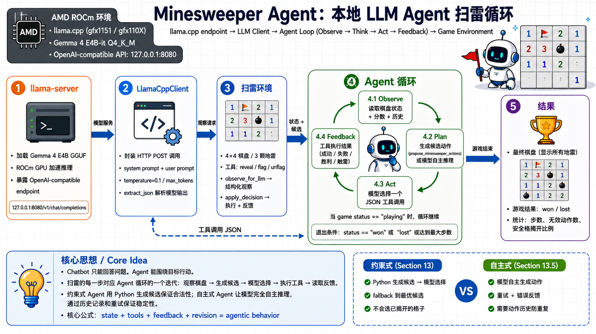

# 💣 Minesweeper Agent - 用本地大模型玩扫雷

<div align='center'>

[](https://rocm.docs.amd.com/)

</div>

<div align='center'>
    
</div>

本案例使用一个 4×4 扫雷棋盘作为 Agent 的运行环境，展示 Agent 如何通过工具与环境交互并根据反馈修正行为。模型使用 Gemma 4 E4B-it Q4_K_M，通过 llama.cpp 提供 OpenAI-compatible API。

- Notebook：[minesweeper_agent.ipynb](https://github.com/datawhalechina/hello-rocm/blob/master/src/amd-yes/minesweeper_agent/minesweeper_agent.ipynb)
- 游戏环境：[minesweeper_game.py](https://github.com/datawhalechina/hello-rocm/blob/master/src/amd-yes/minesweeper_agent/minesweeper_game.py)

## 内容覆盖

1. Chatbot 与 Agent 的结构区别。
2. llama.cpp ROCm 预编译版下载、启动与连接验证。
3. 扫雷环境初始化与手动操作。
4. Agent 循环逐步拆解：Observation → Candidate Actions → LLM 选择 → 工具执行 → Feedback。
5. 模型自主生成 vs Python 确定性候选的对比实验。
6. 完整约束式 Agent 循环（带候选动作）。
7. 完整自主式 Agent 循环（带历史记录 + 重试机制）。
8. 稳定性设计：候选动作约束、低 temperature、JSON 格式、fallback、动作历史。

## 环境要求

### 方式一：AMD Radeon Cloud 在线体验（无需本地 GPU）

没有 AMD GPU 的情况下，可以使用 AMD 官方提供的免费云算力平台，浏览器登录后直接运行 Jupyter Notebook：

- 平台入口：<https://developer.amd.com.cn/login?source=91kadjjnI>
- 注册即送 100 小时 GPU 算力
- 内置 Jupyter 环境，无需本地配置

详细使用教程见：[AMD Radeon Cloud 云算力](/zh/cloud/amd-radeon-cloud)

### 方式二：本地运行

硬件：
- AMD GPU（支持 ROCm 7.0+ 的显卡，如 Ryzen AI Max+ 395、Radeon RX 7000/9000 系列等）

软件：
- Ubuntu 24.04 或 Windows 11（ROCm 7.12+）
- Python 3.12
- Jupyter Notebook

本地环境安装：

```bash
# 创建虚拟环境
uv venv --python=3.12
source .venv/bin/activate  # Linux
# .venv\Scripts\activate   # Windows

# 安装依赖
uv pip install jupyter requests
```

启动 Notebook：

```bash
cd src/amd-yes/minesweeper_agent/
jupyter notebook
```

### 推理服务

- llama.cpp ROCm 预编译版（[lemonade-sdk/llamacpp-rocm b1292](https://github.com/lemonade-sdk/llamacpp-rocm/releases/tag/b1292)）
- 模型：Gemma 4 E4B-it Q4_K_M GGUF（约 5.4 GB）

> 📖 ROCm 基础环境安装请参考 [00-Environment](/zh/00-environment/)。

## 模型下载

**ModelScope（国内直连）：**

```bash
wget https://www.modelscope.cn/models/bartowski/google_gemma-4-E4B-it-GGUF/resolve/master/google_gemma-4-E4B-it-Q4_K_M.gguf
```

**Hugging Face：**

```bash
wget https://huggingface.co/bartowski/google_gemma-4-E4B-it-GGUF/resolve/main/google_gemma-4-E4B-it-Q4_K_M.gguf
```

## 相关资源

- [Gemma 4 llama.cpp 部署教程](/zh/01-deploy/gemma4/llamacpp-rocm7-deploy.md)
- [toy-cli 终端 Agent 教程](/zh/05-amd-yes/toy-cli)
- [hello-rocm 04-References](/zh/04-references/)
