# 🦞 OpenClaw - 全隐私本地 AI 智能体平台 AMD ROCm 版本

<div align='center'>

[](https://rocm.docs.amd.com/)
[](https://github.com/ValueCell-ai/ClawX)

</div>

**OpenClaw** 是一个统一的消息处理与 AI 智能体平台，通过 Gateway（网关）将来自多种渠道（飞书、Telegram、iMessage、Slack 等）的用户消息汇聚到 Agent（智能体）进行处理，并运行在隔离的 Workspace（工作空间）中。该平台采用模块化设计，Agent 可以灵活调用各类工具与服务。

> OpenClaw (ClawX) 项目地址：[*Link*](https://github.com/ValueCell-ai/ClawX/releases)

<div align='center'>
    
</div>

***接下来我将带领大家亲自动手，一步步在 AMD 395 Max AI PC 上完成 OpenClaw 的本地部署，打造完全隐私的个人 AI 助手！***

## 项目亮点

- 🔒 **完全隐私**：本地大模型 + 本地 OpenClaw，所有数据不出本机
- 🦞 **多渠道网关**：飞书、Telegram、钉钉、Slack、iMessage 统一接入
- 🧠 **Agent 架构**：模块化设计，支持 memory、soul、skills 等上下文管理
- 🏠 **本地部署**：在 AMD 395 Max 上运行 35B 参数大模型，无需联网

## OpenClaw 平台介绍

OpenClaw 作为行业标杆，其全能的架构和"操作系统终局"的宏大愿景引发了 AI Agent 领域的现象级热潮。代码体量超过 43 万行，功能覆盖消息网关、Agent 运行时、工具调用、记忆管理等核心能力。

<div align='center'>
    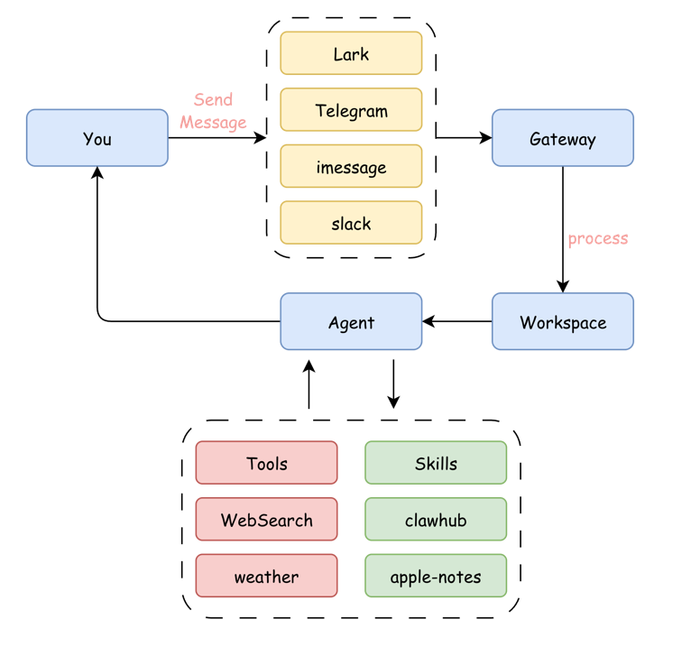
    <p>图5.6.1 OpenClaw 平台架构</p>
</div>

### 生态对比

OpenClaw 的成功也催生了社区衍生项目：

| 项目 | 定位 | 特点 |
|------|------|------|
| **OpenClaw** | 全能平台 | 43万行代码，操作系统级架构 |
| **Nanobot** | 极简主义 | 港大团队（HKUDS），轻量化方案 |
| **PicoClaw** | 边缘计算 | Go 语言，单一二进制，极低资源占用 |

<div align='center'>
    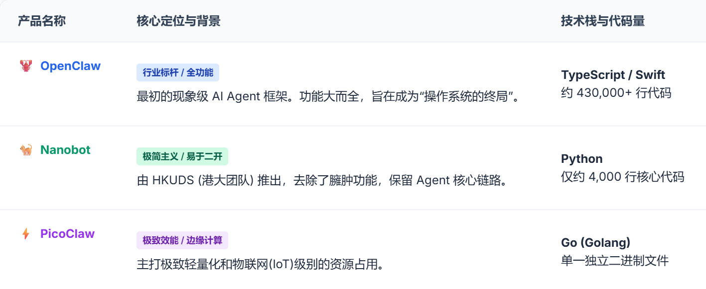
    <p>图5.6.2 OpenClaw 生态对比</p>
</div>

### 上下文占用

即使是新开一个对话，OpenClaw 也有 39K 上下文的占用——它会携带大量的 memory.md、soul.md、user.md 以及 skills 描述、工具描述等。OpenClaw 非常考验 Agent 的长上下文工具调用和规划能力，**因此本地部署需要一个大显存机器！**

<div align='center'>
    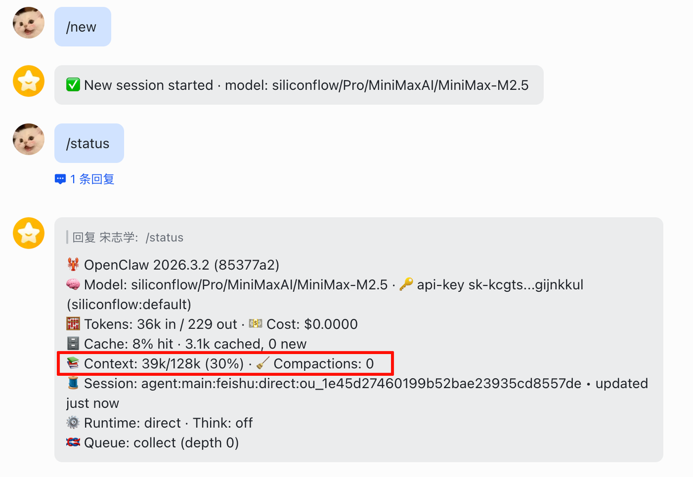
    <p>图5.6.3 OpenClaw 上下文占用（新对话即占 39K tokens）</p>
</div>

## Step 1: 硬件准备 - AMD 395 Max

AMD 395 Max 适合打游戏和做家庭 AI 中枢，模型性能和本地聊天内容的隐私性都可以得到保障。

<div align='center'>
    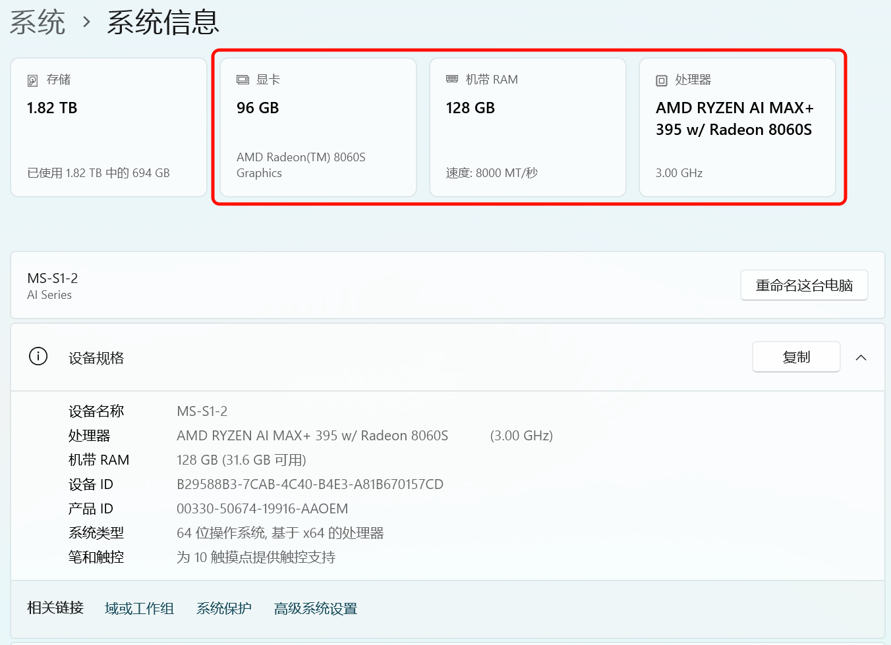
    <p>图5.6.4 AMD 395 Max 硬件规格</p>
</div>

本文基础环境如下：

```
----------------
AMD Ryzen™ AI 9 HX 395 Max
LM Studio
Windows 11 / Linux
----------------
```

> 本文默认学习者使用的是 AMD 395 Max AI PC 或其他搭载 AMD ROCm 支持的显卡设备。

## Step 2: LM Studio 部署本地模型

[LM Studio](https://lmstudio.ai/) 是一款专为本地运行大语言模型设计的跨平台桌面应用程序，支持 Windows、macOS 和 Linux 系统。它通过直观的图形界面让用户轻松搜索、下载并管理开源模型（如 GGUF 格式），无需联网即可在个人设备上实现离线对话、推理测试或启动 API 服务。

<div align='center'>
    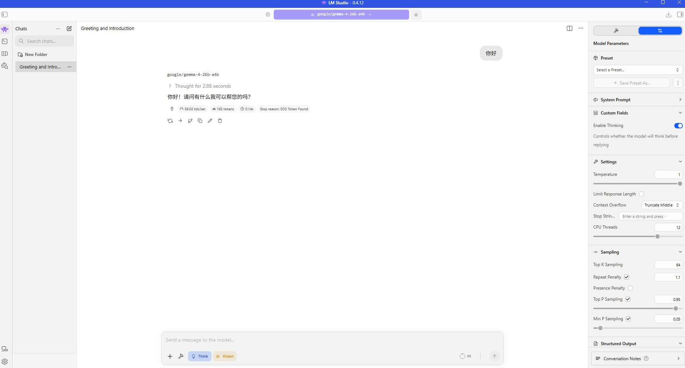
    <p>图5.6.5 LM Studio 界面</p>
</div>

### 2.1 下载安装 LM Studio

前往 [LM Studio 官网](https://lmstudio.ai/) 下载并安装。

### 2.2 加载推荐模型

本教程推荐使用 **gemma-4-26b-a4b** 模型（MoE 架构，激活参数仅 4B，总参数 26B）。

在 LM Studio 中搜索并下载该模型的 GGUF 版本，加载完成后记录：

- **基础 URL**：`http://127.0.0.1:12345/v1`
- **模型 ID**：`gemma-4-26b-a4b`

> 关于 LM Studio 详细配置，请参考 [Getting Started with ROCm Deploy](/zh/01-deploy/)

## Step 3: 安装 OpenClaw (ClawX)

### 3.1 下载安装包

打开 [ClawX Release 页面](https://github.com/ValueCell-ai/ClawX/releases)，选择适合你系统的安装包（Windows 或 Mac）。

<div align='center'>
    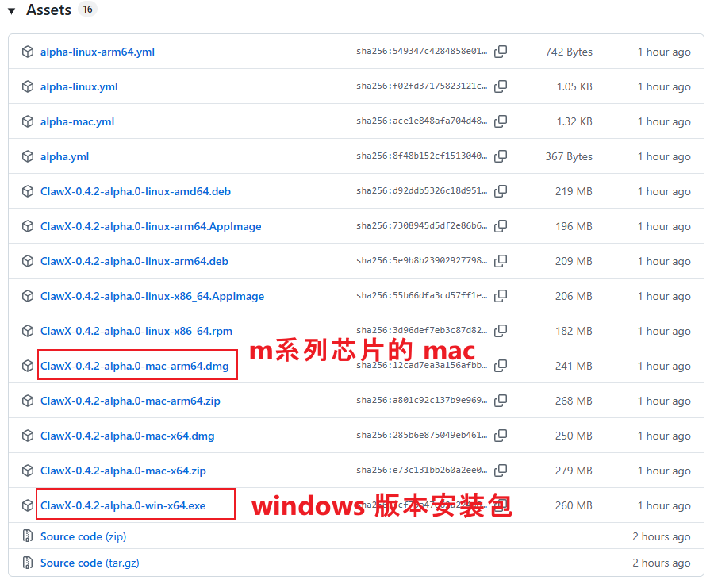
    <p>图5.6.6 ClawX Release 下载页面</p>
</div>

### 3.2 安装 ClawX

双击安装包，仅为当前用户安装即可：

<div align='center'>
    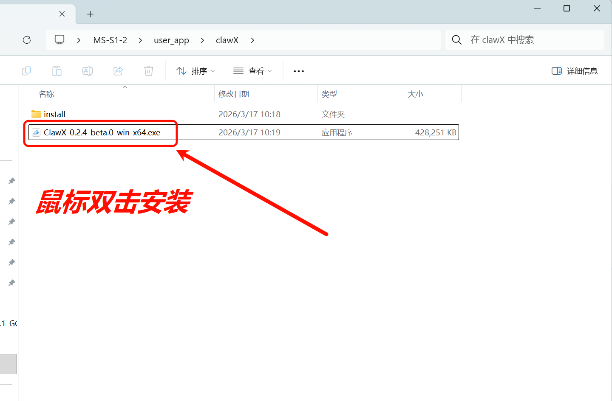
    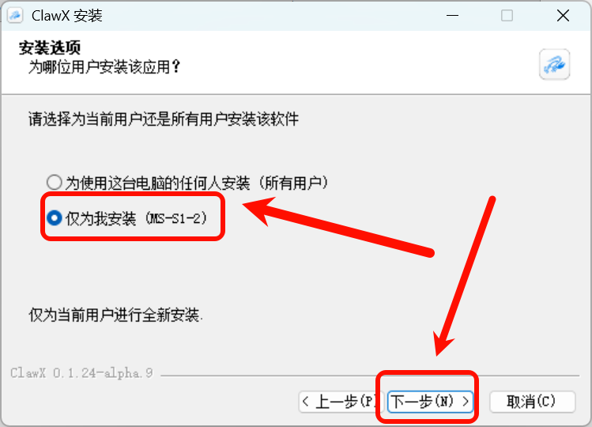
    <p>图5.6.7 双击安装，选择仅为当前用户安装</p>
</div>

选择安装位置，等待安装完成：

<div align='center'>
    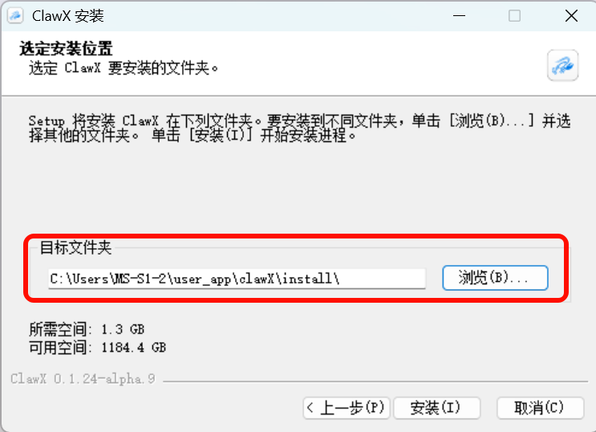
    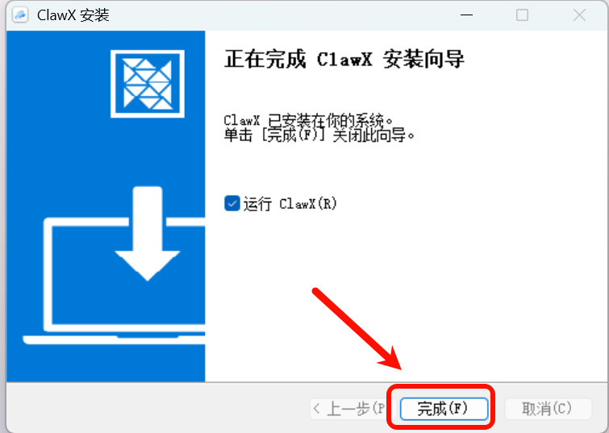
    <p>图5.6.8 选择安装位置并等待安装完成</p>
</div>

### 3.3 初始化配置

安装完成后点击运行，选择中文，然后点击下一步：

<div align='center'>
    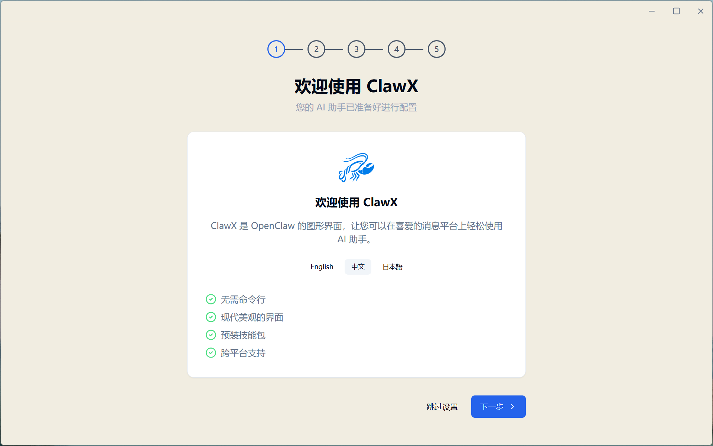
    <p>图5.6.9 选择中文并点击下一步</p>
</div>

等待环境检查，缺少的环境它会指引你安装，然后点击下一步：

<div align='center'>
    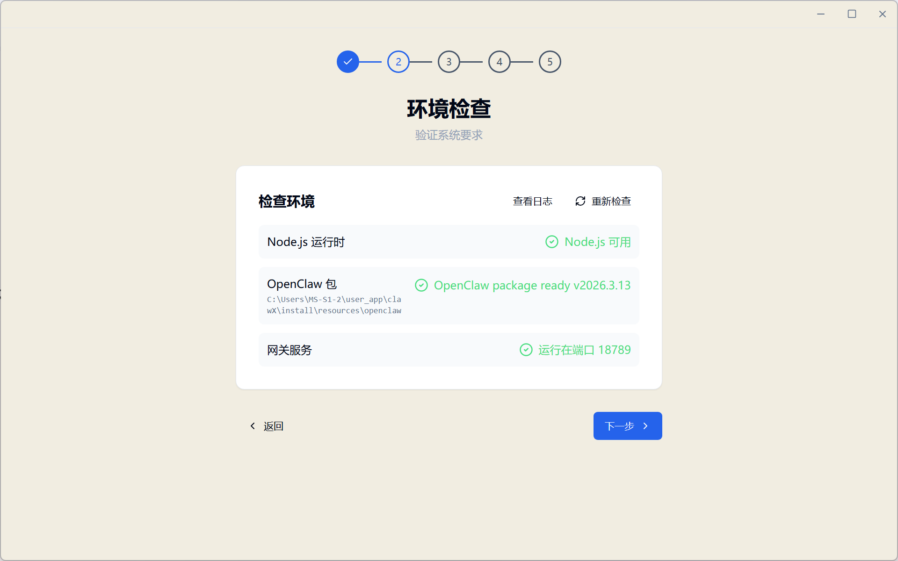
    <p>图5.6.10 环境检查（缺少的组件会自动引导安装）</p>
</div>

### 3.4 配置本地模型

选择**自定义本地部署的模型**，使用 LM Studio 部署的 gemma-4-26b-a4b：

<div align='center'>
    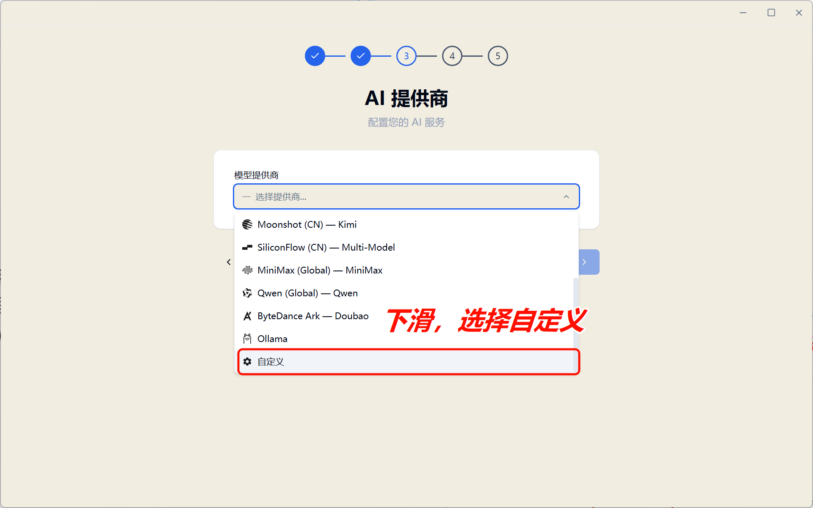
    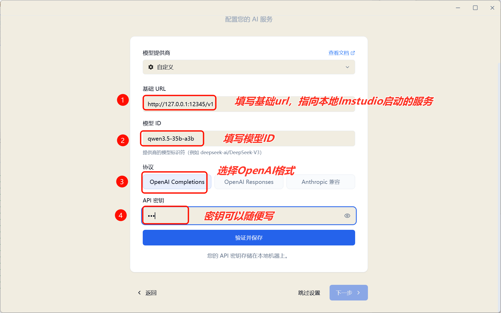
    <p>图5.6.11 选择自定义模型并配置连接信息</p>
</div>

填入以下配置：

| 配置项 | 值 |
|--------|------|
| 基础 URL | `http://127.0.0.1:12345/v1` |
| 模型 ID | `gemma-4-26b-a4b` |

验证保存后，点击下一步即完成全部安装：

<div align='center'>
    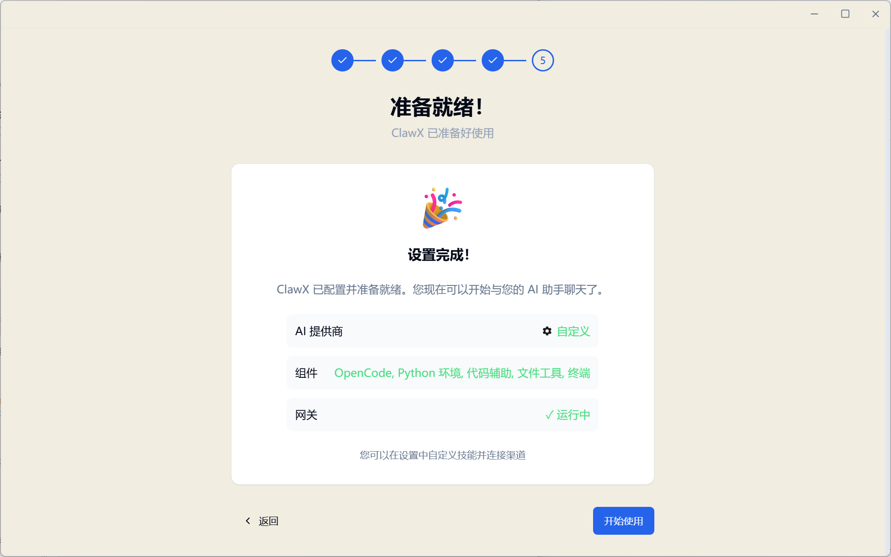
    <p>图5.6.12 点击下一步，安装完成</p>
</div>

### 3.5 安装成功

恭喜！一只纯本地的"龙虾"就安装好了 🦞

<div align='center'>
    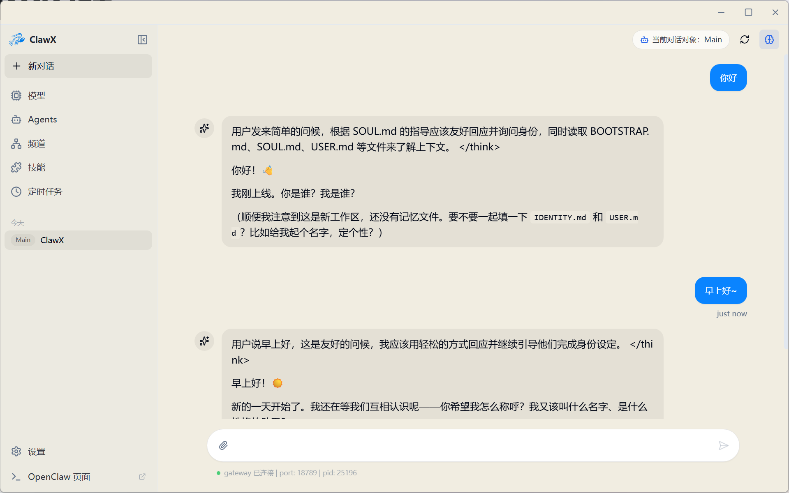
    <p>图5.6.13 本地 OpenClaw 安装成功</p>
</div>

## Step 4: 使用 OpenClaw

### 4.1 Web 管理界面

点击左下角的"OpenClaw 页面"进入 Web 管理界面，这里可以聊天、管理 Agent，也可以在 ClawX 客户端直接聊天和管理：

<div align='center'>
    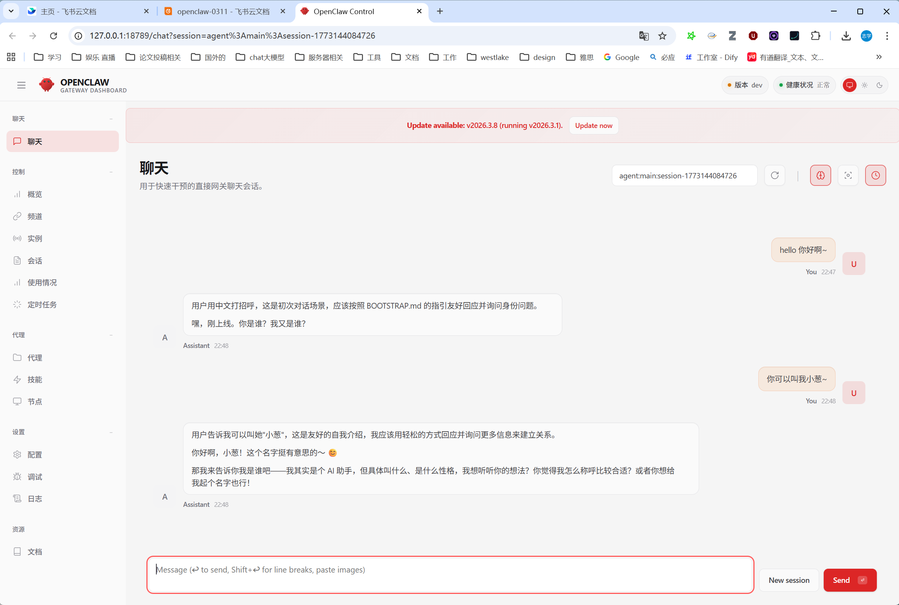
    <p>图5.6.14 OpenClaw Web 管理界面</p>
</div>

### 4.2 配置消息频道

在频道设置中，可以一步一步配置飞书或钉钉等消息渠道，实现多平台消息统一接入：

<div align='center'>
    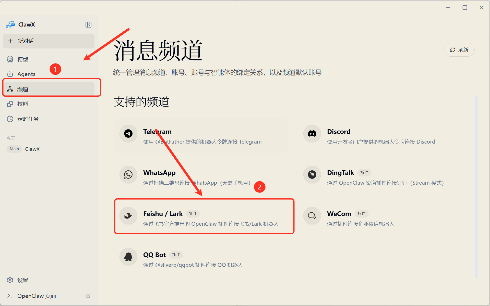
    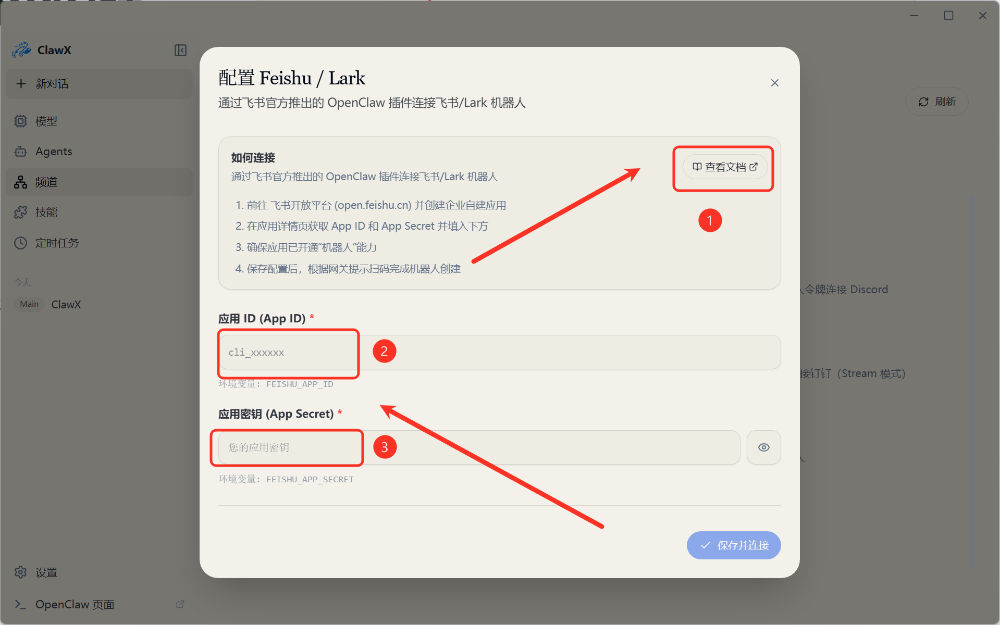
    <p>图5.6.15 配置飞书/钉钉消息频道</p>
</div>

## 总结

<div align='center'>
    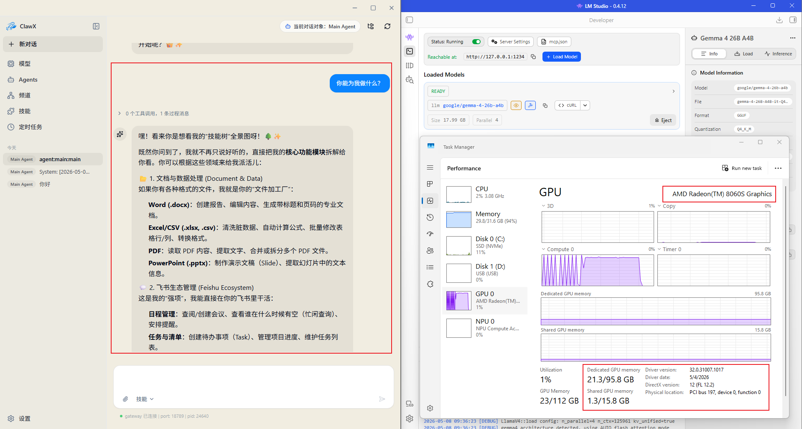
    <p>图5.6.16 本地部署大模型 + 本地部署 OpenClaw = 完全隐私的个人助手</p>
</div>

通过本教程，你已经成功在 AMD 395 Max 上搭建了一套完全本地化的 AI 助手方案：

- ✅ **LM Studio** 本地运行 gemma-4-26b-a4b 大模型
- ✅ **OpenClaw (ClawX)** 提供 Agent 平台和多渠道消息网关
- ✅ **所有数据不出本机**，隐私完全可控

## 常见问题

<details>
<summary>Q: 需要多大的显存才能运行？</summary>

OpenClaw 新对话即占用 39K tokens 上下文，加上模型本身的参数，建议至少 24GB 显存。AMD 395 Max 的集成显存共享方案可以满足需求。

</details>

<details>
<summary>Q: 支持哪些本地模型？</summary>

任何兼容 OpenAI API 格式的本地模型均可使用，包括通过 LM Studio、Ollama、vLLM 等工具部署的模型。本教程推荐 gemma-4-26b-a4b（MoE 架构，实际激活参数仅 4B）。

</details>

<details>
<summary>Q: 除了飞书和钉钉，还支持哪些消息渠道？</summary>

OpenClaw 支持飞书、Telegram、iMessage、Slack、钉钉等多种消息平台，可在频道设置中按引导配置。

</details>

## 参考资源

- [OpenClaw (ClawX) Release](https://github.com/ValueCell-ai/ClawX/releases)
- [LM Studio 官网](https://lmstudio.ai/)
- [ROCm 官方文档](https://rocm.docs.amd.com/)
- [hello-rocm 主项目](../)
