# ☁️ AMD Radeon Cloud · 云算力

> **AMD 官方为中国开发者提供的免费 GPU 云算力平台**，无需本地环境，浏览器登录即可上手 ROCm 实战。

## 🚀 立即体验

 

**📱 微信 / 浏览器扫码直达**

🔗 <https://developer.amd.com.cn/login?source=91kadjjnI>

## 平台简介

**AMD Radeon Cloud** 是 **AMD AI 开发者计划中文站**（中国区官方平台）为开发者提供的云端算力入口。平台围绕 AMD 开源 AI 生态打造，目标是让中国本土开发者获得「无门槛、无网速焦虑」的原生 AMD 体验。

**核心特点**：

- 🇨🇳 **本地化部署**：中国区官方平台，免去访问与登录的网络障碍
- ☁️ **免费算力额度**：注册即送 **100 小时**中国区专属算力（活动期间）
- 🖥 **底层硬件**：基于 **AMD Radeon PRO W7900D** 等专业级 GPU 构建
- 📦 **开箱即用**：内置技术模板与预配置工作区，无需自行搭建环境
- ⭐ **积分体系**：完善信息、活跃贡献可累积积分，等额兑换算力券
- 🤝 **进阶通道**：通过魔搭社区联动「开发者激励计划」，最高可累计获得 **1000+ 小时** GPU 算力
- 💬 **官方技术支持**：中国成员专属微信群，AMD 官方团队解答 ROCm 与硬件适配问题

加入 AMD AI 开发者计划中文站，成员将围绕技术、资源、交流三大维度，解锁完整的本地化服务版图：

  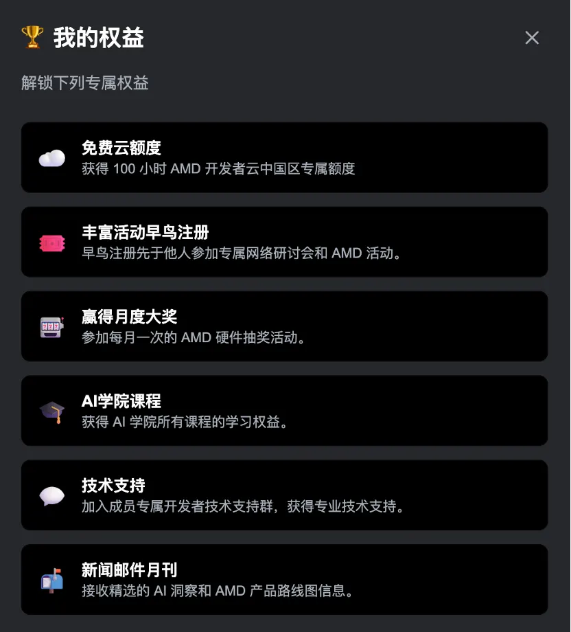

## 平台使用教程

完整流程：**注册登录 → 完善信息（领取 100 积分）→ 进入 Radeon Cloud → 选择模板 / 创建工作区 → 开始实战**。

### 1. 注册与登录

打开 <https://developer.amd.com.cn/login?source=91kadjjnI>，中文站全面接入了国内主流账号体系，提供 **3 种登录方式**：

| 方式 | 操作 | 适用场景 |
|------|------|---------|
| 🟢 **微信登录** | 扫描页面二维码 | 最快捷，一键直达 |
| 🤖 **魔搭社区账号** | 授权绑定已有账号 | 已有魔搭生态账号的开发者 |
| 📱 **手机号 / 邮箱验证码** | 输入接收验证码 | 灵活适配个人习惯 |

  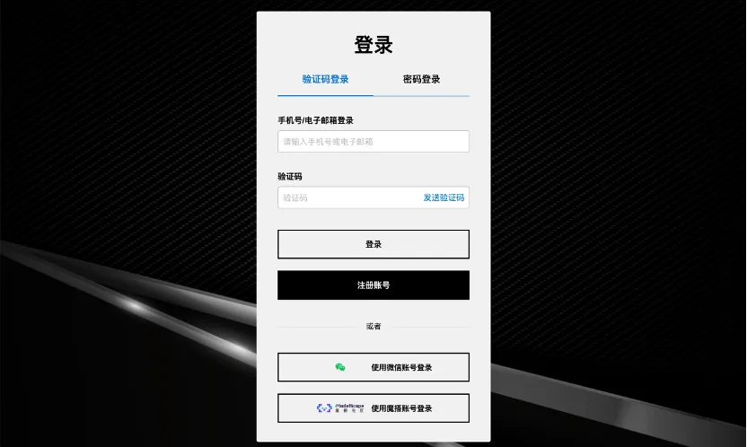

> 💡 推荐使用微信登录，节省注册成本。

**首次登录会跳转注册表单**，按提示填写姓名、邮箱 / 手机号并完成验证：

  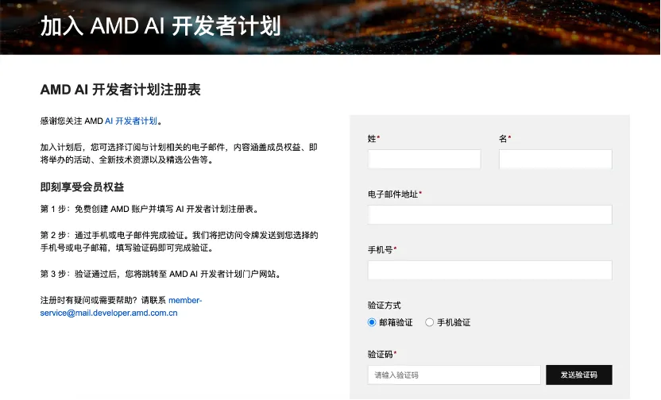

### 2. 完善信息领取积分

注册完成后，进入会员中心补全 **个人基础信息 → 项目环境与偏好 → 学术身份**，提交后即可获得 **100 积分** 奖励，用于后续兑换算力券。

  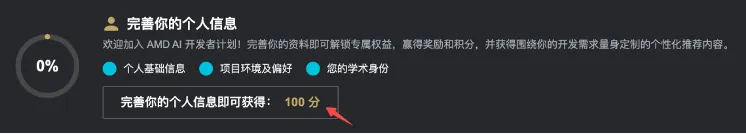

### 3. 进入云算力 / 创建工作区

登录后在中文站首页一键进入 **AMD 开发者云（Radeon Cloud）**：

  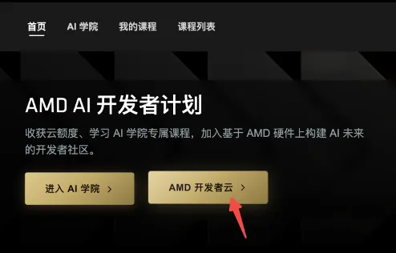

- 活动期间，注册成员**免费获得 100 小时中国区专属算力额度**
- 平台底层基于 **AMD Radeon PRO W7900D** 等专业级 GPU
- 提供**开箱即用的技术模板与工作区**，无需自行配置 ROCm / PyTorch 环境
- 直接选择模板 → 启动工作区 → 在浏览器内进入开发环境

  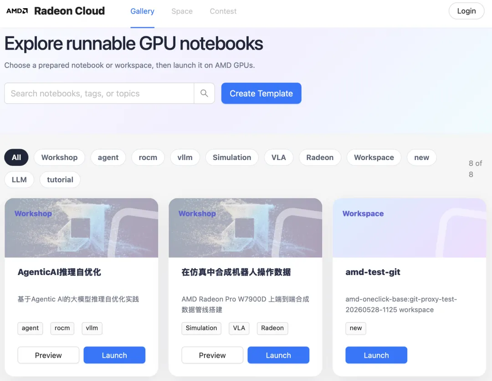

### 4. 算力扩展：积分兑换 + 魔搭联动

如果初始 100 小时不够用，有两条扩展路径：

#### 路径 A：积分兑换算力券

中文站采用透明的积分成长规则，开发者可通过技术贡献多维度积累积分，**积分等额兑换云算力券**——边沉淀技术能力边累积算力资源。

  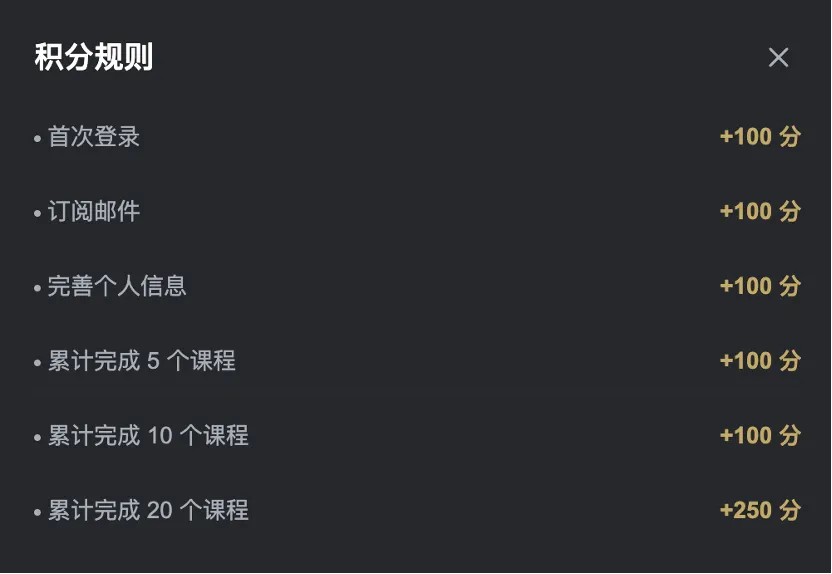

#### 路径 B：魔搭社区「开发者激励计划」

AMD 与魔搭社区联合启动激励计划，提供 **3 条完全独立的进阶任务路径**，灵活叠加最高可累计获得 **1000+ 小时** GPU 算力：

1. 通过魔搭 Notebook 活动页进入
2. 授权绑定 AMD 开发者计划账号（即完成上述注册步骤）
3. 完成对应进阶任务即可解锁算力

  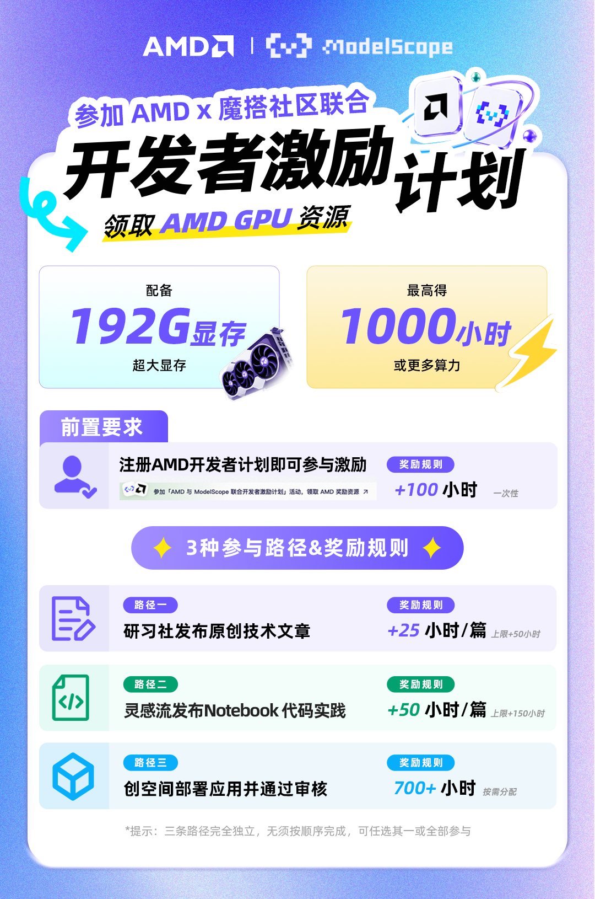

> 📌 详情参见 AMD AI 开发者计划中文站公告。

#### 积分兑换

积分兑换的完整逻辑是：先在 **AMD AI 开发者计划中文站**消耗积分生成云算力券链接，再前往 **AMD 开发者云平台**完成兑换入账。

  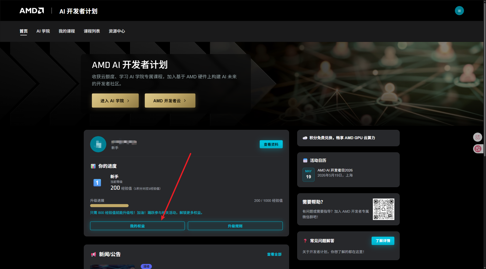

  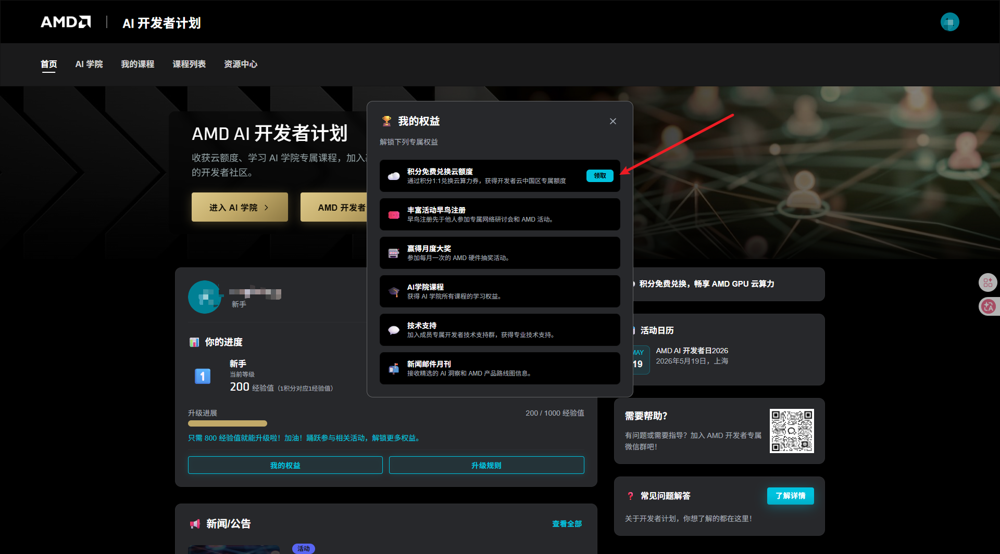

##### 兑换规则

- **兑换比例**：1 积分可兑换 1 小时 AMD GPU 云算力
- **起兑门槛**：100 积分起兑，兑换小时数不超过当前剩余可兑换积分数
- **兑换结果**：兑换成功后会生成虚拟云算力券 / 兑换链接
- **使用方式**：复制兑换链接后，需要前往 AMD 开发者云平台完成入账
- **有效期**：云算力券通常自兑换日起 30 天内有效，请及时使用
- **注意事项**：兑换的是线上云算力服务，不是实物或现金；请勿转售或违规获取积分

  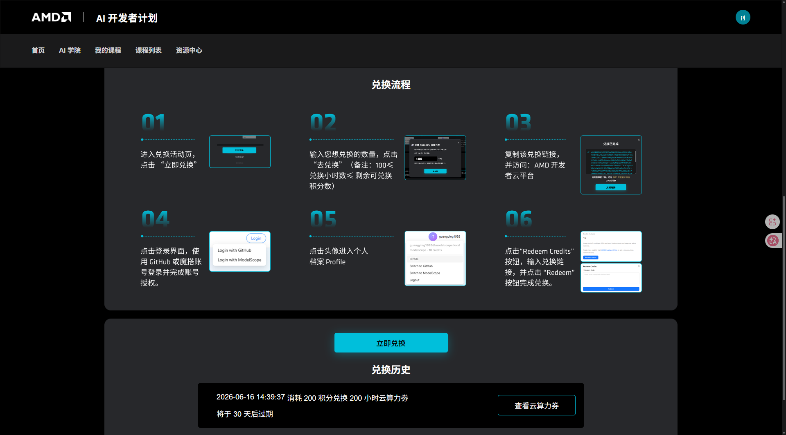

##### 兑换流程

1. 从中文站主页面或活动入口进入云算力兑换区域
2. 在兑换活动页点击 **立即兑换**
3. 输入想兑换的云算力小时数，点击 **去兑换**
4. 兑换成功后复制生成的兑换链接
5. 访问 **AMD 开发者云平台**
6. 使用 GitHub 或魔搭账号登录，并完成账号授权
7. 点击右上角头像进入 **Profile**
8. 点击 **Redeem Credits**
9. 在 **Coupon Link** 输入框粘贴兑换链接，点击 **Redeem** 完成兑换

### 5. 跑通你的第一个 ROCm 任务

平台预置了开箱即用的环境，建议起步路径：

1. 启动一个内置 ROCm + PyTorch 模板的工作区
2. 参考本仓库 [Gemma4 部署教程](/zh/01-deploy/) 跑通推理
3. 进入 [LoRA 微调实战](/zh/02-fine-tune/) 体验训练
4. 进阶 [算子优化](/zh/03-infra/) 了解底层

## 常见问题

**Q1：完全免费吗？**
活动期间注册即送 100 小时中国区专属算力。后续可通过积分兑换或魔搭激励计划继续扩展。

**Q2：需要科学上网吗？**
不需要。中文站本地化部署，访问与登录均针对中国网络环境优化。

**Q3：可以用本仓库的教程吗？**
可以。平台内置 ROCm + PyTorch 等常见模板，本仓库 `01-deploy` / `02-fine-tune` / `03-infra` 的教程可直接在工作区内运行。

**Q4：遇到 ROCm 软件栈或硬件适配问题怎么办？**
加入「中国成员专属技术支持微信群」，AMD 官方技术支持团队会随群协助解答。入口在中文站个人中心。

**Q5：100 小时用完后怎么办？**

- 走积分兑换路径：完善贡献、参与活动累积积分，兑换算力券
- 走魔搭路径：完成「开发者激励计划」3 条独立任务路径，最高 1000+ 小时
- 详见上面「算力扩展」小节

## 配套教程对应关系

> 本仓库哪些教程可以直接在 AMD Radeon Cloud 上运行：

| 学习阶段 | 对应教程 | 推荐工作区模板 |
|---------|---------|---------|
| 大模型部署 | [Gemma 4 / Qwen3 / Qwen3.5 部署](/zh/01-deploy/) | ROCm + PyTorch |
| LoRA 微调 | [Gemma4-E4B LoRA 微调](/zh/02-fine-tune/) | ROCm + PyTorch + Transformers |
| 算子优化 | [ROCm 算子优化实践](/zh/03-infra/) | ROCm + HIP 开发环境 |
| 组队学习 | [hello-rocm 组队学习](/zh/learning/) | 由 Datawhale 组队营提供 |

---

返回：[← hello-rocm 首页](/zh/)
