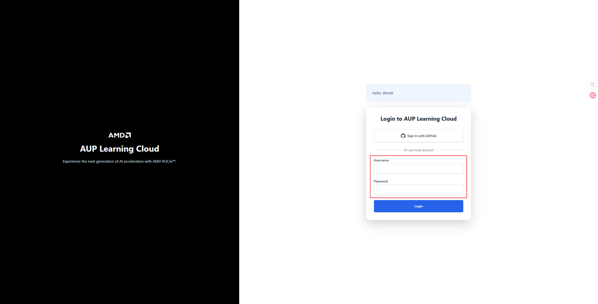
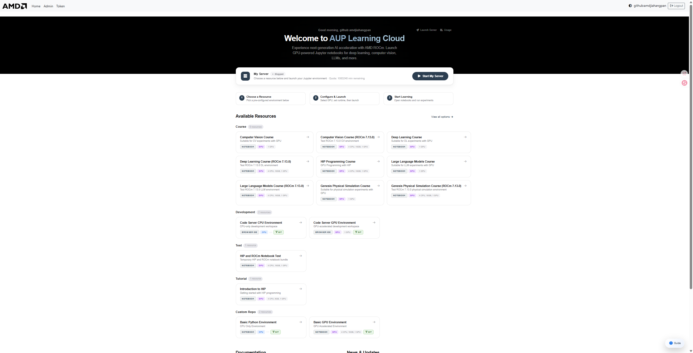
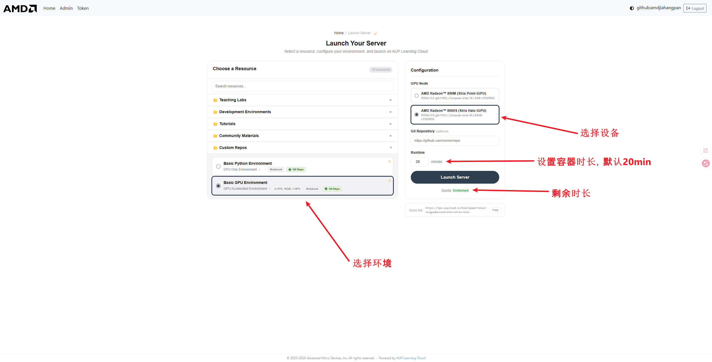
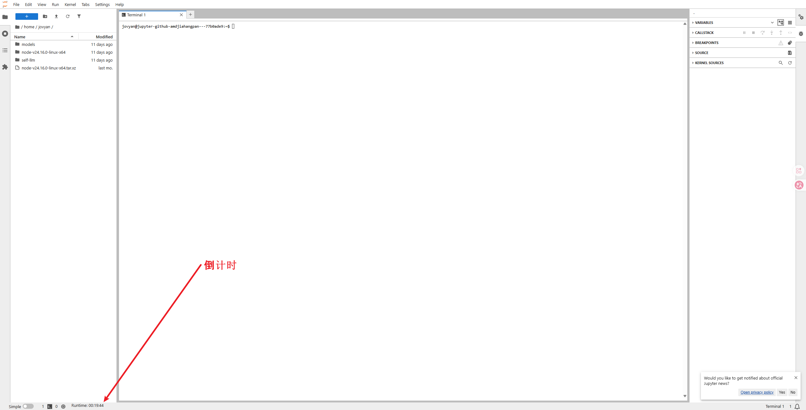
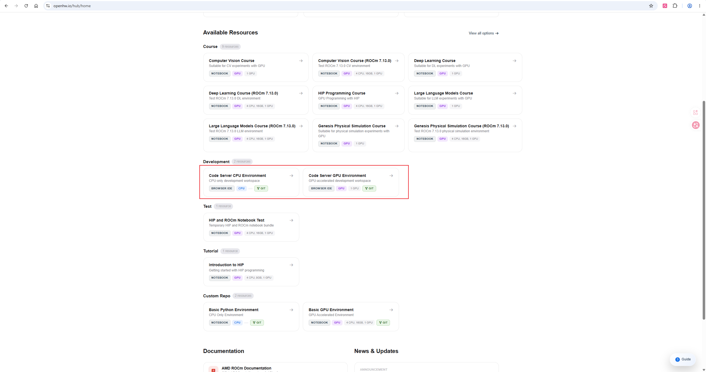
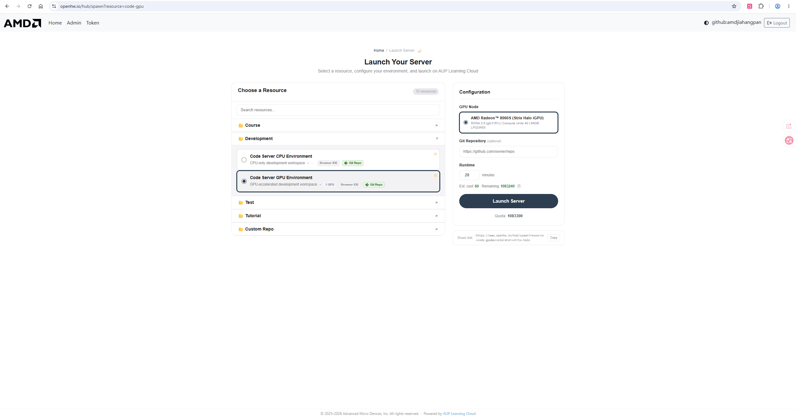
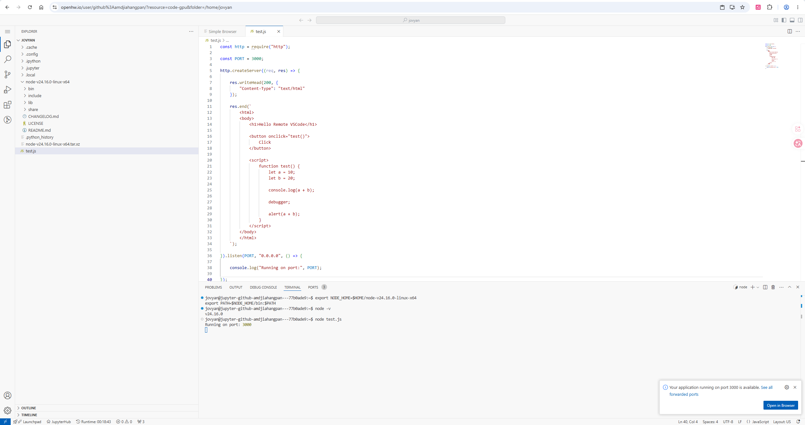
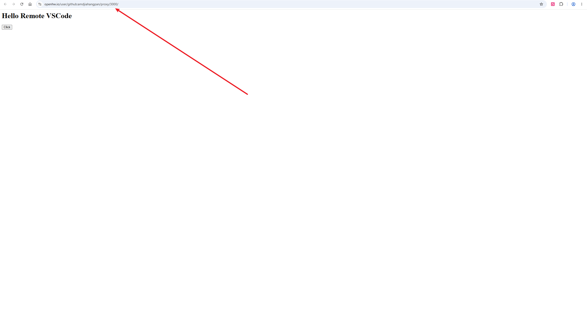
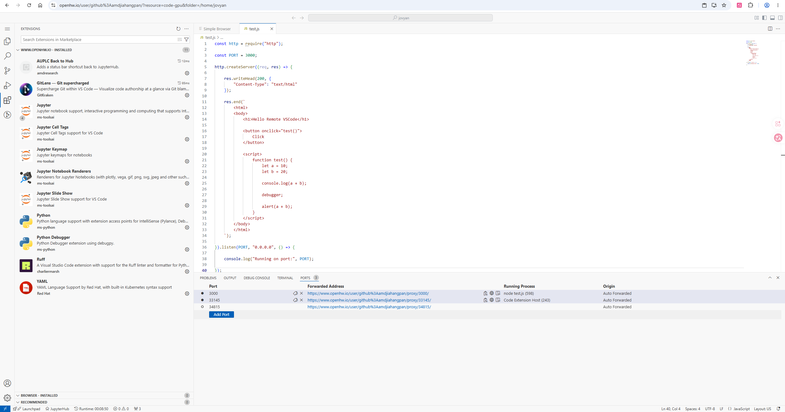
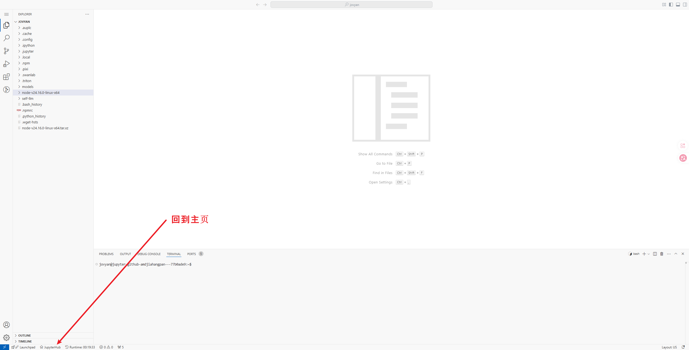

# ☁️ AUP Learning Cloud · 端侧 AMD 算力

::: warning 🧪 内测阶段公告
**AUP Learning Cloud 目前处于内部测试阶段**，平台功能、资源配额与计费规则可能随时调整；如遇服务不稳定或异常，请及时向管理员反馈。正式开放时间与相关政策以官方通知为准。
:::

> 基于 **AMD 端侧 Ryzen™ AI APU** 构建的远程 **JupyterHub / Code Server** 开发环境，无需本地配置，浏览器登录即可上手 ROCm 实战。

::: tip 📦 开源项目
[**AUP Learning Cloud**](https://github.com/AMDResearch/aup-learning-cloud) 是 **AMD Research** 开源的定制化 JupyterHub 学习云平台（**MIT 许可**），面向 AMD 硬件加速（CPU / GPU / NPU），内置计算机视觉、深度学习、大模型、物理仿真等实践课程工具包，并基于 Kubernetes（K3s）部署。源码、部署方式与镜像均公开在 GitHub：<https://github.com/AMDResearch/aup-learning-cloud>。
:::

## 🖥 平台设备说明

[**AUP Learning Cloud**](https://github.com/AMDResearch/aup-learning-cloud) 的算力全部来自 **AMD 端侧（client）Ryzen™ AI APU**。与独立显卡方案不同，这里的 **CPU / GPU / NPU 集成在同一颗芯片上**，更贴近真实的 AMD AI PC 使用场景。目前后台主要部署两款设备：

| 设备 | 定位 | CPU | GPU（iGPU） | NPU |
|------|------|-----|------------|-----|
| **Ryzen™ AI Max+ 395**（Strix Halo） | 旗舰端侧 APU | Zen 5 · 16 核 | Radeon™ 8060S（RDNA 3.5 · 40 CU） | XDNA™ 2 · ~50 TOPS |
| **Ryzen™ AI 9 HX 370**（Strix Point） | 高性能端侧 APU | Zen 5 · 12 核 | Radeon™ 890M（RDNA 3.5 · 16 CU） | XDNA™ 2 · ~50 TOPS |

- **CPU**：基于 Zen 5 架构，承担数据预处理、编译与常规计算任务。
- **GPU（iGPU）**：RDNA 3.5 集成显卡，通过 **ROCm** 为 PyTorch 等框架提供 GPU 加速。
- **NPU**：XDNA 2 架构 AI 引擎，面向低功耗端侧推理。

## 🚀 立即体验

<div align="center">

[](https://tpe.aupcloud.io)

🔗 <https://tpe.aupcloud.io>

</div>

## 一、什么是 JupyterHub / Code Server？

| JupyterHub | Code Server（VSCode Server） |
|------------|------------------------------|
| 基于浏览器的远程开发平台：<br>- ✅ 浏览器直接写代码（无需本地配置环境）<br>- ✅ 使用 Python / Jupyter Notebook 实验与学习<br>- ✅ 代码文件保存在服务器，不怕电脑重装<br>- ✅ 在不同电脑上随时继续学习<br><br>📌 **你只需要**：一台能上网的电脑 + 现代浏览器（推荐 Chrome / Edge / Firefox） | 在浏览器中运行的**完整 VSCode 编辑器**，可理解为「在浏览器里打开一个和本地一模一样的 VSCode」：<br>- ✅ 完整 VSCode 编辑体验（语法高亮、自动补全、调试）<br>- ✅ 终端中运行程序、脚本和训练任务<br>- ✅ 安装 VSCode 插件（Python、Jupyter、GitLens 等）<br>- ✅ 端口转发预览 Web 应用<br>- ✅ 适合需要 IDE 级开发体验的用户 |

## 二、登录说明

### 1. 获取 GitHub 授权 / 本地账号密码

- **GitHub 授权登录**：点击授权登录即可。
- **本地账户**：由管理员提供账号密码。

### 2. 打开登录页面

在浏览器地址栏输入：<https://tpe.aupcloud.io>

<div align="center">
  
</div>

### 3. 选择登录方式

平台提供两种登录方式：**GitHub 账户登录（推荐）** 和 **本地账户登录**（本地账户需管理员提供）。

<div align="center">
  
</div>

#### 方式 1：GitHub 账户登录（推荐）

1. 点击 **Use GitHub Login** 按钮
2. 跳转到 GitHub 授权页面，选择已授权的 GitHub 账户

<div align="center">
  
</div>

#### 方式 2：本地账户登录

从邮件中获取账号密码：

1. 在登录框中输入 **Username** 与 **Password**
2. 点击 **Use LocalAccount Login** 按钮，**首次登录需要修改密码**

### 4. 成功登录后的界面

<div align="center">
  
</div>

<div align="center">
  
</div>

## 三、平台使用须知与可用资源

::: tip 使用须知
- **运行时长**：容器默认时长为 **20 min**，开启后左下角会有倒计时，倒计时结束会自动关闭容器。
- **个人存储**：每人默认存储空间为 **20 G**，无法存储超过该容量的文件。
- **积分计费**：消耗 = 运行时长（分钟）× 硬件倍率，会话结束时扣除；余额不足将无法启动新会话（倍率见下表）。
:::

| 硬件 | 积分倍率 |
|------|---------|
| CPU | 1× |
| GPU（Radeon 8060S iGPU） | 3× |

**可用资源目录**：

- **Course**（课程资料）：Computer Vision Course、Deep Learning Course、HIP Programming Course、Large Language Models Course、Genesis Physical Simulation Course（均提供 ROCm 7.13.0 版本）
- **Development**（开发环境）：Code Server CPU Environment、Code Server GPU Environment
- **Test**（测试环境）：HIP and ROCm Notebook Test
- **Tutorial**（教程内容）：Introduction to HIP
- **Custom Repo**（自定义仓库，提供基础镜像）：Basic Python Environment、Basic GPU Environment

<div align="center">
  
</div>

<div align="center">
  
</div>

::: warning 注意
选择合适的镜像时长，计时结束时会关闭连接；未放置在用户存储目录 `/home/jovyan` 的内容会被重置。
:::

## 四、JupyterHub 使用说明

### 1. 新建一个 Notebook

1. 选择 **Python 3**
2. 浏览器会打开一个新的 Notebook 页面

🎉 恭喜，你已经可以开始写代码了！

### 2. 运行代码

- 在代码单元格中输入代码
- 按 **Shift + Enter** 运行当前单元
- 运行结果会显示在下方

```python
print("Hello, JupyterHub!")
```

### 3. 保存你的工作

- JupyterHub **会自动保存**，也可手动保存：`Ctrl + S`（Windows）/ `Cmd + S`（Mac）
- 每个镜像的默认工作目录为 `/ryzers/notebooks`，用户拥有 20 G 磁盘的目录在 `/home/jovyan`。**如需保存工作内容，请在镜像结束前迁移至 `/home/jovyan`。**

⚠️ 默认工作目录：`/ryzers/notebooks`　　⚠️ 用户存档目录：`/home/jovyan`

```bash
# 切换 bash
bash
cp <需要保存的文件> /home/jovyan
```

## 五、Code Server（VSCode Server）使用说明

### 1. 启动 Code Server 环境

1. 登录后，在启动页面选择 **Code Server CPU Environment** 或 **Code Server GPU Environment**
2. 选择所需的硬件配置（如 AMD Radeon™ 8060S GPU）

<div align="center">
  
</div>

3. 设置运行时长，点击 **Launch Server**
4. 等待几秒后，浏览器将自动打开 VSCode 界面

<div align="center">
  
</div>

### 2. 界面介绍

Code Server 的界面和本地 VSCode **完全一致**：

- **左侧**：文件资源管理器、搜索、源代码管理、调试、扩展
- **中间**：代码编辑区域
- **下方**：集成终端（Terminal）、端口面板（Ports）、输出面板

### 3. 端口转发（Port Forwarding）

当你在 Code Server 中运行一个 Web 服务（如 Node.js、Flask、Streamlit 等），系统会**自动检测并转发端口**。

**使用方法**：

1. 在终端中启动服务，例如：

```bash
node test.js
# 输出: Running on port: 3000
```

2. 右下角会弹出通知提示端口已转发，点击 **Open in Browser** 即可在新标签页访问

<div align="center">
  
</div>

3. 也可以在底部 **PORTS** 面板中查看所有已转发的端口

<div align="center">
  
</div>

**转发地址格式**：

```
https://tpe.aupcloud.io/user/<your-username>/proxy/<port>/
```

例如：`https://tpe.aupcloud.io/user/github%3Ausername/proxy/3000/`

<div align="center">
  
</div>

**注意事项**：

- 端口转发是**自动**的，无需手动配置
- 支持任何在服务器上监听端口的服务（HTTP / WebSocket）
- 转发地址可以分享给他人访问（在同一网络授权下）
- 如果端口未自动检测，可在 PORTS 面板手动添加

### 4. 插件（Extensions）使用

Code Server 支持安装 VSCode 插件来增强开发体验。

**已预装的插件**：

| 插件 | 用途 |
|------|------|
| Python | Python 语言支持、IntelliSense、调试 |
| Jupyter | 在 VSCode 中运行 Jupyter Notebook |
| GitLens | Git 增强（查看 blame、历史、对比） |
| Python Debugger | Python 断点调试 |
| Ruff | Python 代码格式化和 lint |
| YAML | YAML 文件语法支持 |

**安装新插件**：

1. 点击左侧**扩展图标**（四方块形状）
2. 在搜索框输入插件名称
3. 点击 **Install** 安装

<div align="center">
  
</div>

**推荐安装的插件**：C/C++（配合 HIP 开发）、ROCm HIP（AMD GPU 编程支持）、Remote - Containers、Thunder Client、Markdown Preview。

::: warning 注意
- 插件安装在服务器端，**镜像重启后需要重新安装**。
- 建议将常用插件列表记录下来，方便下次快速安装。
- 部分插件可能因网络原因安装失败，可尝试刷新页面后重试。
:::

### 5. 终端（Terminal）使用

在 Code Server 中可以直接使用集成终端：

- 快捷键 `` Ctrl + ` `` 打开/关闭终端
- 支持多终端窗口（点击 + 号新建）
- 默认 shell 为 bash

```bash
# 查看 GPU 状态
rocm-smi

# 安装 Python 包
pip install torch torchvision

# 运行训练脚本
python train.py

# 启动 Web 服务（会自动端口转发）
python -m http.server 8080
```

## 六、正确退出方式（很重要）

使用完成后，请**正确退出**：

1. 打开菜单 **File → Hub Control Panel**（见下图），在控制面板中点击 **Stop My Server** 停止服务器，然后关闭浏览器标签页。

⚠️ 不要长时间占用服务器资源！

<div align="center">
  
</div>

**VSCode Server GPU：如何回到主页**

在 Code Server（VSCode Server）环境中，若要退出或切换镜像，需先回到 JupyterHub 主页：点击**左下角状态栏的 JupyterHub 按钮**（见下图红色箭头处），即可返回 Hub 主页，随后按上文点击 **Stop My Server** 停止服务器。

<div align="center">
  
</div>

## 七、常见问题答疑（FAQ）

**Q1：页面打不开 / 加载很慢怎么办？**
检查网络是否正常；尝试更换浏览器（推荐 Chrome / Edge）；刷新页面或重新登录。

**Q2：已经启用一个镜像，想换另一个镜像，无法启动？**
请在选择界面点击 **Stop my server** 关闭当前镜像后再启动新镜像。

<div align="center">
  
</div>

**Q3：代码报错了，是平台的问题吗？**
大多数情况下不是。请先检查：是否有拼写错误、是否漏写括号或冒号、是否按顺序运行了所有单元。

**Q4：Code Server 中端口转发不生效？**
确认服务确实在监听该端口（终端能看到 `Running on port: XXXX`）；检查 PORTS 面板是否有对应端口记录；尝试手动在 PORTS 面板添加端口；仍不生效则刷新浏览器页面。

**Q5：Code Server 中插件安装失败？**
检查网络连接是否正常；尝试刷新页面后重新安装；部分插件可能不兼容 Code Server（web 版），可尝试搜索替代插件。

## 八、使用小建议（强烈推荐）

- ⭐ 经常保存代码
- ⭐ 文件命名清晰（不要用 `test123.ipynb`）
- ⭐ 不要在一个 Notebook 里写「所有内容」
- ⭐ 遇到问题及时提问，不要憋着
- ⭐ 重要文件记得存到 `/home/jovyan` 目录
- ⭐ Code Server 用户建议记录常用插件列表，方便重装

## 参考链接

- **AUP Learning Cloud 开源仓库**（AMD Research · MIT 许可）：<https://github.com/AMDResearch/aup-learning-cloud>
- **AUP Learning Cloud 项目文档**：<https://amdresearch.github.io/aup-learning-cloud/>

---

返回：[← hello-rocm 首页](/zh/)
