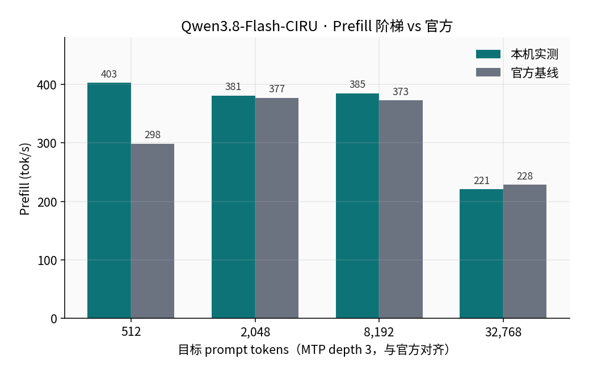
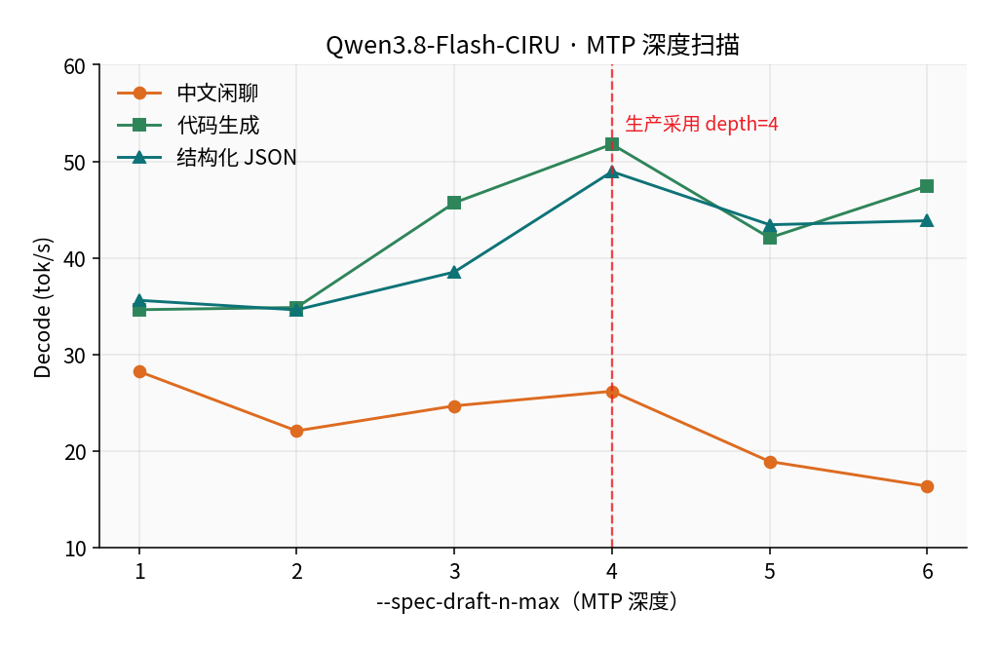

## Qwen3.8-Flash-CIRU 部署（Ubuntu 24.04 + ROCm 7.1+ / Strix Halo）

本节介绍如何在 **AMD Ryzen AI MAX+ 395（Radeon 8060S，`gfx1151`）+ 128 GB 统一内存** 上，按 [ciru-ai/Qwen3.8-Flash-CIRU-STRIX-IU4](https://github.com/ciru-ai/Qwen3.8-Flash-CIRU-STRIX-IU4) **v1.1** 编译 CIRU `llama-server`，加载 Hugging Face `jcbtc/Qwen3.8-Flash-CIRU-STRIX-IU4` 的 GGUF + PLE + MTP，提供 OpenAI 兼容接口。

> 前置条件：已完成 [ROCm 基础环境安装](/zh/00-environment/)。本教程实测环境为 **Ubuntu 24.04 + ROCm 7.1.0**，GPU 性能档 `high`（sclk 2900 MHz）。  
> **不是** stock llama.cpp，也 **不是** 上一篇的 lucebox `dflash_server`。普通 GGUF 加载器读不了 PLE sidecar。

---

### 模型简介

Qwen3.8-Flash-CIRU-STRIX-IU4 是专为 Strix Halo 做的 IU4 / PLE 发行包：主权重约 74 GiB，PLE payload 约 49 GiB 从 NVMe 分页，MTP 草稿约 3.9 GiB。`/v1/models` 回报约 **126B MoE**（`n_params=125,743,653,760`），上下文可开到 262144。

| 项 | 值 |
|:---|:---|
| 运行时 | CIRU `llama-server` v1.1（仓库标签 `v1.1`） |
| 权重 | [jcbtc/Qwen3.8-Flash-CIRU-STRIX-IU4](https://huggingface.co/jcbtc/Qwen3.8-Flash-CIRU-STRIX-IU4) |
| 磁盘 | 完整包约 **127 GiB**（务必先 `sha256sum -c checksums.sha256`） |
| 常驻内存 | 约 96 / 125 GiB（PLE 只缓存 4 GiB 热页） |
| 官方配方 | `profiles/strix-halo-production.env`；本机把 MTP 深度从 3 调到 **4** |

它和 [DeepSeek-V4-Flash](../ds4/dflash-native-hip-rocm7-deploy.md) 抢同一块统一内存，**不能同时常驻**。

---

### 一、确认硬件与 ROCm

```bash
amd-smi
rocminfo | grep -A2 -E 'Name:|Marketing Name|gfx1151'
df -h .   # 至少再留 ~130 GiB
```

建议 GPU 锁到 `high`：

```bash
echo performance | sudo tee /sys/firmware/acpi/platform_profile
sudo rocm-smi -d 0 --setperflevel high
```

若本机还跑着 DS4（`dflash_server`），先停掉：

```bash
pkill -x dflash_server || true
ss -tlnp | grep -E ':8000|:8080' || true
```

---

### 二、编译 CIRU llama-server

```bash
mkdir -p ~/rocm-llm && cd ~/rocm-llm
git clone --branch v1.1 --depth 1 \
  https://github.com/ciru-ai/Qwen3.8-Flash-CIRU-STRIX-IU4.git
cd Qwen3.8-Flash-CIRU-STRIX-IU4

export ROCM_ROOT=/opt/rocm
export PATH="/opt/rocm/bin:$PATH"
unset HSA_OVERRIDE_GFX_VERSION

./scripts/ciru/build-linux-amd.sh
./build-gfx1151/bin/llama-server --version
./build-gfx1151/bin/llama-server --help | grep -E 'ple-sidecar|spec-draft-model'
```

官方脚本会编 `build-gfx1151/bin/llama-server`，并打开 `GGML_HIP` / `gfx1151`。帮助里应出现 `--ple-sidecar` 和 `--spec-draft-model`。

---

### 三、下载权重并校验

```bash
export HF_ENDPOINT=https://hf-mirror.com
python3 -m pip install -q "huggingface_hub>=0.26"

python3 - <<'PY'
from huggingface_hub import snapshot_download
path = snapshot_download(
    repo_id="jcbtc/Qwen3.8-Flash-CIRU-STRIX-IU4",
    local_dir="model",
)
print("local_dir", path)
PY

ls -lh model/Qwen3.8-Flash-CIRU-STRIX-IU4.gguf \
       model/mtp/Qwen3.8-Flash-CIRU-STRIX-IU4-MTP-Q8_0.gguf \
       model/ple/ple.payload.bin \
       model/ple/ple.manifest.json \
       model/ple/ple.scale.bf16

(cd model && sha256sum -c checksums.sha256)
```

本机校验通过的文件：

| 文件 | 大小 |
|:---|---:|
| `Qwen3.8-Flash-CIRU-STRIX-IU4.gguf` | 74 GiB |
| `ple/ple.payload.bin` | 49 GiB |
| `mtp/Qwen3.8-Flash-CIRU-STRIX-IU4-MTP-Q8_0.gguf` | 3.9 GiB |

官方 `run-server.sh` 默认读仓库下的 `model/` 目录。若权重放在别处，启动时设 `MODEL_DIR`。

---

### 四、启动服务

CIRU 自带 `scripts/ciru/run-server.sh`，会加载 `profiles/strix-halo-production.env`（PLE 4 GiB 页缓存、prompt cache 8 GiB、ctx 262144、MTP）。本机扫描后把 MTP 深度改成 **4**（官方默认 3）。

```bash
export ROCM_PATH=/opt/rocm
export HIP_PATH=/opt/rocm
export LD_LIBRARY_PATH=/opt/rocm/lib:/opt/rocm/lib64:${LD_LIBRARY_PATH:-}
unset HSA_OVERRIDE_GFX_VERSION

cd ~/rocm-llm/Qwen3.8-Flash-CIRU-STRIX-IU4
mkdir -p slot-state

# Agent / 短回复建议关思考，避免 max_tokens 被 reasoning 吃掉
HOST=0.0.0.0 PORT=8080 MTP_DEPTH=4 \
  ./scripts/ciru/run-server.sh \
  --reasoning off \
  --chat-template-kwargs '{"enable_thinking":false}'
```

加载约 **60 s**（主模型 + MTP）。日志就绪后：

```bash
curl -s http://127.0.0.1:8080/health
curl -s http://127.0.0.1:8080/v1/models | jq '.data[0].id'
```

应看到 `Qwen3.8-Flash-CIRU-STRIX-IU4`。回退官方 MTP 深度：`MTP_DEPTH=3`。需要思考时不要在启动参数里关，改为请求里传 `"chat_template_kwargs": {"enable_thinking": true}` 并加大 `max_tokens`。

---

### 五、冒烟测试

```bash
curl -s -X POST http://127.0.0.1:8080/v1/chat/completions \
  -H 'Content-Type: application/json' \
  -d '{
    "model": "Qwen3.8-Flash-CIRU-STRIX-IU4",
    "messages": [{"role": "user", "content": "只回答：ok"}],
    "max_tokens": 16,
    "temperature": 0,
    "chat_template_kwargs": {"enable_thinking": false}
  }' | jq -r '.choices[0].message.content'
```

本机关思考时短问返回 `ok`，约 0.5 s，无 `reasoning_content`。

质量冒烟（`temperature=0`，关思考，MTP depth 4）全部通过：`23*17=391`、中文压缩、回文函数、上海天气 JSON、拼音排序。

---

### 六、本机测评结果

机器与 DS4 同一台。数字取服务端 `timings`。官方 HumanEval / ARC 分数引自 CIRU README，**未在本机重跑全量套件**。

#### 6.1 Prefill：512–8K 达到或超过官方

冷 prompt，生成 128 token，**MTP depth 3**（与官方配方对齐）。

<div align='center'>
  
</div>

| 目标 token | 本机 prefill | 官方 prefill | 本机 decode | 官方 decode |
|---:|---:|---:|---:|---:|
| 512 | **402.7** | 298.3 | 25.1 | 30.0 |
| 2,048 | **380.6** | 377.0 | **26.7** | 24.4 |
| 8,192 | **384.7** | 372.8 | 21.0 | 32.1 |
| 32,768 | 220.6 | 228.3 | 16.8 | 23.3 |

8K 冷 prefill 约 **21 s**。32K 与官方几乎持平。本机 decode 在 8K/32K 低于官方，是因为阶梯追加的是中文问题，MTP 接受率只有 37–70%；官方数字来自高接受率的英文 / HumanEval。

<div align='center'>
  
</div>

#### 6.2 负载：代码 / JSON 大约是中文的两倍

生产配置 **MTP depth 4**：

<div align='center'>
  
</div>

| 负载 | decode tok/s | MTP 接受率 |
|:---|---:|---:|
| 中文闲聊 | 22.9 | 28.9% |
| 代码生成 | **46.3** | 90.0% |
| 结构化 JSON | **48.8** | 100% |

草稿（Q8_0 MTP）对英文 / 符号更准。短中文流式首字约 **0.23 s**。

#### 6.3 MTP 深度：甜点是 4

同一组负载只改 `--spec-draft-n-max`：

<div align='center'>
  
</div>

| depth | 中文 | 代码 | JSON | 相对官方 depth 3 |
|---:|---:|---:|---:|:---|
| 1 | **28.3** | 34.7 | 35.6 | 中文最好，代码差 |
| 3（官方） | 24.7 | 45.7 | 38.6 | 基线 |
| **4（已采用）** | 26.2 | **51.8** | **48.9** | 代码 **+13%**，结构化 **+27%** |
| 5 | 18.9 | 42.1 | 43.4 | 中文崩 |
| 6 | 16.4 | 47.5 | 43.9 | 草稿浪费过大 |

depth ≥ 5 时中文接受率掉到 ~23%。六轮扫描无 MTP 位置错误、HSA 或 pager 失败。

#### 6.4 前缀缓存

<div align='center'>
  
</div>

约 8K 前缀换问题：第一次 `cache_n=0`，第二次复用 **7548 / (7548+517) = 93.6%**，只重算约 0.5K token。短多轮的 `cache_n` 也会逐轮递增。客户端保持 `cache_prompt: true`，系统提示和工具 JSON 不要每轮改写。

PLE 页缓存从 4 GiB 加到 12 GiB，8K/32K prefill 几乎不变，热页已被 OS page cache 兜住。保持官方 4 GiB 即可。

---

### 七、接入注意

```json
{
  "model": "Qwen3.8-Flash-CIRU-STRIX-IU4",
  "messages": [{"role": "user", "content": "你好"}],
  "temperature": 0.7,
  "top_p": 0.8,
  "top_k": 20,
  "presence_penalty": 1.5,
  "cache_prompt": true,
  "chat_template_kwargs": {"enable_thinking": false}
}
```

| 项 | 建议 |
|:---|:---|
| Base URL | `http://127.0.0.1:8080/v1` |
| 思考 | 默认关；需要推理时再开，并加大 `max_tokens` |
| 预期速度 | 短中文首字 ~0.2 s；中文生成约 23–28 tok/s；代码 / JSON 约 46–52 tok/s |
| 长上下文 | 8K 冷启动约 21 s 才出第一个 token，之后靠缓存 |
| 并发 | `--parallel 1`，同时只处理一个请求 |
| SSD | PLE 49 GiB 持续分页，盘慢会掉速 |

和 DS4 的选型：写代码、出 JSON、要精确计算 → **CIRU**。中文长文、要可预测的 25 tok/s、讨厌 NVMe 依赖 → **DS4**。

---

### 八、常见问题

<details>
<summary>Q: 普通 llama.cpp / Lemonade 预编译能不能直接加载？</summary>

不能。缺少 `--ple-sidecar` 时专家权重是错的。必须用 CIRU 这份运行时。

</details>

<details>
<summary>Q: 短回复只有思考没有正文？</summary>

服务端默认可能开思考。启动加 `--reasoning off`，请求里再显式 `enable_thinking: false`。短 `max_tokens` 会被 `reasoning_content` 占满。

</details>

<details>
<summary>Q: checksum 失败？</summary>

不要混用未完成的断点文件。删掉对应 blob 后重下，再 `sha256sum -c checksums.sha256`。

</details>

<details>
<summary>Q: 和 DS4 一起开内存立刻打满？</summary>

正常。先 `pkill -x dflash_server`（或反过来 `pkill -x llama-server`）再启动另一个。

</details>

---

### 参考资源

- [CIRU 仓库 v1.1](https://github.com/ciru-ai/Qwen3.8-Flash-CIRU-STRIX-IU4)
- [Hugging Face 权重](https://huggingface.co/jcbtc/Qwen3.8-Flash-CIRU-STRIX-IU4)
- 同机另一条路径：[DeepSeek-V4-Flash 原生 HIP 部署](../ds4/dflash-native-hip-rocm7-deploy.md)
